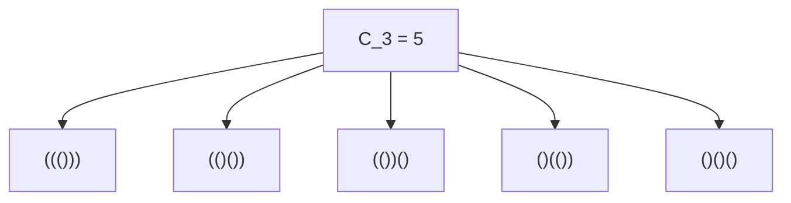
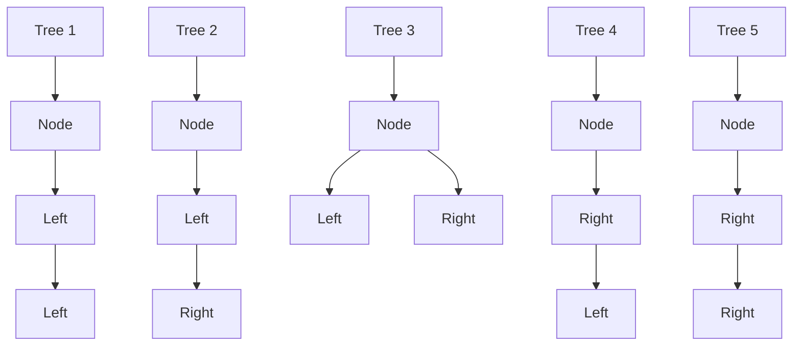
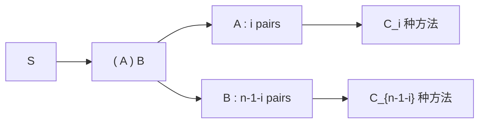

## 1. 引言：什么是[卡塔兰数](https://kenji.blog/zh-cn/p/catalan-numbers/)？

在数学和计算机科学的世界中，我们经常会看到一种美妙的现象：多个看似完全不同的问题，实际上在背后拥有完全相同的结构。其中一个著名的例子就是 **[卡塔兰数](https://kenji.blog/zh-cn/p/catalan-numbers/)** (Catalan numbers)。

[卡塔兰数](https://kenji.blog/zh-cn/p/catalan-numbers/)以比利时数学家欧仁·查理·卡塔兰的名字命名，该数列如下所示：

$$ C_0 = 1, \quad C_1 = 1, \quad C_2 = 2, \quad C_3 = 5, \quad C_4 = 14, \quad C_5 = 42, \quad C_6 = 132, \quad C_7 = 429, \quad \dots $$

这个数列作为各种组合问题的解频繁出现。在本文中，我们将介绍四个涉及[卡塔兰数](https://kenji.blog/zh-cn/p/catalan-numbers/)的著名例子（合法括号序列、二叉树、多边形三角剖分和迪克路径）。我们将剖析它们背后的递归结构，以了解为什么它们对应着完全相同的数列。此外，我们还将详细介绍使用动态规划 ([DP](https://kenji.blog/zh-cn/p/dynamic-programming-dp-introduction-knapsack-fibonacci/)) 的计算算法以及使用母函数的数学推导。

## 2. [卡塔兰数](https://kenji.blog/zh-cn/p/catalan-numbers/)出现的四个具体例子

### 例子1：合法括号序列 (Valid Parentheses)

在编程中，确保括号正确匹配至关重要。使用 $n$ 对括号 `()` 所能组成的“合法括号序列”的数量正是[卡塔兰数](https://kenji.blog/zh-cn/p/catalan-numbers/) $C_n$。

合法括号序列是指，从左向右读取时，在任何时刻右括号 `)` 的数量都不会超过左括号 `(` 数量的字符串。

让我们看看 $n = 3$ 的情况。3 对括号可以组成 5 种合法排列。这与 $C_3 = 5$ 完全一致。



### 例子2：二叉树结构 (Binary Trees)

接下来，我们来看看大家熟悉的数据结构：二叉树。包含 $n$ 个内部节点的二叉树的形状数量也是[卡塔兰数](https://kenji.blog/zh-cn/p/catalan-numbers/) $C_n$。

对于 $n = 3$，有 5 种不同的二叉树形状。它们的区别在于节点是连接到左子树还是右子树。



### 例子3：多边形三角剖分 (Polygon Triangulation)

[卡塔兰数](https://kenji.blog/zh-cn/p/catalan-numbers/)也出现在几何学中。通过在顶点之间绘制不相交的对角线，将凸 $(n+2)$ 边形分割成 $n$ 个三角形的方法数正是 $C_n$。

例如，当 $n = 3$ 时，我们考虑将一个五边形（$3+2=5$）进行三角剖分。通过绘制对角线形成3个三角形的方法恰好有 5 种。在这里，我们再次看到了数字 $C_3 = 5$。

### 例子4：迪克路径 (Dyck Paths)

[卡塔兰数](https://kenji.blog/zh-cn/p/catalan-numbers/)同样出现在网格路径问题中。在一个 $n \times n$ 的网格上，考虑从左下角 $(0, 0)$ 到右上角 $(n, n)$ 的最短路径，每次只能向右或向上移动一个单位。那些永远不会穿过对角线 $y = x$（即始终满足 $y \le x$）的路径数量为 $C_n$。这些被称为 **迪克路径** (Dyck path)。

如果我们用 `R` 表示向右移动，用 `U` 表示向上移动，该条件要求在路径的任何前缀中，`U` 的数量永远不超过 `R` 的数量。这与合法括号序列中 `(` 和 `)` 之间的关系完全等价。

## 3. 为什么它们是相同的？（背后的结构）

为什么这些看似无关的问题都会得出相同的[卡塔兰数](https://kenji.blog/zh-cn/p/catalan-numbers/)列？答案在于它们都共享着 **完全相同的递归结构**。

[卡塔兰数](https://kenji.blog/zh-cn/p/catalan-numbers/) $C_n$ 由以下递推关系定义：

$$ C_0 = 1 $$
$$ C_{n} = \sum_{i=0}^{n-1} C_i C_{n-1-i} \quad (n \ge 1) $$

让我们以“合法括号序列”为例，直观地理解这个递推关系是如何推导出来的。

考虑一个任意长度为 $2n$ 的合法括号序列 $S$。$S$ 必须以一个左括号 `(` 开头。在字符串的某处必定存在恰好一个匹配的右括号 `)`。
通过关注这个特定的匹配对，字符串 $S$ 可以被唯一地分解为以下形式：

$$ S = ( A ) B $$

在这里，$A$ 和 $B$ 本身也是合法的括号序列（它们可以是空字符串）。
假设在最初的 `(` 和其匹配的 `)` 之间的子串 $A$ 包含 $i$ 对括号 $(0 \le i \le n-1)$。
由于整个字符串有 $n$ 对括号，其中 1 对被外层的 `( )` 消耗掉，剩余的子串 $B$ 必定包含 $(n - 1 - i)$ 对括号。

- 形成 $A$ 的方法数为 $C_i$ 种
- 形成 $B$ 的方法数为 $C_{n-1-i}$ 种

因此，对于固定的 $i$ 值，可能的字符串数量为 $C_i \times C_{n-1-i}$。由于 $i$ 可以取从 $0$ 到 $n-1$ 的任何值，将所有这些可能性相加就得到了 $C_n$。这就是递推关系的含义。



完全相同的分解也适用于“二叉树”。如果我们将一个节点指定为根节点，并为左子树分配 $i$ 个节点，那么右子树必须接收剩余的 $n-1-i$ 个节点。这得出了完全相同的递推关系。

## 4. 闭合公式的数学推导

[卡塔兰数](https://kenji.blog/zh-cn/p/catalan-numbers/)可以使用组合学符号通过一个非常简单的 **闭合公式** (Closed-form formula) 来表示：

$$ C_n = \frac{1}{n+1} \binom{2n}{n} = \frac{(2n)!}{(n+1)!n!} $$

这个优雅的公式是如何推导出来的呢？让我们来探讨两种主要的方法。

### 4.1. 反射原理 (Reflection Principle) 证明

我们可以使用迪克路径来证明这个公式。
从 $(0,0)$ 到 $(n,n)$ 的最短路径总数为 $\binom{2n}{n}$，因为在总共 $2n$ 步中，我们必须选择 $n$ 步向右移动。

从中，我们必须减去违反条件的路径（即穿过直线 $y = x$ 并触碰直线 $y = x + 1$ 的路径）。
令 $P$ 为违反条件的路径首次触碰 $y = x + 1$ 的点。我们将路径从点 $P$ 到终点 $(n,n)$ 的部分沿直线 $y = x + 1$ 进行反射。
原来的终点 $(n,n)$ 被反射到了新的终点 $(n-1, n+1)$。

奇妙的是，“从 $(0,0)$ 到 $(n,n)$ 的非法路径”与“从 $(0,0)$ 到 $(n-1, n+1)$ 的所有路径”之间存在着完美的双射（一一对应）关系。
从 $(0,0)$ 到 $(n-1, n+1)$ 的路径总数为 $\binom{2n}{n-1}$。

因此，合法路径的数量为：

$$ C_n = \binom{2n}{n} - \binom{2n}{n-1} $$

我们可以对其进行代数化简：

$$ C_n = \binom{2n}{n} - \frac{n}{n+1} \binom{2n}{n} = \left( 1 - \frac{n}{n+1} \right) \binom{2n}{n} = \frac{1}{n+1} \binom{2n}{n} $$

### 4.2. 母函数 ([Generating Functions](https://kenji.blog/zh-cn/p/generating-functions/)) 方法

令[卡塔兰数](https://kenji.blog/zh-cn/p/catalan-numbers/)的母函数为 $C(x) = \sum_{n=0}^\infty C_n x^n$。
利用递推关系 $C_{n} = \sum_{i=0}^{n-1} C_i C_{n-1-i}$，我们发现该母函数满足以下方程：

$$ C(x) = 1 + x [C(x)]^2 $$

这可以看作是关于 $C(x)$ 的二次方程：$x [C(x)]^2 - C(x) + 1 = 0$。通过应用求根公式，我们得到：

$$ C(x) = \frac{1 \pm \sqrt{1 - 4x}}{2x} $$

为了在 $x \to 0$ 时满足 $C(0) = 1$ 的条件，我们必须选择负号。

$$ C(x) = \frac{1 - \sqrt{1 - 4x}}{2x} $$

通过使用广义二项式定理（泰勒展开）展开 $\sqrt{1 - 4x} = (1 - 4x)^{1/2}$ 并比较系数，我们就得出了 $C_n = \frac{1}{n+1} \binom{2n}{n}$。

## 5. [卡塔兰数](https://kenji.blog/zh-cn/p/catalan-numbers/)的计算算法

当通过编程计算[卡塔兰数](https://kenji.blog/zh-cn/p/catalan-numbers/)时，主要有三种方法。

### 5.1. 简单递归 (Naive Recursion)

这涉及直接实现递推关系。然而，由于它重复计算相同的值，时间复杂度呈指数级增长，因此不适合较大的 $n$。

```python
def catalan_recursive(n):
    # 基础情况
    if n <= 1:
        return 1
    
    res = 0
    for i in range(n):
        res += catalan_recursive(i) * catalan_recursive(n - 1 - i)
    return res
```

### 5.2. 动态规划 ([Dynamic Programming](https://kenji.blog/zh-cn/p/dynamic-programming-dp-introduction-knapsack-fibonacci/))

通过利用记忆化（或自底向上的动态规划）将计算结果存储在数组中，我们可以将时间复杂度降低到 $O(n^2)$。

```python
def catalan_dp(n):
    # 初始化 DP 表。C_0 = 1
    dp = [0] * (n + 1)
    dp[0] = 1
    
    # 基于递推关系进行计算
    for i in range(1, n + 1):
        for j in range(i):
            dp[i] += dp[j] * dp[i - 1 - j]
            
    return dp[n]

# 测试
for i in range(7):
    print(f"C_{i} =", catalan_dp(i))
```

### 5.3. 闭合公式 (Closed-Form Formula)

使用该公式，我们只需执行阶乘计算，即可在 $O(n)$ 的时间复杂度内计算出结果。

```python
import math

def catalan_formula(n):
    # C_n = (2n)! / ((n+1)! * n!)
    return math.comb(2 * n, n) // (n + 1)

# 测试
for i in range(7):
    print(f"C_{i} =", catalan_formula(i))
```

## 6. 总结

[卡塔兰数](https://kenji.blog/zh-cn/p/catalan-numbers/)列 $C_n$ 是一个迷人的数列，它统一地出现在众多看似不同的问题中，例如合法括号序列、二叉树形状、多边形三角剖分和迪克路径。这些问题得出相同数量的原因在于它们都体现了一个共同的递归结构：**“将整体分割为两个子问题并将它们组合”**。

在学习算法和数据结构时，理解这些数学背景能培养看透问题本质的能力。它也是动态规划的极佳练习，所以一定要尝试自己编写代码进行实验！
