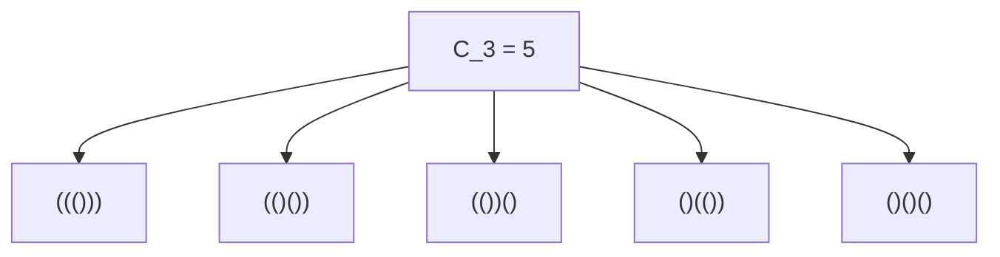
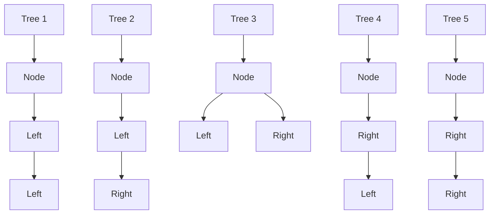
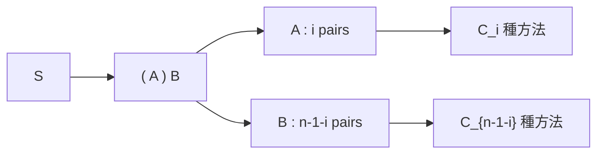

## 1. 簡介：什麼是[卡塔蘭數](https://kenji.blog/zh-tw/p/catalan-numbers/)？

在數學和電腦科學的世界中，我們經常會看到一種美妙的現象：多個看似完全不同的問題，實際上在背後擁有完全相同的結構。其中一個著名的例子就是 **[卡塔蘭數](https://kenji.blog/zh-tw/p/catalan-numbers/)** (Catalan numbers)。

[卡塔蘭數](https://kenji.blog/zh-tw/p/catalan-numbers/)以比利時數學家歐仁·查理·卡塔蘭的名字命名，該數列如下所示：

$$ C_0 = 1, \quad C_1 = 1, \quad C_2 = 2, \quad C_3 = 5, \quad C_4 = 14, \quad C_5 = 42, \quad C_6 = 132, \quad C_7 = 429, \quad \dots $$

這個數列作為各種組合問題的解頻繁出現。在本文中，我們將介紹四個涉及[卡塔蘭數](https://kenji.blog/zh-tw/p/catalan-numbers/)的著名例子（合法括號序列、二元樹、多邊形三角剖分和迪克路徑）。我們將剖析它們背後的遞迴結構，以了解為什麼它們對應著完全相同的數列。此外，我們還將詳細介紹使用動態規劃 ([DP](https://kenji.blog/zh-tw/p/dynamic-programming-dp-introduction-knapsack-fibonacci/)) 的計算演算法以及使用[母函數](https://kenji.blog/zh-tw/p/generating-functions/)的數學推導。

## 2. [卡塔蘭數](https://kenji.blog/zh-tw/p/catalan-numbers/)出現的四個具體例子

### 例子1：合法括號序列 (Valid Parentheses)

在程式設計中，確保括號正確匹配至關重要。使用 $n$ 對括號 `()` 所能組成的「合法括號序列」的數量正是[卡塔蘭數](https://kenji.blog/zh-tw/p/catalan-numbers/) $C_n$。

合法括號序列是指，從左向右讀取時，在任何時刻右括號 `)` 的數量都不會超過左括號 `(` 數量的字串。

讓我們看看 $n = 3$ 的情況。3 對括號可以組成 5 種合法排列。這與 $C_3 = 5$ 完全一致。



### 例子2：二元樹結構 (Binary Trees)

接下來，我們來看看大家熟悉的資料結構：二元樹。包含 $n$ 個內部節點的二元樹的形狀數量也是[卡塔蘭數](https://kenji.blog/zh-tw/p/catalan-numbers/) $C_n$。

對於 $n = 3$，有 5 種不同的二元樹形狀。它們的區別在於節點是連接到左子樹還是右子樹。



### 例子3：多邊形三角剖分 (Polygon Triangulation)

[卡塔蘭數](https://kenji.blog/zh-tw/p/catalan-numbers/)也出現在幾何學中。透過在頂點之間繪製不相交的對角線，將凸 $(n+2)$ 邊形分割成 $n$ 個三角形的方法數正是 $C_n$。

例如，當 $n = 3$ 時，我們考慮將一個五邊形（$3+2=5$）進行三角剖分。透過繪製對角線形成3個三角形的方法恰好有 5 種。在這裡，我們再次看到了數字 $C_3 = 5$。

### 例子4：迪克路徑 (Dyck Paths)

[卡塔蘭數](https://kenji.blog/zh-tw/p/catalan-numbers/)同樣出現在網格路徑問題中。在一個 $n \times n$ 的網格上，考慮從左下角 $(0, 0)$ 到右上角 $(n, n)$ 的最短路徑，每次只能向右或向上移動一個單位。那些永遠不會穿過對角線 $y = x$（即始終滿足 $y \le x$）的路徑數量為 $C_n$。這些被稱為 **迪克路徑** (Dyck path)。

如果我們用 `R` 表示向右移動，用 `U` 表示向上移動，該條件要求在路徑的任何前綴中，`U` 的數量永遠不超過 `R` 的數量。這與合法括號序列中 `(` 和 `)` 之間的關係完全等價。

## 3. 為什麼它們是相同的？（背後的結構）

為什麼這些看似無關的問題都會得出相同的[卡塔蘭數](https://kenji.blog/zh-tw/p/catalan-numbers/)列？答案在於它們都共享著 **完全相同的遞迴結構**。

[卡塔蘭數](https://kenji.blog/zh-tw/p/catalan-numbers/) $C_n$ 由以下遞迴關係定義：

$$ C_0 = 1 $$
$$ C_{n} = \sum_{i=0}^{n-1} C_i C_{n-1-i} \quad (n \ge 1) $$

讓我們以「合法括號序列」為例，直觀地理解這個遞迴關係是如何推導出來的。

考慮一個任意長度為 $2n$ 的合法括號序列 $S$。$S$ 必須以一個左括號 `(` 開頭。在字串的某處必定存在恰好一個匹配的右括號 `)`。
透過關注這個特定的匹配對，字串 $S$ 可以被唯一地分解為以下形式：

$$ S = ( A ) B $$

在這裡，$A$ 和 $B$ 本身也是合法的括號序列（它們可以是空字串）。
假設在最初的 `(` 和其匹配的 `)` 之間的子字串 $A$ 包含 $i$ 對括號 $(0 \le i \le n-1)$。
由於整個字串有 $n$ 對括號，其中 1 對被外層的 `( )` 消耗掉，剩餘的子字串 $B$ 必定包含 $(n - 1 - i)$ 對括號。

- 形成 $A$ 的方法數為 $C_i$ 種
- 形成 $B$ 的方法數為 $C_{n-1-i}$ 種

因此，對於固定的 $i$ 值，可能的字串數量為 $C_i \times C_{n-1-i}$。由於 $i$ 可以取從 $0$ 到 $n-1$ 的任何值，將所有這些可能性相加就得到了 $C_n$。這就是遞迴關係的含義。



完全相同的分解也適用於「二元樹」。如果我們將一個節點指定為根節點，並為左子樹分配 $i$ 個節點，那麼右子樹必須接收剩餘的 $n-1-i$ 個節點。這得出了完全相同的遞迴關係。

## 4. 閉合公式的數學推導

[卡塔蘭數](https://kenji.blog/zh-tw/p/catalan-numbers/)可以使用組合學符號透過一個非常簡單的 **閉合公式** (Closed-form formula) 來表示：

$$ C_n = \frac{1}{n+1} \binom{2n}{n} = \frac{(2n)!}{(n+1)!n!} $$

這個優雅的公式是如何推導出來的呢？讓我們來探討兩種主要的方法。

### 4.1. 反射原理 (Reflection Principle) 證明

我們可以使用迪克路徑來證明這個公式。
從 $(0,0)$ 到 $(n,n)$ 的最短路徑總數為 $\binom{2n}{n}$，因為在總共 $2n$ 步中，我們必須選擇 $n$ 步向右移動。

從中，我們必須減去違反條件的路徑（即穿過直線 $y = x$ 並觸碰直線 $y = x + 1$ 的路徑）。
令 $P$ 為違反條件的路徑首次觸碰 $y = x + 1$ 的點。我們將路徑從點 $P$ 到終點 $(n,n)$ 的部分沿著直線 $y = x + 1$ 進行反射。
原來的終點 $(n,n)$ 被反射到了新的終點 $(n-1, n+1)$。

奇妙的是，「從 $(0,0)$ 到 $(n,n)$ 的非法路徑」與「從 $(0,0)$ 到 $(n-1, n+1)$ 的所有路徑」之間存在著完美的雙射（一一對應）關係。
從 $(0,0)$ 到 $(n-1, n+1)$ 的路徑總數為 $\binom{2n}{n-1}$。

因此，合法路徑的數量為：

$$ C_n = \binom{2n}{n} - \binom{2n}{n-1} $$

我們可以對其進行代數化簡：

$$ C_n = \binom{2n}{n} - \frac{n}{n+1} \binom{2n}{n} = \left( 1 - \frac{n}{n+1} \right) \binom{2n}{n} = \frac{1}{n+1} \binom{2n}{n} $$

### 4.2. [母函數](https://kenji.blog/zh-tw/p/generating-functions/) ([Generating Functions](https://kenji.blog/zh-tw/p/generating-functions/)) 方法

令[卡塔蘭數](https://kenji.blog/zh-tw/p/catalan-numbers/)的[母函數](https://kenji.blog/zh-tw/p/generating-functions/)為 $C(x) = \sum_{n=0}^\infty C_n x^n$。
利用遞迴關係 $C_{n} = \sum_{i=0}^{n-1} C_i C_{n-1-i}$，我們發現該[母函數](https://kenji.blog/zh-tw/p/generating-functions/)滿足以下方程式：

$$ C(x) = 1 + x [C(x)]^2 $$

這可以看作是關於 $C(x)$ 的二次方程式：$x [C(x)]^2 - C(x) + 1 = 0$。透過應用求根公式，我們得到：

$$ C(x) = \frac{1 \pm \sqrt{1 - 4x}}{2x} $$

為了在 $x \to 0$ 時滿足 $C(0) = 1$ 的條件，我們必須選擇負號。

$$ C(x) = \frac{1 - \sqrt{1 - 4x}}{2x} $$

透過使用廣義二項式定理（泰勒展開）展開 $\sqrt{1 - 4x} = (1 - 4x)^{1/2}$ 並比較係數，我們就得出了 $C_n = \frac{1}{n+1} \binom{2n}{n}$。

## 5. [卡塔蘭數](https://kenji.blog/zh-tw/p/catalan-numbers/)的計算演算法

當透過程式設計計算[卡塔蘭數](https://kenji.blog/zh-tw/p/catalan-numbers/)時，主要有三種方法。

### 5.1. 簡單遞迴 (Naive Recursion)

這涉及直接實作遞迴關係。然而，由於它重複計算相同的值，時間複雜度呈指數級增長，因此不適合較大的 $n$。

```python
def catalan_recursive(n):
    # 基礎情況
    if n <= 1:
        return 1
    
    res = 0
    for i in range(n):
        res += catalan_recursive(i) * catalan_recursive(n - 1 - i)
    return res
```

### 5.2. 動態規劃 ([Dynamic Programming](https://kenji.blog/zh-tw/p/dynamic-programming-dp-introduction-knapsack-fibonacci/))

透過利用記憶化（或由下而上的動態規劃）將計算結果儲存在陣列中，我們可以將時間複雜度降低到 $O(n^2)$。

```python
def catalan_dp(n):
    # 初始化 DP 表。C_0 = 1
    dp = [0] * (n + 1)
    dp[0] = 1
    
    # 基於遞迴關係進行計算
    for i in range(1, n + 1):
        for j in range(i):
            dp[i] += dp[j] * dp[i - 1 - j]
            
    return dp[n]

# 測試
for i in range(7):
    print(f"C_{i} =", catalan_dp(i))
```

### 5.3. 閉合公式 (Closed-Form Formula)

使用該公式，我們只需執行階乘計算，即可在 $O(n)$ 的時間複雜度內計算出結果。

```python
import math

def catalan_formula(n):
    # C_n = (2n)! / ((n+1)! * n!)
    return math.comb(2 * n, n) // (n + 1)

# 測試
for i in range(7):
    print(f"C_{i} =", catalan_formula(i))
```

## 6. 總結

[卡塔蘭數](https://kenji.blog/zh-tw/p/catalan-numbers/)列 $C_n$ 是一個迷人的數列，它統一地出現在眾多看似不同的問題中，例如合法括號序列、二元樹形狀、多邊形三角剖分和迪克路徑。這些問題得出相同數量的原因在於它們都體現了一個共同的遞迴結構：**「將整體分割為兩個子問題並將它們組合」**。

在學習演算法和資料結構時，理解這些數學背景能培養看透問題本質的能力。它也是動態規劃的極佳練習，所以一定要嘗試自己編寫程式碼進行實驗！
