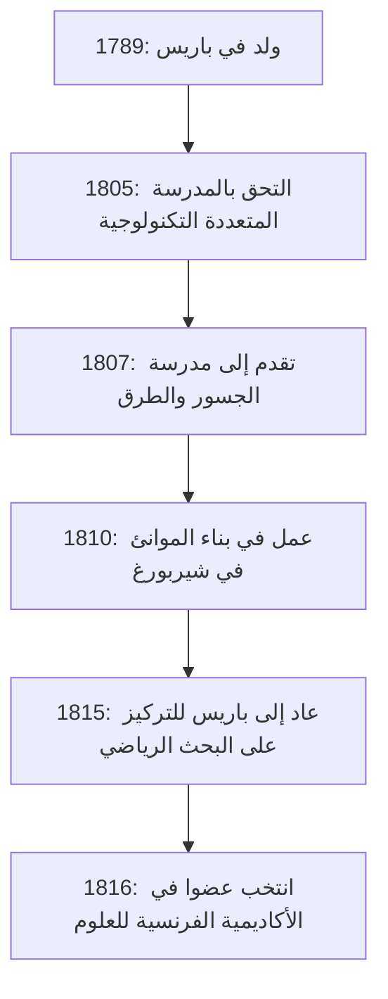

## مقدمة

في تاريخ الرياضيات، يُعرف القرن التاسع عشر باسم "عصر الدقة". عالم الرياضيات الفرنسي **[أوغوستان-لوي كوشي](https://kenji.blog/p/cauchy/)** (1789-1857) هو من وضع أساسًا منطقيًا قويًا لحساب التفاضل والتكامل، والذي كان يُعالج سابقًا بشكل حدسي. يكلل اسمه الكثير من النظريات والمفاهيم بحيث لا بد لأي شخص يدرس الرياضيات الحديثة أن يواجهه.

يستكشف هذا المقال الحياة المضطربة لكوشي، عملاق عالم الرياضيات، والإنجازات الرياضية الرائعة التي تركها وراءه.

## حياة مضطربة: العيش في فرنسا المضطربة

ولد كوشي في باريس عام 1789، بعد اندلاع الثورة الفرنسية مباشرة. كانت حياته متشابكة باستمرار مع الاضطرابات السياسية في فرنسا.

### الطفولة والتعليم

شغل والد كوشي منصبًا رفيعًا في قوات الشرطة، ولكن للهروب من فوضى الثورة، فرت العائلة إلى أركوي، وهي ضاحية من ضواحي باريس. هناك، تلقى تعليمات من كبار العلماء في ذلك الوقت، مثل لابلاس ولاغرانج، الذين كانوا أصدقاء لوالده. لاغرانج، على وجه الخصوص، أدرك موهبة كوشي الشاب في الرياضيات وتوقع بشكل شهير: "هذا الصبي سيتفوق علينا جميعًا يومًا ما."

### المهنة والمعتقدات السياسية

بعد تخرجه من المدرسة المتعددة التكنولوجية، بدأ العمل كمهندس مدني، لكن صحته المدمرة وشغفه بالرياضيات قاداه في مسار باحث. في عام 1816، أثناء إعادة تنظيم أكاديمية العلوم بعد استعادة البوربون، تم انتخابه عضوًا، ليحل محل مونج وكارنو اللذين طُردوا لأسباب سياسية.

كان كوشي كاثوليكيًا متدينًا وملكيًا متحمسًا (مؤيدًا لعائلة بوربون). عندما تنازل تشارلز العاشر عن العرش بعد ثورة يوليو عام 1830، رفض أداء يمين الولاء للنظام الجديد واختار المنفى. تجول عبر سويسرا وإيطاليا وبراغ، وترك وطنه لمدة ثماني سنوات تقريبًا حتى عاد إلى باريس عام 1838. حتى بعد عودته، استمر في رفض القسم، ولفترة طويلة لم يتمكن من تأمين منصب جامعي رسمي.

تسببت أيديولوجيته المحافظة وشخصيته التي لا هوادة فيها في بعض الأحيان في احتكاك مع زملائه وعلماء الرياضيات الأصغر سنًا (مثل أبيل وجالوا)، ولكن تفانيه في الرياضيات وإنتاجيته الساحقة لا يمكن لأحد أن ينكره.

## ثورة في الرياضيات: السعي وراء الدقة

كان أعظم إنجاز لكوشي هو توفير أساس صارم للتحليل الرياضي. أعاد بناء مفاهيم مثل النهايات والاستمرارية والتمايز والتكامل باستخدام تعريفات صارمة أدت إلى وسيطات إبسيلون-دلتا (التي أتقنها ويرستراس لاحقًا) والتي نتعلمها اليوم.

فيما يلي بعض الإنجازات المهمة التي تحمل اسمه.

### 1. متتالية كوشي

يعتبر مفهوم **متتالية كوشي** أساسيًا عند مناقشة استمرارية الأعداد الحقيقية. تكون المتتالية $ (a_n) $ متتالية كوشي إذا أصبح الفرق بين $ a_n $ و $ a_m $ صغيرًا بشكل تعسفي عندما تكون المؤشرات $ n $ و $ m $ كبيرة بما يكفي.

يُعبر عنها رياضيًا، لأي $ \epsilon > 0 $، يوجد عدد طبيعي $ N $ بحيث يكون لجميع $ n, m > N $،
$$ |a_n - a_m| < \epsilon $$
صحيحًا دائمًا.

في مساحة الأعداد الحقيقية، تشير الخاصية التي تنص على أن "متتالية كوشي تتقارب دائمًا" إلى أن المساحة "مكتملة". مفهوم الاكتمال هذا هو أساس الطوبولوجيا الحديثة والتحليل الوظيفي.

### 2. نظرية تكامل كوشي

ليس من المبالغة القول إن نظرية الوظائف المعقدة (التحليل المعقد) أسسها كوشي بمفرده تقريبًا. نظريتها المركزية هي **نظرية تكامل كوشي**.

تنص على أنه بالنسبة لوظيفة معقدة $ f(z) $ وهي هولومورفية (قابلة للتفاضل) في منطقة $ D $، فإن التكامل الخطي على طول أي منحنى مغلق بسيط $ C $ داخل $ D $ هو صفر.

$$ \oint_C f(z) \, dz = 0 $$

من هذه النظرية التي تبدو بسيطة، يتم استخلاص نتائج مذهلة باستمرار. على سبيل المثال، نحصل على **صيغة تكامل كوشي**، والتي توضح أن قيمة الوظيفة يتم تحديدها فقط من خلال قيمها على الحدود.

$$ f(a) = \frac{1}{2\pi i} \oint_C \frac{f(z)}{z - a} \, dz $$

هذه الصيغة هي أداة قوية بشكل لا يصدق تضمن أن الوظيفة الهولومورفية قابلة للتفاضل بلا حدود ويمكن توسيعها إلى سلسلة تايلور.

### 3. متراجحة كوشي-شفارتز

هذه واحدة من أكثر المتراجحات استخدامًا في الجبر الخطي والتحليل. لأي متجهات $ \mathbf{u} $ و $ \mathbf{v} $ للأرقام الحقيقية أو المعقدة في مساحة المنتج الداخلي، تحمل العلاقة التالية:

$$ |\langle \mathbf{u}, \mathbf{v} \rangle|^2 \leq \langle \mathbf{u}, \mathbf{u} \rangle \cdot \langle \mathbf{v}, \mathbf{v} \rangle $$

في شكلها التكاملي، للوظائف $ f(x) $ و $ g(x) $، يتم التعبير عنها على النحو التالي:

$$ \left( \int_a^b f(x)g(x) \, dx \right)^2 \leq \left( \int_a^b f(x)^2 \, dx \right) \left( \int_a^b g(x)^2 \, dx \right) $$

تشكل هذه المتراجحة الأساس لتوسيع مفاهيم الزوايا والمسافات بين المتجهات إلى مساحات مجردة.

## غزارة إنتاج كوشي وإرثه

نشر كوشي حوالي 800 ورقة علمية خلال حياته. هذا رقم مذهل، في المرتبة الثانية بعد أويلر. حتى أن هناك حكاية تفيد بأنه قدم العديد من الأوراق إلى نشرة أكاديمية العلوم واحدة تلو الأخرى بحيث اضطرت الأكاديمية إلى فرض حدود للصفحات على الأوراق للحفاظ على انخفاض تكاليف الطباعة.

لم تقتصر موضوعات بحثه على التحليل بل امتدت لتشمل مجموعة واسعة من المجالات في الرياضيات والفيزياء، بما في ذلك الجبر (دراسة التباديل في نظرية المجموعة) والفيزياء الرياضية (نظرية المرونة والبصريات).

## استنتاج

صاغ [أوغوستان-لوي كوشي](https://kenji.blog/p/cauchy/) الرياضيات، التي اعتمدت على الحدس، في تخصص أكاديمي صارم من خلال قوة المنطق. المفاهيم والنظريات التي ابتكرها متجذرة بعمق في كل مكان في الرياضيات الحديثة.

على الرغم من أن حياته لم تكن سلسة، حيث اختار المنفى كشهيد لمعتقداته السياسية، إلا أن شغفه بالسعي وراء الحقيقة لم يتزعزع أبدًا. لا يزال الإرث الفكري الهائل الذي تركه وراءه يوجه علماء الرياضيات والعلماء في جميع أنحاء العالم اليوم.
