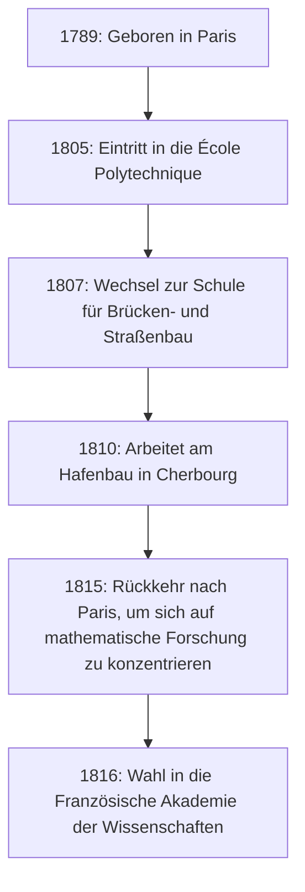

## Einleitung

In der Geschichte der Mathematik ist das 19. Jahrhundert als "Ära der Strenge" bekannt. Der französische Mathematiker **[Augustin-Louis Cauchy](https://kenji.blog/de/p/cauchy/)** (1789-1857) war es, der der Infinitesimalrechnung, die zuvor intuitiv behandelt wurde, ein festes logisches Fundament gab. Sein Name krönt so viele Theoreme und Konzepte, dass jeder, der moderne Mathematik studiert, zwangsläufig auf ihn stößt.

Dieser Artikel beleuchtet das turbulente Leben von [Cauchy](https://kenji.blog/de/p/cauchy/), einem Giganten der mathematischen Welt, und die brillanten mathematischen Errungenschaften, die er hinterlassen hat.

## Ein turbulentes Leben: Leben in einem unruhigen Frankreich

[Cauchy](https://kenji.blog/de/p/cauchy/) wurde 1789, kurz nach dem Ausbruch der Französischen Revolution, in Paris geboren. Sein Leben war ständig mit den politischen Umwälzungen Frankreichs verflochten.

### Kindheit und Ausbildung

[Cauchy](https://kenji.blog/de/p/cauchy/)s Vater bekleidete ein hohes Amt bei der Polizei, aber um dem Chaos der Revolution zu entkommen, floh die Familie nach Arcueil, einem Vorort von Paris. Dort wurde er von großen Wissenschaftlern der damaligen Zeit unterrichtet, wie Laplace und Lagrange, die Freunde seines Vaters waren. Insbesondere Lagrange erkannte das mathematische Talent des jungen [Cauchy](https://kenji.blog/de/p/cauchy/) und prophezeite berühmt: "Dieser Junge wird uns eines Tages alle übertreffen."

### Karriere und politische Überzeugungen

Nach seinem Abschluss an der École Polytechnique begann er als Bauingenieur zu arbeiten, aber seine ruinierte Gesundheit und seine Leidenschaft für die Mathematik führten ihn auf den Weg des Forschers. Im Jahr 1816, während der Umstrukturierung der Akademie der Wissenschaften nach der Restauration der Bourbonen, wurde er als Mitglied gewählt und ersetzte Monge und Carnot, die aus politischen Gründen ausgeschlossen wurden.

[Cauchy](https://kenji.blog/de/p/cauchy/) war ein frommer Katholik und ein glühender Royalist (Anhänger des Hauses Bourbon). Als Karl X. nach der Julirevolution von 1830 abdankte, weigerte er sich, dem neuen Regime einen Treueid zu leisten, und wählte das Exil. Er wanderte durch die Schweiz, Italien und Prag und verließ sein Heimatland für etwa acht Jahre, bis er 1838 nach Paris zurückkehrte. Auch nach seiner Rückkehr weigerte er sich weiterhin, den Eid abzulegen, und konnte lange Zeit keine formelle Universitätsposition erhalten.

Seine konservative Ideologie und seine kompromisslose Persönlichkeit verursachten manchmal Reibungen mit Kollegen und jüngeren Mathematikern (wie [Abel](https://kenji.blog/de/p/abel/) und [Galois](https://kenji.blog/de/p/galois/)), aber seine Hingabe zur Mathematik und seine überwältigende Produktivität konnten von niemandem geleugnet werden.

## Revolution in der Mathematik: Das Streben nach Strenge

[Cauchy](https://kenji.blog/de/p/cauchy/)s größte Errungenschaft war es, der mathematischen Analysis ein strenges Fundament zu geben. Er rekonstruierte Konzepte wie Grenzwerte, Stetigkeit, Differenzierung und Integration mit strengen Definitionen, die zu den [Epsilon-Delta](/de/p/epsilon-delta-definition/)-Argumenten führten (die später von Weierstraß perfektioniert wurden), die wir heute lernen.

Hier sind einige der wichtigsten Errungenschaften, die seinen Namen tragen.

### 1. [Cauchy](https://kenji.blog/de/p/cauchy/)-Folge

Das Konzept einer **[Cauchy](https://kenji.blog/de/p/cauchy/)-Folge** ist wesentlich, wenn es um die Stetigkeit reeller Zahlen geht. Eine Folge $ (a_n) $ ist eine [Cauchy](https://kenji.blog/de/p/cauchy/)-Folge, wenn die Differenz zwischen $ a_n $ und $ a_m $ beliebig klein wird, wenn die Indizes $ n $ und $ m $ ausreichend groß sind.

Mathematisch ausgedrückt: Für jedes $ \epsilon > 0 $ existiert eine natürliche Zahl $ N $, so dass für alle $ n, m > N $
$$ |a_n - a_m| < \epsilon $$
immer gilt.

Im Raum der reellen Zahlen zeigt die Eigenschaft, dass "eine [Cauchy](https://kenji.blog/de/p/cauchy/)-Folge immer konvergiert", an, dass der Raum "vollständig" ist. Dieses Konzept der Vollständigkeit ist die Grundlage der modernen Topologie und Funktionalanalysis.

### 2. [Cauchy](https://kenji.blog/de/p/cauchy/)scher Integralsatz

Es ist keine Übertreibung zu sagen, dass die komplexe Funktionentheorie (komplexe Analysis) fast im Alleingang von [Cauchy](https://kenji.blog/de/p/cauchy/) begründet wurde. Ihr zentraler Satz ist der **[Cauchy](https://kenji.blog/de/p/cauchy/)sche Integralsatz**.

Er besagt, dass für eine komplexe Funktion $ f(z) $, die in einem Gebiet $ D $ holomorph (differenzierbar) ist, das Wegintegral entlang jeder einfachen geschlossenen Kurve $ C $ innerhalb von $ D $ null ist.

$$ \oint_C f(z) \, dz = 0 $$

Aus diesem scheinbar einfachen Satz werden kontinuierlich erstaunliche Ergebnisse abgeleitet. Zum Beispiel erhalten wir die **[Cauchy](https://kenji.blog/de/p/cauchy/)sche Integralformel**, die zeigt, dass der Wert einer Funktion allein durch ihre Werte auf dem Rand bestimmt wird.

$$ f(a) = \frac{1}{2\pi i} \oint_C \frac{f(z)}{z - a} \, dz $$

Diese Formel ist ein unglaublich leistungsfähiges Werkzeug, das garantiert, dass eine holomorphe Funktion unendlich oft differenzierbar ist und in eine Taylorreihe entwickelt werden kann.

### 3. [Cauchy](https://kenji.blog/de/p/cauchy/)-Schwarzsche Ungleichung

Dies ist eine der am häufigsten verwendeten Ungleichungen in der linearen Algebra und Analysis. Für alle Vektoren $ \mathbf{u} $ und $ \mathbf{v} $ reeller oder komplexer Zahlen in einem Prähilbertraum gilt die folgende Beziehung:

$$ |\langle \mathbf{u}, \mathbf{v} \rangle|^2 \leq \langle \mathbf{u}, \mathbf{u} \rangle \cdot \langle \mathbf{v}, \mathbf{v} \rangle $$

In ihrer Integralform wird sie für die Funktionen $ f(x) $ und $ g(x) $ wie folgt ausgedrückt:

$$ \left( \int_a^b f(x)g(x) \, dx \right)^2 \leq \left( \int_a^b f(x)^2 \, dx \right) \left( \int_a^b g(x)^2 \, dx \right) $$

Diese Ungleichung bildet die Grundlage für die Ausweitung der Konzepte von Winkeln und Abständen zwischen Vektoren auf abstrakte Räume.

## [Cauchy](https://kenji.blog/de/p/cauchy/)s Produktivität und Erbe

[Cauchy](https://kenji.blog/de/p/cauchy/) veröffentlichte zu seinen Lebzeiten etwa 800 Arbeiten. Dies ist eine atemberaubende Zahl, die nur von Euler übertroffen wird. Es gibt sogar eine Anekdote, dass er nacheinander so viele Arbeiten beim Bulletin der Akademie der Wissenschaften einreichte, dass die Akademie Seitenbeschränkungen für Arbeiten einführen musste, um die Druckkosten niedrig zu halten.

Seine Forschungsthemen beschränkten sich nicht auf die Analysis, sondern erstreckten sich auf ein breites Spektrum von Bereichen in Mathematik und Physik, einschließlich Algebra (die Untersuchung von Permutationen in der Gruppentheorie) und mathematischer Physik (Elastizitätstheorie und Optik).

## Fazit

[Augustin-Louis Cauchy](https://kenji.blog/de/p/cauchy/) schmiedete die Mathematik, die sich auf Intuition verlassen hatte, durch die Kraft der Logik zu einer strengen akademischen Disziplin. Die Konzepte und Theoreme, die er geschaffen hat, sind überall in der modernen Mathematik tief verwurzelt.

Obwohl sein Leben nicht glatt verlief, da er das Exil als Märtyrer seiner politischen Überzeugungen wählte, geriet seine Leidenschaft für die Suche nach der Wahrheit nie ins Wanken. Das immense intellektuelle Erbe, das er hinterlassen hat, leitet Mathematiker und Wissenschaftler auf der ganzen Welt bis heute.
