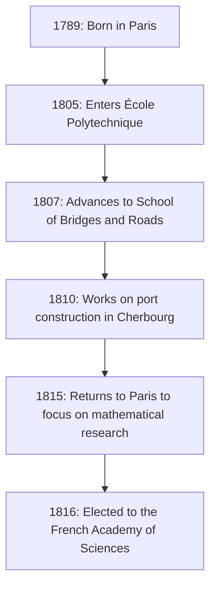

## Introduction

In the history of mathematics, the 19th century is known as the "Era of Rigor." The French mathematician **[Augustin-Louis Cauchy](https://kenji.blog/en/p/cauchy/)** (1789-1857) is the one who provided a firm logical foundation for calculus, which had previously been treated intuitively. His name crowns so many theorems and concepts that anyone studying modern mathematics is bound to encounter it.

This article explores the turbulent life of Cauchy, a giant in the mathematical world, and the brilliant mathematical achievements he left behind.

## A Turbulent Life: Living in a Tumultuous France

Cauchy was born in Paris in 1789, just after the outbreak of the French Revolution. His life was constantly intertwined with the political upheavals of France.

### Childhood and Education

Cauchy's father held a high position in the police force, but to escape the chaos of the revolution, the family fled to Arcueil, a suburb of Paris. There, he received instruction from great scientists of the time, such as Laplace and Lagrange, who were friends of his father. Lagrange, in particular, recognized young Cauchy's mathematical talent and famously predicted, "This boy will one day surpass us all."

### Career and Political Beliefs

After graduating from the École Polytechnique, he began working as a civil engineer, but his ruined health and passion for mathematics led him down the path of a researcher. In 1816, during the reorganization of the Academy of Sciences following the Bourbon Restoration, he was elected a member, replacing Monge and Carnot who were expelled for political reasons.

Cauchy was a devout Catholic and an ardent royalist (supporter of the House of Bourbon). When Charles X abdicated following the July Revolution of 1830, he refused to swear an oath of allegiance to the new regime and chose exile. He wandered through Switzerland, Italy, and Prague, leaving his homeland for about eight years until returning to Paris in 1838. Even after his return, he continued to refuse the oath, and for a long time was unable to secure a formal university position.

His conservative ideology and uncompromising personality sometimes caused friction with colleagues and younger mathematicians (such as Abel and Galois), but his dedication to mathematics and overwhelming productivity could be denied by no one.

## Revolution in Mathematics: The Pursuit of Rigor

Cauchy's greatest achievement was providing a rigorous foundation for mathematical analysis. He reconstructed concepts such as limits, continuity, differentiation, and integration using rigorous definitions that led to the epsilon-delta arguments (later perfected by Weierstrass) that we learn today.

Here are a few of the important achievements that bear his name.

### 1. Cauchy Sequence

The concept of a **Cauchy sequence** is essential when discussing the continuity of real numbers. A sequence $ (a_n) $ is a Cauchy sequence if the difference between $ a_n $ and $ a_m $ becomes arbitrarily small when the indices $ n $ and $ m $ are sufficiently large.

Expressed mathematically, for any $ \epsilon > 0 $, there exists a natural number $ N $ such that for all $ n, m > N $,
$$ |a_n - a_m| < \epsilon $$
always holds.

In the space of real numbers, the property that "a Cauchy sequence always converges" indicates that the space is "complete." This concept of completeness is the foundation of modern topology and functional analysis.

### 2. Cauchy's Integral Theorem

It is no exaggeration to say that complex function theory (complex analysis) was founded almost single-handedly by Cauchy. Its central theorem is **Cauchy's Integral Theorem**.

It states that for a complex function $ f(z) $ that is holomorphic (differentiable) in a region $ D $, the line integral along any simple closed curve $ C $ within $ D $ is zero.

$$ \oint_C f(z) \, dz = 0 $$

From this seemingly simple theorem, astonishing results are continuously derived. For example, we obtain **Cauchy's Integral Formula**, which shows that the value of a function is determined solely by its values on the boundary.

$$ f(a) = \frac{1}{2\pi i} \oint_C \frac{f(z)}{z - a} \, dz $$

This formula is an incredibly powerful tool that guarantees that a holomorphic function is infinitely differentiable and can be expanded into a Taylor series.

### 3. Cauchy-Schwarz Inequality

This is one of the most frequently used inequalities in linear algebra and analysis. For any vectors $ \mathbf{u} $ and $ \mathbf{v} $ of real or complex numbers in an inner product space, the following relationship holds:

$$ |\langle \mathbf{u}, \mathbf{v} \rangle|^2 \leq \langle \mathbf{u}, \mathbf{u} \rangle \cdot \langle \mathbf{v}, \mathbf{v} \rangle $$

In its integral form, for functions $ f(x) $ and $ g(x) $, it is expressed as follows:

$$ \left( \int_a^b f(x)g(x) \, dx \right)^2 \leq \left( \int_a^b f(x)^2 \, dx \right) \left( \int_a^b g(x)^2 \, dx \right) $$

This inequality forms the foundation for extending the concepts of angles and distances between vectors to abstract spaces.

## Cauchy's Prolificacy and Legacy

Cauchy published about 800 papers during his lifetime. This is a staggering number, second only to Euler. There is even an anecdote that he submitted so many papers to the Academy of Sciences' bulletin one after another that the Academy had to impose page limits on papers to keep printing costs down.

His research subjects were not limited to analysis but extended to a wide range of fields in mathematics and physics, including algebra (the study of permutations in group theory) and mathematical physics (elasticity theory and optics).

## Conclusion

[Augustin-Louis Cauchy](https://kenji.blog/en/p/cauchy/) forged mathematics, which had relied on intuition, into a rigorous academic discipline through the power of logic. The concepts and theorems he created are deeply rooted everywhere in modern mathematics.

Although his life was not smooth, as he chose exile as a martyr to his political beliefs, his passion for pursuing the truth never wavered. The immense intellectual legacy he left behind continues to guide mathematicians and scientists around the world today.
