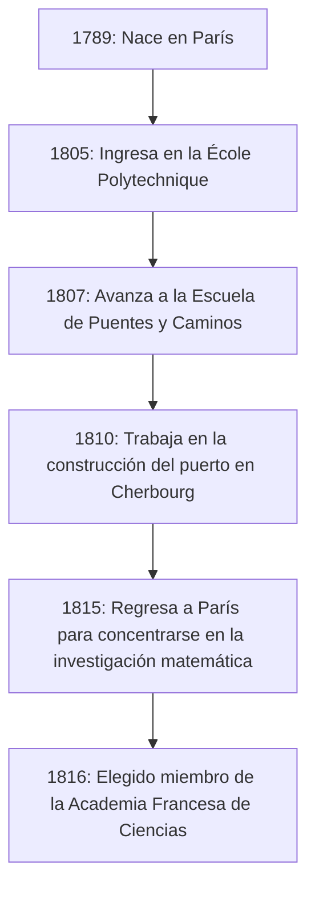

## Introducción

En la historia de las matemáticas, el siglo XIX es conocido como la "Era del Rigor". El matemático francés **[Augustin-Louis Cauchy](https://kenji.blog/es/p/cauchy/)** (1789-1857) es quien proporcionó un fundamento lógico firme para el cálculo, que anteriormente se había tratado de forma intuitiva. Su nombre corona tantos teoremas y conceptos que cualquiera que estudie matemáticas modernas está destinado a encontrarlo.

Este artículo explora la vida turbulenta de [Cauchy](https://kenji.blog/es/p/cauchy/), un gigante del mundo matemático, y los brillantes logros matemáticos que dejó.

## Una vida turbulenta: Viviendo en una Francia agitada

[Cauchy](https://kenji.blog/es/p/cauchy/) nació en París en 1789, poco después del estallido de la Revolución Francesa. Su vida estuvo constantemente entrelazada con las convulsiones políticas de Francia.

### Infancia y educación

El padre de [Cauchy](https://kenji.blog/es/p/cauchy/) ocupaba un alto cargo en las fuerzas policiales, pero para escapar del caos de la revolución, la familia huyó a Arcueil, un suburbio de París. Allí, recibió instrucción de grandes científicos de la época, como Laplace y Lagrange, que eran amigos de su padre. Lagrange, en particular, reconoció el talento matemático del joven [Cauchy](https://kenji.blog/es/p/cauchy/) y predijo de forma célebre: "Este chico nos superará a todos algún día".

### Carrera y creencias políticas

Después de graduarse de la École Polytechnique, comenzó a trabajar como ingeniero civil, pero su salud arruinada y su pasión por las matemáticas lo llevaron por el camino de investigador. En 1816, durante la reorganización de la Academia de Ciencias tras la Restauración de los Borbones, fue elegido miembro, en sustitución de Monge y Carnot, que fueron expulsados por motivos políticos.

[Cauchy](https://kenji.blog/es/p/cauchy/) era un devoto católico y un ferviente monárquico (partidario de la Casa de Borbón). Cuando Carlos X abdicó tras la Revolución de Julio de 1830, se negó a prestar juramento de lealtad al nuevo régimen y eligió el exilio. Deambuló por Suiza, Italia y Praga, dejando su patria durante unos ocho años hasta regresar a París en 1838. Incluso después de su regreso, continuó rechazando el juramento, y durante mucho tiempo no pudo asegurar un puesto universitario formal.

Su ideología conservadora y su personalidad intransigente a veces causaron fricciones con colegas y matemáticos más jóvenes (como [Abel](https://kenji.blog/es/p/abel/) y [Galois](https://kenji.blog/es/p/galois/)), pero su dedicación a las matemáticas y su productividad abrumadora no podían ser negadas por nadie.

## Revolución en matemáticas: La búsqueda del rigor

El mayor logro de [Cauchy](https://kenji.blog/es/p/cauchy/) fue proporcionar una base rigurosa para el análisis matemático. Reconstruyó conceptos como límites, continuidad, diferenciación e integración utilizando definiciones rigurosas que llevaron a los argumentos épsilon-delta (más tarde perfeccionados por Weierstrass) que aprendemos hoy.

A continuación, se presentan algunos de los logros importantes que llevan su nombre.

### 1. Sucesión de [Cauchy](https://kenji.blog/es/p/cauchy/)

El concepto de **sucesión de [Cauchy](https://kenji.blog/es/p/cauchy/)** es esencial cuando se discute la continuidad de los números reales. Una sucesión $ (a_n) $ es una sucesión de [Cauchy](https://kenji.blog/es/p/cauchy/) si la diferencia entre $ a_n $ y $ a_m $ se vuelve arbitrariamente pequeña cuando los índices $ n $ y $ m $ son suficientemente grandes.

Expresado matemáticamente, para cualquier $ \epsilon > 0 $, existe un número natural $ N $ tal que para todos los $ n, m > N $,
$$ |a_n - a_m| < \epsilon $$
siempre se cumple.

En el espacio de los números reales, la propiedad de que "una sucesión de [Cauchy](https://kenji.blog/es/p/cauchy/) siempre converge" indica que el espacio es "completo". Este concepto de completitud es la base de la topología moderna y del análisis funcional.

### 2. Teorema integral de [Cauchy](https://kenji.blog/es/p/cauchy/)

No es exagerado decir que la teoría de funciones complejas (análisis complejo) fue fundada casi sin ayuda por [Cauchy](https://kenji.blog/es/p/cauchy/). Su teorema central es el **Teorema Integral de [Cauchy](https://kenji.blog/es/p/cauchy/)**.

Establece que para una función compleja $ f(z) $ que es holomorfa (diferenciable) en una región $ D $, la integral de línea a lo largo de cualquier curva cerrada simple $ C $ dentro de $ D $ es cero.

$$ \oint_C f(z) \, dz = 0 $$

De este teorema aparentemente simple, se derivan continuamente resultados asombrosos. Por ejemplo, obtenemos la **Fórmula Integral de [Cauchy](https://kenji.blog/es/p/cauchy/)**, que muestra que el valor de una función está determinado únicamente por sus valores en el límite.

$$ f(a) = \frac{1}{2\pi i} \oint_C \frac{f(z)}{z - a} \, dz $$

Esta fórmula es una herramienta increíblemente poderosa que garantiza que una función holomorfa es infinitamente diferenciable y puede expandirse en una serie de Taylor.

### 3. Desigualdad de [Cauchy](https://kenji.blog/es/p/cauchy/)-Schwarz

Esta es una de las desigualdades que se utilizan con más frecuencia en el álgebra lineal y el análisis. Para cualquier vector $ \mathbf{u} $ y $ \mathbf{v} $ de números reales o complejos en un espacio con producto interno, se cumple la siguiente relación:

$$ |\langle \mathbf{u}, \mathbf{v} \rangle|^2 \leq \langle \mathbf{u}, \mathbf{u} \rangle \cdot \langle \mathbf{v}, \mathbf{v} \rangle $$

En su forma integral, para las funciones $ f(x) $ y $ g(x) $, se expresa de la siguiente manera:

$$ \left( \int_a^b f(x)g(x) \, dx \right)^2 \leq \left( \int_a^b f(x)^2 \, dx \right) \left( \int_a^b g(x)^2 \, dx \right) $$

Esta desigualdad forma la base para extender los conceptos de ángulos y distancias entre vectores a espacios abstractos.

## La prolificidad y el legado de [Cauchy](https://kenji.blog/es/p/cauchy/)

[Cauchy](https://kenji.blog/es/p/cauchy/) publicó unos 800 artículos durante su vida. Este es un número asombroso, solo superado por Euler. Incluso existe una anécdota de que presentó tantos artículos al boletín de la Academia de Ciencias uno tras otro que la Academia tuvo que imponer límites de página en los artículos para reducir los costos de impresión.

Sus temas de investigación no se limitaron al análisis, sino que se extendieron a una amplia gama de campos en matemáticas y física, incluyendo el álgebra (el estudio de las permutaciones en la teoría de grupos) y la física matemática (teoría de la elasticidad y óptica).

## Conclusión

[Augustin-Louis Cauchy](https://kenji.blog/es/p/cauchy/) forjó las matemáticas, que se habían basado en la intuición, en una disciplina académica rigurosa a través del poder de la lógica. Los conceptos y teoremas que creó están profundamente arraigados en todas partes de las matemáticas modernas.

Aunque su vida no fue fácil, ya que eligió el exilio como mártir de sus creencias políticas, su pasión por la búsqueda de la verdad nunca flaqueó. El inmenso legado intelectual que dejó continúa guiando a los matemáticos y científicos de todo el mundo de hoy.
