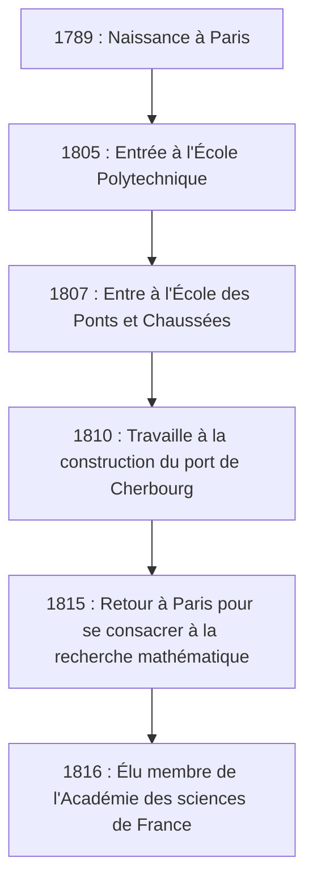

## Introduction

Dans l'histoire des mathématiques, le XIXe siècle est connu comme "l'ère de la rigueur". Le mathématicien français **Augustin-Louis Cauchy** (1789-1857) est celui qui a fourni un fondement logique solide au calcul infinitésimal, qui avait été traité de manière intuitive auparavant. Son nom couronne tant de théorèmes et de concepts que quiconque étudiant les mathématiques modernes est tenu de le rencontrer.

Cet article explore la vie tumultueuse de Cauchy, un géant du monde mathématique, et les brillantes réalisations mathématiques qu'il a laissées derrière lui.

## Une Vie Tumultueuse : Vivre dans une France Agitée

Cauchy est né à Paris en 1789, juste après le déclenchement de la Révolution française. Sa vie fut constamment liée aux bouleversements politiques de la France.

### Enfance et Éducation

Le père de Cauchy occupait un poste élevé dans la police, mais pour échapper au chaos de la révolution, la famille s'est enfuie à Arcueil, une banlieue de Paris. Là, il a reçu l'enseignement de grands scientifiques de l'époque, tels que Laplace et Lagrange, qui étaient des amis de son père. Lagrange, en particulier, a reconnu le talent mathématique du jeune Cauchy et a prédit avec célèbre : "Ce garçon nous surpassera tous un jour."

### Carrière et Convictions Politiques

Après avoir obtenu son diplôme de l'École Polytechnique, il a commencé à travailler comme ingénieur civil, mais sa santé ruinée et sa passion pour les mathématiques l'ont conduit sur la voie de chercheur. En 1816, lors de la réorganisation de l'Académie des sciences suite à la Restauration des Bourbons, il a été élu membre, remplaçant Monge et Carnot qui ont été expulsés pour des raisons politiques.

Cauchy était un catholique fervent et un royaliste ardent (partisan de la Maison de Bourbon). Lorsque Charles X a abdiqué suite à la Révolution de Juillet de 1830, il a refusé de prêter serment d'allégeance au nouveau régime et a choisi l'exil. Il a erré en Suisse, en Italie et à Prague, quittant sa patrie pendant environ huit ans jusqu'à son retour à Paris en 1838. Même après son retour, il a continué à refuser le serment et a longtemps été incapable d'obtenir un poste universitaire formel.

Son idéologie conservatrice et sa personnalité intransigeante ont parfois causé des frictions avec des collègues et de jeunes mathématiciens (tels qu'Abel et Galois), mais son dévouement aux mathématiques et sa productivité écrasante ne pouvaient être niés par personne.

## Révolution dans les Mathématiques : La Quête de la Rigueur

La plus grande réalisation de Cauchy a été de fournir un fondement rigoureux à l'analyse mathématique. Il a reconstruit des concepts tels que les limites, la continuité, la dérivation et l'intégration en utilisant des définitions rigoureuses qui ont conduit aux arguments epsilon-delta (perfectionnés plus tard par Weierstrass) que nous apprenons aujourd'hui.

Voici quelques-unes des réalisations importantes qui portent son nom.

### 1. Suite de Cauchy

Le concept de **suite de Cauchy** est essentiel lors de la discussion de la continuité des nombres réels. Une suite $ (a_n) $ est une suite de Cauchy si la différence entre $ a_n $ et $ a_m $ devient arbitrairement petite lorsque les indices $ n $ et $ m $ sont suffisamment grands.

Exprimé mathématiquement, pour tout $ \epsilon > 0 $, il existe un entier naturel $ N $ tel que pour tous $ n, m > N $,
$$ |a_n - a_m| < \epsilon $$
est toujours vrai.

Dans l'espace des nombres réels, la propriété selon laquelle "une suite de Cauchy converge toujours" indique que l'espace est "complet". Ce concept d'exhaustivité est le fondement de la topologie moderne et de l'analyse fonctionnelle.

### 2. Théorème Intégral de Cauchy

Il n'est pas exagéré de dire que la théorie des fonctions complexes (analyse complexe) a été fondée presque à lui seul par Cauchy. Son théorème central est le **théorème intégral de Cauchy**.

Il stipule que pour une fonction complexe $ f(z) $ qui est holomorphe (différentiable) dans une région $ D $, l'intégrale de contour le long de toute courbe fermée simple $ C $ dans $ D $ est nulle.

$$ \oint_C f(z) \, dz = 0 $$

De ce théorème d'apparence simple, des résultats étonnants sont continuellement dérivés. Par exemple, nous obtenons la **formule intégrale de Cauchy**, qui montre que la valeur d'une fonction est déterminée uniquement par ses valeurs sur la frontière.

$$ f(a) = \frac{1}{2\pi i} \oint_C \frac{f(z)}{z - a} \, dz $$

Cette formule est un outil incroyablement puissant qui garantit qu'une fonction holomorphe est infiniment différentiable et peut être développée en une série de Taylor.

### 3. Inégalité de Cauchy-Schwarz

C'est l'une des inégalités les plus fréquemment utilisées en algèbre linéaire et en analyse. Pour tous vecteurs $ \mathbf{u} $ et $ \mathbf{v} $ de nombres réels ou complexes dans un espace préhilbertien, la relation suivante est vraie :

$$ |\langle \mathbf{u}, \mathbf{v} \rangle|^2 \leq \langle \mathbf{u}, \mathbf{u} \rangle \cdot \langle \mathbf{v}, \mathbf{v} \rangle $$

Dans sa forme intégrale, pour les fonctions $ f(x) $ et $ g(x) $, elle est exprimée comme suit :

$$ \left( \int_a^b f(x)g(x) \, dx \right)^2 \leq \left( \int_a^b f(x)^2 \, dx \right) \left( \int_a^b g(x)^2 \, dx \right) $$

Cette inégalité constitue le fondement de l'extension des concepts d'angles et de distances entre les vecteurs à des espaces abstraits.

## La Prolificité et l'Héritage de Cauchy

Cauchy a publié environ 800 articles au cours de sa vie. C'est un nombre stupéfiant, juste derrière Euler. Il y a même une anecdote selon laquelle il a soumis tellement d'articles au bulletin de l'Académie des sciences l'un après l'autre que l'Académie a dû imposer des limites de pages sur les articles pour réduire les coûts d'impression.

Ses sujets de recherche ne se limitaient pas à l'analyse mais s'étendaient à un large éventail de domaines en mathématiques et en physique, y compris l'algèbre (l'étude des permutations dans la théorie des groupes) et la physique mathématique (la théorie de l'élasticité et l'optique).

## Conclusion

Augustin-Louis Cauchy a forgé les mathématiques, qui s'étaient appuyées sur l'intuition, en une discipline académique rigoureuse grâce au pouvoir de la logique. Les concepts et les théorèmes qu'il a créés sont profondément enracinés partout dans les mathématiques modernes.

Bien que sa vie n'ait pas été facile, car il a choisi l'exil en tant que martyr de ses convictions politiques, sa passion pour la recherche de la vérité n'a jamais vacillé. L'immense héritage intellectuel qu'il a laissé derrière lui continue de guider les mathématiciens et les scientifiques du monde entier aujourd'hui.
