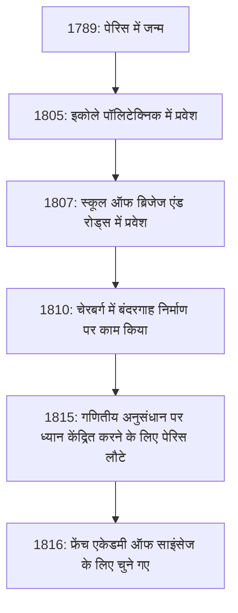

## प्रस्तावना

गणित के इतिहास में, 19वीं सदी को "कठोरता का युग" कहा जाता है। फ्रांसीसी गणितज्ञ **[ऑगस्टिन-लुई कॉशी](https://kenji.blog/p/cauchy/)** (1789-1857) वह व्यक्ति हैं जिन्होंने कलन के लिए एक मजबूत तार्किक आधार प्रदान किया, जिसे पहले सहज रूप से व्यवहार किया गया था। उनका नाम इतने सारे प्रमेयों और अवधारणाओं को सुशोभित करता है कि आधुनिक गणित का अध्ययन करने वाला कोई भी व्यक्ति उनसे मिलने के लिए बाध्य है।

यह लेख गणितीय दुनिया के एक दिग्गज कॉशी के अशांत जीवन और उनके द्वारा छोड़ी गई शानदार गणितीय उपलब्धियों की पड़ताल करता है।

## एक अशांत जीवन: एक अशांत फ्रांस में रहना

कॉशी का जन्म 1789 में पेरिस में हुआ था, फ्रांसीसी क्रांति के फैलने के ठीक बाद। उनका जीवन फ्रांस की राजनीतिक उथल-पुथल से लगातार जुड़ा रहा।

### बचपन और शिक्षा

कॉशी के पिता पुलिस बल में एक उच्च पद पर आसीन थे, लेकिन क्रांति की अराजकता से बचने के लिए, परिवार पेरिस के एक उपनगर आर्क्यूइल भाग गया। वहां, उन्होंने उस समय के महान वैज्ञानिकों, जैसे लाप्लास और लैग्रेंज से शिक्षा प्राप्त की, जो उनके पिता के मित्र थे। लैग्रेंज ने विशेष रूप से युवा कॉशी की गणितीय प्रतिभा को पहचाना और प्रसिद्ध भविष्यवाणी की, "यह लड़का एक दिन हम सभी को पीछे छोड़ देगा।"

### करियर और राजनीतिक मान्यताएं

इकोले पॉलिटेक्निक से स्नातक होने के बाद, उन्होंने एक सिविल इंजीनियर के रूप में काम करना शुरू किया, लेकिन उनके बर्बाद स्वास्थ्य और गणित के प्रति जुनून ने उन्हें एक शोधकर्ता के रास्ते पर ला दिया। 1816 में, बॉर्बन बहाली के बाद विज्ञान अकादमी के पुनर्गठन के दौरान, उन्हें मोंगे और कार्नोट की जगह सदस्य चुना गया, जिन्हें राजनीतिक कारणों से निष्कासित कर दिया गया था।

कॉशी एक कट्टर कैथोलिक और एक उत्साही शाही (बॉर्बन हाउस के समर्थक) थे। जब 1830 की जुलाई क्रांति के बाद चार्ल्स एक्स ने पदत्याग किया, तो उन्होंने नए शासन के प्रति निष्ठा की शपथ लेने से इनकार कर दिया और निर्वासन चुना। वे स्विट्जरलैंड, इटली और प्राग में भटकते रहे, 1838 में पेरिस लौटने तक लगभग आठ वर्षों के लिए अपनी मातृभूमि छोड़ दी। लौटने के बाद भी, उन्होंने शपथ लेने से इंकार करना जारी रखा, और लंबे समय तक विश्वविद्यालय के किसी भी औपचारिक पद को सुरक्षित करने में असमर्थ रहे।

उनकी रूढ़िवादी विचारधारा और अडिग व्यक्तित्व के कारण कभी-कभी सहयोगियों और युवा गणितज्ञों (जैसे हाबिल और गैलोज़) के साथ घर्षण पैदा हुआ, लेकिन गणित के प्रति उनके समर्पण और अत्यधिक उत्पादकता से कोई भी इनकार नहीं कर सकता था।

## गणित में क्रांति: कठोरता की खोज

कॉशी की सबसे बड़ी उपलब्धि गणितीय विश्लेषण के लिए एक कठोर आधार प्रदान करना था। उन्होंने सीमाएं, निरंतरता, विभेदीकरण और एकीकरण जैसी अवधारणाओं को कठोर परिभाषाओं का उपयोग करके फिर से बनाया, जिससे एप्सिलॉन-डेल्टा तर्कों (बाद में वीयरस्ट्रास द्वारा पूर्ण किया गया) का उदय हुआ जिसे हम आज सीखते हैं।

यहां कुछ महत्वपूर्ण उपलब्धियां दी गई हैं जो उनका नाम रखती हैं।

### 1. कॉशी अनुक्रम

वास्तविक संख्याओं की निरंतरता पर चर्चा करते समय **कॉशी अनुक्रम** की अवधारणा आवश्यक है। एक अनुक्रम $ (a_n) $ एक कॉशी अनुक्रम है यदि $ a_n $ और $ a_m $ के बीच का अंतर मनमाने ढंग से छोटा हो जाता है जब सूचकांक $ n $ और $ m $ पर्याप्त रूप से बड़े होते हैं।

गणितीय रूप से व्यक्त किया गया, किसी भी $ \epsilon > 0 $ के लिए, एक प्राकृतिक संख्या $ N $ मौजूद है जैसे कि सभी $ n, m > N $ के लिए,
$$ |a_n - a_m| < \epsilon $$
हमेशा सच होता है।

वास्तविक संख्याओं के स्थान में, यह गुण कि "एक कॉशी अनुक्रम हमेशा अभिसरण करता है" इंगित करता है कि स्थान "पूर्ण" है। पूर्णता की यह अवधारणा आधुनिक टोपोलॉजी और कार्यात्मक विश्लेषण की नींव है।

### 2. कॉशी का समाकलन प्रमेय

यह कहना अतिशयोक्ति नहीं होगी कि जटिल फलन सिद्धांत (जटिल विश्लेषण) की स्थापना लगभग अकेले कॉशी ने ही की थी। इसका केंद्रीय प्रमेय **कॉशी का समाकलन प्रमेय** है।

यह बताता है कि एक जटिल कार्य $ f(z) $ के लिए जो एक क्षेत्र $ D $ में होलोमॉर्फिक (वियोज्य) है, $ D $ के भीतर किसी भी साधारण बंद वक्र $ C $ के साथ रेखा समाकलन शून्य है।

$$ \oint_C f(z) \, dz = 0 $$

इस प्रतीत होने वाले सरल प्रमेय से, आश्चर्यजनक परिणाम लगातार प्राप्त होते हैं। उदाहरण के लिए, हम **कॉशी का समाकलन सूत्र** प्राप्त करते हैं, जो दर्शाता है कि किसी फ़ंक्शन का मान केवल सीमा पर उसके मानों द्वारा निर्धारित किया जाता है।

$$ f(a) = \frac{1}{2\pi i} \oint_C \frac{f(z)}{z - a} \, dz $$

यह सूत्र एक अविश्वसनीय रूप से शक्तिशाली उपकरण है जो गारंटी देता है कि एक होलोमोर्फिक फ़ंक्शन असीम रूप से अलग है और इसे टेलर श्रृंखला में विस्तारित किया जा सकता है।

### 3. कॉशी-श्वार्ज़ असमानता

यह रैखिक बीजगणित और विश्लेषण में सबसे अधिक उपयोग की जाने वाली असमानताओं में से एक है। आंतरिक उत्पाद स्थान में वास्तविक या जटिल संख्याओं के किन्हीं सदिशों $ \mathbf{u} $ और $ \mathbf{v} $ के लिए, निम्नलिखित संबंध सत्य है:

$$ |\langle \mathbf{u}, \mathbf{v} \rangle|^2 \leq \langle \mathbf{u}, \mathbf{u} \rangle \cdot \langle \mathbf{v}, \mathbf{v} \rangle $$

इसके समाकलन रूप में, कार्यों $ f(x) $ और $ g(x) $ के लिए, इसे निम्नानुसार व्यक्त किया गया है:

$$ \left( \int_a^b f(x)g(x) \, dx \right)^2 \leq \left( \int_a^b f(x)^2 \, dx \right) \left( \int_a^b g(x)^2 \, dx \right) $$

यह असमानता सदिशों के बीच कोणों और दूरियों की अवधारणाओं को अमूर्त स्थानों तक विस्तारित करने का आधार बनाती है।

## कॉशी की उत्पादकता और विरासत

कॉशी ने अपने जीवनकाल में लगभग 800 शोध पत्र प्रकाशित किए। यह एक चौंका देने वाली संख्या है, जो यूलर के बाद दूसरे स्थान पर है। यहाँ तक कि एक किस्सा भी है कि उन्होंने एक के बाद एक विज्ञान अकादमी के बुलेटिन में इतने सारे पत्र प्रस्तुत किए कि अकादमी को छपाई की लागत कम रखने के लिए पत्रों पर पृष्ठ सीमा लगानी पड़ी।

उनके शोध विषय विश्लेषण तक सीमित नहीं थे, बल्कि गणित और भौतिकी के क्षेत्रों की एक विस्तृत श्रृंखला में विस्तारित थे, जिसमें बीजगणित (समूह सिद्धांत में क्रमपरिवर्तन का अध्ययन) और गणितीय भौतिकी (लोच सिद्धांत और प्रकाशिकी) शामिल हैं।

## निष्कर्ष

[ऑगस्टिन-लुई कॉशी](https://kenji.blog/p/cauchy/) ने गणित को, जो अंतर्ज्ञान पर निर्भर था, तर्क की शक्ति के माध्यम से एक कठोर शैक्षणिक अनुशासन में बदल दिया। उनके द्वारा बनाई गई अवधारणाएं और प्रमेय आधुनिक गणित में हर जगह गहराई से निहित हैं।

हालाँकि उनका जीवन सुचारू नहीं था, क्योंकि उन्होंने अपनी राजनीतिक मान्यताओं के लिए शहीद के रूप में निर्वासन को चुना, सत्य की खोज के लिए उनका जुनून कभी नहीं डगमगाया। उनके द्वारा छोड़ी गई अपार बौद्धिक विरासत आज दुनिया भर के गणितज्ञों और वैज्ञानिकों का मार्गदर्शन करती है।
