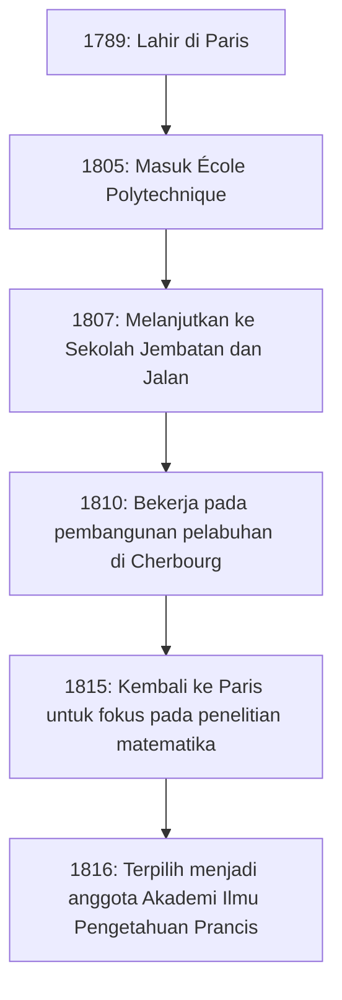

## Pengantar

Dalam sejarah matematika, abad ke-19 dikenal sebagai "Era Ketelitian". Matematikawan Prancis **[Augustin-Louis Cauchy](https://kenji.blog/id/p/cauchy/)** (1789-1857) adalah orang yang memberikan landasan logis yang kuat untuk kalkulus, yang sebelumnya telah diperlakukan secara intuitif. Namanya memahkotai begitu banyak teorema dan konsep sehingga siapa pun yang mempelajari matematika modern pasti akan menemukannya.

Artikel ini mengeksplorasi kehidupan [Cauchy](https://kenji.blog/id/p/cauchy/) yang penuh gejolak, seorang raksasa dalam dunia matematika, dan pencapaian matematika brilian yang ia tinggalkan.

## Kehidupan yang Penuh Gejolak: Hidup di Prancis yang Penuh Gejolak

[Cauchy](https://kenji.blog/id/p/cauchy/) lahir di Paris pada tahun 1789, tepat setelah pecahnya Revolusi Prancis. Kehidupannya selalu terkait dengan pergolakan politik di Prancis.

### Masa Kecil dan Pendidikan

Ayah [Cauchy](https://kenji.blog/id/p/cauchy/) memegang posisi tinggi di kepolisian, tetapi untuk menghindari kekacauan revolusi, keluarganya melarikan diri ke Arcueil, pinggiran kota Paris. Di sana, ia menerima instruksi dari ilmuwan-ilmuwan hebat pada masa itu, seperti Laplace dan Lagrange, yang merupakan teman ayahnya. Lagrange, khususnya, mengenali bakat matematika [Cauchy](https://kenji.blog/id/p/cauchy/) muda dan dengan terkenal meramalkan, "Anak laki-laki ini suatu hari nanti akan melampaui kita semua."

### Karir dan Keyakinan Politik

Setelah lulus dari École Polytechnique, ia mulai bekerja sebagai insinyur sipil, tetapi kesehatannya yang hancur dan hasratnya pada matematika membawanya ke jalan seorang peneliti. Pada tahun 1816, selama reorganisasi Akademi Ilmu Pengetahuan setelah Restorasi Bourbon, ia terpilih menjadi anggota, menggantikan Monge dan Carnot yang dikeluarkan karena alasan politik.

[Cauchy](https://kenji.blog/id/p/cauchy/) adalah seorang Katolik yang taat dan seorang royalis yang bersemangat (pendukung Wangsa Bourbon). Ketika Charles X turun takhta setelah Revolusi Juli 1830, ia menolak untuk bersumpah setia kepada rezim baru dan memilih pengasingan. Ia mengembara melalui Swiss, Italia, dan Praha, meninggalkan tanah airnya selama sekitar delapan tahun sampai kembali ke Paris pada tahun 1838. Bahkan setelah kepulangannya, ia terus menolak sumpah tersebut, dan untuk waktu yang lama tidak dapat mengamankan posisi universitas formal.

Ideologi konservatifnya dan kepribadiannya yang tanpa kompromi terkadang menyebabkan gesekan dengan rekan-rekan dan matematikawan yang lebih muda (seperti [Abel](https://kenji.blog/id/p/abel/) dan [Galois](https://kenji.blog/id/p/galois/)), tetapi dedikasinya pada matematika dan produktivitasnya yang luar biasa tidak dapat disangkal oleh siapa pun.

## Revolusi dalam Matematika: Pengejaran Ketelitian

Pencapaian terbesar [Cauchy](https://kenji.blog/id/p/cauchy/) adalah memberikan dasar yang kuat untuk analisis matematika. Ia merekonstruksi konsep-konsep seperti limit, kontinuitas, diferensiasi, dan integrasi menggunakan definisi ketat yang mengarah pada argumen epsilon-delta (kemudian disempurnakan oleh Weierstrass) yang kita pelajari saat ini.

Berikut adalah beberapa pencapaian penting yang menyandang namanya.

### 1. Barisan [Cauchy](https://kenji.blog/id/p/cauchy/)

Konsep **barisan [Cauchy](https://kenji.blog/id/p/cauchy/)** sangat penting ketika membahas kontinuitas bilangan real. Suatu barisan $ (a_n) $ adalah barisan [Cauchy](https://kenji.blog/id/p/cauchy/) jika selisih antara $ a_n $ dan $ a_m $ menjadi sangat kecil secara sembarang ketika indeks $ n $ dan $ m $ cukup besar.

Dinyatakan secara matematis, untuk sembarang $ \epsilon > 0 $, terdapat bilangan asli $ N $ sehingga untuk semua $ n, m > N $,
$$ |a_n - a_m| < \epsilon $$
selalu berlaku.

Dalam ruang bilangan real, sifat bahwa "barisan [Cauchy](https://kenji.blog/id/p/cauchy/) selalu konvergen" menunjukkan bahwa ruang tersebut "lengkap". Konsep kelengkapan ini adalah dasar topologi modern dan analisis fungsional.

### 2. Teorema Integral [Cauchy](https://kenji.blog/id/p/cauchy/)

Tidak berlebihan untuk mengatakan bahwa teori fungsi kompleks (analisis kompleks) didirikan hampir seorang diri oleh [Cauchy](https://kenji.blog/id/p/cauchy/). Teorema utamanya adalah **Teorema Integral [Cauchy](https://kenji.blog/id/p/cauchy/)**.

Teorema ini menyatakan bahwa untuk fungsi kompleks $ f(z) $ yang holomorfik (dapat didiferensiasi) di suatu wilayah $ D $, integral garis di sepanjang sembarang kurva tertutup sederhana $ C $ di dalam $ D $ adalah nol.

$$ \oint_C f(z) \, dz = 0 $$

Dari teorema yang tampaknya sederhana ini, hasil yang mencengangkan terus diturunkan. Misalnya, kita memperoleh **Rumus Integral [Cauchy](https://kenji.blog/id/p/cauchy/)**, yang menunjukkan bahwa nilai suatu fungsi ditentukan semata-mata oleh nilainya pada batas.

$$ f(a) = \frac{1}{2\pi i} \oint_C \frac{f(z)}{z - a} \, dz $$

Rumus ini adalah alat yang sangat kuat yang menjamin bahwa fungsi holomorfik dapat didiferensiasi tanpa batas dan dapat diperluas menjadi deret Taylor.

### 3. Ketaksamaan [Cauchy](https://kenji.blog/id/p/cauchy/)-Schwarz

Ini adalah salah satu ketaksamaan yang paling sering digunakan dalam aljabar linear dan analisis. Untuk sembarang vektor $ \mathbf{u} $ dan $ \mathbf{v} $ dari bilangan real atau kompleks dalam ruang hasil kali dalam, hubungan berikut berlaku:

$$ |\langle \mathbf{u}, \mathbf{v} \rangle|^2 \leq \langle \mathbf{u}, \mathbf{u} \rangle \cdot \langle \mathbf{v}, \mathbf{v} \rangle $$

Dalam bentuk integralnya, untuk fungsi $ f(x) $ dan $ g(x) $, dinyatakan sebagai berikut:

$$ \left( \int_a^b f(x)g(x) \, dx \right)^2 \leq \left( \int_a^b f(x)^2 \, dx \right) \left( \int_a^b g(x)^2 \, dx \right) $$

Ketaksamaan ini membentuk dasar untuk memperluas konsep sudut dan jarak antara vektor ke ruang abstrak.

## Produktivitas dan Warisan [Cauchy](https://kenji.blog/id/p/cauchy/)

[Cauchy](https://kenji.blog/id/p/cauchy/) menerbitkan sekitar 800 makalah selama hidupnya. Ini adalah angka yang mengejutkan, kedua setelah Euler. Bahkan ada anekdot bahwa ia mengirimkan begitu banyak makalah ke buletin Akademi Ilmu Pengetahuan satu demi satu sehingga Akademi harus memberlakukan batasan halaman pada makalah untuk menekan biaya pencetakan.

Subjek penelitiannya tidak terbatas pada analisis tetapi diperluas ke berbagai bidang dalam matematika dan fisika, termasuk aljabar (studi permutasi dalam teori grup) dan fisika matematika (teori elastisitas dan optik).

## Kesimpulan

[Augustin-Louis Cauchy](https://kenji.blog/id/p/cauchy/) menempa matematika, yang sebelumnya mengandalkan intuisi, menjadi disiplin akademis yang ketat melalui kekuatan logika. Konsep dan teorema yang ia ciptakan berakar dalam di mana-mana dalam matematika modern.

Meskipun hidupnya tidak mulus, karena ia memilih pengasingan sebagai martir atas keyakinan politiknya, hasratnya untuk mengejar kebenaran tidak pernah goyah. Warisan intelektual luar biasa yang ia tinggalkan terus membimbing ahli matematika dan ilmuwan di seluruh dunia saat ini.
