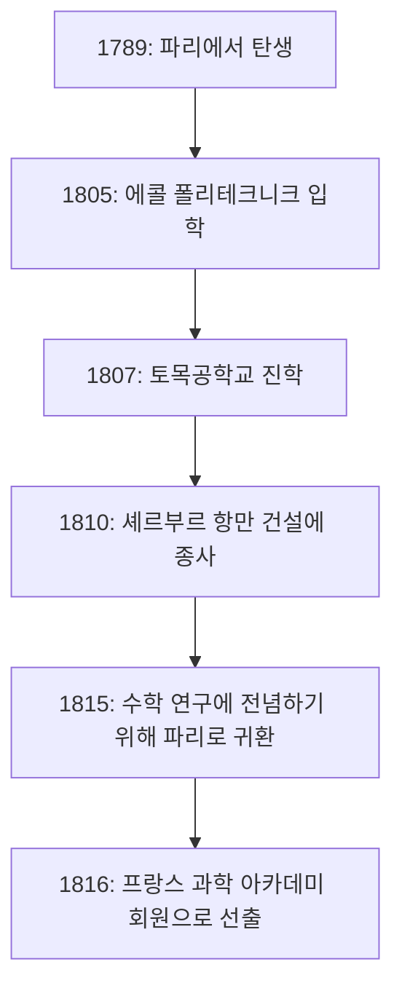

## 머리말

수학의 역사에서 19세기는 '엄밀화의 시대'라고 불립니다. 그때까지 직관적으로 다루어졌던 미적분학에 확고한 논리적 기초를 제공한 사람이 바로 프랑스의 수학자 **[오귀스탱 루이 코시](https://kenji.blog/p/cauchy/)** ([Augustin-Louis Cauchy](https://kenji.blog/p/cauchy/), 1789-1857)입니다. 그의 이름은 현대 수학을 배우는 사람이라면 반드시 접하게 될 정도로 수많은 정리와 개념에 붙어 있습니다.

이 글에서는 수학계의 거장 코시의 파란만장한 생애와 그가 남긴 눈부신 수학적 업적에 대해 탐구합니다.

## 파란만장한 생애: 격동의 프랑스를 살다

코시는 프랑스 대혁명이 발발한 직후인 1789년 파리에서 태어났습니다. 그의 생애는 항상 프랑스의 정치적 격동과 밀접하게 연결되어 있었습니다.

### 유년기와 교육

코시의 아버지는 경찰의 요직에 있었지만, 혁명의 혼란을 피하기 위해 가족은 파리 교외의 아르쾨유(Arcueil)로 피신했습니다. 그곳에서 그는 아버지의 친구였던 라플라스(Laplace)나 라그랑주(Lagrange)와 같은 당시의 위대한 과학자들로부터 가르침을 받았습니다. 특히 라그랑주는 젊은 코시의 수학적 재능을 알아보고 "이 아이는 언젠가 우리 모두를 능가할 것이다"라고 예언했다고 합니다.

### 경력과 정치적 신념

에콜 폴리테크니크(École Polytechnique)를 졸업한 후 토목 엔지니어로 일하기 시작했지만, 건강 악화와 수학에 대한 열정 때문에 연구자의 길을 걷게 되었습니다. 1816년 왕정 복고에 따른 과학 아카데미 재편 과정에서, 정치적인 이유로 추방된 몽주(Monge)와 카르노(Carnot)를 대신하여 회원으로 선출되었습니다.

코시는 독실한 가톨릭 신자이자 열렬한 왕당파(부르봉 가문 지지자)였습니다. 1830년 7월 혁명으로 샤를 10세가 퇴위하자, 그는 신체제에 대한 충성 서약을 거부하고 스스로 망명길에 올랐습니다. 스위스, 이탈리아, 프라하를 전전하며 1838년 파리로 돌아올 때까지 약 8년 동안 조국을 떠나게 됩니다. 복귀 후에도 충성 서약을 계속 거부했기 때문에 오랫동안 대학의 정식 직책을 맡을 수 없었습니다.

그의 보수적인 사상과 타협을 모르는 성격은 동료나 젊은 수학자(아벨이나 갈루아 등)와 마찰을 빚기도 했지만, 그의 수학에 대한 헌신과 압도적인 생산력은 누구도 부정할 수 없는 것이었습니다.

## 수학의 혁명: 엄밀성의 추구

코시의 가장 큰 공적은 해석학에 엄밀한 기초를 제공한 것입니다. 극한, 연속성, 미분, 적분과 같은 개념을 오늘날 우리가 배우는 입실론-델타 논법(나중에 바이어슈트라스에 의해 완성됨)으로 이어지는 엄밀한 정의를 사용하여 재구성했습니다.

여기에서는 그의 이름이 붙은 중요한 업적 몇 가지를 소개합니다.

### 1. 코시 수열 (Cauchy Sequence)

실수의 연속성을 논할 때 빼놓을 수 없는 것이 **코시 수열** 의 개념입니다. 수열 $ (a_n) $이 코시 수열이라는 것은, 번호 $ n, m $이 충분히 클 때 $ a_n $과 $ a_m $의 차이가 얼마든지 작아진다는 것을 의미합니다.

수식으로 표현하면, 임의의 $ \epsilon > 0 $에 대하여 어떤 자연수 $ N $이 존재하여, $ n, m > N $이면 항상
$$ |a_n - a_m| < \epsilon $$
이 성립한다는 것입니다.

실수 공간에서 "코시 수열은 반드시 수렴한다"는 성질은 공간이 "완비적"임을 나타냅니다. 이 완비성의 개념은 현대 위상수학이나 함수해석학의 기반이 됩니다.

### 2. 코시의 적분 정리 (Cauchy's Integral Theorem)

복소함수론(복소해석학)은 코시에 의해 거의 혼자서 창설되었다고 해도 과언이 아닙니다. 그 중심적인 정리가 **코시의 적분 정리** 입니다.

영역 $ D $에서 정칙(미분 가능)인 복소함수 $ f(z) $에 대해, $ D $ 안의 임의의 단순 폐곡선 $ C $를 따라 적분한 선적분은 0이 된다는 정리입니다.

$$ \oint_C f(z) \, dz = 0 $$

이 언뜻 보기에 단순한 정리로부터 놀라운 결과들이 계속해서 도출됩니다. 예를 들어, 함수의 값이 경계상의 값만으로 결정되는 **코시의 적분 공식** 을 얻을 수 있습니다.

$$ f(a) = \frac{1}{2\pi i} \oint_C \frac{f(z)}{z - a} \, dz $$

이 공식은 정칙 함수가 무한번 미분 가능하며 테일러 전개 가능함을 보장하는 매우 강력한 도구입니다.

### 3. 코시-슈바르츠 부등식 (Cauchy-Schwarz Inequality)

선형대수학이나 해석학에서 가장 빈번하게 사용되는 부등식 중 하나입니다. 임의의 실수 또는 복소수 벡터 $ \mathbf{u}, \mathbf{v} $ 내적 공간에서 다음 관계가 성립합니다.

$$ |\langle \mathbf{u}, \mathbf{v} \rangle|^2 \leq \langle \mathbf{u}, \mathbf{u} \rangle \cdot \langle \mathbf{v}, \mathbf{v} \rangle $$

적분을 사용한 형태로는 함수 $ f(x), g(x) $에 대해 다음과 같이 표현됩니다.

$$ \left( \int_a^b f(x)g(x) \, dx \right)^2 \leq \left( \int_a^b f(x)^2 \, dx \right) \left( \int_a^b g(x)^2 \, dx \right) $$

이 부등식은 벡터가 이루는 각이나 거리의 개념을 추상적인 공간으로 확장하기 위한 기초가 됩니다.

## 코시의 다작과 유산

코시는 평생 동안 약 800편의 논문을 발표했습니다. 이는 오일러에 이어 두 번째로 놀라운 수치입니다. 과학 아카데미의 기요에 논문을 잇달아 너무 많이 투고한 나머지, 아카데미는 인쇄비를 줄이기 위해 논문의 페이지 수에 제한을 둘 수밖에 없었다는 일화가 있을 정도입니다.

그의 연구 대상은 해석학에 그치지 않고, 대수학(군론의 치환 연구), 수리물리학(탄성 이론 및 광학) 등 수학과 물리학의 광범위한 분야에 걸쳐 있었습니다.

## 결론

[오귀스탱 루이 코시](https://kenji.blog/p/cauchy/)는 직관에 의존하던 수학을 논리의 힘으로 엄밀한 학문으로 다시 단련했습니다. 그가 만들어낸 개념과 정리들은 현대 수학의 모든 곳에 깊이 뿌리내리고 있습니다.

정치적 신념에 순교하여 망명을 택하는 등 그의 생애는 순탄치 않았지만, 진리를 탐구하는 그의 열정은 결코 흔들리지 않았습니다. 그가 남긴 방대한 지적 유산은 오늘날에도 전 세계의 수학자들과 과학자들을 계속해서 이끌고 있습니다.
