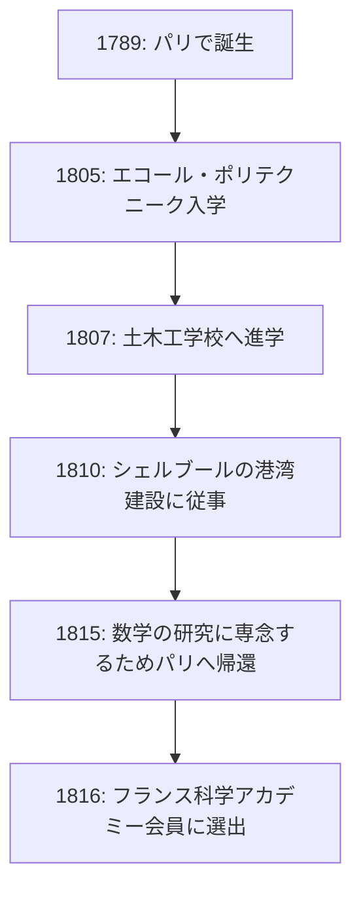

## はじめに

数学の歴史において、19世紀は「厳密化の時代」と呼ばれています。それまで直感的に扱われていた微積分学に対して、確固たる論理的基礎を与えたのが、フランスの数学者 **[オーギュスタン＝ルイ・コーシー](https://kenji.blog/p/cauchy/)** ([Augustin-Louis Cauchy](https://kenji.blog/p/cauchy/), 1789-1857) です。彼の名前は、現代の数学を学ぶ者であれば必ず目にするほど、数多くの定理や概念に冠されています。

本記事では、数学界における巨人[コーシー](https://kenji.blog/p/cauchy/)の波乱に満ちた生涯と、彼が残した輝かしい数学的業績について探求します。

## 波乱万丈な生涯：激動のフランスを生きる

[コーシー](https://kenji.blog/p/cauchy/)は1789年、フランス革命の勃発直後にパリで生まれました。彼の生涯は、常にフランスの政治的激動と密接に結びついていました。

### 幼少期と教育

[コーシー](https://kenji.blog/p/cauchy/)の父親は警察の要職に就いていましたが、革命の混乱を避けるために一家はパリ郊外のアルクイユへと逃れました。そこで彼は、父の友人であったラプラスやラグランジュといった当時の偉大な科学者たちから薫陶を受けました。特にラグランジュは、若き[コーシー](https://kenji.blog/p/cauchy/)の数学的才能を見抜き、「この子はいつか我々全員を凌駕するだろう」と予言したと言われています。

### キャリアと政治的信条

エコール・ポリテクニーク（理工科学校）を卒業後、土木技術者として働き始めますが、健康を害したことと数学への情熱から、研究者の道へと進みます。1816年、王政復古に伴う科学アカデミーの再編において、政治的な理由で追放されたモンジュやカルノーの代わりに会員に選出されました。

[コーシー](https://kenji.blog/p/cauchy/)は敬虔なカトリック教徒であり、熱烈な王党派（ブルボン家支持者）でした。1830年の七月革命によりシャルル10世が退位すると、彼は新体制への忠誠宣誓を拒否し、自ら亡命の道を選びました。スイス、イタリア、プラハを転々とし、1838年にパリに戻るまで、約8年間にわたり祖国を離れることになります。復帰後も忠誠宣誓を拒み続けたため、大学の正式なポストに就くことは長らくできませんでした。

彼の保守的な思想と妥協を許さない性格は、同僚や若い数学者（[アーベル](https://kenji.blog/p/abel/)や[ガロア](https://kenji.blog/p/galois/)など）との間に軋轢を生むこともありましたが、その数学への献身と圧倒的な生産力は誰にも否定できるものではありませんでした。

## 数学における革命：厳密性の追求

[コーシー](https://kenji.blog/p/cauchy/)の最大の功績は、解析学に厳密な基礎を与えたことです。極限、連続性、微分、積分といった概念を、今日の私たちが学ぶようなイプシロン・デルタ論法（後にワイエルシュトラスにより完成される）に繋がる厳密な定義を用いて再構築しました。

ここでは、彼の名が冠された重要な業績をいくつか紹介します。

### 1. [コーシー](https://kenji.blog/p/cauchy/)列 ([Cauchy](https://kenji.blog/p/cauchy/) Sequence)

実数の連続性を議論する上で欠かせないのが **[コーシー](https://kenji.blog/p/cauchy/)列** の概念です。数列 $ (a_n) $ が[コーシー](https://kenji.blog/p/cauchy/)列であるとは、番号 $ n, m $ が十分に大きいとき、$ a_n $ と $ a_m $ の差がいくらでも小さくなることを意味します。

数式で表すと、任意の $ \epsilon > 0 $ に対して、ある自然数 $ N $ が存在し、$ n, m > N $ ならば常に
$$ |a_n - a_m| < \epsilon $$
が成り立つというものです。

実数の空間において、「[コーシー](https://kenji.blog/p/cauchy/)列は必ず収束する」という性質は、空間が「完備」であることを示しています。この完備性の概念は、現代の位相空間論や関数解析学の基盤となっています。

### 2. [コーシーの積分定理](https://kenji.blog/p/cauchys-integral-theorem/) ([Cauchy](https://kenji.blog/p/cauchy/)'s Integral Theorem)

複素関数論（複素解析学）は、[コーシー](https://kenji.blog/p/cauchy/)によってほぼ独力で創設されたと言っても過言ではありません。その中心的な定理が **[コーシーの積分定理](https://kenji.blog/p/cauchys-integral-theorem/)** です。

領域 $ D $ で正則（微分可能）な複素関数 $ f(z) $ について、$ D $ 内の任意の単純閉曲線 $ C $ に沿った線積分はゼロになるという定理です。

$$ \oint_C f(z) \, dz = 0 $$

この一見シンプルな定理から、驚くべき結果が次々と導かれます。例えば、関数の値が境界上の値のみで決定される **[コーシー](https://kenji.blog/p/cauchy/)の積分公式** が得られます。

$$ f(a) = \frac{1}{2\pi i} \oint_C \frac{f(z)}{z - a} \, dz $$

この公式は、正則関数が無限回微分可能であることや、テイラー展開可能であることを保証する、極めて強力なツールです。

### 3. [コーシー](https://kenji.blog/p/cauchy/)＝シュワルツの不等式 ([Cauchy](https://kenji.blog/p/cauchy/)-Schwarz Inequality)

線形代数学や解析学において最も頻繁に用いられる不等式の一つです。任意の実数または複素数のベクトル $ \mathbf{u}, \mathbf{v} $ 内積空間において、以下の関係が成り立ちます。

$$ |\langle \mathbf{u}, \mathbf{v} \rangle|^2 \leq \langle \mathbf{u}, \mathbf{u} \rangle \cdot \langle \mathbf{v}, \mathbf{v} \rangle $$

積分を用いた形では、関数 $ f(x), g(x) $ に対して次のように表されます。

$$ \left( \int_a^b f(x)g(x) \, dx \right)^2 \leq \left( \int_a^b f(x)^2 \, dx \right) \left( \int_a^b g(x)^2 \, dx \right) $$

この不等式は、ベクトルのなす角や距離の概念を抽象的な空間へと拡張するための基礎となります。

## [コーシー](https://kenji.blog/p/cauchy/)の多産さと遺産

[コーシー](https://kenji.blog/p/cauchy/)は生涯に約800編もの論文を発表しました。これは[オイラー](https://kenji.blog/p/euler/)に次ぐ驚異的な数字です。あまりに多くの論文を次々と科学アカデミーの紀要に投稿したため、アカデミーは印刷費を抑えるために論文のページ数に制限を設けざるを得なくなったという逸話があるほどです。

彼の研究対象は解析学にとどまらず、代数学（群論における置換の研究）、数理物理学（弾性理論や光学）など、数学と物理学の広範な分野に及びました。

## まとめ

[オーギュスタン＝ルイ・コーシー](https://kenji.blog/p/cauchy/)は、直感に頼っていた数学を論理の力で厳密な学問へと鍛え直しました。彼の生み出した概念や定理は、現代数学のあらゆる場所に深く根付いています。

政治的信念に殉じて亡命を選ぶなど、その生涯は平坦ではありませんでしたが、真理を追究する彼の情熱が揺らぐことはありませんでした。彼が残した膨大な知的遺産は、今日でもなお、世界中の数学者や科学者たちを導き続けています。
