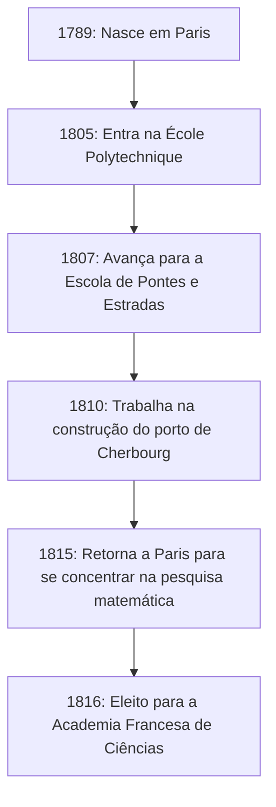

## Introdução

Na história da matemática, o século XIX é conhecido como a "Era do Rigor". O matemático francês **[Augustin-Louis Cauchy](https://kenji.blog/pt/p/cauchy/)** (1789-1857) foi quem forneceu uma base lógica firme para o cálculo, que anteriormente havia sido tratado de forma intuitiva. Seu nome coroa tantos teoremas e conceitos que qualquer pessoa que estude matemática moderna está fadada a encontrá-lo.

Este artigo explora a vida turbulenta de [Cauchy](https://kenji.blog/pt/p/cauchy/), um gigante no mundo matemático, e as brilhantes realizações matemáticas que ele deixou para trás.

## Uma Vida Turbulenta: Vivendo em uma França Tumultuada

[Cauchy](https://kenji.blog/pt/p/cauchy/) nasceu em Paris em 1789, logo após o início da Revolução Francesa. Sua vida esteve constantemente entrelaçada com as convulsões políticas da França.

### Infância e Educação

O pai de [Cauchy](https://kenji.blog/pt/p/cauchy/) ocupava um cargo alto na força policial, mas para escapar do caos da revolução, a família fugiu para Arcueil, um subúrbio de Paris. Lá, ele recebeu instruções de grandes cientistas da época, como Laplace e Lagrange, que eram amigos de seu pai. Lagrange, em particular, reconheceu o talento matemático do jovem [Cauchy](https://kenji.blog/pt/p/cauchy/) e previu famosamente: "Este menino um dia ultrapassará todos nós."

### Carreira e Crenças Políticas

Depois de se formar na École Polytechnique, ele começou a trabalhar como engenheiro civil, mas sua saúde arruinada e paixão pela matemática o levaram pelo caminho de pesquisador. Em 1816, durante a reorganização da Academia de Ciências após a Restauração dos Bourbons, ele foi eleito membro, substituindo Monge e Carnot, que foram expulsos por razões políticas.

[Cauchy](https://kenji.blog/pt/p/cauchy/) era um católico devoto e um monarquista ardente (apoiador da Casa de Bourbon). Quando Carlos X abdicou após a Revolução de Julho de 1830, ele se recusou a fazer um juramento de lealdade ao novo regime e escolheu o exílio. Ele vagou pela Suíça, Itália e Praga, deixando sua terra natal por cerca de oito anos até retornar a Paris em 1838. Mesmo após seu retorno, ele continuou a recusar o juramento e por muito tempo não conseguiu garantir um cargo universitário formal.

Sua ideologia conservadora e personalidade intransigente às vezes causavam atritos com colegas e matemáticos mais jovens (como [Abel](https://kenji.blog/pt/p/abel/) e [Galois](https://kenji.blog/pt/p/galois/)), mas sua dedicação à matemática e sua produtividade esmagadora não podiam ser negadas por ninguém.

## Revolução na Matemática: A Busca pelo Rigor

A maior conquista de [Cauchy](https://kenji.blog/pt/p/cauchy/) foi fornecer uma base rigorosa para a análise matemática. Ele reconstruiu conceitos como limites, continuidade, diferenciação e integração usando definições rigorosas que levaram aos argumentos [épsilon-delta](/pt/p/epsilon-delta-definition/) (mais tarde aperfeiçoados por Weierstrass) que aprendemos hoje.

Aqui estão algumas das realizações importantes que levam seu nome.

### 1. Sequência de [Cauchy](https://kenji.blog/pt/p/cauchy/)

O conceito de **sequência de [Cauchy](https://kenji.blog/pt/p/cauchy/)** é essencial quando se discute a continuidade de números reais. Uma sequência $ (a_n) $ é uma sequência de [Cauchy](https://kenji.blog/pt/p/cauchy/) se a diferença entre $ a_n $ e $ a_m $ se torna arbitrariamente pequena quando os índices $ n $ e $ m $ são suficientemente grandes.

Expresso matematicamente, para qualquer $ \epsilon > 0 $, existe um número natural $ N $ tal que para todos $ n, m > N $,
$$ |a_n - a_m| < \epsilon $$
sempre vale.

No espaço dos números reais, a propriedade de que "uma sequência de [Cauchy](https://kenji.blog/pt/p/cauchy/) sempre converge" indica que o espaço é "completo". Esse conceito de completude é o alicerce da topologia moderna e da análise funcional.

### 2. Teorema Integral de [Cauchy](https://kenji.blog/pt/p/cauchy/)

Não é exagero dizer que a teoria das funções complexas (análise complexa) foi fundada quase sozinha por [Cauchy](https://kenji.blog/pt/p/cauchy/). Seu teorema central é o **Teorema Integral de [Cauchy](https://kenji.blog/pt/p/cauchy/)**.

Ele afirma que para uma função complexa $ f(z) $ que é holomorfa (diferenciável) em uma região $ D $, a integral de linha ao longo de qualquer curva fechada simples $ C $ dentro de $ D $ é zero.

$$ \oint_C f(z) \, dz = 0 $$

Deste teorema aparentemente simples, resultados surpreendentes são derivados continuamente. Por exemplo, obtemos a **Fórmula Integral de [Cauchy](https://kenji.blog/pt/p/cauchy/)**, que mostra que o valor de uma função é determinado exclusivamente por seus valores no limite.

$$ f(a) = \frac{1}{2\pi i} \oint_C \frac{f(z)}{z - a} \, dz $$

Essa fórmula é uma ferramenta incrivelmente poderosa que garante que uma função holomorfa é infinitamente diferenciável e pode ser expandida em uma série de Taylor.

### 3. Desigualdade de [Cauchy](https://kenji.blog/pt/p/cauchy/)-Schwarz

Esta é uma das desigualdades usadas com mais frequência em álgebra linear e análise. Para quaisquer vetores $ \mathbf{u} $ e $ \mathbf{v} $ de números reais ou complexos em um espaço de produto interno, a seguinte relação é válida:

$$ |\langle \mathbf{u}, \mathbf{v} \rangle|^2 \leq \langle \mathbf{u}, \mathbf{u} \rangle \cdot \langle \mathbf{v}, \mathbf{v} \rangle $$

Em sua forma integral, para as funções $ f(x) $ e $ g(x) $, é expresso da seguinte forma:

$$ \left( \int_a^b f(x)g(x) \, dx \right)^2 \leq \left( \int_a^b f(x)^2 \, dx \right) \left( \int_a^b g(x)^2 \, dx \right) $$

Esta desigualdade forma a base para estender os conceitos de ângulos e distâncias entre vetores a espaços abstratos.

## A Prolificidade e o Legado de [Cauchy](https://kenji.blog/pt/p/cauchy/)

[Cauchy](https://kenji.blog/pt/p/cauchy/) publicou cerca de 800 artigos durante sua vida. Este é um número impressionante, perdendo apenas para Euler. Existe até uma anedota de que ele submeteu tantos artigos ao boletim da Academia de Ciências um após o outro que a Academia teve que impor limites de página nos artigos para manter os custos de impressão baixos.

Seus temas de pesquisa não se limitaram à análise, mas se estenderam a uma ampla gama de campos em matemática e física, incluindo álgebra (o estudo de permutações na teoria dos grupos) e física matemática (teoria da elasticidade e óptica).

## Conclusão

[Augustin-Louis Cauchy](https://kenji.blog/pt/p/cauchy/) forjou a matemática, que dependia da intuição, em uma disciplina acadêmica rigorosa através do poder da lógica. Os conceitos e teoremas que ele criou estão profundamente enraizados em todos os lugares da matemática moderna.

Embora sua vida não tenha sido tranquila, ao escolher o exílio como um mártir por suas convicções políticas, sua paixão pela busca da verdade nunca vacilou. O imenso legado intelectual que ele deixou continua a orientar matemáticos e cientistas em todo o mundo hoje.
