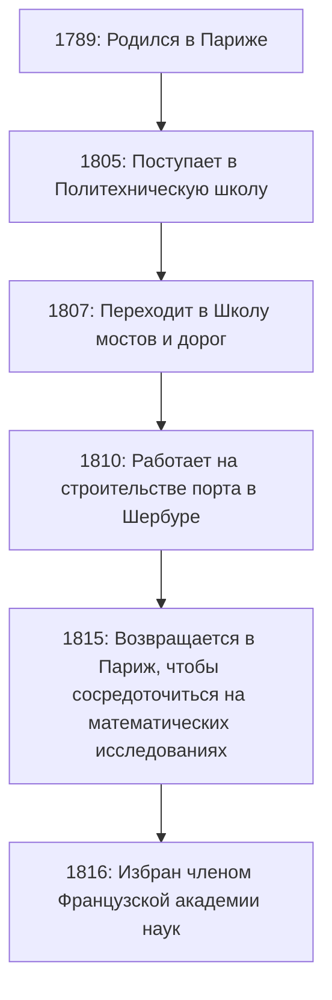

## Введение

В истории математики 19 век известен как «Эпоха строгости». Французский математик **[Огюстен Луи Коши](https://kenji.blog/ru/p/cauchy/)** (1789-1857) — это тот, кто заложил прочный логический фундамент для математического анализа, к которому ранее подходили интуитивно. Его имя носят так много теорем и понятий, что любой, кто изучает современную математику, обязательно столкнется с ним.

В этой статье исследуется бурная жизнь Коши, гиганта математического мира, и блестящие математические достижения, которые он оставил после себя.

## Бурная жизнь: Жизнь в неспокойной Франции

Коши родился в Париже в 1789 году, сразу после начала Великой французской революции. Его жизнь была постоянно переплетена с политическими потрясениями во Франции.

### Детство и образование

Отец Коши занимал высокий пост в полиции, но чтобы спастись от хаоса революции, семья бежала в Аркёй, пригород Парижа. Там он получал наставления от великих ученых того времени, таких как Лаплас и Лагранж, которые были друзьями его отца. Лагранж, в частности, признал математический талант юного Коши и предсказал: «Этот мальчик когда-нибудь превзойдет всех нас».

### Карьера и политические убеждения

После окончания Политехнической школы он начал работать инженером-строителем, но подорванное здоровье и страсть к математике привели его на путь исследователя. В 1816 году, во время реорганизации Академии наук после Реставрации Бурбонов, он был избран членом, заменив Монжа и Карно, которые были исключены по политическим причинам.

Коши был набожным католиком и ярым роялистом (сторонником дома Бурбонов). Когда Карл X отрекся от престола после Июльской революции 1830 года, он отказался присягнуть на верность новому режиму и выбрал изгнание. Он скитался по Швейцарии, Италии и Праге, покинув родину примерно на восемь лет, пока не вернулся в Париж в 1838 году. Даже после своего возвращения он продолжал отказываться от присяги, и долгое время не мог получить официальную университетскую должность.

Его консервативная идеология и бескомпромиссная личность иногда вызывали трения с коллегами и молодыми математиками (такими как Абель и Галуа), но его преданность математике и ошеломляющую продуктивность не мог отрицать никто.

## Революция в математике: Стремление к строгости

Величайшим достижением Коши было создание строгой основы для математического анализа. Он реконструировал такие концепции, как пределы, непрерывность, дифференцирование и интегрирование, используя строгие определения, которые привели к эпсилон-дельта аргументам (позже усовершенствованным Вейерштрассом), которые мы изучаем сегодня.

Вот несколько важных достижений, носящих его имя.

### 1. Последовательность Коши

Понятие **последовательности Коши** имеет важное значение при обсуждении непрерывности действительных чисел. Последовательность $ (a_n) $ является последовательностью Коши, если разница между $ a_n $ и $ a_m $ становится сколь угодно малой, когда индексы $ n $ и $ m $ достаточно велики.

Математически это выражается так: для любого $ \epsilon > 0 $ существует натуральное число $ N $ такое, что для всех $ n, m > N $,
$$ |a_n - a_m| < \epsilon $$
всегда выполняется.

В пространстве действительных чисел свойство, согласно которому «последовательность Коши всегда сходится», указывает на то, что пространство является «полным». Эта концепция полноты является основой современной топологии и функционального анализа.

### 2. Интегральная теорема Коши

Не будет преувеличением сказать, что теория комплексных функций (комплексный анализ) была основана почти исключительно Коши. Ее центральной теоремой является **Интегральная теорема Коши**.

Она гласит, что для комплексной функции $ f(z) $, которая является голоморфной (дифференцируемой) в области $ D $, криволинейный интеграл вдоль любой простой замкнутой кривой $ C $ внутри $ D $ равен нулю.

$$ \oint_C f(z) \, dz = 0 $$

Из этой, казалось бы, простой теоремы непрерывно выводятся удивительные результаты. Например, мы получаем **Интегральную формулу Коши**, которая показывает, что значение функции полностью определяется ее значениями на границе.

$$ f(a) = \frac{1}{2\pi i} \oint_C \frac{f(z)}{z - a} \, dz $$

Эта формула является невероятно мощным инструментом, который гарантирует, что голоморфная функция бесконечно дифференцируема и может быть разложена в ряд Тейлора.

### 3. Неравенство Коши-Шварца

Это одно из наиболее часто используемых неравенств в линейной алгебре и анализе. Для любых векторов $ \mathbf{u} $ и $ \mathbf{v} $ действительных или комплексных чисел в пространстве со скалярным произведением выполняется следующее соотношение:

$$ |\langle \mathbf{u}, \mathbf{v} \rangle|^2 \leq \langle \mathbf{u}, \mathbf{u} \rangle \cdot \langle \mathbf{v}, \mathbf{v} \rangle $$

В интегральной форме для функций $ f(x) $ и $ g(x) $ это выражается следующим образом:

$$ \left( \int_a^b f(x)g(x) \, dx \right)^2 \leq \left( \int_a^b f(x)^2 \, dx \right) \left( \int_a^b g(x)^2 \, dx \right) $$

Это неравенство образует основу для распространения понятий углов и расстояний между векторами на абстрактные пространства.

## Плодовитость и наследие Коши

При жизни Коши опубликовал около 800 работ. Это ошеломляющая цифра, уступающая только Эйлеру. Существует даже анекдот, что он подавал так много статей в бюллетень Академии наук одну за другой, что Академии пришлось ввести ограничения на количество страниц в статьях, чтобы снизить расходы на печать.

Его объекты исследований не ограничивались анализом, а распространялись на широкий спектр областей математики и физики, включая алгебру (изучение перестановок в теории групп) и математическую физику (теорию упругости и оптику).

## Заключение

[Огюстен Луи Коши](https://kenji.blog/ru/p/cauchy/) превратил математику, которая опиралась на интуицию, в строгую академическую дисциплину благодаря силе логики. Созданные им концепции и теоремы глубоко укоренились везде в современной математике.

Хотя его жизнь не была гладкой, поскольку он выбрал изгнание в качестве мученика за свои политические убеждения, его страсть к поиску истины никогда не колебалась. Огромное интеллектуальное наследие, которое он оставил после себя, продолжает руководить математиками и учеными во всем мире сегодня.
