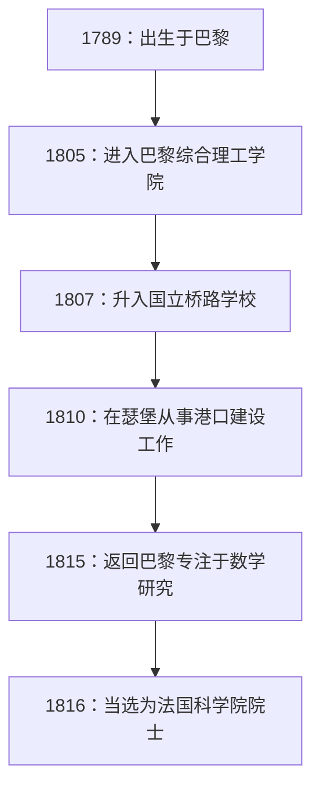

## 引言

在数学史上，19世纪被称为“严密化时代”。为之前一直凭借直觉处理的微积分学奠定坚实逻辑基础的，正是法国数学家 **[奥古斯丁-路易·柯西](https://kenji.blog/p/cauchy/)** ([Augustin-Louis Cauchy](https://kenji.blog/p/cauchy/), 1789-1857)。他的名字冠于如此多的定理和概念之上，以至于任何学习现代数学的人都必然会遇到他。

本文将探讨这位数学界巨匠柯西波澜壮阔的一生，以及他留下的辉煌数学成就。

## 波澜壮阔的一生：生活在动荡的法国

1789年，就在法国大革命爆发后不久，柯西出生于巴黎。他的一生始终与法国的政治动荡紧密相连。

### 童年与教育

柯西的父亲在警察局担任要职，但为了躲避革命的混乱，全家逃到了巴黎郊外的阿克伊。在那里，他受到了当时伟大科学家（如拉普拉斯和拉格朗日，他们是他父亲的朋友）的教导。特别是拉格朗日，他看出了年轻柯西的数学天赋，并留下了那句著名的预言：“这个孩子总有一天会超越我们所有人。”

### 职业生涯与政治信仰

从巴黎综合理工学院毕业后，他开始从事土木工程师的工作，但由于健康状况恶化以及对数学的热爱，他走上了研究者的道路。1816年，在波旁王朝复辟后科学院的重组中，他当选为院士，取代了因政治原因被驱逐的蒙日和卡诺。

柯西是一位虔诚的天主教徒，也是一位狂热的保皇党人（波旁家族的支持者）。1830年七月革命导致查理十世退位时，他拒绝向新政权宣誓效忠，并选择了流亡。他辗转于瑞士、意大利和布拉格，离开祖国约八年之久，直到1838年才返回巴黎。即使在回国后，他仍然拒绝宣誓，因此在很长一段时间内都无法在大学获得正式职位。

他保守的意识形态和不妥协的性格有时会导致他与同事和年轻数学家（如阿贝尔和伽罗瓦）产生摩擦，但他对数学的奉献精神和惊人的生产力是任何人都无法否认的。

## 数学革命：对严密性的追求

柯西最大的成就是为数学分析奠定了严密的基石。他使用严密的定义（后来由魏尔斯特拉斯完善的 epsilon-delta 论证，也就是我们今天所学的）重建了极限、连续性、微分和积分等概念。

以下是一些以他名字命名的重要成就。

### 1. 柯西序列

在讨论实数的连续性时，**柯西序列** 的概念是必不可少的。如果序列 $ (a_n) $ 在索引 $ n $ 和 $ m $ 足够大时，$ a_n $ 和 $ a_m $ 之间的差变得任意小，那么它就是一个柯西序列。

用数学公式表示，对于任意 $ \epsilon > 0 $，存在一个自然数 $ N $，使得对于所有 $ n, m > N $，
$$ |a_n - a_m| < \epsilon $$
始终成立。

在实数空间中，“柯西序列必定收敛”这一性质表明该空间是“完备的”。这种完备性的概念是现代拓扑学和泛函分析的基础。

### 2. 柯西积分定理

毫不夸张地说，复变函数论（复分析）几乎是由柯西一人创立的。其核心定理就是 **柯西积分定理**。

该定理指出，对于在区域 $ D $ 内解析（可导）的复变函数 $ f(z) $，沿 $ D $ 内任意简单闭曲线 $ C $ 的线积分为零。

$$ \oint_C f(z) \, dz = 0 $$

从这个看似简单的定理中，不断推导出令人惊叹的结果。例如，我们得到了 **柯西积分公式**，它表明函数的值仅由其边界上的值决定。

$$ f(a) = \frac{1}{2\pi i} \oint_C \frac{f(z)}{z - a} \, dz $$

这个公式是一个极其强大的工具，它保证了解析函数无限次可导，并且可以展开成泰勒级数。

### 3. 柯西-施瓦茨不等式

这是线性代数和分析中最常用的不等式之一。对于内积空间中实数或复数的任意向量 $ \mathbf{u} $ 和 $ \mathbf{v} $，以下关系成立：

$$ |\langle \mathbf{u}, \mathbf{v} \rangle|^2 \leq \langle \mathbf{u}, \mathbf{u} \rangle \cdot \langle \mathbf{v}, \mathbf{v} \rangle $$

在积分形式中，对于函数 $ f(x) $ 和 $ g(x) $，它表示如下：

$$ \left( \int_a^b f(x)g(x) \, dx \right)^2 \leq \left( \int_a^b f(x)^2 \, dx \right) \left( \int_a^b g(x)^2 \, dx \right) $$

该不等式为将向量之间角度和距离的概念扩展到抽象空间奠定了基础。

## 柯西的多产与遗产

柯西一生发表了大约800篇论文。这是一个惊人的数字，仅次于欧拉。甚至有一则轶事说，他接二连三地向科学院的公报提交了太多的论文，以至于科学院不得不对论文的页数施加限制，以降低印刷成本。

他的研究课题并不局限于分析，而是扩展到了数学和物理学领域的广泛范畴，包括代数（群论中置换的研究）和数学物理（弹性理论和光学）。

## 结语

[奥古斯丁-路易·柯西](https://kenji.blog/p/cauchy/)通过逻辑的力量，将依赖于直觉的数学锻造成了一门严密的学术学科。他创造的概念和定理在现代数学的各个角落都根深蒂固。

尽管他的一生并不平坦，因为他为了自己的政治信仰而选择流亡，但他追求真理的热情从未动摇。他留下的巨大知识遗产至今仍继续指引着世界各地的数学家和科学家们。
