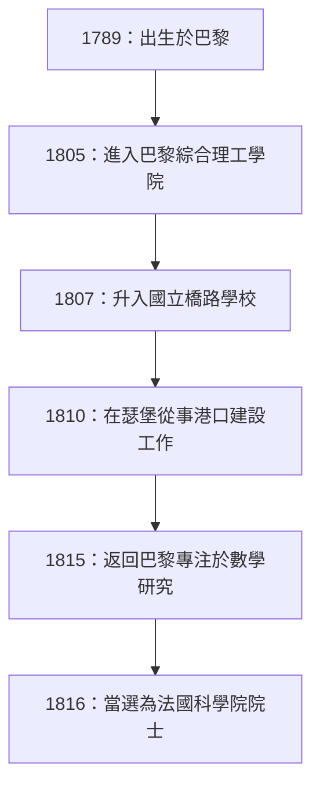

## 引言

在數學史上，19世紀被稱為「嚴密化時代」。為之前一直憑藉直覺處理的微積分學奠定堅實邏輯基礎的，正是法國數學家 **奧古斯丁-路易·柯西** (Augustin-Louis Cauchy, 1789-1857)。他的名字冠於如此多的定理和概念之上，以至於任何學習現代數學的人都必然會遇到他。

本文將探討這位數學界巨匠柯西波瀾壯闊的一生，以及他留下的輝煌數學成就。

## 波瀾壯闊的一生：生活在動盪的法國

1789年，就在法國大革命爆發後不久，柯西出生於巴黎。他的一生始終與法國的政治動盪緊密相連。

### 童年與教育

柯西的父親在警察局擔任要職，但為了躲避革命的混亂，全家逃到了巴黎郊外的阿克伊。在那裡，他受到了當時偉大科學家（如拉普拉斯和拉格朗日，他們是他父親的朋友）的教導。特別是拉格朗日，他看出了年輕柯西的數學天賦，並留下了那句著名的預言：「這個孩子總有一天會超越我們所有人。」

### 職業生涯與政治信仰

從巴黎綜合理工學院畢業後，他開始從事土木工程師的工作，但由於健康狀況惡化以及對數學的熱愛，他走上了研究者的道路。1816年，在波旁王朝復辟後科學院的重組中，他當選為院士，取代了因政治原因被驅逐的蒙日和卡諾。

柯西是一位虔誠的天主教徒，也是一位狂熱的保皇黨人（波旁家族的支持者）。1830年七月革命導致查理十世退位時，他拒絕向新政權宣誓效忠，並選擇了流亡。他輾轉於瑞士、義大利和布拉格，離開祖國約八年之久，直到1838年才返回巴黎。即使在回國後，他仍然拒絕宣誓，因此在很長一段時間內都無法在大學獲得正式職位。

他保守的意識形態和不妥協的性格有時會導致他與同事和年輕數學家（如阿貝爾和伽羅瓦）產生摩擦，但他對數學的奉獻精神和驚人的生產力是任何人都無法否認的。

## 數學革命：對嚴密性的追求

柯西最大的成就是為數學分析奠定了嚴密的基石。他使用嚴密的定義（後來由魏爾施特拉斯完善的 epsilon-delta 論證，也就是我們今天所學的）重建了極限、連續性、微分和積分等概念。

以下是一些以他名字命名的重要成就。

### 1. 柯西序列

在討論實數的連續性時，**柯西序列** 的概念是必不可少的。如果序列 $ (a_n) $ 在索引 $ n $ 和 $ m $ 足夠大時，$ a_n $ 和 $ a_m $ 之間的差變得任意小，那麼它就是一個柯西序列。

用數學公式表示，對於任意 $ \epsilon > 0 $，存在一個自然數 $ N $，使得對於所有 $ n, m > N $，
$$ |a_n - a_m| < \epsilon $$
始終成立。

在實數空間中，「柯西序列必定收斂」這一性質表明該空間是「完備的」。這種完備性的概念是現代拓撲學和泛函分析的基礎。

### 2. 柯西積分定理

毫不誇張地說，複變函數論（複分析）幾乎是由柯西一人創立的。其核心定理就是 **柯西積分定理**。

該定理指出，對於在區域 $ D $ 內解析（可導）的複變函數 $ f(z) $，沿 $ D $ 內任意簡單閉曲線 $ C $ 的線積分為零。

$$ \oint_C f(z) \, dz = 0 $$

從這個看似簡單的定理中，不斷推導出令人驚嘆的結果。例如，我們得到了 **柯西積分公式**，它表明函數的值僅由其邊界上的值決定。

$$ f(a) = \frac{1}{2\pi i} \oint_C \frac{f(z)}{z - a} \, dz $$

這個公式是一個極其強大的工具，它保證了解析函數無限次可導，並且可以展開成泰勒級數。

### 3. 柯西-施瓦茨不等式

這是線性代數和分析中最常用的不等式之一。對於內積空間中實數或複數的任意向量 $ \mathbf{u} $ 和 $ \mathbf{v} $，以下關係成立：

$$ |\langle \mathbf{u}, \mathbf{v} \rangle|^2 \leq \langle \mathbf{u}, \mathbf{u} \rangle \cdot \langle \mathbf{v}, \mathbf{v} \rangle $$

在積分形式中，對於函數 $ f(x) $ 和 $ g(x) $，它表示如下：

$$ \left( \int_a^b f(x)g(x) \, dx \right)^2 \leq \left( \int_a^b f(x)^2 \, dx \right) \left( \int_a^b g(x)^2 \, dx \right) $$

該不等式為將向量之間角度和距離的概念擴展到抽象空間奠定了基礎。

## 柯西的多產與遺產

柯西一生發表了大約800篇論文。這是一個驚人的數字，僅次於歐拉。甚至有一則軼事說，他接二連三地向科學院的公報提交了太多的論文，以至於科學院不得不對論文的頁數施加限制，以降低印刷成本。

他的研究課題並不侷限於分析，而是擴展到了數學和物理學領域的廣泛範疇，包括代數（群論中置換的研究）和數學物理（彈性理論和光學）。

## 結語

奧古斯丁-路易·柯西通過邏輯的力量，將依賴於直覺的數學鍛造成了一門嚴密的學術學科。他創造的概念和定理在現代數學的各個角落都根深蒂固。

儘管他的一生並不平坦，因為他為了自己的政治信仰而選擇流亡，但他追求真理的熱情從未動搖。他留下的巨大知識遺產至今仍繼續指引著世界各地的數學家和科學家們。
