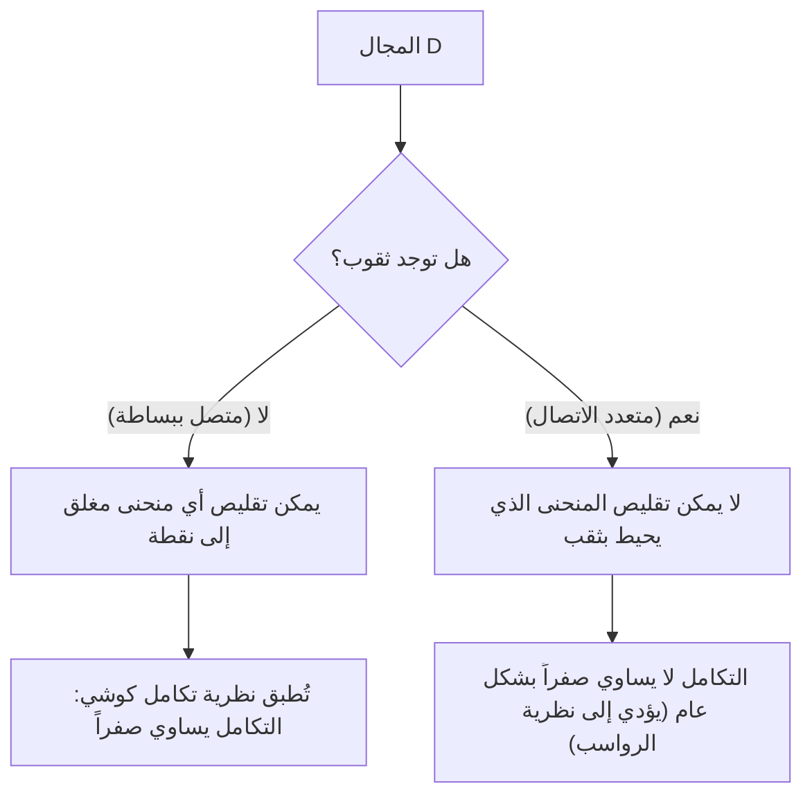

## 1. مقدمة

في مجال الرياضيات المعروف بالتحليل المركب، واحدة من أجمل النظريات وأكثرها قوة هي **نظرية تكامل كوشي** (Cauchy's integral theorem). تؤكد هذه النظرية حقيقة تبدو للوهلة الأولى مدهشة للغاية: "تكامل دالة مركبة تستوفي شروطاً معينة على طول مسار مغلق سيؤدي دائماً إلى الصفر تماماً."

من خلال تجربة تعلم تكامل الدوال الحقيقية، يُعتقد طبيعياً أن التكامل يمثل "المساحة" أو "التراكم على طول مسار"، لذلك إذا قمت بالتكامل عبر مسافة طويلة على طول مسار ما، يبدو من الطبيعي أن تتبقى بعض القيم. ومع ذلك، في المستوى المركب، عندما تمتلك الدالة الخاصية الاستثنائية بكونها **تحليلية** (holomorphic)، يظهر تناظر مذهل حيث تصبح نتيجة التكامل مستقلة تماماً عن المسار المتخذ، متجاهلة الاختلافات في المسارات.

في هذا المقال، سنشرح نظرية تكامل كوشي بتفصيل كبير، بدءاً من التعريفات الأساسية للمستوى المركب والدوال التحليلية، مروراً بالمعنى البديهي للنظرية، وتفسيرها الفيزيائي، ورسم تخطيطي لبرهانها الكلاسيكي باستخدام نظرية جرين. وعلاوة على ذلك، سنتطرق إلى كيفية ارتباط هذه النظرية بمواضيع أكثر تقدماً في التحليل المركب، مثل صيغة تكامل كوشي ونظرية الرواسب. دعونا نقدر العمق العميق لهذه النظرية من منظور الصرامة الرياضية والصور البديهية.

## 2. أسس المستوى المركب والدوال التحليلية

لفهم نظرية تكامل كوشي بعمق، يجب علينا أولاً ترسيخ فهمنا لأساسيات المستوى المركب واشتقاق الدوال المركبة. يشكل الفهم هنا أساساً مهماً للبراهين والتفسيرات للنظريات التي تلي.

### الدوال في المستوى المركب

الدالة المركبة $f(z)$ هي دالة تعين عدداً مركباً $z = x + iy$ إلى عدد مركب آخر $w = u + iv$. هنا، $x, y$ أرقام حقيقية، و $i$ هي الوحدة التخيلية ($i^2 = -1$)، و $u, v$ عبارة عن دوال ذات قيم حقيقية تعتمد على $x, y$ على التوالي. لذلك، يمكن تمثيل الدالة المركبة كمزيج من دالتين ذات قيم حقيقية لمتغيرين حقيقيين على النحو التالي:

$$
f(z) = u(x, y) + i v(x, y)
$$

على سبيل المثال، بالنسبة للدالة $f(z) = z^2$، بالتعويض بـ $z = x + iy$ ونشرها نحصل على $z^2 = (x + iy)^2 = x^2 - y^2 + 2ixy$. وبالتالي، في هذه الحالة، يمكننا أن نرى أنها تتكون من الدوال ذات القيم الحقيقية $u(x, y) = x^2 - y^2$ و $v(x, y) = 2xy$.

### الاشتقاق المركب ومعادلتي كوشي-ريمان

يُقال إن الدالة المركبة $f(z)$ **قابلة للاشتقاق** عند النقطة $z_0$ إذا كانت النهاية التالية موجودة:

$$
f'(z_0) = \lim_{\Delta z \to 0} \frac{f(z_0 + \Delta z) - f(z_0)}{\Delta z}
$$

الشيء المهم للغاية هنا هو أن هذه النهاية يجب أن تتقارب إلى نفس القيمة بالضبط بغض النظر "عن أي اتجاه" تقترب $\Delta z$ من الصفر في المستوى المركب. في عالم الأرقام الحقيقية، كان هناك مساران فقط: الاقتراب من اليمين أو من اليسار، ولكن في المستوى المركب، هناك طرق لا حصر لها للاقتراب. بسبب هذا الشرط الصارم، تُشتق خصائص أقوى بكثير من اشتقاق الدوال الحقيقية.

عندما تكون الدالة $f(z)$ قابلة للاشتقاق في جميع النقاط داخل مجال معين، يُقال إن الدالة **تحليلية** (holomorphic) في ذلك المجال. ومن المعروف أن الشرط الضروري والكافي لكونها تحليلية هو أن الجزء الحقيقي $u$ والجزء التخيلي $v$ يستوفيان المعادلات التفاضلية الجزئية التالية. وتُعرف هذه باسم **معادلتي كوشي-ريمان**.

$$
\frac{\partial u}{\partial x} = \frac{\partial v}{\partial y}, \quad \frac{\partial u}{\partial y} = -\frac{\partial v}{\partial x}
$$

علاوة على ذلك، إذا كانت لـ $u$ و $v$ مشتقات جزئية متصلة، فإن تحقق هذه المعادلات يعادل كون $f(z)$ تحليلية. تلعب هذه المعادلات الترابطية، التي تمتلك تناظراً جميلاً، دوراً حاسماً في برهان نظرية تكامل كوشي الموصوفة لاحقاً.

## 3. تعريف وخصائص التكامل المركب

بعد ذلك، نُعرّف التكامل الخطي في المستوى المركب. نظراً لأن نظرية تكامل كوشي هي نظرية حول التكامل على طول "منحنى" في المستوى المركب، فمن الضروري توضيح تعريف هذا التكامل.

لنفترض أن منحنى أملس $C$ في المستوى المركب محدد المعالم باستخدام متغير حقيقي $t \in [a, b]$ حيث $z(t) = x(t) + i y(t)$. يُعرّف التكامل الخطي للدالة المركبة $f(z)$ على طول هذا المنحنى $C$ على النحو التالي:

$$
\int_C f(z) dz = \int_a^b f(z(t)) z'(t) dt
$$

هنا، $z'(t) = \frac{dx}{dt} + i \frac{dy}{dt}$، ومن خلال إجراء التعويض الشكلي $dz = dx + i dy$، يمكن في النهاية اختزال الحساب إلى تكامل المتغيرات الحقيقية.

يمتلك التكامل المركب خصائص أساسية مشابهة للتكامل الخطي للدوال الحقيقية، مثل:

1. **الخطية** : لأي ثوابت مركبة $\alpha, \beta$، ينطبق أن $\int_C (\alpha f(z) + \beta g(z)) dz = \alpha \int_C f(z) dz + \beta \int_C g(z) dz$.
2. **عكس المسار** : إذا تم عكس اتجاه المنحنى $C$ (اتجاه التقدم من نقطة البداية إلى نقطة النهاية) وتم الإشارة إليه كـ $-C$، فإن $\int_{-C} f(z) dz = -\int_C f(z) dz$. يؤدي تشغيل مسار التكامل في الاتجاه العكسي إلى قلب الإشارة.
3. **تقسيم المسارات ودمجها** : عندما يمكن تقسيم المنحنى $C$ عند نقطة وسيطة إلى $C_1$ و $C_2$، يتم التعبير عن التكامل الإجمالي كمجموع للتكاملات الجزئية. أي، $\int_C f(z) dz = \int_{C_1} f(z) dz + \int_{C_2} f(z) dz$.

هذه الخصائص، رغم أنها تبدو واضحة، تصبح أدوات قوية للغاية عندما نطور حججنا لاحقاً عن طريق تشويه المسارات بأشكال مختلفة.

## 4. صياغة نظرية تكامل كوشي

الآن بعد أن اكتملت تحضيراتنا، نذكر أخيراً الصياغة الدقيقة للموضوع الرئيسي، نظرية تكامل كوشي.

**النظرية (نظرية تكامل كوشي)**
بالنسبة للدالة المركبة $f(z)$ التي تكون تحليلية في مجال متصل ببساطة $D$، وبالنسبة لأي منحنى مغلق بسيط $C$ داخل $D$، تسري المساواة التالية.

$$
\oint_C f(z) dz = 0
$$

دعونا نكمل هذا ببعض المصطلحات المهمة التي تظهر كشروط مسبقة للنظرية.

- **المجال المتصل ببساطة** : من الناحية البديهية، يشير هذا إلى مجال "بدون ثقوب". وللتعبير عنه بصرامة رياضية، يشير إلى مجال حيث يمكن تشويه أي منحنى مغلق داخله باستمرار وتقليصه إلى نقطة واحدة دون مغادرة المجال أبداً.
- **المنحنى المغلق البسيط** : هذا منحنى حيث تتطابق نقطة البداية ونقطة النهاية (منحنى مغلق) ولا يتقاطع مع نفسه على طول الطريق (بسيط). ويُعرف أيضاً باسم "منحنى جوردان"، ومن المعروف أنه يقسم المستوى إلى جزأين: "داخل" و "خارج" (نظرية منحنى جوردان).

يوضح الرسم البياني أدناه بصرياً الفرق في سلوك المنحنيات المغلقة في المجالات المتصلة ببساطة مقابل المجالات متعددة الاتصال (المجالات ذات الثقوب).

## 5. الفهم البديهي والتفسير الفيزيائي للنظرية

لماذا يصبح تكامل الدالة التحليلية على منحنى مغلق دائماً صفراً؟ لفهم ذلك بديهياً، بدلاً من مجرد تسلسل للصيغ الرياضية، دعنا نقسم التكامل المركب إلى أجزائه الحقيقية والتخيلية.

لتكن $f(z) = u + iv$ و $dz = dx + i dy$. يمكن حينئذٍ توسيع التكامل على النحو التالي:

$$
\oint_C f(z) dz = \oint_C (u + iv)(dx + idy) = \oint_C (u dx - v dy) + i \oint_C (v dx + u dy)
$$

لاحظ الجانب الأيمن من هذه المعادلة. لقد ظهر تكاملان حقيقيان، ولهما نفس الشكل تماماً مثل التكاملات الخطية للمجالات المتجهة على مستوى ثنائي الأبعاد. وبشكل محدد، يمكن تفسير الجزء الحقيقي على أنه التكامل الخطي لمجال متجه $\vec{F}_1 = (u, -v)$، والجزء التخيلي على أنه التكامل الخطي لمجال متجه $\vec{F}_2 = (v, u)$.

بالنظر إلى ذلك في سياق الفيزياء (وخاصة ديناميكا الموائع أو الكهرومغناطيسية)، فإن التكامل الخطي لمجال متجه على طول منحنى مغلق يمثل "دوران" ذلك المجال. إذا كان المجال المتجه كلاً من "غير دوراني" (irrotational) و "غير قابل للانضغاط" (incompressible)، فبغض النظر عن المنحنى المغلق الذي تحسب الدوران على طوله، ستكون النتيجة صفراً.

تذكر معادلتي كوشي-ريمان التي تعلمناها سابقاً: $\frac{\partial u}{\partial y} = -\frac{\partial v}{\partial x}$. هذا هو بالضبط الشرط الذي يضمن أن المجالات المتجهة $\vec{F}_1$ و $\vec{F}_2$ "غير دورانية". وبالمثل، فإن المعادلة الأخرى $\frac{\partial u}{\partial x} = \frac{\partial v}{\partial y}$ تضمن أنها "غير قابلة للانضغاط".

بعبارة أخرى، يعني شرط كون الدالة تحليلية تكوين مجالات متجهة تتصرف بـ "حسن" شديد (بدون دوامات، بدون مصادر أو مصارف) من منظور فيزيائي، ونتيجة لذلك، يصبح التكامل على حلقة مغلقة بالضرورة صفراً. هذا هو المعنى الفيزيائي والبديهي وراء نظرية تكامل كوشي.

## 6. رسم تخطيطي لبرهان صارم باستخدام نظرية جرين

هنا، كبرهان كلاسيكي وبديهي لنظرية تكامل كوشي، نقدم طريقة تستخدم **نظرية جرين** من حساب التفاضل والتكامل. (ملاحظة: يفترض هذا البرهان أن المشتقات الجزئية متصلة، أي أن $f'(z)$ متصلة).

نظرية جرين هي نظرية قوية تحول تكاملاً خطياً على طول منحنى مغلق في مستوى إلى تكامل مزدوج فوق المجال $D'$ الذي يحيط به ذلك المنحنى.

**نظرية جرين**
$$
\oint_{\partial D'} (P dx + Q dy) = \iint_{D'} \left( \frac{\partial Q}{\partial x} - \frac{\partial P}{\partial y} \right) dx dy
$$

دعونا نطبق نظرية جرين هذه على الجزء الحقيقي من التكامل المركب المفكك من قبل. هنا نجعل $P = u, Q = -v$.

$$
\oint_C (u dx - v dy) = \iint_{D'} \left( \frac{\partial (-v)}{\partial x} - \frac{\partial u}{\partial y} \right) dx dy
$$

الآن، نستبدل معادلة كوشي-ريمان $\frac{\partial u}{\partial y} = -\frac{\partial v}{\partial x}$، وهي خاصية للدوال التحليلية. بعد ذلك، يصبح المكامل (integrand) على النحو التالي:

$$
-\frac{\partial v}{\partial x} - \left( -\frac{\partial v}{\partial x} \right) = 0
$$

نظراً لأن المكامل يصبح $0$ في جميع النقاط داخل المجال، فإن التكامل المزدوج بأكمله يصبح صفراً، مما يثبت أن التكامل الخطي للجزء الحقيقي هو صفر.

من خلال نفس الإجراء تماماً، نطبق نظرية جرين على الجزء التخيلي $i \oint_C (v dx + u dy)$. هنا $P = v, Q = u$.

$$
\oint_C (v dx + u dy) = \iint_{D'} \left( \frac{\partial u}{\partial x} - \frac{\partial v}{\partial y} \right) dx dy
$$

مرة أخرى، بالتعويض بمعادلة كوشي-ريمان الأخرى $\frac{\partial u}{\partial x} = \frac{\partial v}{\partial y}$، يصبح المكامل $\frac{\partial v}{\partial y} - \frac{\partial v}{\partial y} = 0$، ويصبح تكامل الجزء التخيلي أيضاً صفراً.

في الختام، نظراً لأن كلاً من الجزء الحقيقي والتخيلي يصبحان صفراً، ينطبق ما يلي:

$$
\oint_C f(z) dz = 0 + i0 = 0
$$

هذا هو الهيكل الأساسي لبرهان نظرية تكامل كوشي. يمكننا أن نرى أنه من خلال تداخل معادلتي كوشي-ريمان ونظرية جرين معاً بشكل جميل، يمكن إنجاز البرهان ببساطة مدهشة.

## 7. نظرية جورساه: إزالة افتراض القابلية للاشتقاق المستمر

البرهان باستخدام نظرية جرين أعلاه سهل الفهم وبديهي للغاية، ولكنه رياضياً يحتوي على نقطة ضعف واحدة. وهي أنه يستخدم ضمنياً افتراض أن "$f'(z)$ متصلة" (أي، افتراض أن المشتقات الجزئية لـ $u, v$ متصلة). كما اعتمد برهان كوشي الأولي على هذا الافتراض.

ومع ذلك، في نهاية القرن التاسع عشر، أثبت عالم الرياضيات الفرنسي إدوار جورساه (Édouard Goursat) أن افتراض الاستمرارية هذا غير ضروري في الواقع. أي أنه أظهر أن نظرية تكامل كوشي تظل صحيحة ببساطة لكون الدالة "قابلة للاشتقاق (تحليلية) عند كل نقطة".

يستخدم برهان جورساه طريقة بارعة لتقسيم المجال إلى مثلثات صغيرة واستخدام البرهان بالتناقض لاشتقاق تناقض (طريقة التثليث). في الكتب المدرسية الحديثة للتحليل المركب، تُقدم هذه النتيجة عموماً باسم "نظرية كوشي-جورساه". وسلطت هذه النتيجة الضوء مرة أخرى على أن شرط كون الدالة "قابلة للاشتقاق مركباً ولو لمرة واحدة" هو قيد أقوى بكثير (مما يؤدي إلى قابليتها للاشتقاق لعدد لا نهائي من المرات) مما يمكن للمرء أن يقارنه مع حالة الدوال الحقيقية.

## 8. تشويه المسار واستقلالية المسار

من النتائج المهمة للغاية لنظرية تكامل كوشي هي **استقلالية التكاملات عن المسار**.

لنفترض وجود نقطتين $A$ و $B$ داخل مجال متصل ببساطة $D$، وهناك مساران مختلفان $C_1$ و $C_2$ يربطان بينهما. في هذه الحالة، إذا كانت الدالة $f(z)$ تحليلية داخل $D$، ينطبق ما يلي:

$$
\int_{C_1} f(z) dz = \int_{C_2} f(z) dz
$$

البرهان بسيط للغاية. لنأخذ في الاعتبار مساراً يذهب إلى $B$ عبر $C_1$، ويعود إلى $A$ عبر المسار العكسي $-C_2$. يشكل هذا منحنى مغلقاً واحداً $C = C_1 + (-C_2)$. بموجب نظرية تكامل كوشي، فإن التكامل على طول هذا المنحنى المغلق هو صفر.

$$
\oint_C f(z) dz = \int_{C_1} f(z) dz + \int_{-C_2} f(z) dz = \int_{C_1} f(z) dz - \int_{C_2} f(z) dz = 0
$$

بنقل هذا، نحصل على $\int_{C_1} f(z) dz = \int_{C_2} f(z) dz$.

وبسبب هذه الخاصية، لا يعتمد تكامل الدالة التحليلية على "أي مسار تم اتخاذه"، بل يتحدد "فقط بنقطتي البداية والنهاية". هذا يجعل من الممكن تحديد مشتق عكسي (تكامل غير محدد) $F(z)$ بشكل فريد حتى في المستوى المركب (باستثناء ثابت التكامل)، مما يضمن أن "النظرية الأساسية لحساب التفاضل والتكامل" للدوال الحقيقية تنطبق أيضاً بشكل جميل على المستوى المركب.

## 9. التطبيق: صيغة تكامل كوشي والامتداد إلى المجالات متعددة الاتصال

نظرية تكامل كوشي هي نظرية جميلة بحد ذاتها، ولكنها تعمل كأساس قوي لاشتقاق نظريات مهمة أخرى تباعاً في التحليل المركب.

### صيغة تكامل كوشي

النتيجة المباشرة والأكثر قابلية للتطبيق على نطاق واسع للنظرية هي **صيغة تكامل كوشي**. عندما تكون الدالة $f(z)$ تحليلية في مجال $D$، بالنسبة لمنحنى مغلق بسيط $C$ داخل $D$ وأي نقطة $a$ بداخله، ينطبق ما يلي:

$$
f(a) = \frac{1}{2\pi i} \oint_C \frac{f(z)}{z - a} dz
$$

توضح هذه الصيغة الصلابة المذهلة للدوال التحليلية: "طالما أن قيم الدالة على حدود المنحنى المغلق معروفة، فإن قيمة الدالة عند كل نقطة داخل المجال تتحدد تماماً عن طريق حساب التكامل".

### المجالات متعددة الاتصال ونظرية الرواسب

إذا كان المجال يحتوي على "ثقوب" ولم يكن متصلاً ببساطة (مجال متعدد الاتصال)، فلا يمكن تطبيق نظرية تكامل كوشي كما هي. على سبيل المثال، الدالة $f(z) = 1/z$ غير مُعرّفة عند نقطة الأصل $z=0$ وليست تحليلية هناك. إذا أجرينا التكامل على طول دائرة الوحدة المحيطة بنقطة الأصل، فلن تكون النتيجة صفراً، بل القيمة $2\pi i$.

ومع ذلك، من خلال تطبيق نظرية تكامل كوشي ببراعة وتشويه مسار التكامل، تم إنشاء طريقة منهجية لتقييم التكاملات حول الثقوب. وهذا يؤدي إلى **نظرية الرواسب** (Residue theorem)، وهي واحدة من أكثر الأدوات العملية في التحليل المركب الحديث. باستخدام نظرية الرواسب، يمكن استبدال التكاملات المحددة المركبة والتكاملات اللانهائية للدوال الحقيقية ببراعة بحسابات جبرية في المستوى المركب وحلها.

## 10. خاتمة

للوهلة الأولى، قد تبدو نظرية تكامل كوشي وكأنها نظرية متواضعة تقول ببساطة "التكامل يصبح صفراً". ومع ذلك، يختبئ وراءها تناظر عميق وجميل ناتج عن الشرط الذي يبدو بسيطاً لـ "تحليلية" الدوال المركبة.

بدءاً من هذه النظرية، تُشتق تباعاً إنجازات مجيدة للتحليل المركب مثل صيغة تكامل كوشي، وإثبات أن الدالة قابلة للاشتقاق مرات لا حصر لها (مما يضمن متسلسلات تايلور ومتسلسلات لوران)، ونظرية الرواسب. يمكن القول حقاً إن نظرية تكامل كوشي هي الأساس الأكثر قوة وجمالاً الذي يدعم الصرح الرياضي الرائع للتحليل المركب من جذوره.

نحن نشجع القراء على إحضار ورقة وقلم وتتبع البرهان باستخدام نظرية جرين بأيديكم. من المفترض أن تتمكنوا بالتأكيد من الشعور بالعالم المتناغم بشكل جميل للمستوى المركب والذي يمتد خلف الصيغ الرياضية.
