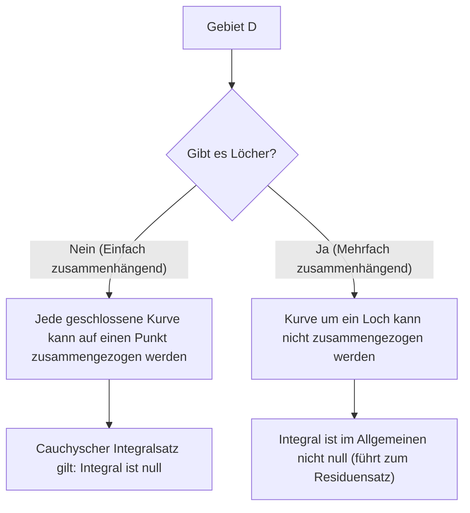

## 1. Einleitung

In dem Teilgebiet der Mathematik, das als Funktionentheorie (komplexe Analysis) bekannt ist, ist einer der schönsten und mächtigsten Sätze der **[Cauchy](https://kenji.blog/de/p/cauchy/)sche Integralsatz**. Dieser Satz behauptet eine auf den ersten Blick höchst überraschende Tatsache: "Die Integration einer komplexen Funktion, die bestimmte Bedingungen erfüllt, entlang einer geschlossenen Kurve liefert immer genau null."

Aus der Erfahrung mit der Integration reeller Funktionen denkt man bei der Integration natürlicherweise an "Fläche" oder "Akkumulation entlang eines Weges", so dass es natürlich erscheint, dass ein gewisser Wert übrig bleibt, wenn man über eine lange Strecke entlang eines Weges integriert. In der komplexen Ebene zeigt sich jedoch, wenn eine Funktion die besondere Eigenschaft besitzt, **holomorph** zu sein, eine erstaunliche Symmetrie, bei der das Ergebnis der Integration völlig unabhängig vom gewählten Weg wird und Unterschiede in den Wegen überspringt.

In diesem Artikel werden wir den [Cauchy](https://kenji.blog/de/p/cauchy/)schen Integralsatz sehr detailliert erklären, angefangen bei den grundlegenden Definitionen der komplexen Ebene und holomorpher Funktionen über die intuitive Bedeutung des Satzes, seine physikalische Interpretation bis hin zu einer Skizze seines klassischen Beweises mit dem Satz von Green. Darüber hinaus werden wir ansprechen, wie dieser Satz mit fortgeschritteneren Themen der Funktionentheorie, wie der Cauchyschen Integralformel und dem [Residuensatz](https://kenji.blog/de/p/residue-theorem/), zusammenhängt. Lassen Sie uns die tiefe Bedeutung dieses Satzes sowohl aus der Perspektive mathematischer Strenge als auch intuitiver Vorstellungskraft würdigen.

## 2. Grundlagen der komplexen Ebene und holomorpher Funktionen

Um den [Cauchy](https://kenji.blog/de/p/cauchy/)schen Integralsatz tiefgreifend zu verstehen, müssen wir zunächst unser Verständnis der Grundlagen der komplexen Ebene und der Differentiation komplexer Funktionen festigen. Das Verständnis hier bildet eine wichtige Grundlage für die Beweise und Interpretationen der folgenden Sätze.

### Funktionen in der komplexen Ebene

Eine komplexe Funktion $f(z)$ ist eine Funktion, die eine komplexe Zahl $z = x + iy$ auf eine andere komplexe Zahl $w = u + iv$ abbildet. Hierbei sind $x, y$ reelle Zahlen, $i$ ist die imaginäre Einheit ($i^2 = -1$), und $u, v$ sind reellwertige Funktionen, die jeweils von $x, y$ abhängen. Daher kann eine komplexe Funktion als Kombination aus zwei reellwertigen Funktionen zweier reeller Variablen wie folgt dargestellt werden:

$$
f(z) = u(x, y) + i v(x, y)
$$

Zum Beispiel ergibt sich für die Funktion $f(z) = z^2$ durch Einsetzen von $z = x + iy$ und Ausmultiplizieren $z^2 = (x + iy)^2 = x^2 - y^2 + 2ixy$. Somit können wir in diesem Fall sehen, dass sie aus den reellwertigen Funktionen $u(x, y) = x^2 - y^2$ und $v(x, y) = 2xy$ zusammengesetzt ist.

### Komplexe Differentiation und die [Cauchy](https://kenji.blog/de/p/cauchy/)-[Riemann](https://kenji.blog/de/p/riemann/)schen Differentialgleichungen

Eine komplexe Funktion $f(z)$ heißt an einem Punkt $z_0$ **differenzierbar**, wenn der folgende Grenzwert existiert:

$$
f'(z_0) = \lim_{\Delta z \to 0} \frac{f(z_0 + \Delta z) - f(z_0)}{\Delta z}
$$

Hierbei ist extrem wichtig, dass dieser Grenzwert gegen genau denselben Wert konvergieren muss, unabhängig davon, "aus welcher Richtung" sich $\Delta z$ in der komplexen Ebene der Null nähert. In der Welt der reellen Zahlen gab es nur zwei Möglichkeiten: Annäherung von rechts oder von links, aber in der komplexen Ebene gibt es unendlich viele Möglichkeiten der Annäherung. Aufgrund dieser strengen Bedingung ergeben sich Eigenschaften, die weitaus stärker sind als bei der Differentiation reeller Funktionen.

Wenn eine Funktion $f(z)$ in allen Punkten eines bestimmten Gebietes differenzierbar ist, sagt man, die Funktion sei in diesem Gebiet **holomorph**. Es ist bekannt, dass eine notwendige und hinreichende Bedingung dafür, dass eine Funktion holomorph ist, darin besteht, dass der Realteil $u$ und der Imaginärteil $v$ die folgenden partiellen Differentialgleichungen erfüllen. Diese werden die **[Cauchy](https://kenji.blog/de/p/cauchy/)-[Riemann](https://kenji.blog/de/p/riemann/)schen Differentialgleichungen** genannt.

$$
\frac{\partial u}{\partial x} = \frac{\partial v}{\partial y}, \quad \frac{\partial u}{\partial y} = -\frac{\partial v}{\partial x}
$$

Wenn außerdem $u$ und $v$ stetige partielle Ableitungen haben, ist die Gültigkeit dieser Gleichungen äquivalent dazu, dass $f(z)$ holomorph ist. Diese Beziehungsgleichungen, die eine schöne Symmetrie besitzen, spielen eine entscheidende Rolle im später beschriebenen Beweis des [Cauchy](https://kenji.blog/de/p/cauchy/)schen Integralsatzes.

## 3. Definition und Eigenschaften der komplexen Integration

Als nächstes definieren wir das Wegintegral in der komplexen Ebene. Da der [Cauchy](https://kenji.blog/de/p/cauchy/)sche Integralsatz ein Satz über die Integration entlang einer "Kurve" in der komplexen Ebene ist, ist es unerlässlich, die Definition dieser Integration zu klären.

Angenommen, eine glatte Kurve $C$ in der komplexen Ebene wird mit einem reellen Parameter $t \in [a, b]$ als $z(t) = x(t) + i y(t)$ parametrisiert. Das Wegintegral der komplexen Funktion $f(z)$ entlang dieser Kurve $C$ ist wie folgt definiert:

$$
\int_C f(z) dz = \int_a^b f(z(t)) z'(t) dt
$$

Hierbei ist $z'(t) = \frac{dx}{dt} + i \frac{dy}{dt}$, und durch die formale Substitution $dz = dx + i dy$ kann die Berechnung letztendlich auf die Integration reeller Variablen zurückgeführt werden.

Die komplexe Integration besitzt grundlegende Eigenschaften, die denen der Wegintegration reeller Funktionen ähnlich sind, wie zum Beispiel:

1. **Linearität** : Für beliebige komplexe Konstanten $\alpha, \beta$ gilt $\int_C (\alpha f(z) + \beta g(z)) dz = \alpha \int_C f(z) dz + \beta \int_C g(z) dz$.
2. **Wegumkehr** : Wenn die Richtung der Kurve $C$ (die Fortschrittsrichtung vom Anfangspunkt zum Endpunkt) umgekehrt und als $-C$ bezeichnet wird, dann ist $\int_{-C} f(z) dz = -\int_C f(z) dz$. Das Durchlaufen des Integrationsweges in umgekehrter Richtung kehrt das Vorzeichen um.
3. **Aufteilen und Verbinden von Wegen** : Wenn eine Kurve $C$ an einem Zwischenpunkt in $C_1$ und $C_2$ aufgeteilt werden kann, drückt sich das Gesamtintegral als Summe der Teilintegrale aus. Das heißt, $\int_C f(z) dz = \int_{C_1} f(z) dz + \int_{C_2} f(z) dz$.

Diese Eigenschaften, die scheinbar offensichtlich sind, werden später zu sehr mächtigen Werkzeugen, wenn wir unsere Argumentationen vorantreiben, indem wir die Wege auf verschiedene Weise verformen.

## 4. Formulierung des [Cauchy](https://kenji.blog/de/p/cauchy/)schen Integralsatzes

Nachdem unsere Vorbereitungen abgeschlossen sind, formulieren wir schließlich die exakte Aussage des Hauptthemas, des [Cauchy](https://kenji.blog/de/p/cauchy/)schen Integralsatzes.

**Satz ([Cauchy](https://kenji.blog/de/p/cauchy/)scher Integralsatz)**
Für eine komplexe Funktion $f(z)$, die auf einem einfach zusammenhängenden Gebiet $D$ holomorph ist, und für jede einfache geschlossene Kurve $C$ innerhalb von $D$, gilt die folgende Gleichung.

$$
\oint_C f(z) dz = 0
$$

Lassen Sie uns dies mit einigen wichtigen Begriffen ergänzen, die als Voraussetzung für den Satz erscheinen.

- **Einfach zusammenhängendes Gebiet** : Intuitiv gesprochen bezieht sich dies auf ein Gebiet "ohne Löcher". Mathematisch streng ausgedrückt bezeichnet es ein Gebiet, in dem jede geschlossene Kurve innerhalb des Gebiets kontinuierlich verformt und auf einen einzigen Punkt zusammengezogen werden kann, ohne jemals das Gebiet zu verlassen.
- **Einfache geschlossene Kurve** : Dies ist eine Kurve, bei der Anfangspunkt und Endpunkt übereinstimmen (geschlossene Kurve) und die sich auf ihrem Weg nicht selbst schneidet (einfach). Auch als "Jordankurve" bekannt, ist sie dafür bekannt, die Ebene in zwei Teile zu teilen: ein "Inneres" und ein "Äußeres" (Jordanscher Kurvensatz).

Das folgende Diagramm zeigt visuell den Unterschied im Verhalten geschlossener Kurven in einfach zusammenhängenden Gebieten im Vergleich zu mehrfach zusammenhängenden Gebieten (Gebieten mit Löchern).

## 5. Intuitives Verständnis und physikalische Interpretation des Satzes

Warum wird das Integral einer holomorphen Funktion über eine geschlossene Kurve immer null? Um dies intuitiv und nicht nur als eine Folge mathematischer Formeln zu verstehen, zerlegen wir das komplexe Integral in seinen Real- und Imaginärteil.

Sei $f(z) = u + iv$ und $dz = dx + i dy$. Das Integral kann dann wie folgt entwickelt werden:

$$
\oint_C f(z) dz = \oint_C (u + iv)(dx + idy) = \oint_C (u dx - v dy) + i \oint_C (v dx + u dy)
$$

Beachten Sie die rechte Seite dieser Gleichung. Es sind zwei reelle Integrale aufgetreten, und sie haben exakt die gleiche Form wie die Wegintegrale von Vektorfeldern auf einer 2D-Ebene. Speziell kann der Realteil als Wegintegral eines Vektorfeldes $\vec{F}_1 = (u, -v)$ und der Imaginärteil als Wegintegral eines Vektorfeldes $\vec{F}_2 = (v, u)$ interpretiert werden.

Betrachtet man dies im Kontext der Physik (insbesondere der Strömungsmechanik oder des Elektromagnetismus), stellt das Wegintegral eines Vektorfeldes entlang einer geschlossenen Kurve die "Zirkulation" dieses Feldes dar. Wenn ein Vektorfeld sowohl "wirbelfrei" als auch "quellenfrei" ist, dann ist die Zirkulation null, egal entlang welcher geschlossenen Kurve man sie berechnet.

Erinnern Sie sich an die [Cauchy](https://kenji.blog/de/p/cauchy/)-[Riemann](https://kenji.blog/de/p/riemann/)schen Differentialgleichungen, die wir zuvor kennengelernt haben: $\frac{\partial u}{\partial y} = -\frac{\partial v}{\partial x}$. Dies ist genau die Bedingung, die garantiert, dass die Vektorfelder $\vec{F}_1$ und $\vec{F}_2$ "wirbelfrei" sind. Analog garantiert die andere Gleichung $\frac{\partial u}{\partial x} = \frac{\partial v}{\partial y}$, dass sie "quellenfrei" sind.

Mit anderen Worten, die Bedingung, eine holomorphe Funktion zu sein, bedeutet, Vektorfelder zu bilden, die aus physikalischer Sicht sehr "gutartig" sind (keine Wirbel, keine Quellen oder Senken), und als Folge davon wird das Integral über eine geschlossene Schleife zwangsläufig null. Dies ist die physikalische und intuitive Bedeutung hinter dem [Cauchy](https://kenji.blog/de/p/cauchy/)schen Integralsatz.

## 6. Skizze eines strengen Beweises mit dem Satz von Green

Hier stellen wir als klassischen und intuitiven Beweis des [Cauchy](https://kenji.blog/de/p/cauchy/)schen Integralsatzes eine Methode vor, die den **Satz von Green** aus der Analysis verwendet. (Hinweis: Dieser Beweis setzt voraus, dass die partiellen Ableitungen stetig sind, d.h., $f'(z)$ ist stetig.)

Der Satz von Green ist ein mächtiger Satz, der ein Wegintegral entlang einer geschlossenen Kurve in einer Ebene in ein Doppelintegral über das von dieser Kurve umschlossene Gebiet $D'$ umwandelt.

**Satz von Green**
$$
\oint_{\partial D'} (P dx + Q dy) = \iint_{D'} \left( \frac{\partial Q}{\partial x} - \frac{\partial P}{\partial y} \right) dx dy
$$

Wenden wir diesen Satz von Green auf den Realteil des zuvor zerlegten komplexen Integrals an. Hier setzen wir $P = u, Q = -v$.

$$
\oint_C (u dx - v dy) = \iint_{D'} \left( \frac{\partial (-v)}{\partial x} - \frac{\partial u}{\partial y} \right) dx dy
$$

Nun setzen wir die [Cauchy](https://kenji.blog/de/p/cauchy/)-[Riemann](https://kenji.blog/de/p/riemann/)sche Differentialgleichung $\frac{\partial u}{\partial y} = -\frac{\partial v}{\partial x}$ ein, was eine Eigenschaft holomorpher Funktionen ist. Dann wird der Integrand wie folgt:

$$
-\frac{\partial v}{\partial x} - \left( -\frac{\partial v}{\partial x} \right) = 0
$$

Da der Integrand in allen Punkten innerhalb des Gebiets zu $0$ wird, wird das gesamte Doppelintegral null, womit bewiesen ist, dass das Wegintegral des Realteils null ist.

Nach exakt demselben Verfahren wenden wir den Satz von Green auf den Imaginärteil $i \oint_C (v dx + u dy)$ an. Hier ist $P = v, Q = u$.

$$
\oint_C (v dx + u dy) = \iint_{D'} \left( \frac{\partial u}{\partial x} - \frac{\partial v}{\partial y} \right) dx dy
$$

Erneut durch Einsetzen der anderen [Cauchy](https://kenji.blog/de/p/cauchy/)-[Riemann](https://kenji.blog/de/p/riemann/)schen Differentialgleichung $\frac{\partial u}{\partial x} = \frac{\partial v}{\partial y}$ wird der Integrand zu $\frac{\partial v}{\partial y} - \frac{\partial v}{\partial y} = 0$, und das Integral des Imaginärteils wird ebenfalls null.

Zusammenfassend gilt, da sowohl der Real- als auch der Imaginärteil null werden:

$$
\oint_C f(z) dz = 0 + i0 = 0
$$

Dies ist das Gerüst des Beweises für den [Cauchy](https://kenji.blog/de/p/cauchy/)schen Integralsatz. Wir können sehen, dass durch das wunderbare Ineinandergreifen der Cauchy-[Riemann](https://kenji.blog/de/p/riemann/)schen Differentialgleichungen und des Satzes von Green der Beweis erstaunlich einfach durchgeführt werden kann.

## 7. Der Satz von Goursat: Aufhebung der Annahme der stetigen Differenzierbarkeit

Der Beweis mit dem obigen Satz von Green ist sehr leicht zu verstehen und intuitiv, hat aber mathematisch gesehen eine Schwäche. Nämlich, dass er implizit die Annahme verwendet, dass "$f'(z)$ stetig ist" (d.h. die Annahme, dass die partiellen Ableitungen von $u, v$ stetig sind). [Cauchy](https://kenji.blog/de/p/cauchy/)s anfänglicher Beweis stützte sich ebenfalls auf diese Annahme.

Am Ende des 19. Jahrhunderts bewies der französische Mathematiker Édouard Goursat jedoch, dass diese Annahme der Stetigkeit tatsächlich unnötig ist. Das heißt, er zeigte, dass der [Cauchy](https://kenji.blog/de/p/cauchy/)sche Integralsatz allein dadurch gilt, dass die Funktion "in jedem Punkt differenzierbar (holomorph) ist".

Goursats Beweis wendet eine raffinierte Methode an, das Gebiet in kleine Dreiecke zu unterteilen und durch einen Widerspruchsbeweis einen Widerspruch abzuleiten (die Methode der Triangulierung). In modernen Lehrbüchern zur Funktionentheorie wird dieses Ergebnis im Allgemeinen als "Satz von [Cauchy](https://kenji.blog/de/p/cauchy/)-Goursat" eingeführt. Dieses Ergebnis verdeutlichte einmal mehr, dass die Bedingung, "auch nur einmal komplex differenzierbar zu sein", eine weitaus stärkere Einschränkung ist (die dazu führt, dass man unendlich oft differenzierbar ist), als man es mit dem Fall reeller Funktionen vergleichen könnte.

## 8. Wegverformung und Wegunabhängigkeit

Eine der äußerst wichtigen Konsequenzen des [Cauchy](https://kenji.blog/de/p/cauchy/)schen Integralsatzes ist die **Wegunabhängigkeit von Integralen**.

Angenommen, es gibt zwei Punkte $A$ und $B$ innerhalb eines einfach zusammenhängenden Gebiets $D$, und es gibt zwei verschiedene Wege $C_1$ und $C_2$, die sie verbinden. In diesem Fall gilt, wenn die Funktion $f(z)$ innerhalb von $D$ holomorph ist:

$$
\int_{C_1} f(z) dz = \int_{C_2} f(z) dz
$$

Der Beweis ist sehr einfach. Betrachten Sie einen Weg, der über $C_1$ nach $B$ führt und über den umgekehrten Weg $-C_2$ nach $A$ zurückkehrt. Dies bildet eine einzige geschlossene Kurve $C = C_1 + (-C_2)$. Nach dem [Cauchy](https://kenji.blog/de/p/cauchy/)schen Integralsatz ist das Integral entlang dieser geschlossenen Kurve null.

$$
\oint_C f(z) dz = \int_{C_1} f(z) dz + \int_{-C_2} f(z) dz = \int_{C_1} f(z) dz - \int_{C_2} f(z) dz = 0
$$

Durch Umstellen erhalten wir $\int_{C_1} f(z) dz = \int_{C_2} f(z) dz$.

Aufgrund dieser Eigenschaft hängt die Integration einer holomorphen Funktion nicht davon ab, "welcher Weg genommen wurde", sondern wird "nur durch die Anfangs- und Endpunkte" bestimmt. Dies macht es möglich, eine Stammfunktion (unbestimmtes Integral) $F(z)$ auch in der komplexen Ebene eindeutig zu definieren (bis auf eine Integrationskonstante), was garantiert, dass der "Hauptsatz der Differential- und Integralrechnung" für reelle Funktionen auch in der komplexen Ebene auf wunderbare Weise gilt.

## 9. Anwendung: [Cauchy](https://kenji.blog/de/p/cauchy/)sche Integralformel und Erweiterung auf mehrfach zusammenhängende Gebiete

Der [Cauchy](https://kenji.blog/de/p/cauchy/)sche Integralsatz ist für sich genommen ein schöner Satz, aber er dient als mächtiges Fundament für die sukzessive Herleitung weiterer wichtiger Sätze in der Funktionentheorie.

### [Cauchy](https://kenji.blog/de/p/cauchy/)sche Integralformel

Die direkteste und am weitesten anwendbare Konsequenz des Satzes ist die **[Cauchy](https://kenji.blog/de/p/cauchy/)sche Integralformel**. Wenn eine Funktion $f(z)$ in einem Gebiet $D$ holomorph ist, gilt für eine einfache geschlossene Kurve $C$ innerhalb von $D$ und jeden Punkt $a$ in ihrem Inneren Folgendes:

$$
f(a) = \frac{1}{2\pi i} \oint_C \frac{f(z)}{z - a} dz
$$

Diese Formel zeigt die erstaunliche Starrheit holomorpher Funktionen: "Solange die Werte der Funktion auf dem Rand der geschlossenen Kurve bekannt sind, ist der Wert der Funktion an jedem Punkt innerhalb des Gebietes durch Integralrechnung vollständig bestimmt."

### Mehrfach zusammenhängende Gebiete und der [Residuensatz](https://kenji.blog/de/p/residue-theorem/)

Wenn das Gebiet "Löcher" aufweist und nicht einfach zusammenhängend ist (mehrfach zusammenhängendes Gebiet), kann der [Cauchy](https://kenji.blog/de/p/cauchy/)sche Integralsatz nicht unverändert angewendet werden. Zum Beispiel ist die Funktion $f(z) = 1/z$ im Ursprung $z=0$ nicht definiert und dort nicht holomorph. Integriert man entlang des Einheitskreises, der den Ursprung umschließt, so ist das Ergebnis nicht null, sondern der Wert $2\pi i$.

Indem man jedoch den [Cauchy](https://kenji.blog/de/p/cauchy/)schen Integralsatz raffiniert anwendet und den Integrationsweg verformt, wurde eine systematische Methode zur Bewertung von Integralen um Löcher herum etabliert. Dies führt zum **Residuensatz**, einem der praktischsten Werkzeuge in der modernen Funktionentheorie. Mithilfe des [Residuensatz](https://kenji.blog/de/p/residue-theorem/)es können komplexe bestimmte Integrale und uneigentliche Integrale reeller Funktionen auf brillante Weise durch algebraische Berechnungen in der komplexen Ebene ersetzt und gelöst werden.

## 10. Fazit

Auf den ersten Blick mag der [Cauchy](https://kenji.blog/de/p/cauchy/)sche Integralsatz wie ein bescheidener Satz aussehen, der einfach besagt, dass "das Integral null wird". Dahinter verbirgt sich jedoch eine tiefe und schöne Symmetrie, die durch die scheinbar einfache Bedingung der "Holomorphie" komplexer Funktionen hervorgerufen wird.

Ausgehend von diesem Satz werden sukzessive glorreiche Errungenschaften der Funktionentheorie abgeleitet, wie die [Cauchy](https://kenji.blog/de/p/cauchy/)sche Integralformel, der Beweis, dass eine Funktion unendlich oft differenzierbar ist (was Taylor-Reihen und Laurent-Reihen garantiert), und der Residuensatz. Vom [Cauchy](https://kenji.blog/de/p/cauchy/)schen Integralsatz kann man wahrlich sagen, dass er das robusteste und schönste Fundament ist, das das großartige mathematische Gebäude der Funktionentheorie von seinen Wurzeln an stützt.

Wir ermutigen die Leser, Papier und Stift zur Hand zu nehmen und den Beweis mit dem Satz von Green mit eigenen Händen nachzuvollziehen. Sie sollten dann sicherlich die wunderbar harmonische Welt der komplexen Ebene spüren können, die sich hinter den mathematischen Formeln ausbreitet.

