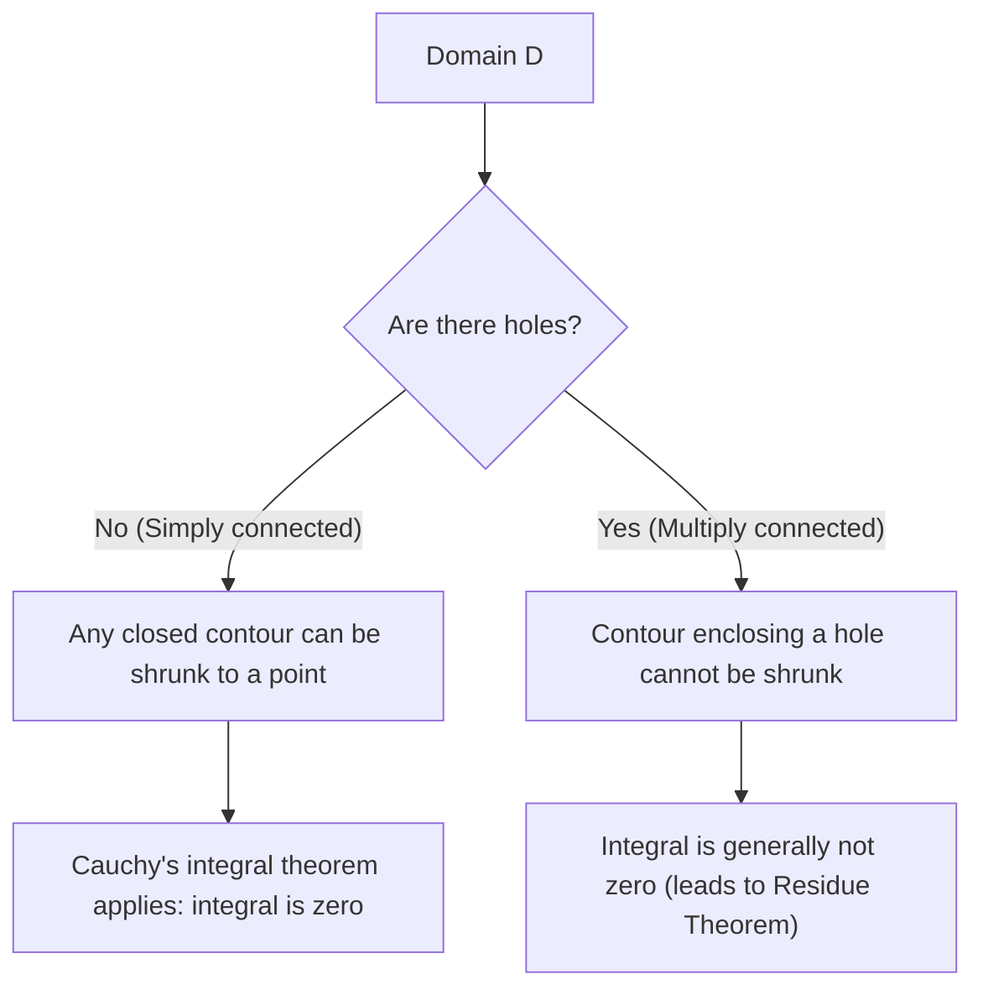

## 1. Introduction

In the field of mathematics known as complex analysis, one of the most beautiful and powerful theorems is **[Cauchy](https://kenji.blog/en/p/cauchy/)'s integral theorem**. This theorem asserts what at first glance seems to be a highly surprising fact: "Integrating a complex function that satisfies certain conditions along a closed contour will always yield exactly zero."

From the experience of learning the integration of real functions, integration is naturally thought of as representing "area" or "accumulation along a path," so if you integrate over a long distance along a path, it seems natural that some value would remain. However, on the complex plane, when a function possesses the special property of being **holomorphic**, an astonishing symmetry emerges where the result of the integration becomes completely independent of the path taken, skipping over differences in paths.

In this article, we will explain [Cauchy](https://kenji.blog/en/p/cauchy/)'s integral theorem in great detail, starting from the foundational definitions of the complex plane and holomorphic functions, moving through the intuitive meaning of the theorem, its physical interpretation, and a sketch of its classical proof using Green's theorem. Furthermore, we will touch upon how this theorem connects to more advanced topics in complex analysis, such as [Cauchy](https://kenji.blog/en/p/cauchy/)'s integral formula and the [Residue Theorem](https://kenji.blog/en/p/residue-theorem/). Let us appreciate the profound depth of this theorem from both a mathematical rigor and intuitive imagery perspective.

## 2. Foundations of the Complex Plane and Holomorphic Functions

To deeply understand [Cauchy](https://kenji.blog/en/p/cauchy/)'s integral theorem, we must first solidify our understanding of the basics of the complex plane and the differentiation of complex functions. The understanding here forms an important foundation for the proofs and interpretations of the theorems that follow.

### Functions on the Complex Plane

A complex function $f(z)$ is a function that maps a complex number $z = x + iy$ to another complex number $w = u + iv$. Here, $x, y$ are real numbers, $i$ is the imaginary unit ($i^2 = -1$), and $u, v$ are real-valued functions depending on $x, y$ respectively. Therefore, a complex function can be represented as a combination of two real-valued functions of two real variables as follows:

$$
f(z) = u(x, y) + i v(x, y)
$$

For example, for the function $f(z) = z^2$, substituting $z = x + iy$ and expanding gives $z^2 = (x + iy)^2 = x^2 - y^2 + 2ixy$. Thus, in this case, we can see that it is composed of the real-valued functions $u(x, y) = x^2 - y^2$ and $v(x, y) = 2xy$.

### Complex Differentiation and the [Cauchy](https://kenji.blog/en/p/cauchy/)-[Riemann](https://kenji.blog/en/p/riemann/) Equations

A complex function $f(z)$ is said to be **differentiable** at a point $z_0$ if the following limit exists:

$$
f'(z_0) = \lim_{\Delta z \to 0} \frac{f(z_0 + \Delta z) - f(z_0)}{\Delta z}
$$

What is extremely important here is that this limit must converge to exactly the same value regardless of "from which direction" $\Delta z$ approaches zero on the complex plane. In the world of real numbers, there were only two ways: approaching from the right or from the left, but in the complex plane, there are infinite ways to approach. Because of this strict condition, properties that are far stronger than the differentiation of real functions are derived.

When a function $f(z)$ is differentiable at all points within a certain domain, the function is said to be **holomorphic** in that domain. It is known that a necessary and sufficient condition for being holomorphic is that the real part $u$ and imaginary part $v$ satisfy the following partial differential equations. These are called the **[Cauchy](https://kenji.blog/en/p/cauchy/)-[Riemann](https://kenji.blog/en/p/riemann/) equations**.

$$
\frac{\partial u}{\partial x} = \frac{\partial v}{\partial y}, \quad \frac{\partial u}{\partial y} = -\frac{\partial v}{\partial x}
$$

Furthermore, if $u$ and $v$ have continuous partial derivatives, the holding of these equations is equivalent to $f(z)$ being holomorphic. These relational equations, which possess a beautiful symmetry, play a crucial role in the proof of [Cauchy](https://kenji.blog/en/p/cauchy/)'s integral theorem described later.

## 3. Definition and Properties of Complex Integration

Next, we define line integration on the complex plane. Since [Cauchy](https://kenji.blog/en/p/cauchy/)'s integral theorem is a theorem about integration along a "curve" on the complex plane, it is essential to clarify the definition of this integration.

Suppose a smooth curve $C$ on the complex plane is parameterized using a real variable $t \in [a, b]$ as $z(t) = x(t) + i y(t)$. The line integral of the complex function $f(z)$ along this curve $C$ is defined as follows:

$$
\int_C f(z) dz = \int_a^b f(z(t)) z'(t) dt
$$

Here, $z'(t) = \frac{dx}{dt} + i \frac{dy}{dt}$, and by performing the formal substitution $dz = dx + i dy$, the calculation can ultimately be reduced to the integration of real variables.

Complex integration possesses fundamental properties similar to the line integration of real functions, such as:

1. **Linearity** : For any complex constants $\alpha, \beta$, it holds that $\int_C (\alpha f(z) + \beta g(z)) dz = \alpha \int_C f(z) dz + \beta \int_C g(z) dz$.
2. **Path Reversal** : If the direction of the curve $C$ (the direction of progress from start point to end point) is reversed and denoted as $-C$, then $\int_{-C} f(z) dz = -\int_C f(z) dz$. Running the integration path in reverse flips the sign.
3. **Splitting and Combining Paths** : When a curve $C$ can be split at an intermediate point into $C_1$ and $C_2$, the overall integral is expressed as the sum of the partial integrals. That is, $\int_C f(z) dz = \int_{C_1} f(z) dz + \int_{C_2} f(z) dz$.

These properties, while seemingly obvious, become very powerful tools when we later advance our arguments by variously deforming the paths.

## 4. Formulation of [Cauchy](https://kenji.blog/en/p/cauchy/)'s Integral Theorem

Now that our preparations are complete, we finally state the exact formulation of the main subject, [Cauchy](https://kenji.blog/en/p/cauchy/)'s integral theorem.

**Theorem ([Cauchy](https://kenji.blog/en/p/cauchy/)'s Integral Theorem)**
For a complex function $f(z)$ that is holomorphic on a simply connected domain $D$, and for any simple closed contour $C$ within $D$, the following equality holds.

$$
\oint_C f(z) dz = 0
$$

Let us supplement this with some important terminology that appears as prerequisite conditions of the theorem.

- **Simply connected domain** : Intuitively speaking, this refers to a domain "without holes." Expressed with mathematical rigor, it refers to a domain where any closed curve within it can be continuously deformed and shrunk to a single point without ever leaving the domain.
- **Simple closed contour** : This is a curve where the start point and end point coincide (closed curve) and it does not intersect itself along the way (simple). Also known as a "Jordan curve," it is known to divide the plane into two parts: an "inside" and an "outside" (Jordan curve theorem).

The diagram below visually shows the difference in the behavior of closed curves in simply connected domains versus multiply connected domains (domains with holes).

## 5. Intuitive Understanding and Physical Interpretation of the Theorem

Why does the integral of a holomorphic function over a closed contour always become zero? To intuitively understand this, rather than just as a sequence of mathematical formulas, let's break the complex integral down into its real and imaginary parts.

Let $f(z) = u + iv$ and $dz = dx + i dy$. The integral can then be expanded as follows:

$$
\oint_C f(z) dz = \oint_C (u + iv)(dx + idy) = \oint_C (u dx - v dy) + i \oint_C (v dx + u dy)
$$

Notice the right side of this equation. Two real integrals have appeared, and they have exactly the same form as the line integrals of vector fields on a 2D plane. Specifically, the real part can be interpreted as the line integral of a vector field $\vec{F}_1 = (u, -v)$, and the imaginary part as the line integral of a vector field $\vec{F}_2 = (v, u)$.

Considered in the context of physics (especially fluid dynamics or electromagnetism), the line integral of a vector field along a closed contour represents the "circulation" of that field. If a vector field is both "irrotational" and "incompressible," then no matter what closed curve you compute the circulation along, the result will be zero.

Recall the [Cauchy](https://kenji.blog/en/p/cauchy/)-[Riemann](https://kenji.blog/en/p/riemann/) equations we learned earlier: $\frac{\partial u}{\partial y} = -\frac{\partial v}{\partial x}$. This is exactly the condition that guarantees the vector fields $\vec{F}_1$ and $\vec{F}_2$ are "irrotational." Similarly, the other equation $\frac{\partial u}{\partial x} = \frac{\partial v}{\partial y}$ guarantees they are "incompressible."

In other words, the condition of being a holomorphic function means forming vector fields that are very "well-behaved" (no vortices, no sources or sinks) from a physical perspective, and as a result, the integral over a closed loop necessarily becomes zero. This is the physical and intuitive meaning behind [Cauchy](https://kenji.blog/en/p/cauchy/)'s integral theorem.

## 6. Sketch of a Rigorous Proof Using Green's Theorem

Here, as a classical and intuitive proof of [Cauchy](https://kenji.blog/en/p/cauchy/)'s integral theorem, we introduce a method utilizing **Green's theorem** from calculus. (Note: This proof assumes that the partial derivatives are continuous, i.e., $f'(z)$ is continuous.)

Green's theorem is a powerful theorem that converts a line integral along a closed curve on a plane into a double integral over the domain $D'$ enclosed by that curve.

**Green's Theorem**
$$
\oint_{\partial D'} (P dx + Q dy) = \iint_{D'} \left( \frac{\partial Q}{\partial x} - \frac{\partial P}{\partial y} \right) dx dy
$$

Let's apply this Green's theorem to the real part of the decomposed complex integral from earlier. Here we let $P = u, Q = -v$.

$$
\oint_C (u dx - v dy) = \iint_{D'} \left( \frac{\partial (-v)}{\partial x} - \frac{\partial u}{\partial y} \right) dx dy
$$

Now, we substitute the [Cauchy](https://kenji.blog/en/p/cauchy/)-[Riemann](https://kenji.blog/en/p/riemann/) equation $\frac{\partial u}{\partial y} = -\frac{\partial v}{\partial x}$, which is a property of holomorphic functions. Then, the integrand becomes as follows:

$$
-\frac{\partial v}{\partial x} - \left( -\frac{\partial v}{\partial x} \right) = 0
$$

Since the integrand becomes $0$ at all points within the domain, the entire double integral becomes zero, proving that the real part's line integral is zero.

Through completely the same procedure, we apply Green's theorem to the imaginary part $i \oint_C (v dx + u dy)$. Here $P = v, Q = u$.

$$
\oint_C (v dx + u dy) = \iint_{D'} \left( \frac{\partial u}{\partial x} - \frac{\partial v}{\partial y} \right) dx dy
$$

Again, substituting the other [Cauchy](https://kenji.blog/en/p/cauchy/)-[Riemann](https://kenji.blog/en/p/riemann/) equation $\frac{\partial u}{\partial x} = \frac{\partial v}{\partial y}$, the integrand becomes $\frac{\partial v}{\partial y} - \frac{\partial v}{\partial y} = 0$, and the imaginary part's integral also becomes zero.

In conclusion, since both the real and imaginary parts become zero, the following holds:

$$
\oint_C f(z) dz = 0 + i0 = 0
$$

This is the skeleton of the proof for [Cauchy](https://kenji.blog/en/p/cauchy/)'s integral theorem. We can see that by the [Cauchy](https://kenji.blog/en/p/cauchy/)-[Riemann](https://kenji.blog/en/p/riemann/) equations and Green's theorem beautifully meshing together, the proof can be accomplished surprisingly simply.

## 7. Goursat's Theorem: Removing the Assumption of Continuous Differentiability

The proof using Green's theorem above is very easy to understand and intuitive, but mathematically it has one weakness. That is, it implicitly uses the assumption that "$f'(z)$ is continuous" (i.e., the assumption that the partial derivatives of $u, v$ are continuous). [Cauchy](https://kenji.blog/en/p/cauchy/)'s initial proof also relied on this assumption.

However, at the end of the 19th century, the French mathematician Édouard Goursat proved that this assumption of continuity is actually unnecessary. That is, he showed that [Cauchy](https://kenji.blog/en/p/cauchy/)'s integral theorem holds true simply by the function being "differentiable (holomorphic) at each point."

Goursat's proof employs an ingenious method of dividing the domain into small triangles and using proof by contradiction to derive a contradiction (the method of triangulation). In modern complex analysis textbooks, this result is generally introduced as the "[Cauchy](https://kenji.blog/en/p/cauchy/)-Goursat theorem." This result highlighted once again that the condition of being "complex differentiable even once" is a far stronger constraint (resulting in being infinitely differentiable) than one could compare with the case of real functions.

## 8. Path Deformation and Path Independence

One of the extremely important consequences of [Cauchy](https://kenji.blog/en/p/cauchy/)'s integral theorem is the **path independence of integrals**.

Suppose there are two points $A$ and $B$ within a simply connected domain $D$, and there are two different paths $C_1$ and $C_2$ connecting them. At this time, if the function $f(z)$ is holomorphic within $D$, the following holds:

$$
\int_{C_1} f(z) dz = \int_{C_2} f(z) dz
$$

The proof is very simple. Consider a path that goes to $B$ via $C_1$, and returns to $A$ via the reverse path $-C_2$. This forms a single closed curve $C = C_1 + (-C_2)$. By [Cauchy](https://kenji.blog/en/p/cauchy/)'s integral theorem, the integral along this closed curve is zero.

$$
\oint_C f(z) dz = \int_{C_1} f(z) dz + \int_{-C_2} f(z) dz = \int_{C_1} f(z) dz - \int_{C_2} f(z) dz = 0
$$

By transposing this, we obtain $\int_{C_1} f(z) dz = \int_{C_2} f(z) dz$.

Because of this property, the integration of a holomorphic function does not depend on "what route was taken," but is determined "only by the start and end points." This makes it possible to uniquely define an antiderivative (indefinite integral) $F(z)$ even on the complex plane (up to a constant of integration), guaranteeing that the "Fundamental Theorem of Calculus" for real functions also holds beautifully on the complex plane.

## 9. Application: [Cauchy](https://kenji.blog/en/p/cauchy/)'s Integral Formula and Extension to Multiply Connected Domains

[Cauchy](https://kenji.blog/en/p/cauchy/)'s integral theorem is a beautiful theorem on its own, but it serves as a powerful foundation for successively deriving other important theorems in complex analysis.

### [Cauchy](https://kenji.blog/en/p/cauchy/)'s Integral Formula

The most direct and widely applicable consequence of the theorem is **[Cauchy](https://kenji.blog/en/p/cauchy/)'s integral formula**. When a function $f(z)$ is holomorphic in a domain $D$, for a simple closed curve $C$ within $D$ and any point $a$ inside it, the following holds:

$$
f(a) = \frac{1}{2\pi i} \oint_C \frac{f(z)}{z - a} dz
$$

This formula shows the astonishing rigidity of holomorphic functions: "As long as the values of the function on the boundary of the closed curve are known, the value of the function at every point inside the domain is completely determined by integral calculation."

### Multiply Connected Domains and the [Residue Theorem](https://kenji.blog/en/p/residue-theorem/)

If the domain has "holes" and is not simply connected (multiply connected domain), [Cauchy](https://kenji.blog/en/p/cauchy/)'s integral theorem cannot be applied as is. For example, the function $f(z) = 1/z$ is not defined at the origin $z=0$ and is not holomorphic there. If we integrate along the unit circle enclosing the origin, the result is not zero, but the value $2\pi i$.

However, by ingeniously applying [Cauchy](https://kenji.blog/en/p/cauchy/)'s integral theorem and deforming the integration path, a systematic method for evaluating integrals around holes was established. This leads to the **[Residue Theorem](https://kenji.blog/en/p/residue-theorem/)**, one of the most practical tools in modern complex analysis. By using the [Residue Theorem](https://kenji.blog/en/p/residue-theorem/), complex definite integrals and infinite integrals of real functions can be brilliantly replaced with algebraic calculations on the complex plane and solved.

## 10. Conclusion

At first glance, [Cauchy](https://kenji.blog/en/p/cauchy/)'s integral theorem might look like a modest theorem that simply says "the integral becomes zero." However, hidden behind it is a profound and beautiful symmetry brought about by the seemingly simple condition of the "holomorphy" of complex functions.

Starting from this theorem, glorious achievements of complex analysis such as [Cauchy](https://kenji.blog/en/p/cauchy/)'s integral formula, the proof that a function is infinitely differentiable (guaranteeing Taylor expansions and Laurent expansions), and the [Residue Theorem](https://kenji.blog/en/p/residue-theorem/) are successively derived. [Cauchy](https://kenji.blog/en/p/cauchy/)'s integral theorem can truly be said to be the most robust and beautiful foundation that supports the magnificent mathematical edifice of complex analysis from its roots.

We encourage readers to pick up a paper and pen and trace the proof using Green's theorem with your own hands. You should be able to surely feel the beautifully harmonious world of the complex plane spreading out behind the mathematical formulas.
