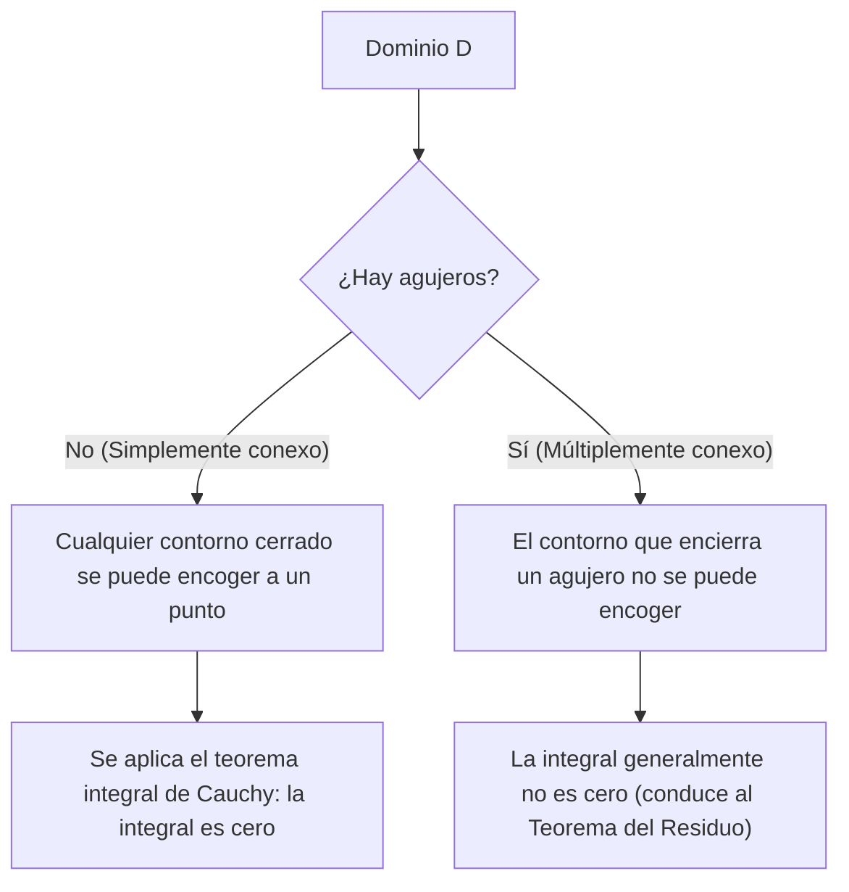

## 1. Introducción

En el campo de las matemáticas conocido como análisis complejo, uno de los teoremas más hermosos y poderosos es el **Teorema integral de [Cauchy](https://kenji.blog/es/p/cauchy/)**. Este teorema afirma lo que a primera vista parece ser un hecho sumamente sorprendente: "Integrar una función compleja que satisface ciertas condiciones a lo largo de un contorno cerrado siempre dará exactamente cero."

Por la experiencia de aprender la integración de funciones reales, naturalmente se piensa que la integración representa un "área" o "acumulación a lo largo de un camino", por lo que si se integra sobre una larga distancia a lo largo de un camino, parece natural que quede algún valor. Sin embargo, en el plano complejo, cuando una función posee la propiedad especial de ser **holomorfa**, surge una simetría asombrosa en la que el resultado de la integración se vuelve completamente independiente del camino recorrido, omitiendo las diferencias en las trayectorias.

En este artículo, explicaremos el teorema integral de [Cauchy](https://kenji.blog/es/p/cauchy/) con gran detalle, comenzando por las definiciones fundamentales del plano complejo y las funciones holomorfas, pasando por el significado intuitivo del teorema, su interpretación física y un esbozo de su prueba clásica utilizando el teorema de Green. Además, mencionaremos cómo este teorema se conecta con temas más avanzados del análisis complejo, como la fórmula integral de [Cauchy](https://kenji.blog/es/p/cauchy/) y el Teorema del Residuo. Apreciemos la profunda belleza de este teorema tanto desde la perspectiva del rigor matemático como desde una imaginería intuitiva.

## 2. Fundamentos del Plano Complejo y las Funciones Holomorfas

Para comprender profundamente el teorema integral de [Cauchy](https://kenji.blog/es/p/cauchy/), primero debemos consolidar nuestra comprensión de los conceptos básicos del plano complejo y la diferenciación de funciones complejas. La comprensión aquí forma una base importante para las pruebas e interpretaciones de los teoremas que siguen.

### Funciones en el Plano Complejo

Una función compleja $f(z)$ es una función que mapea un número complejo $z = x + iy$ a otro número complejo $w = u + iv$. Aquí, $x, y$ son números reales, $i$ es la unidad imaginaria ($i^2 = -1$), y $u, v$ son funciones de valor real que dependen de $x, y$ respectivamente. Por lo tanto, una función compleja puede representarse como una combinación de dos funciones de valor real de dos variables reales de la siguiente manera:

$$
f(z) = u(x, y) + i v(x, y)
$$

Por ejemplo, para la función $f(z) = z^2$, sustituyendo $z = x + iy$ y expandiendo obtenemos $z^2 = (x + iy)^2 = x^2 - y^2 + 2ixy$. Así, en este caso, podemos ver que está compuesta por las funciones de valor real $u(x, y) = x^2 - y^2$ y $v(x, y) = 2xy$.

### Diferenciación Compleja y las Ecuaciones de [Cauchy](https://kenji.blog/es/p/cauchy/)-[Riemann](https://kenji.blog/es/p/riemann/)

Se dice que una función compleja $f(z)$ es **diferenciable** en un punto $z_0$ si el siguiente límite existe:

$$
f'(z_0) = \lim_{\Delta z \to 0} \frac{f(z_0 + \Delta z) - f(z_0)}{\Delta z}
$$

Lo que es extremadamente importante aquí es que este límite debe converger exactamente al mismo valor sin importar "desde qué dirección" $\Delta z$ se acerque a cero en el plano complejo. En el mundo de los números reales, solo había dos formas: acercarse desde la derecha o desde la izquierda, pero en el plano complejo, hay infinitas formas de acercarse. Debido a esta estricta condición, se derivan propiedades que son mucho más fuertes que las de la diferenciación de funciones reales.

Cuando una función $f(z)$ es diferenciable en todos los puntos dentro de un cierto dominio, se dice que la función es **holomorfa** en ese dominio. Se sabe que una condición necesaria y suficiente para ser holomorfa es que la parte real $u$ y la parte imaginaria $v$ satisfagan las siguientes ecuaciones diferenciales parciales. A estas se les llama **Ecuaciones de [Cauchy](https://kenji.blog/es/p/cauchy/)-[Riemann](https://kenji.blog/es/p/riemann/)**.

$$
\frac{\partial u}{\partial x} = \frac{\partial v}{\partial y}, \quad \frac{\partial u}{\partial y} = -\frac{\partial v}{\partial x}
$$

Además, si $u$ y $v$ tienen derivadas parciales continuas, el cumplimiento de estas ecuaciones es equivalente a que $f(z)$ sea holomorfa. Estas ecuaciones relacionales, que poseen una hermosa simetría, juegan un papel crucial en la prueba del teorema integral de [Cauchy](https://kenji.blog/es/p/cauchy/) que se describirá más adelante.

## 3. Definición y Propiedades de la Integración Compleja

A continuación, definimos la integración de línea en el plano complejo. Dado que el teorema integral de [Cauchy](https://kenji.blog/es/p/cauchy/) es un teorema sobre la integración a lo largo de una "curva" en el plano complejo, es esencial aclarar la definición de esta integración.

Supongamos que una curva suave $C$ en el plano complejo está parametrizada usando una variable real $t \in [a, b]$ como $z(t) = x(t) + i y(t)$. La integral de línea de la función compleja $f(z)$ a lo largo de esta curva $C$ se define de la siguiente manera:

$$
\int_C f(z) dz = \int_a^b f(z(t)) z'(t) dt
$$

Aquí, $z'(t) = \frac{dx}{dt} + i \frac{dy}{dt}$, y al realizar la sustitución formal $dz = dx + i dy$, el cálculo finalmente puede reducirse a la integración de variables reales.

La integración compleja posee propiedades fundamentales similares a la integración de línea de funciones reales, tales como:

1. **Linealidad** : Para cualesquiera constantes complejas $\alpha, \beta$, se cumple que $\int_C (\alpha f(z) + \beta g(z)) dz = \alpha \int_C f(z) dz + \beta \int_C g(z) dz$.
2. **Inversión de Trayectoria** : Si se invierte la dirección de la curva $C$ (la dirección de avance desde el punto de inicio hasta el punto final) y se denota como $-C$, entonces $\int_{-C} f(z) dz = -\int_C f(z) dz$. Recorrer la ruta de integración a la inversa cambia el signo.
3. **División y Combinación de Trayectorias** : Cuando una curva $C$ se puede dividir en un punto intermedio en $C_1$ y $C_2$, la integral general se expresa como la suma de las integrales parciales. Es decir, $\int_C f(z) dz = \int_{C_1} f(z) dz + \int_{C_2} f(z) dz$.

Estas propiedades, aunque parezcan obvias, se convierten en herramientas muy poderosas cuando más tarde avanzamos en nuestros argumentos deformando de diversas maneras las trayectorias.

## 4. Formulación del Teorema Integral de [Cauchy](https://kenji.blog/es/p/cauchy/)

Una vez completados los preparativos, finalmente establecemos la formulación exacta del tema principal, el teorema integral de [Cauchy](https://kenji.blog/es/p/cauchy/).

**Teorema (Teorema Integral de [Cauchy](https://kenji.blog/es/p/cauchy/))**
Para una función compleja $f(z)$ que es holomorfa en un dominio simplemente conexo $D$, y para cualquier contorno cerrado simple $C$ dentro de $D$, se cumple la siguiente igualdad.

$$
\oint_C f(z) dz = 0
$$

Complementemos esto con algunos términos importantes que aparecen como condiciones previas del teorema.

- **Dominio simplemente conexo** : Intuitivamente hablando, esto se refiere a un dominio "sin agujeros". Expresado con rigor matemático, se refiere a un dominio donde cualquier curva cerrada dentro de él puede deformarse de forma continua y encogerse hasta un solo punto sin abandonar nunca el dominio.
- **Contorno cerrado simple** : Esta es una curva donde el punto de inicio y el punto final coinciden (curva cerrada) y no se cruza a sí misma a lo largo del camino (simple). También conocida como "curva de Jordan", se sabe que divide el plano en dos partes: un "interior" y un "exterior" (teorema de la curva de Jordan).

El siguiente diagrama muestra visualmente la diferencia en el comportamiento de las curvas cerradas en dominios simplemente conexos frente a dominios múltiplemente conexos (dominios con agujeros).

## 5. Comprensión Intuitiva e Interpretación Física del Teorema

¿Por qué la integral de una función holomorfa sobre un contorno cerrado siempre se vuelve cero? Para entender esto intuitivamente, en lugar de solo como una secuencia de fórmulas matemáticas, descompongamos la integral compleja en sus partes real e imaginaria.

Sea $f(z) = u + iv$ y $dz = dx + i dy$. La integral entonces puede expandirse de la siguiente manera:

$$
\oint_C f(z) dz = \oint_C (u + iv)(dx + idy) = \oint_C (u dx - v dy) + i \oint_C (v dx + u dy)
$$

Note el lado derecho de esta ecuación. Han aparecido dos integrales reales, y tienen exactamente la misma forma que las integrales de línea de campos vectoriales en un plano 2D. Específicamente, la parte real puede interpretarse como la integral de línea de un campo vectorial $\vec{F}_1 = (u, -v)$, y la parte imaginaria como la integral de línea de un campo vectorial $\vec{F}_2 = (v, u)$.

Considerado en el contexto de la física (especialmente en dinámica de fluidos o electromagnetismo), la integral de línea de un campo vectorial a lo largo de un contorno cerrado representa la "circulación" de ese campo. Si un campo vectorial es tanto "irrotacional" como "incompresible", entonces no importa a lo largo de qué curva cerrada calcule la circulación, el resultado será cero.

Recuerde las ecuaciones de [Cauchy](https://kenji.blog/es/p/cauchy/)-[Riemann](https://kenji.blog/es/p/riemann/) que aprendimos antes: $\frac{\partial u}{\partial y} = -\frac{\partial v}{\partial x}$. Esta es exactamente la condición que garantiza que los campos vectoriales $\vec{F}_1$ y $\vec{F}_2$ sean "irrotacionales". De manera similar, la otra ecuación $\frac{\partial u}{\partial x} = \frac{\partial v}{\partial y}$ garantiza que sean "incompresibles".

En otras palabras, la condición de ser una función holomorfa significa formar campos vectoriales que se comportan muy "bien" (sin vórtices, sin fuentes o sumideros) desde una perspectiva física, y como resultado, la integral sobre un bucle cerrado se vuelve necesariamente cero. Este es el significado físico e intuitivo detrás del teorema integral de [Cauchy](https://kenji.blog/es/p/cauchy/).

## 6. Esbozo de una Prueba Rigurosa Usando el Teorema de Green

Aquí, como una prueba clásica e intuitiva del teorema integral de [Cauchy](https://kenji.blog/es/p/cauchy/), introducimos un método que utiliza el **Teorema de Green** del cálculo. (Nota: Esta prueba asume que las derivadas parciales son continuas, es decir, $f'(z)$ es continua).

El teorema de Green es un poderoso teorema que convierte una integral de línea a lo largo de una curva cerrada en un plano en una integral doble sobre el dominio $D'$ encerrado por esa curva.

**Teorema de Green**
$$
\oint_{\partial D'} (P dx + Q dy) = \iint_{D'} \left( \frac{\partial Q}{\partial x} - \frac{\partial P}{\partial y} \right) dx dy
$$

Apliquemos este teorema de Green a la parte real de la integral compleja descompuesta de antes. Aquí dejamos que $P = u, Q = -v$.

$$
\oint_C (u dx - v dy) = \iint_{D'} \left( \frac{\partial (-v)}{\partial x} - \frac{\partial u}{\partial y} \right) dx dy
$$

Ahora, sustituimos la ecuación de [Cauchy](https://kenji.blog/es/p/cauchy/)-[Riemann](https://kenji.blog/es/p/riemann/) $\frac{\partial u}{\partial y} = -\frac{\partial v}{\partial x}$, que es una propiedad de las funciones holomorfas. Entonces, el integrando se vuelve el siguiente:

$$
-\frac{\partial v}{\partial x} - \left( -\frac{\partial v}{\partial x} \right) = 0
$$

Dado que el integrando se vuelve $0$ en todos los puntos dentro del dominio, toda la integral doble se vuelve cero, demostrando que la integral de línea de la parte real es cero.

Siguiendo exactamente el mismo procedimiento, aplicamos el teorema de Green a la parte imaginaria $i \oint_C (v dx + u dy)$. Aquí $P = v, Q = u$.

$$
\oint_C (v dx + u dy) = \iint_{D'} \left( \frac{\partial u}{\partial x} - \frac{\partial v}{\partial y} \right) dx dy
$$

Nuevamente, sustituyendo la otra ecuación de [Cauchy](https://kenji.blog/es/p/cauchy/)-[Riemann](https://kenji.blog/es/p/riemann/) $\frac{\partial u}{\partial x} = \frac{\partial v}{\partial y}$, el integrando se convierte en $\frac{\partial v}{\partial y} - \frac{\partial v}{\partial y} = 0$, y la integral de la parte imaginaria también se vuelve cero.

En conclusión, dado que tanto la parte real como la imaginaria se vuelven cero, se cumple lo siguiente:

$$
\oint_C f(z) dz = 0 + i0 = 0
$$

Este es el esqueleto de la prueba para el teorema integral de [Cauchy](https://kenji.blog/es/p/cauchy/). Podemos ver que al engranarse bellamente las ecuaciones de Cauchy-[Riemann](https://kenji.blog/es/p/riemann/) y el teorema de Green, la prueba se puede lograr de una manera sorprendentemente simple.

## 7. Teorema de Goursat: Eliminando la Suposición de Diferenciabilidad Continua

La prueba que usa el teorema de Green anterior es muy fácil de entender e intuitiva, pero matemáticamente tiene una debilidad. Esa es, que usa implícitamente la suposición de que "$f'(z)$ es continua" (es decir, la suposición de que las derivadas parciales de $u, v$ son continuas). La prueba inicial de [Cauchy](https://kenji.blog/es/p/cauchy/) también se basó en esta suposición.

Sin embargo, a fines del siglo XIX, el matemático francés Édouard Goursat demostró que esta suposición de continuidad es en realidad innecesaria. Es decir, demostró que el teorema integral de [Cauchy](https://kenji.blog/es/p/cauchy/) se cumple simplemente porque la función es "diferenciable (holomorfa) en cada punto".

La prueba de Goursat emplea un ingenioso método para dividir el dominio en pequeños triángulos y usar la prueba por contradicción para derivar una contradicción (el método de triangulación). En los libros de texto modernos de análisis complejo, este resultado se introduce generalmente como el "teorema de [Cauchy](https://kenji.blog/es/p/cauchy/)-Goursat". Este resultado destacó una vez más que la condición de ser "compleja diferenciable incluso una vez" es una restricción mucho más fuerte (que resulta en ser infinitamente diferenciable) de lo que uno podría comparar con el caso de las funciones reales.

## 8. Deformación de Trayectorias e Independencia de la Trayectoria

Una de las consecuencias extremadamente importantes del teorema integral de [Cauchy](https://kenji.blog/es/p/cauchy/) es la **independencia de la trayectoria de las integrales**.

Supongamos que hay dos puntos $A$ y $B$ dentro de un dominio simplemente conexo $D$, y hay dos caminos diferentes $C_1$ y $C_2$ conectándolos. En este momento, si la función $f(z)$ es holomorfa dentro de $D$, se cumple lo siguiente:

$$
\int_{C_1} f(z) dz = \int_{C_2} f(z) dz
$$

La prueba es muy simple. Considere un camino que va a $B$ a través de $C_1$, y regresa a $A$ a través del camino inverso $-C_2$. Esto forma una sola curva cerrada $C = C_1 + (-C_2)$. Por el teorema integral de [Cauchy](https://kenji.blog/es/p/cauchy/), la integral a lo largo de esta curva cerrada es cero.

$$
\oint_C f(z) dz = \int_{C_1} f(z) dz + \int_{-C_2} f(z) dz = \int_{C_1} f(z) dz - \int_{C_2} f(z) dz = 0
$$

Transponiendo esto, obtenemos $\int_{C_1} f(z) dz = \int_{C_2} f(z) dz$.

Debido a esta propiedad, la integración de una función holomorfa no depende de "qué ruta se tomó", sino que está determinada "solo por los puntos de inicio y final". Esto hace posible definir unívocamente una antiderivada (integral indefinida) $F(z)$ incluso en el plano complejo (salvo una constante de integración), garantizando que el "Teorema Fundamental del Cálculo" para funciones reales también se cumpla maravillosamente en el plano complejo.

## 9. Aplicación: Fórmula Integral de [Cauchy](https://kenji.blog/es/p/cauchy/) y Extensión a Dominios Múltiplemente Conexos

El teorema integral de [Cauchy](https://kenji.blog/es/p/cauchy/) es un teorema hermoso por sí solo, pero sirve como una poderosa base para derivar sucesivamente otros teoremas importantes en el análisis complejo.

### Fórmula Integral de [Cauchy](https://kenji.blog/es/p/cauchy/)

La consecuencia más directa y de más amplia aplicación del teorema es la **fórmula integral de [Cauchy](https://kenji.blog/es/p/cauchy/)**. Cuando una función $f(z)$ es holomorfa en un dominio $D$, para una curva cerrada simple $C$ dentro de $D$ y cualquier punto $a$ dentro de ella, se cumple lo siguiente:

$$
f(a) = \frac{1}{2\pi i} \oint_C \frac{f(z)}{z - a} dz
$$

Esta fórmula muestra la asombrosa rigidez de las funciones holomorfas: "Siempre que se conozcan los valores de la función en el límite de la curva cerrada, el valor de la función en cada punto dentro del dominio está completamente determinado por el cálculo integral".

### Dominios Múltiplemente Conexos y el Teorema del Residuo

Si el dominio tiene "agujeros" y no es simplemente conexo (dominio múltiplemente conexo), el teorema integral de [Cauchy](https://kenji.blog/es/p/cauchy/) no se puede aplicar tal cual. Por ejemplo, la función $f(z) = 1/z$ no está definida en el origen $z=0$ y no es holomorfa allí. Si integramos a lo largo del círculo unitario que encierra el origen, el resultado no es cero, sino el valor $2\pi i$.

Sin embargo, al aplicar ingeniosamente el teorema integral de [Cauchy](https://kenji.blog/es/p/cauchy/) y deformar el camino de integración, se estableció un método sistemático para evaluar integrales alrededor de agujeros. Esto conduce al **Teorema del Residuo**, una de las herramientas más prácticas en el análisis complejo moderno. Mediante el uso del Teorema del Residuo, las integrales definidas complejas e integrales infinitas de funciones reales pueden ser reemplazadas de forma brillante por cálculos algebraicos en el plano complejo y resueltas.

## 10. Conclusión

A primera vista, el teorema integral de [Cauchy](https://kenji.blog/es/p/cauchy/) puede parecer un modesto teorema que simplemente dice "la integral se vuelve cero". Sin embargo, oculto detrás de él hay una profunda y hermosa simetría provocada por la condición aparentemente simple de la "holomorfia" de las funciones complejas.

A partir de este teorema, se derivan sucesivamente logros gloriosos del análisis complejo como la fórmula integral de [Cauchy](https://kenji.blog/es/p/cauchy/), la prueba de que una función es infinitamente diferenciable (garantizando las expansiones de Taylor y las expansiones de Laurent), y el Teorema del Residuo. Realmente se puede decir que el teorema integral de [Cauchy](https://kenji.blog/es/p/cauchy/) es la base más sólida y hermosa que soporta el magnífico edificio matemático del análisis complejo desde sus raíces.

Alentamos a los lectores a tomar papel y lápiz y trazar la prueba usando el teorema de Green con sus propias manos. Seguramente deberían poder sentir el mundo bellamente armonioso del plano complejo que se extiende detrás de las fórmulas matemáticas.

