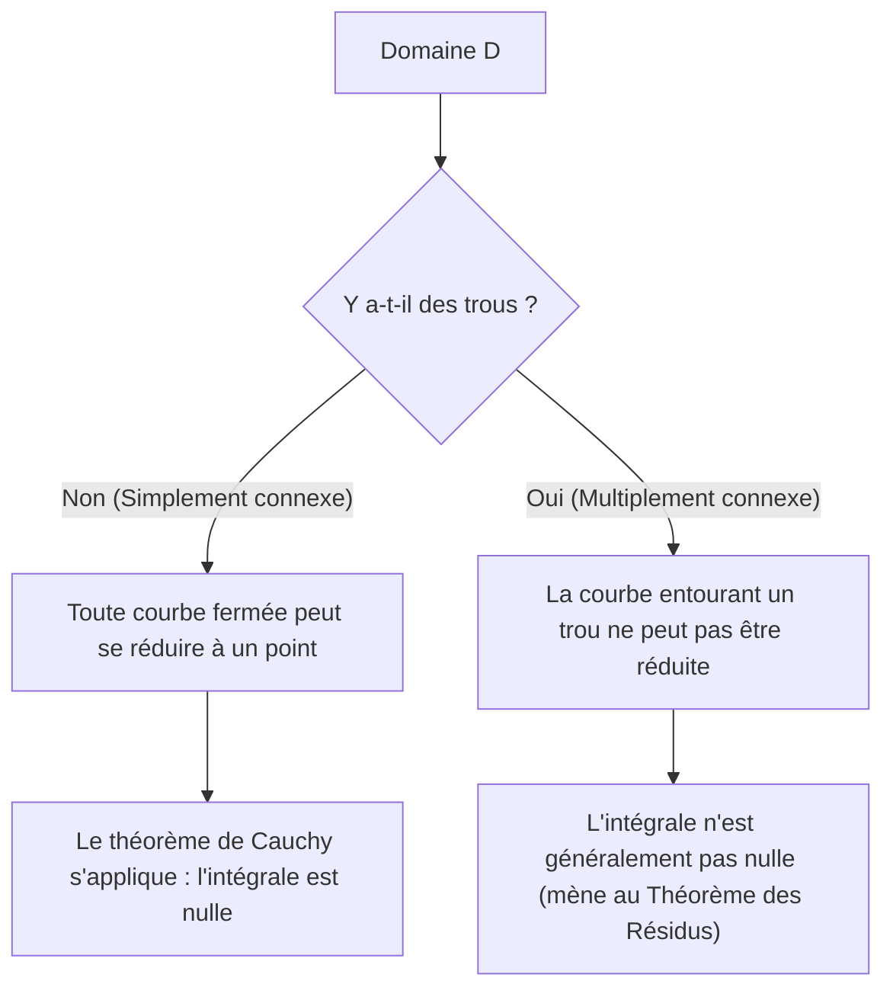

## 1. Introduction

Dans le domaine des mathématiques connu sous le nom d'analyse complexe, l'un des théorèmes les plus beaux et les plus puissants est le **théorème intégral de [Cauchy](https://kenji.blog/fr/p/cauchy/)**. Ce théorème affirme ce qui, à première vue, semble être un fait très surprenant : "L'intégration d'une fonction complexe qui satisfait à certaines conditions le long d'un contour fermé donnera toujours exactement zéro."

D'après l'expérience de l'apprentissage de l'intégration des fonctions réelles, l'intégration est naturellement considérée comme représentant une "aire" ou une "accumulation le long d'un chemin", de sorte que si l'on intègre sur une longue distance le long d'un chemin, il semble naturel qu'il reste une certaine valeur. Cependant, sur le plan complexe, lorsqu'une fonction possède la propriété spéciale d'être **holomorphe**, une symétrie étonnante émerge où le résultat de l'intégration devient complètement indépendant du chemin emprunté, sautant par-dessus les différences de chemins.

Dans cet article, nous expliquerons le théorème intégral de [Cauchy](https://kenji.blog/fr/p/cauchy/) de manière très détaillée, en partant des définitions fondamentales du plan complexe et des fonctions holomorphes, en passant par la signification intuitive du théorème, son interprétation physique et une esquisse de sa preuve classique à l'aide du théorème de Green. De plus, nous aborderons la façon dont ce théorème se connecte à des sujets plus avancés de l'analyse complexe, tels que la formule intégrale de [Cauchy](https://kenji.blog/fr/p/cauchy/) et le théorème des résidus. Apprécions la profondeur insondable de ce théorème tant du point de vue de la rigueur mathématique que de l'imagerie intuitive.

## 2. Fondements du Plan Complexe et des Fonctions Holomorphes

Pour bien comprendre le théorème intégral de [Cauchy](https://kenji.blog/fr/p/cauchy/), nous devons d'abord consolider notre compréhension des bases du plan complexe et de la dérivation des fonctions complexes. La compréhension de ces éléments constitue une base importante pour les preuves et les interprétations des théorèmes qui suivent.

### Fonctions sur le Plan Complexe

Une fonction complexe $f(z)$ est une fonction qui associe à un nombre complexe $z = x + iy$ un autre nombre complexe $w = u + iv$. Ici, $x, y$ sont des nombres réels, $i$ est l'unité imaginaire ($i^2 = -1$), et $u, v$ sont des fonctions à valeurs réelles dépendant respectivement de $x, y$. Par conséquent, une fonction complexe peut être représentée comme une combinaison de deux fonctions à valeurs réelles de deux variables réelles comme suit :

$$
f(z) = u(x, y) + i v(x, y)
$$

Par exemple, pour la fonction $f(z) = z^2$, remplacer $z = x + iy$ et développer donne $z^2 = (x + iy)^2 = x^2 - y^2 + 2ixy$. Ainsi, dans ce cas, nous pouvons voir qu'elle est composée des fonctions à valeurs réelles $u(x, y) = x^2 - y^2$ et $v(x, y) = 2xy$.

### Dérivation Complexe et les Équations de [Cauchy](https://kenji.blog/fr/p/cauchy/)-[Riemann](https://kenji.blog/fr/p/riemann/)

Une fonction complexe $f(z)$ est dite **dérivable** en un point $z_0$ si la limite suivante existe :

$$
f'(z_0) = \lim_{\Delta z \to 0} \frac{f(z_0 + \Delta z) - f(z_0)}{\Delta z}
$$

Ce qui est extrêmement important ici, c'est que cette limite doit converger vers exactement la même valeur quelle que soit la "direction depuis laquelle" $\Delta z$ s'approche de zéro sur le plan complexe. Dans le monde des nombres réels, il n'y avait que deux façons : l'approche par la droite ou par la gauche, mais dans le plan complexe, il y a des façons infinies de s'approcher. En raison de cette condition stricte, des propriétés bien plus fortes que la dérivation des fonctions réelles en sont déduites.

Lorsqu'une fonction $f(z)$ est dérivable en tous les points d'un certain domaine, on dit que la fonction est **holomorphe** dans ce domaine. Il est connu qu'une condition nécessaire et suffisante pour être holomorphe est que la partie réelle $u$ et la partie imaginaire $v$ satisfassent aux équations aux dérivées partielles suivantes. Celles-ci sont appelées les **équations de [Cauchy](https://kenji.blog/fr/p/cauchy/)-[Riemann](https://kenji.blog/fr/p/riemann/)**.

$$
\frac{\partial u}{\partial x} = \frac{\partial v}{\partial y}, \quad \frac{\partial u}{\partial y} = -\frac{\partial v}{\partial x}
$$

De plus, si $u$ et $v$ ont des dérivées partielles continues, le respect de ces équations équivaut à ce que $f(z)$ soit holomorphe. Ces équations relationnelles, qui possèdent une belle symétrie, jouent un rôle crucial dans la preuve du théorème intégral de [Cauchy](https://kenji.blog/fr/p/cauchy/) décrite plus tard.

## 3. Définition et Propriétés de l'Intégration Complexe

Ensuite, nous définissons l'intégration curviligne sur le plan complexe. Le théorème intégral de [Cauchy](https://kenji.blog/fr/p/cauchy/) étant un théorème sur l'intégration le long d'une "courbe" sur le plan complexe, il est essentiel de clarifier la définition de cette intégration.

Supposons qu'une courbe lisse $C$ sur le plan complexe soit paramétrée à l'aide d'une variable réelle $t \in [a, b]$ par $z(t) = x(t) + i y(t)$. L'intégrale curviligne de la fonction complexe $f(z)$ le long de cette courbe $C$ est définie comme suit :

$$
\int_C f(z) dz = \int_a^b f(z(t)) z'(t) dt
$$

Ici, $z'(t) = \frac{dx}{dt} + i \frac{dy}{dt}$, et en effectuant la substitution formelle $dz = dx + i dy$, le calcul peut finalement être réduit à l'intégration de variables réelles.

L'intégration complexe possède des propriétés fondamentales similaires à l'intégration curviligne des fonctions réelles, telles que :

1. **Linéarité** : Pour toutes constantes complexes $\alpha, \beta$, on a $\int_C (\alpha f(z) + \beta g(z)) dz = \alpha \int_C f(z) dz + \beta \int_C g(z) dz$.
2. **Inversion de Trajet** : Si la direction de la courbe $C$ (le sens de progression du point de départ au point d'arrivée) est inversée et notée $-C$, alors $\int_{-C} f(z) dz = -\int_C f(z) dz$. Parcourir le chemin d'intégration en sens inverse change le signe.
3. **Division et Combinaison de Trajets** : Lorsqu'une courbe $C$ peut être divisée en un point intermédiaire en $C_1$ et $C_2$, l'intégrale globale est exprimée comme la somme des intégrales partielles. C'est-à-dire, $\int_C f(z) dz = \int_{C_1} f(z) dz + \int_{C_2} f(z) dz$.

Ces propriétés, bien qu'apparemment évidentes, deviennent des outils très puissants lorsque nous avancerons plus tard nos arguments en déformant les chemins de diverses manières.

## 4. Formulation du Théorème Intégral de [Cauchy](https://kenji.blog/fr/p/cauchy/)

Maintenant que nos préparatifs sont terminés, nous énonçons enfin la formulation exacte de notre sujet principal, le théorème intégral de [Cauchy](https://kenji.blog/fr/p/cauchy/).

**Théorème (Théorème Intégral de [Cauchy](https://kenji.blog/fr/p/cauchy/))**
Pour une fonction complexe $f(z)$ qui est holomorphe sur un domaine simplement connexe $D$, et pour tout contour fermé simple $C$ dans $D$, l'égalité suivante est vérifiée.

$$
\oint_C f(z) dz = 0
$$

Complétons ceci par quelques termes importants qui apparaissent comme conditions préalables au théorème.

- **Domaine simplement connexe** : Intuitivement parlant, cela fait référence à un domaine "sans trous". Exprimé avec rigueur mathématique, il fait référence à un domaine où toute courbe fermée en son sein peut être déformée de façon continue et rétrécie en un seul point sans jamais quitter le domaine.
- **Contour fermé simple** : Il s'agit d'une courbe où le point de départ et le point d'arrivée coïncident (courbe fermée) et qui ne se croise pas elle-même en cours de route (simple). Également connue sous le nom de "courbe de Jordan", elle est connue pour diviser le plan en deux parties : un "intérieur" et un "extérieur" (théorème de la courbe de Jordan).

Le diagramme ci-dessous montre visuellement la différence de comportement des courbes fermées dans les domaines simplement connexes par rapport aux domaines multiplement connexes (domaines avec des trous).

## 5. Compréhension Intuitive et Interprétation Physique du Théorème

Pourquoi l'intégrale d'une fonction holomorphe sur un contour fermé devient-elle toujours nulle ? Pour comprendre cela intuitivement, plutôt que seulement comme une séquence de formules mathématiques, décomposons l'intégrale complexe en ses parties réelle et imaginaire.

Soit $f(z) = u + iv$ et $dz = dx + i dy$. L'intégrale peut alors être développée comme suit :

$$
\oint_C f(z) dz = \oint_C (u + iv)(dx + idy) = \oint_C (u dx - v dy) + i \oint_C (v dx + u dy)
$$

Remarquez le côté droit de cette équation. Deux intégrales réelles sont apparues, et elles ont exactement la même forme que les intégrales curvilignes de champs vectoriels sur un plan 2D. Plus précisément, la partie réelle peut être interprétée comme l'intégrale curviligne d'un champ vectoriel $\vec{F}_1 = (u, -v)$, et la partie imaginaire comme l'intégrale curviligne d'un champ vectoriel $\vec{F}_2 = (v, u)$.

Considéré dans le contexte de la physique (en particulier de la dynamique des fluides ou de l'électromagnétisme), l'intégrale curviligne d'un champ vectoriel le long d'un contour fermé représente la "circulation" de ce champ. Si un champ vectoriel est à la fois "irrotationnel" et "incompressible", alors peu importe la courbe fermée le long de laquelle vous calculez la circulation, le résultat sera zéro.

Rappelez-vous les équations de [Cauchy](https://kenji.blog/fr/p/cauchy/)-[Riemann](https://kenji.blog/fr/p/riemann/) que nous avons apprises plus tôt : $\frac{\partial u}{\partial y} = -\frac{\partial v}{\partial x}$. C'est exactement la condition qui garantit que les champs vectoriels $\vec{F}_1$ et $\vec{F}_2$ sont "irrotationnels". De même, l'autre équation $\frac{\partial u}{\partial x} = \frac{\partial v}{\partial y}$ garantit qu'ils sont "incompressibles".

En d'autres termes, la condition d'être une fonction holomorphe signifie former des champs vectoriels qui sont très "sages" (sans tourbillons, ni sources, ni puits) du point de vue de la physique, et en conséquence, l'intégrale sur une boucle fermée devient nécessairement nulle. C'est la signification physique et intuitive derrière le théorème intégral de [Cauchy](https://kenji.blog/fr/p/cauchy/).

## 6. Esquisse d'une Preuve Rigoureuse à l'aide du Théorème de Green

Ici, comme preuve classique et intuitive du théorème intégral de [Cauchy](https://kenji.blog/fr/p/cauchy/), nous introduisons une méthode utilisant le **théorème de Green** du calcul. (Note : Cette preuve suppose que les dérivées partielles sont continues, c'est-à-dire que $f'(z)$ est continue.)

Le théorème de Green est un théorème puissant qui convertit une intégrale curviligne le long d'une courbe fermée dans un plan en une intégrale double sur le domaine $D'$ délimité par cette courbe.

**Théorème de Green**
$$
\oint_{\partial D'} (P dx + Q dy) = \iint_{D'} \left( \frac{\partial Q}{\partial x} - \frac{\partial P}{\partial y} \right) dx dy
$$

Appliquons ce théorème de Green à la partie réelle de l'intégrale complexe décomposée plus tôt. Ici, nous posons $P = u, Q = -v$.

$$
\oint_C (u dx - v dy) = \iint_{D'} \left( \frac{\partial (-v)}{\partial x} - \frac{\partial u}{\partial y} \right) dx dy
$$

Maintenant, nous substituons l'équation de [Cauchy](https://kenji.blog/fr/p/cauchy/)-[Riemann](https://kenji.blog/fr/p/riemann/) $\frac{\partial u}{\partial y} = -\frac{\partial v}{\partial x}$, qui est une propriété des fonctions holomorphes. Ensuite, l'intégrande devient le suivant :

$$
-\frac{\partial v}{\partial x} - \left( -\frac{\partial v}{\partial x} \right) = 0
$$

Puisque l'intégrande devient $0$ en tous les points à l'intérieur du domaine, l'intégrale double entière devient nulle, prouvant que l'intégrale curviligne de la partie réelle est nulle.

Par une procédure complètement identique, nous appliquons le théorème de Green à la partie imaginaire $i \oint_C (v dx + u dy)$. Ici $P = v, Q = u$.

$$
\oint_C (v dx + u dy) = \iint_{D'} \left( \frac{\partial u}{\partial x} - \frac{\partial v}{\partial y} \right) dx dy
$$

À nouveau, en substituant l'autre équation de [Cauchy](https://kenji.blog/fr/p/cauchy/)-[Riemann](https://kenji.blog/fr/p/riemann/) $\frac{\partial u}{\partial x} = \frac{\partial v}{\partial y}$, l'intégrande devient $\frac{\partial v}{\partial y} - \frac{\partial v}{\partial y} = 0$, et l'intégrale de la partie imaginaire devient également nulle.

En conclusion, puisque les parties réelle et imaginaire deviennent toutes deux nulles, ce qui suit est vérifié :

$$
\oint_C f(z) dz = 0 + i0 = 0
$$

Ceci est le squelette de la preuve du théorème intégral de [Cauchy](https://kenji.blog/fr/p/cauchy/). Nous pouvons voir qu'en combinant magnifiquement les équations de Cauchy-[Riemann](https://kenji.blog/fr/p/riemann/) et le théorème de Green, la preuve peut être accomplie de manière étonnamment simple.

## 7. Le Théorème de Goursat : Suppression de l'Hypothèse de Dérivabilité Continue

La preuve utilisant le théorème de Green ci-dessus est très facile à comprendre et intuitive, mais mathématiquement elle présente une faiblesse. C'est-à-dire qu'elle utilise implicitement l'hypothèse selon laquelle "$f'(z)$ est continue" (c'est-à-dire l'hypothèse selon laquelle les dérivées partielles de $u, v$ sont continues). La preuve initiale de [Cauchy](https://kenji.blog/fr/p/cauchy/) reposait également sur cette hypothèse.

Cependant, à la fin du 19ème siècle, le mathématicien français Édouard Goursat a prouvé que cette hypothèse de continuité est en réalité inutile. C'est-à-dire qu'il a montré que le théorème intégral de [Cauchy](https://kenji.blog/fr/p/cauchy/) reste vrai du simple fait que la fonction est "dérivable (holomorphe) en chaque point".

La preuve de Goursat emploie une méthode ingénieuse consistant à diviser le domaine en petits triangles et à utiliser la preuve par l'absurde pour déduire une contradiction (la méthode de triangulation). Dans les manuels modernes d'analyse complexe, ce résultat est généralement présenté sous le nom de "théorème de [Cauchy](https://kenji.blog/fr/p/cauchy/)-Goursat". Ce résultat a souligné une fois de plus que la condition d'être "complexe dérivable ne serait-ce qu'une fois" est une contrainte beaucoup plus forte (aboutissant à être infiniment dérivable) que ce que l'on pourrait comparer avec le cas des fonctions réelles.

## 8. Déformation du Chemin et Indépendance du Chemin

L'une des conséquences extrêmement importantes du théorème intégral de [Cauchy](https://kenji.blog/fr/p/cauchy/) est l'**indépendance des intégrales par rapport au chemin**.

Supposons qu'il y ait deux points $A$ et $B$ à l'intérieur d'un domaine simplement connexe $D$, et qu'il y ait deux chemins différents $C_1$ et $C_2$ les reliant. À ce moment-là, si la fonction $f(z)$ est holomorphe dans $D$, ce qui suit est vérifié :

$$
\int_{C_1} f(z) dz = \int_{C_2} f(z) dz
$$

La preuve est très simple. Considérez un chemin qui va vers $B$ via $C_1$, et retourne à $A$ via le chemin inverse $-C_2$. Cela forme une seule courbe fermée $C = C_1 + (-C_2)$. Par le théorème intégral de [Cauchy](https://kenji.blog/fr/p/cauchy/), l'intégrale le long de cette courbe fermée est nulle.

$$
\oint_C f(z) dz = \int_{C_1} f(z) dz + \int_{-C_2} f(z) dz = \int_{C_1} f(z) dz - \int_{C_2} f(z) dz = 0
$$

En transposant ceci, nous obtenons $\int_{C_1} f(z) dz = \int_{C_2} f(z) dz$.

En raison de cette propriété, l'intégration d'une fonction holomorphe ne dépend pas de "l'itinéraire emprunté", mais est déterminée "uniquement par les points de départ et d'arrivée". Cela rend possible la définition univoque d'une primitive (intégrale indéfinie) $F(z)$ même sur le plan complexe (à une constante d'intégration près), garantissant que le "Théorème Fondamental du Calcul" pour les fonctions réelles se vérifie aussi magnifiquement sur le plan complexe.

## 9. Application : Formule Intégrale de [Cauchy](https://kenji.blog/fr/p/cauchy/) et Extension aux Domaines Multiplement Connexes

Le théorème intégral de [Cauchy](https://kenji.blog/fr/p/cauchy/) est un théorème magnifique en soi, mais il sert de base puissante pour dériver successivement d'autres théorèmes importants en analyse complexe.

### Formule Intégrale de [Cauchy](https://kenji.blog/fr/p/cauchy/)

La conséquence la plus directe et la plus largement applicable du théorème est la **formule intégrale de [Cauchy](https://kenji.blog/fr/p/cauchy/)**. Lorsqu'une fonction $f(z)$ est holomorphe dans un domaine $D$, pour une courbe fermée simple $C$ à l'intérieur de $D$ et tout point $a$ à l'intérieur de celle-ci, ce qui suit est vérifié :

$$
f(a) = \frac{1}{2\pi i} \oint_C \frac{f(z)}{z - a} dz
$$

Cette formule montre la rigidité étonnante des fonctions holomorphes : "Tant que les valeurs de la fonction sur la frontière de la courbe fermée sont connues, la valeur de la fonction en chaque point à l'intérieur du domaine est complètement déterminée par le calcul intégral."

### Domaines Multiplement Connexes et [Théorème des Résidus](https://kenji.blog/fr/p/residue-theorem/)

Si le domaine a des "trous" et n'est pas simplement connexe (domaine multiplement connexe), le théorème intégral de [Cauchy](https://kenji.blog/fr/p/cauchy/) ne peut pas être appliqué tel quel. Par exemple, la fonction $f(z) = 1/z$ n'est pas définie à l'origine $z=0$ et n'y est pas holomorphe. Si nous intégrons le long du cercle unité entourant l'origine, le résultat n'est pas nul, mais la valeur $2\pi i$.

Cependant, en appliquant ingénieusement le théorème intégral de [Cauchy](https://kenji.blog/fr/p/cauchy/) et en déformant le chemin d'intégration, une méthode systématique d'évaluation des intégrales autour des trous a été établie. Cela conduit au **théorème des résidus**, l'un des outils les plus pratiques de l'analyse complexe moderne. En utilisant le théorème des résidus, les intégrales définies complexes et les intégrales impropres de fonctions réelles peuvent être brillamment remplacées par des calculs algébriques sur le plan complexe et résolues.

## 10. Conclusion

À première vue, le théorème intégral de [Cauchy](https://kenji.blog/fr/p/cauchy/) pourrait ressembler à un modeste théorème qui dit simplement que "l'intégrale devient nulle". Cependant, caché derrière lui se trouve une symétrie profonde et magnifique apportée par la condition apparemment simple d'"holomorphie" des fonctions complexes.

À partir de ce théorème, des réalisations glorieuses de l'analyse complexe telles que la formule intégrale de [Cauchy](https://kenji.blog/fr/p/cauchy/), la preuve qu'une fonction est infiniment dérivable (garantissant les développements de Taylor et les développements de Laurent), et le théorème des résidus sont successivement dérivées. On peut vraiment dire que le théorème intégral de [Cauchy](https://kenji.blog/fr/p/cauchy/) est la base la plus solide et la plus belle qui soutient le magnifique édifice mathématique de l'analyse complexe depuis ses racines.

Nous encourageons les lecteurs à prendre une feuille et un stylo et à retracer de leurs propres mains la preuve utilisant le théorème de Green. Vous devriez alors pouvoir certainement ressentir le monde harmonieux du plan complexe qui se déploie derrière les formules mathématiques.
