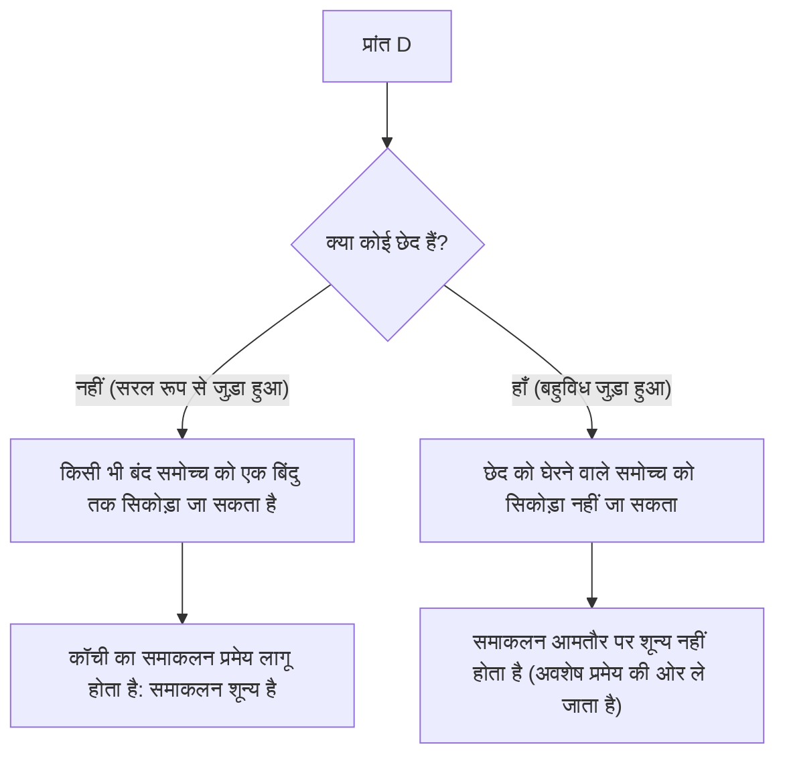

## 1. प्रस्तावना

गणित के उस क्षेत्र में जिसे सम्मिश्र विश्लेषण (complex analysis) के रूप में जाना जाता है, सबसे सुंदर और शक्तिशाली प्रमेयों में से एक **कॉची का समाकलन प्रमेय** ([Cauchy](https://kenji.blog/hi/p/cauchy/)'s integral theorem) है। यह प्रमेय उस बात की पुष्टि करता है जो पहली नज़र में एक अत्यधिक आश्चर्यजनक तथ्य प्रतीत होता है: "एक बंद समोच्च (closed contour) के साथ कुछ शर्तों को पूरा करने वाले एक सम्मिश्र फलन (complex function) का समाकलन करने पर हमेशा ठीक शून्य प्राप्त होगा।"

वास्तविक फलनों (real functions) के समाकलन को सीखने के अनुभव से, समाकलन को स्वाभाविक रूप से "क्षेत्रफल" या "एक पथ के साथ संचय" का प्रतिनिधित्व करने वाला माना जाता है, इसलिए यदि आप एक पथ के साथ लंबी दूरी पर समाकलन करते हैं, तो यह स्वाभाविक लगता है कि कुछ मूल्य शेष रहेगा। हालाँकि, सम्मिश्र तल (complex plane) पर, जब किसी फलन में **होलोमोर्फिक** (holomorphic) होने का विशेष गुण होता है, तो एक आश्चर्यजनक समरूपता उभरती है जहाँ समाकलन का परिणाम पूरी तरह से लिए गए पथ से स्वतंत्र हो जाता है, पथों के अंतर को पार कर जाता है।

इस लेख में, हम सम्मिश्र तल और होलोमोर्फिक फलनों की मूलभूत परिभाषाओं से शुरू करके, प्रमेय के सहज अर्थ, इसकी भौतिक व्याख्या, और ग्रीन के प्रमेय का उपयोग करके इसके शास्त्रीय प्रमाण की रूपरेखा तक, कॉची के समाकलन प्रमेय की विस्तार से व्याख्या करेंगे। इसके अलावा, हम इस बात पर भी चर्चा करेंगे कि यह प्रमेय सम्मिश्र विश्लेषण में अधिक उन्नत विषयों से कैसे जुड़ता है, जैसे कि कॉची का समाकलन सूत्र और अवशेष प्रमेय। आइए गणितीय कठोरता और सहज कल्पना दोनों के दृष्टिकोण से इस प्रमेय की गहन गहराई की सराहना करें।

## 2. सम्मिश्र तल और होलोमोर्फिक फलनों की नींव

कॉची के समाकलन प्रमेय को गहराई से समझने के लिए, हमें सबसे पहले सम्मिश्र तल की मूल बातों और सम्मिश्र फलनों के अवकलन के बारे में अपनी समझ को मजबूत करना चाहिए। यहाँ की समझ उन प्रमेयों के प्रमाणों और व्याख्याओं के लिए एक महत्वपूर्ण आधार बनाती है जो अनुसरण करते हैं।

### सम्मिश्र तल पर फलन

एक सम्मिश्र फलन $f(z)$ एक ऐसा फलन है जो एक सम्मिश्र संख्या $z = x + iy$ को दूसरी सम्मिश्र संख्या $w = u + iv$ पर मैप करता है। यहाँ, $x, y$ वास्तविक संख्याएँ हैं, $i$ काल्पनिक इकाई ($i^2 = -1$) है, और $u, v$ क्रमशः $x, y$ पर निर्भर करने वाले वास्तविक-मूल्यवान फलन हैं। इसलिए, एक सम्मिश्र फलन को दो वास्तविक चरों के दो वास्तविक-मूल्यवान फलनों के संयोजन के रूप में इस प्रकार दर्शाया जा सकता है:

$$
f(z) = u(x, y) + i v(x, y)
$$

उदाहरण के लिए, फलन $f(z) = z^2$ के लिए, $z = x + iy$ को प्रतिस्थापित करने और विस्तारित करने पर $z^2 = (x + iy)^2 = x^2 - y^2 + 2ixy$ मिलता है। इस प्रकार, इस मामले में, हम देख सकते हैं कि यह वास्तविक-मूल्यवान फलनों $u(x, y) = x^2 - y^2$ और $v(x, y) = 2xy$ से बना है।

### सम्मिश्र अवकलन और कॉची-रीमैन समीकरण

एक सम्मिश्र फलन $f(z)$ को एक बिंदु $z_0$ पर **अवकलनीय** (differentiable) कहा जाता है यदि निम्नलिखित सीमा मौजूद है:

$$
f'(z_0) = \lim_{\Delta z \to 0} \frac{f(z_0 + \Delta z) - f(z_0)}{\Delta z}
$$

यहाँ जो अत्यंत महत्वपूर्ण है वह यह है कि इस सीमा को ठीक उसी मान पर अभिसरण (converge) होना चाहिए, चाहे सम्मिश्र तल पर शून्य के करीब "किस दिशा से" $\Delta z$ आता हो। वास्तविक संख्याओं की दुनिया में, केवल दो तरीके थे: दाएँ से या बाएँ से पहुँचना, लेकिन सम्मिश्र तल में, पहुँचने के अनंत तरीके हैं। इस सख्त शर्त के कारण, ऐसे गुण प्राप्त होते हैं जो वास्तविक फलनों के अवकलन से कहीं अधिक मजबूत होते हैं।

जब एक फलन $f(z)$ एक निश्चित प्रांत के भीतर सभी बिंदुओं पर अवकलनीय होता है, तो फलन को उस प्रांत में **होलोमोर्फिक** कहा जाता है। यह ज्ञात है कि होलोमोर्फिक होने के लिए एक आवश्यक और पर्याप्त शर्त यह है कि वास्तविक भाग $u$ और काल्पनिक भाग $v$ निम्नलिखित आंशिक अवकल समीकरणों (partial differential equations) को पूरा करते हैं। इन्हें **कॉची-रीमैन समीकरण** ([Cauchy](https://kenji.blog/hi/p/cauchy/)-[Riemann](https://kenji.blog/hi/p/riemann/) equations) कहा जाता है।

$$
\frac{\partial u}{\partial x} = \frac{\partial v}{\partial y}, \quad \frac{\partial u}{\partial y} = -\frac{\partial v}{\partial x}
$$

इसके अलावा, यदि $u$ और $v$ में निरंतर आंशिक व्युत्पन्न हैं, तो इन समीकरणों का होना $f(z)$ के होलोमोर्फिक होने के बराबर है। ये संबंधपरक समीकरण, जिनमें एक सुंदर समरूपता होती है, बाद में वर्णित कॉची के समाकलन प्रमेय के प्रमाण में महत्वपूर्ण भूमिका निभाते हैं।

## 3. सम्मिश्र समाकलन की परिभाषा और गुण

इसके बाद, हम सम्मिश्र तल पर रेखा समाकलन (line integration) को परिभाषित करते हैं। चूँकि कॉची का समाकलन प्रमेय सम्मिश्र तल पर एक "वक्र" के साथ समाकलन के बारे में एक प्रमेय है, इसलिए इस समाकलन की परिभाषा को स्पष्ट करना आवश्यक है।

मान लीजिए कि सम्मिश्र तल पर एक चिकना वक्र $C$ एक वास्तविक चर $t \in [a, b]$ का उपयोग करके $z(t) = x(t) + i y(t)$ के रूप में पैरामीटरयुक्त है। इस वक्र $C$ के साथ सम्मिश्र फलन $f(z)$ का रेखा समाकलन इस प्रकार परिभाषित किया गया है:

$$
\int_C f(z) dz = \int_a^b f(z(t)) z'(t) dt
$$

यहाँ, $z'(t) = \frac{dx}{dt} + i \frac{dy}{dt}$, और औपचारिक प्रतिस्थापन $dz = dx + i dy$ करने से, गणना को अंततः वास्तविक चरों के समाकलन में कम किया जा सकता है।

सम्मिश्र समाकलन में वास्तविक फलनों के रेखा समाकलन के समान मूलभूत गुण होते हैं, जैसे:

1. **रैखिकता** (Linearity) : किन्हीं भी सम्मिश्र स्थिरांकों $\alpha, \beta$ के लिए, यह मानता है कि $\int_C (\alpha f(z) + \beta g(z)) dz = \alpha \int_C f(z) dz + \beta \int_C g(z) dz$।
2. **पथ का उलटाव** (Path Reversal) : यदि वक्र $C$ की दिशा (प्रारंभ बिंदु से अंत बिंदु तक प्रगति की दिशा) उलट जाती है और इसे $-C$ के रूप में दर्शाया जाता है, तो $\int_{-C} f(z) dz = -\int_C f(z) dz$। समाकलन पथ को उल्टे क्रम में चलाने से चिह्न उलट जाता है।
3. **पथों को विभाजित करना और जोड़ना** : जब एक वक्र $C$ को मध्यवर्ती बिंदु पर $C_1$ और $C_2$ में विभाजित किया जा सकता है, तो समग्र समाकलन को आंशिक समाकलनों के योग के रूप में व्यक्त किया जाता है। अर्थात, $\int_C f(z) dz = \int_{C_1} f(z) dz + \int_{C_2} f(z) dz$।

ये गुण, जो स्पष्ट रूप से स्पष्ट लगते हैं, बहुत शक्तिशाली उपकरण बन जाते हैं जब हम बाद में पथों को विभिन्न तरीकों से विकृत करके अपने तर्कों को आगे बढ़ाते हैं।

## 4. कॉची के समाकलन प्रमेय का निरूपण

अब जब हमारी तैयारियाँ पूरी हो गई हैं, तो हम अंततः मुख्य विषय, कॉची के समाकलन प्रमेय के सटीक निरूपण का उल्लेख करते हैं।

**प्रमेय (कॉची का समाकलन प्रमेय)**
एक सम्मिश्र फलन $f(z)$ के लिए जो एक सरल रूप से जुड़े हुए प्रांत $D$ पर होलोमोर्फिक है, और $D$ के भीतर किसी भी सरल बंद समोच्च $C$ के लिए, निम्नलिखित समानता लागू होती है।

$$
\oint_C f(z) dz = 0
$$

आइए हम इसे कुछ महत्वपूर्ण शब्दावली के साथ पूरक करें जो प्रमेय की पूर्व-आवश्यक शर्तों के रूप में दिखाई देते हैं।

- **सरल रूप से जुड़ा हुआ प्रांत** (Simply connected domain) : सहज रूप से कहें तो, यह "बिना छेद वाले" प्रांत को संदर्भित करता है। गणितीय कठोरता के साथ व्यक्त किया गया, यह एक ऐसे प्रांत को संदर्भित करता है जहाँ इसके भीतर किसी भी बंद वक्र को प्रांत को छोड़े बिना लगातार विकृत और एक बिंदु तक सिकोड़ा जा सकता है।
- **सरल बंद समोच्च** (Simple closed contour) : यह एक ऐसा वक्र है जहाँ प्रारंभिक बिंदु और अंतिम बिंदु संपाती होते हैं (बंद वक्र) और यह रास्ते में खुद को नहीं काटता है (सरल)। इसे "जॉर्डन वक्र" (Jordan curve) के रूप में भी जाना जाता है, यह तल को दो भागों में विभाजित करने के लिए जाना जाता है: एक "अंदर" और एक "बाहर" (जॉर्डन वक्र प्रमेय)।

नीचे दिया गया आरेख बहुविध जुड़े हुए प्रांतों (बहु-छेद वाले प्रांतों) की तुलना में सरल रूप से जुड़े हुए प्रांतों में बंद वक्रों के व्यवहार में अंतर को स्पष्ट रूप से दिखाता है।

## 5. प्रमेय की सहज समझ और भौतिक व्याख्या

एक बंद समोच्च पर एक होलोमोर्फिक फलन का समाकलन हमेशा शून्य क्यों हो जाता है? इसे गणितीय सूत्रों के अनुक्रम के रूप में न समझकर सहज रूप से समझने के लिए, आइए सम्मिश्र समाकलन को उसके वास्तविक और काल्पनिक भागों में विभाजित करें।

मान लीजिए कि $f(z) = u + iv$ और $dz = dx + i dy$ है। समाकलन को तब निम्नानुसार विस्तारित किया जा सकता है:

$$
\oint_C f(z) dz = \oint_C (u + iv)(dx + idy) = \oint_C (u dx - v dy) + i \oint_C (v dx + u dy)
$$

इस समीकरण के दाहिने भाग पर ध्यान दें। दो वास्तविक समाकलन प्रकट हुए हैं, और उनका बिल्कुल वही रूप है जो 2D तल पर सदिश क्षेत्रों (vector fields) के रेखा समाकलनों का होता है। विशेष रूप से, वास्तविक भाग की व्याख्या एक सदिश क्षेत्र $\vec{F}_1 = (u, -v)$ के रेखा समाकलन के रूप में की जा सकती है, और काल्पनिक भाग की व्याख्या एक सदिश क्षेत्र $\vec{F}_2 = (v, u)$ के रेखा समाकलन के रूप में की जा सकती है।

भौतिकी (विशेष रूप से द्रव गतिकी या विद्युत चुंबकत्व) के संदर्भ में माना जाता है, एक बंद समोच्च के साथ एक सदिश क्षेत्र का रेखा समाकलन उस क्षेत्र के "परिसंचरण" (circulation) का प्रतिनिधित्व करता है। यदि कोई सदिश क्षेत्र "अघूर्णी" (irrotational) और "असंपीड्य" (incompressible) दोनों है, तो इससे कोई फर्क नहीं पड़ता कि आप किस बंद वक्र के साथ परिसंचरण की गणना करते हैं, परिणाम शून्य होगा।

उन कॉची-रीमैन समीकरणों को याद करें जिन्हें हमने पहले सीखा था: $\frac{\partial u}{\partial y} = -\frac{\partial v}{\partial x}$। यह ठीक वही शर्त है जो यह गारंटी देती है कि सदिश क्षेत्र $\vec{F}_1$ और $\vec{F}_2$ "अघूर्णी" हैं। इसी तरह, दूसरा समीकरण $\frac{\partial u}{\partial x} = \frac{\partial v}{\partial y}$ गारंटी देता है कि वे "असंपीड्य" हैं।

दूसरे शब्दों में, होलोमोर्फिक फलन होने की शर्त का मतलब ऐसे सदिश क्षेत्रों का निर्माण करना है जो भौतिक दृष्टिकोण से बहुत "अच्छे व्यवहार वाले" (कोई भंवर नहीं, कोई स्रोत या सिंक नहीं) हैं, और इसके परिणामस्वरूप, एक बंद लूप पर समाकलन अनिवार्य रूप से शून्य हो जाता है। कॉची के समाकलन प्रमेय के पीछे यही भौतिक और सहज अर्थ है।

## 6. ग्रीन के प्रमेय का उपयोग करते हुए कठोर प्रमाण की रूपरेखा

यहाँ, कॉची के समाकलन प्रमेय के एक शास्त्रीय और सहज प्रमाण के रूप में, हम कलन (calculus) से **ग्रीन के प्रमेय** (Green's theorem) का उपयोग करने वाली एक विधि का परिचय देते हैं। (नोट: यह प्रमाण यह मानता है कि आंशिक व्युत्पन्न निरंतर हैं, अर्थात $f'(z)$ निरंतर है।)

ग्रीन का प्रमेय एक शक्तिशाली प्रमेय है जो एक तल पर एक बंद वक्र के साथ एक रेखा समाकलन को उस वक्र द्वारा परिबद्ध प्रांत $D'$ पर एक दोहरे समाकलन (double integral) में परिवर्तित करता है।

**ग्रीन का प्रमेय**
$$
\oint_{\partial D'} (P dx + Q dy) = \iint_{D'} \left( \frac{\partial Q}{\partial x} - \frac{\partial P}{\partial y} \right) dx dy
$$

आइए इस ग्रीन के प्रमेय को पहले वाले विघटित सम्मिश्र समाकलन के वास्तविक भाग पर लागू करें। यहाँ हम $P = u, Q = -v$ मानते हैं।

$$
\oint_C (u dx - v dy) = \iint_{D'} \left( \frac{\partial (-v)}{\partial x} - \frac{\partial u}{\partial y} \right) dx dy
$$

अब, हम कॉची-रीमैन समीकरण $\frac{\partial u}{\partial y} = -\frac{\partial v}{\partial x}$ को प्रतिस्थापित करते हैं, जो होलोमोर्फिक फलनों का एक गुण है। फिर, समाकल्य (integrand) निम्नानुसार हो जाता है:

$$
-\frac{\partial v}{\partial x} - \left( -\frac{\partial v}{\partial x} \right) = 0
$$

चूँकि समाकल्य प्रांत के भीतर सभी बिंदुओं पर $0$ हो जाता है, संपूर्ण दोहरा समाकलन शून्य हो जाता है, जिससे यह सिद्ध होता है कि वास्तविक भाग का रेखा समाकलन शून्य है।

बिल्कुल समान प्रक्रिया के माध्यम से, हम ग्रीन के प्रमेय को काल्पनिक भाग $i \oint_C (v dx + u dy)$ पर लागू करते हैं। यहाँ $P = v, Q = u$ है।

$$
\oint_C (v dx + u dy) = \iint_{D'} \left( \frac{\partial u}{\partial x} - \frac{\partial v}{\partial y} \right) dx dy
$$

फिर से, दूसरे कॉची-रीमैन समीकरण $\frac{\partial u}{\partial x} = \frac{\partial v}{\partial y}$ को प्रतिस्थापित करने पर, समाकल्य $\frac{\partial v}{\partial y} - \frac{\partial v}{\partial y} = 0$ हो जाता है, और काल्पनिक भाग का समाकलन भी शून्य हो जाता है।

निष्कर्ष में, चूँकि वास्तविक और काल्पनिक दोनों भाग शून्य हो जाते हैं, निम्नलिखित सत्य है:

$$
\oint_C f(z) dz = 0 + i0 = 0
$$

यह कॉची के समाकलन प्रमेय के प्रमाण का कंकाल है। हम देख सकते हैं कि कॉची-रीमैन समीकरणों और ग्रीन के प्रमेय के खूबसूरती से एक साथ जुड़ने से, प्रमाण आश्चर्यजनक रूप से सरलता से पूरा किया जा सकता है।

## 7. गॉरसेट का प्रमेय: निरंतर अवकलनीयता की धारणा को हटाना

उपरोक्त ग्रीन के प्रमेय का उपयोग करने वाला प्रमाण समझने में बहुत आसान और सहज है, लेकिन गणितीय रूप से इसकी एक कमजोरी है। वह यह है कि यह परोक्ष रूप से इस धारणा का उपयोग करता है कि "$f'(z)$ निरंतर है" (अर्थात यह धारणा कि $u, v$ के आंशिक व्युत्पन्न निरंतर हैं)। कॉची का प्रारंभिक प्रमाण भी इसी धारणा पर निर्भर था।

हालाँकि, 19वीं सदी के अंत में, फ्रांसीसी गणितज्ञ एडौर्ड गॉरसेट (Édouard Goursat) ने साबित किया कि निरंतरता की यह धारणा वास्तव में अनावश्यक है। अर्थात, उन्होंने दिखाया कि फलन के "प्रत्येक बिंदु पर अवकलनीय (होलोमोर्फिक)" होने से ही कॉची का समाकलन प्रमेय सत्य होता है।

गॉरसेट का प्रमाण प्रांत को छोटे त्रिकोणों में विभाजित करने और विरोधाभास प्राप्त करने के लिए विरोधाभास द्वारा प्रमाण का उपयोग करने की एक सरल विधि (त्रिभुजीकरण की विधि) को नियोजित करता है। आधुनिक सम्मिश्र विश्लेषण पाठ्यपुस्तकों में, यह परिणाम आमतौर पर "कॉची-गॉरसेट प्रमेय" के रूप में पेश किया जाता है। इस परिणाम ने एक बार फिर से इस बात पर प्रकाश डाला कि "यहां तक ​​कि एक बार भी सम्मिश्र अवकलनीय" होने की शर्त वास्तविक फलनों के मामले के साथ तुलना करने की तुलना में कहीं अधिक मजबूत बाधा है (जिसके परिणामस्वरूप असीम रूप से अवकलनीय होना)।

## 8. पथ विरूपण और पथ स्वतंत्रता

कॉची के समाकलन प्रमेय के अत्यंत महत्वपूर्ण परिणामों में से एक **समाकलनों की पथ स्वतंत्रता** (path independence of integrals) है।

मान लीजिए कि एक सरल रूप से जुड़े प्रांत $D$ के भीतर दो बिंदु $A$ और $B$ हैं, और उन्हें जोड़ने वाले दो अलग-अलग पथ $C_1$ और $C_2$ हैं। इस समय, यदि फलन $f(z)$, $D$ के भीतर होलोमोर्फिक है, तो निम्नलिखित सत्य है:

$$
\int_{C_1} f(z) dz = \int_{C_2} f(z) dz
$$

प्रमाण बहुत सरल है। एक ऐसे पथ पर विचार करें जो $C_1$ के माध्यम से $B$ तक जाता है, और विपरीत पथ $-C_2$ के माध्यम से $A$ पर लौटता है। यह एक एकल बंद वक्र $C = C_1 + (-C_2)$ बनाता है। कॉची के समाकलन प्रमेय के अनुसार, इस बंद वक्र के साथ समाकलन शून्य है।

$$
\oint_C f(z) dz = \int_{C_1} f(z) dz + \int_{-C_2} f(z) dz = \int_{C_1} f(z) dz - \int_{C_2} f(z) dz = 0
$$

इसे पक्षांतरित करके, हम $\int_{C_1} f(z) dz = \int_{C_2} f(z) dz$ प्राप्त करते हैं।

इस गुण के कारण, एक होलोमोर्फिक फलन का समाकलन "कौन सा मार्ग अपनाया गया" पर निर्भर नहीं करता है, बल्कि "केवल प्रारंभिक और अंतिम बिंदुओं द्वारा" निर्धारित किया जाता है। यह सम्मिश्र तल पर भी एक प्रतिअवकलज (अनिश्चित समाकलन) $F(z)$ को विशिष्ट रूप से परिभाषित करना संभव बनाता है (समाकलन के स्थिरांक तक), यह गारंटी देता है कि वास्तविक फलनों के लिए "कलन का मूल प्रमेय" सम्मिश्र तल पर भी खूबसूरती से लागू होता है।

## 9. अनुप्रयोग: कॉची का समाकलन सूत्र और बहुविध जुड़े प्रांतों में विस्तार

कॉची का समाकलन प्रमेय अपने आप में एक सुंदर प्रमेय है, लेकिन यह सम्मिश्र विश्लेषण में अन्य महत्वपूर्ण प्रमेयों को क्रमिक रूप से प्राप्त करने के लिए एक शक्तिशाली आधार के रूप में कार्य करता है।

### कॉची का समाकलन सूत्र

प्रमेय का सबसे प्रत्यक्ष और व्यापक रूप से लागू होने वाला परिणाम **कॉची का समाकलन सूत्र** ([Cauchy](https://kenji.blog/hi/p/cauchy/)'s integral formula) है। जब एक फलन $f(z)$ एक प्रांत $D$ में होलोमोर्फिक होता है, तो $D$ के भीतर एक सरल बंद वक्र $C$ और उसके अंदर किसी भी बिंदु $a$ के लिए, निम्नलिखित सत्य है:

$$
f(a) = \frac{1}{2\pi i} \oint_C \frac{f(z)}{z - a} dz
$$

यह सूत्र होलोमोर्फिक फलनों की आश्चर्यजनक कठोरता को दर्शाता है: "जब तक बंद वक्र की सीमा पर फलन के मान ज्ञात होते हैं, प्रांत के अंदर हर बिंदु पर फलन का मान समाकलन गणना द्वारा पूरी तरह से निर्धारित किया जाता है।"

### बहुविध जुड़े प्रांत और अवशेष प्रमेय

यदि प्रांत में "छेद" हैं और यह सरल रूप से जुड़ा हुआ नहीं है (बहुविध जुड़ा हुआ प्रांत), तो कॉची का समाकलन प्रमेय वैसा ही लागू नहीं किया जा सकता है। उदाहरण के लिए, फलन $f(z) = 1/z$ मूल बिंदु $z=0$ पर परिभाषित नहीं है और वहां होलोमोर्फिक नहीं है। यदि हम मूल बिंदु को घेरने वाले इकाई वृत्त के साथ समाकलन करते हैं, तो परिणाम शून्य नहीं, बल्कि मान $2\pi i$ होता है।

हालाँकि, कॉची के समाकलन प्रमेय को चतुराई से लागू करके और समाकलन पथ को विकृत करके, छेद के चारों ओर समाकलनों का मूल्यांकन करने के लिए एक व्यवस्थित तरीका स्थापित किया गया था। यह **अवशेष प्रमेय** (Residue theorem) की ओर ले जाता है, जो आधुनिक सम्मिश्र विश्लेषण में सबसे व्यावहारिक उपकरणों में से एक है। अवशेष प्रमेय का उपयोग करके, सम्मिश्र निश्चित समाकलनों और वास्तविक फलनों के अनंत समाकलनों को सम्मिश्र तल पर बीजगणितीय गणनाओं के साथ शानदार ढंग से बदला जा सकता है और हल किया जा सकता है।

## 10. निष्कर्ष

पहली नज़र में, कॉची का समाकलन प्रमेय एक मामूली प्रमेय की तरह लग सकता है जो केवल यह कहता है कि "समाकलन शून्य हो जाता है।" हालाँकि, इसके पीछे सम्मिश्र फलनों के "होलोमॉर्फी" की प्रतीत होने वाली सरल स्थिति से लाई गई एक गहरी और सुंदर समरूपता छिपी हुई है।

इस प्रमेय से शुरू होकर, सम्मिश्र विश्लेषण की शानदार उपलब्धियाँ जैसे कि कॉची का समाकलन सूत्र, यह प्रमाण कि फलन असीमित रूप से अवकलनीय है (टेलर विस्तार और लॉरेंट विस्तार की गारंटी), और अवशेष प्रमेय क्रमिक रूप से प्राप्त किए जाते हैं। कॉची का समाकलन प्रमेय वास्तव में सबसे मजबूत और सबसे सुंदर आधार कहा जा सकता है जो सम्मिश्र विश्लेषण की शानदार गणितीय इमारत को उसकी जड़ों से सहारा देता है।

हम पाठकों को प्रोत्साहित करते हैं कि वे एक कागज और पेन लें और ग्रीन के प्रमेय का उपयोग करके प्रमाण को अपने हाथों से ट्रेस करें। तब आप निश्चित रूप से सम्मिश्र तल की उस खूबसूरती से सामंजस्यपूर्ण दुनिया को महसूस कर पाएंगे जो गणितीय सूत्रों के पीछे फैली हुई है।

