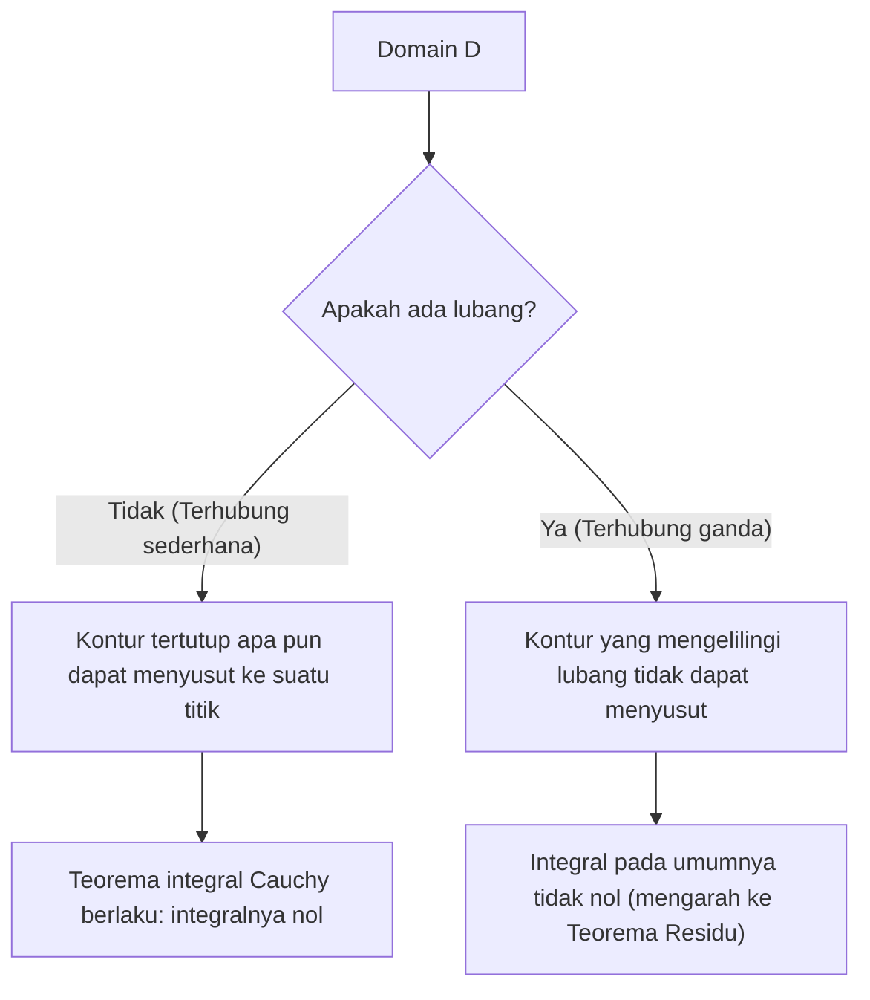

## 1. Pengantar

Di bidang matematika yang dikenal sebagai analisis kompleks, salah satu teorema yang paling indah dan kuat adalah **Teorema integral Cauchy**. Teorema ini menegaskan apa yang pada pandangan pertama tampaknya merupakan fakta yang sangat mengejutkan: "Mengintegralkan fungsi kompleks yang memenuhi kondisi tertentu di sepanjang kontur tertutup akan selalu menghasilkan tepat nol."

Dari pengalaman mempelajari integrasi fungsi nyata, integrasi secara alami dianggap mewakili "area" atau "akumulasi di sepanjang jalan", jadi jika Anda berintegrasi melalui jarak yang jauh di sepanjang jalan, tampaknya wajar bahwa beberapa nilai akan tetap ada. Namun, pada bidang kompleks, ketika suatu fungsi memiliki sifat khusus sebagai **holomorfik**, sebuah simetri yang menakjubkan muncul di mana hasil dari integrasi menjadi sepenuhnya terlepas dari jalan yang diambil, melewatkan perbedaan jalur.

Dalam artikel ini, kami akan menjelaskan teorema integral Cauchy dengan sangat rinci, mulai dari definisi dasar bidang kompleks dan fungsi holomorfik, beranjak pada makna intuitif dari teorema, interpretasi fisiknya, dan sketsa pembuktian klasiknya menggunakan teorema Green. Lebih jauh lagi, kami akan menyentuh bagaimana teorema ini terhubung dengan topik yang lebih maju dalam analisis kompleks, seperti rumus integral Cauchy dan [Teorema Residu](https://kenji.blog/p/residue-theorem/). Mari kita hargai kedalaman mendalam dari teorema ini baik dari perspektif ketelitian matematika maupun gambaran intuitif.

## 2. Fondasi Bidang Kompleks dan Fungsi Holomorfik

Untuk memahami secara mendalam teorema integral Cauchy, pertama-tama kita harus memantapkan pemahaman kita tentang dasar-dasar bidang kompleks dan diferensiasi fungsi kompleks. Pemahaman di sini membentuk dasar yang penting untuk pembuktian dan interpretasi teorema yang mengikutinya.

### Fungsi pada Bidang Kompleks

Fungsi kompleks $f(z)$ adalah fungsi yang memetakan bilangan kompleks $z = x + iy$ ke bilangan kompleks lain $w = u + iv$. Di sini, $x, y$ adalah bilangan real, $i$ adalah unit imajiner ($i^2 = -1$), dan $u, v$ adalah fungsi bernilai real yang masing-masing bergantung pada $x, y$. Oleh karena itu, fungsi kompleks dapat direpresentasikan sebagai kombinasi dari dua fungsi bernilai real dari dua variabel real sebagai berikut:

$$
f(z) = u(x, y) + i v(x, y)
$$

Misalnya, untuk fungsi $f(z) = z^2$, mensubstitusi $z = x + iy$ dan memperluasnya memberikan $z^2 = (x + iy)^2 = x^2 - y^2 + 2ixy$. Jadi, dalam hal ini, kita dapat melihat bahwa ia terdiri dari fungsi bernilai real $u(x, y) = x^2 - y^2$ dan $v(x, y) = 2xy$.

### Diferensiasi Kompleks dan Persamaan Cauchy-Riemann

Sebuah fungsi kompleks $f(z)$ dikatakan **diferensiabel** (dapat didiferensiasi) pada suatu titik $z_0$ jika batas berikut ada:

$$
f'(z_0) = \lim_{\Delta z \to 0} \frac{f(z_0 + \Delta z) - f(z_0)}{\Delta z}
$$

Hal yang sangat penting di sini adalah bahwa batas ini harus menyatu dengan nilai yang sama persis terlepas dari "dari arah mana" $\Delta z$ mendekati nol pada bidang kompleks. Dalam dunia bilangan real, hanya ada dua cara: mendekati dari kanan atau dari kiri, tetapi dalam bidang kompleks, ada cara yang tak terbatas untuk mendekat. Karena kondisi yang ketat ini, sifat-sifat yang jauh lebih kuat daripada diferensiasi fungsi nyata diturunkan.

Ketika suatu fungsi $f(z)$ dapat didiferensiasikan di semua titik dalam domain tertentu, fungsi tersebut dikatakan **holomorfik** dalam domain tersebut. Diketahui bahwa syarat perlu dan cukup untuk menjadi holomorfik adalah bahwa bagian nyata $u$ dan bagian imajiner $v$ memenuhi persamaan diferensial parsial berikut. Ini disebut **Persamaan Cauchy-Riemann**.

$$
\frac{\partial u}{\partial x} = \frac{\partial v}{\partial y}, \quad \frac{\partial u}{\partial y} = -\frac{\partial v}{\partial x}
$$

Lebih lanjut, jika $u$ dan $v$ memiliki turunan parsial kontinu, dipenuhinya persamaan-persamaan ini setara dengan $f(z)$ menjadi holomorfik. Persamaan relasional ini, yang memiliki simetri yang indah, memainkan peran penting dalam pembuktian teorema integral Cauchy yang dijelaskan nanti.

## 3. Definisi dan Sifat Integrasi Kompleks

Selanjutnya, kita mendefinisikan integrasi garis pada bidang kompleks. Karena teorema integral Cauchy adalah teorema tentang integrasi di sepanjang "kurva" pada bidang kompleks, sangat penting untuk memperjelas definisi integrasi ini.

Misalkan kurva mulus $C$ pada bidang kompleks diparameterisasi menggunakan variabel nyata $t \in [a, b]$ sebagai $z(t) = x(t) + i y(t)$. Integral garis dari fungsi kompleks $f(z)$ sepanjang kurva $C$ ini didefinisikan sebagai berikut:

$$
\int_C f(z) dz = \int_a^b f(z(t)) z'(t) dt
$$

Di sini, $z'(t) = \frac{dx}{dt} + i \frac{dy}{dt}$, dan dengan melakukan substitusi formal $dz = dx + i dy$, perhitungan pada akhirnya dapat direduksi menjadi integrasi variabel nyata.

Integrasi kompleks memiliki sifat dasar yang mirip dengan integrasi garis fungsi nyata, seperti:

1. **Linearitas** : Untuk konstanta kompleks apa pun $\alpha, \beta$, berlaku bahwa $\int_C (\alpha f(z) + \beta g(z)) dz = \alpha \int_C f(z) dz + \beta \int_C g(z) dz$.
2. **Pembalikan Jalur** : Jika arah kurva $C$ (arah kemajuan dari titik awal ke titik akhir) dibalik dan dilambangkan sebagai $-C$, maka $\int_{-C} f(z) dz = -\int_C f(z) dz$. Menjalankan jalur integrasi secara terbalik membalikkan tanda.
3. **Pemisahan dan Penggabungan Jalur** : Ketika kurva $C$ dapat dibagi pada titik tengah menjadi $C_1$ dan $C_2$, integral keseluruhan dinyatakan sebagai jumlah integral parsial. Yaitu, $\int_C f(z) dz = \int_{C_1} f(z) dz + \int_{C_2} f(z) dz$.

Sifat-sifat ini, meskipun tampaknya jelas, menjadi alat yang sangat kuat ketika kita kemudian memajukan argumen kita dengan mendistorsi jalur dengan berbagai cara.

## 4. Formulasi Teorema Integral Cauchy

Sekarang setelah persiapan kita selesai, kita akhirnya menyatakan formulasi yang tepat dari subjek utama, teorema integral Cauchy.

**Teorema (Teorema Integral Cauchy)**
Untuk suatu fungsi kompleks $f(z)$ yang holomorfik pada suatu domain terhubung sederhana $D$, dan untuk sebarang kontur tertutup sederhana $C$ di dalam $D$, berlaku kesamaan berikut.

$$
\oint_C f(z) dz = 0
$$

Mari kita lengkapi ini dengan beberapa terminologi penting yang muncul sebagai kondisi prasyarat dari teorema tersebut.

- **Domain terhubung sederhana** (Simply connected domain) : Secara intuitif, ini mengacu pada suatu domain "tanpa lubang". Dinyatakan dengan kekakuan matematis, ini merujuk pada domain di mana setiap kurva tertutup di dalamnya dapat secara terus-menerus dideformasi dan menyusut menjadi satu titik tanpa pernah meninggalkan domain.
- **Kontur tertutup sederhana** (Simple closed contour) : Ini adalah kurva di mana titik awal dan titik akhir bertepatan (kurva tertutup) dan tidak memotong dirinya sendiri di sepanjang jalan (sederhana). Juga dikenal sebagai "kurva Jordan", yang diketahui membagi bidang menjadi dua bagian: "di dalam" dan "di luar" (teorema kurva Jordan).

Diagram di bawah ini secara visual menunjukkan perbedaan perilaku kurva tertutup dalam domain yang terhubung sederhana versus domain yang terhubung ganda (domain dengan lubang).

## 5. Pemahaman Intuitif dan Interpretasi Fisik dari Teorema

Mengapa integral fungsi holomorfik pada kontur tertutup selalu menjadi nol? Untuk memahaminya secara intuitif, bukan sekadar urutan rumus matematika, mari kita uraikan integral kompleks ke dalam bagian nyata dan imajinernya.

Biarkan $f(z) = u + iv$ dan $dz = dx + i dy$. Integral kemudian dapat diperluas sebagai berikut:

$$
\oint_C f(z) dz = \oint_C (u + iv)(dx + idy) = \oint_C (u dx - v dy) + i \oint_C (v dx + u dy)
$$

Perhatikan sisi kanan persamaan ini. Dua integral nyata telah muncul, dan mereka memiliki bentuk yang sama persis dengan integral garis dari medan vektor pada bidang 2D. Secara khusus, bagian nyata dapat diinterpretasikan sebagai integral garis dari medan vektor $\vec{F}_1 = (u, -v)$, dan bagian imajiner sebagai integral garis dari medan vektor $\vec{F}_2 = (v, u)$.

Dilihat dari konteks fisika (khususnya dinamika fluida atau elektromagnetisme), integral garis dari suatu medan vektor di sepanjang kontur tertutup mewakili "sirkulasi" dari medan tersebut. Jika suatu medan vektor bersifat "irotasional" (irrotational) dan "inkompresibel" (incompressible), maka tidak peduli sepanjang kurva tertutup mana Anda menghitung sirkulasi, hasilnya akan nol.

Ingat kembali persamaan Cauchy-Riemann yang kita pelajari sebelumnya: $\frac{\partial u}{\partial y} = -\frac{\partial v}{\partial x}$. Ini persis merupakan kondisi yang menjamin bahwa medan vektor $\vec{F}_1$ dan $\vec{F}_2$ bersifat "irotasional". Demikian pula, persamaan lainnya $\frac{\partial u}{\partial x} = \frac{\partial v}{\partial y}$ menjamin bahwa mereka "inkompresibel".

Dengan kata lain, kondisi menjadi fungsi holomorfik berarti membentuk medan vektor yang sangat "berperilaku baik" (tidak ada pusaran, tidak ada sumber atau penyerap) dari perspektif fisik, dan sebagai hasilnya, integral pada loop tertutup secara pasti menjadi nol. Ini adalah makna fisik dan intuitif di balik teorema integral Cauchy.

## 6. Sketsa Pembuktian Ketat Menggunakan Teorema Green

Di sini, sebagai pembuktian klasik dan intuitif dari teorema integral Cauchy, kami memperkenalkan suatu metode yang memanfaatkan **Teorema Green** dari kalkulus. (Catatan: Pembuktian ini mengasumsikan bahwa turunan parsialnya kontinu, yaitu, $f'(z)$ kontinu.)

Teorema Green adalah teorema kuat yang mengubah integral garis di sepanjang kurva tertutup pada suatu bidang menjadi integral ganda di atas domain $D'$ yang dikelilingi oleh kurva tersebut.

**Teorema Green**
$$
\oint_{\partial D'} (P dx + Q dy) = \iint_{D'} \left( \frac{\partial Q}{\partial x} - \frac{\partial P}{\partial y} \right) dx dy
$$

Mari kita terapkan teorema Green ini pada bagian nyata dari integral kompleks yang telah diuraikan sebelumnya. Di sini kita membiarkan $P = u, Q = -v$.

$$
\oint_C (u dx - v dy) = \iint_{D'} \left( \frac{\partial (-v)}{\partial x} - \frac{\partial u}{\partial y} \right) dx dy
$$

Sekarang, kita mensubstitusikan persamaan Cauchy-Riemann $\frac{\partial u}{\partial y} = -\frac{\partial v}{\partial x}$, yang merupakan sifat fungsi holomorfik. Kemudian, integrand menjadi sebagai berikut:

$$
-\frac{\partial v}{\partial x} - \left( -\frac{\partial v}{\partial x} \right) = 0
$$

Karena integrand menjadi $0$ pada semua titik di dalam domain, seluruh integral ganda menjadi nol, membuktikan bahwa integral garis bagian nyata adalah nol.

Melalui prosedur yang sepenuhnya sama, kita menerapkan teorema Green pada bagian imajiner $i \oint_C (v dx + u dy)$. Di sini $P = v, Q = u$.

$$
\oint_C (v dx + u dy) = \iint_{D'} \left( \frac{\partial u}{\partial x} - \frac{\partial v}{\partial y} \right) dx dy
$$

Sekali lagi, dengan mensubstitusi persamaan Cauchy-Riemann lainnya $\frac{\partial u}{\partial x} = \frac{\partial v}{\partial y}$, integrand menjadi $\frac{\partial v}{\partial y} - \frac{\partial v}{\partial y} = 0$, dan integral bagian imajiner juga menjadi nol.

Kesimpulannya, karena bagian nyata maupun imajinernya menjadi nol, hal berikut berlaku:

$$
\oint_C f(z) dz = 0 + i0 = 0
$$

Ini adalah kerangka pembuktian untuk teorema integral Cauchy. Kita dapat melihat bahwa melalui persamaan Cauchy-Riemann dan teorema Green yang menyatu dengan indah, pembuktian dapat diselesaikan secara mengejutkan sederhana.

## 7. Teorema Goursat: Menghapus Asumsi Diferensiabilitas Kontinu

Pembuktian menggunakan teorema Green di atas sangat mudah dipahami dan intuitif, namun secara matematis memiliki satu kelemahan. Yakni, pembuktian tersebut secara implisit menggunakan asumsi bahwa "$f'(z)$ kontinu" (yaitu, asumsi bahwa turunan parsial $u, v$ adalah kontinu). Pembuktian awal Cauchy juga bergantung pada asumsi ini.

Namun, pada akhir abad ke-19, matematikawan Prancis Édouard Goursat membuktikan bahwa asumsi kekontinuan ini sebenarnya tidak diperlukan. Yakni, ia menunjukkan bahwa teorema integral Cauchy berlaku benar hanya dari fungsi yang "dapat didiferensiasi (holomorfik) pada setiap titik".

Pembuktian Goursat menggunakan metode cerdik membagi domain menjadi segitiga-segitiga kecil dan menggunakan pembuktian dengan kontradiksi untuk mendapatkan kontradiksi (metode triangulasi). Dalam buku teks analisis kompleks modern, hasil ini umumnya diperkenalkan sebagai "teorema Cauchy-Goursat". Hasil ini sekali lagi menyoroti bahwa syarat "dapat didiferensiasi secara kompleks meskipun hanya sekali" merupakan kendala yang jauh lebih kuat (yang mengakibatkan dapat didiferensiasi secara tak terhingga) daripada yang dapat dibandingkan dengan kasus fungsi nyata.

## 8. Deformasi Jalur dan Independensi Jalur

Salah satu konsekuensi yang sangat penting dari teorema integral Cauchy adalah **independensi jalur dari integral**.

Misalkan ada dua titik $A$ dan $B$ dalam suatu domain terhubung sederhana $D$, dan ada dua jalur berbeda $C_1$ dan $C_2$ yang menghubungkannya. Pada saat ini, jika fungsi $f(z)$ holomorfik di dalam $D$, hal berikut berlaku:

$$
\int_{C_1} f(z) dz = \int_{C_2} f(z) dz
$$

Pembuktiannya sangat sederhana. Perhatikan suatu jalur yang menuju ke $B$ via $C_1$, dan kembali ke $A$ via jalur sebaliknya $-C_2$. Ini membentuk satu kurva tertutup $C = C_1 + (-C_2)$. Berdasarkan teorema integral Cauchy, integral sepanjang kurva tertutup ini adalah nol.

$$
\oint_C f(z) dz = \int_{C_1} f(z) dz + \int_{-C_2} f(z) dz = \int_{C_1} f(z) dz - \int_{C_2} f(z) dz = 0
$$

Dengan mentransposisi ini, kita mendapatkan $\int_{C_1} f(z) dz = \int_{C_2} f(z) dz$.

Oleh karena sifat ini, integrasi suatu fungsi holomorfik tidak bergantung pada "rute mana yang diambil", melainkan ditentukan "hanya oleh titik awal dan akhir". Ini memungkinkan pendefinisian antiturunan (integral tak tentu) $F(z)$ secara unik bahkan pada bidang kompleks (hingga suatu konstanta integrasi), menjamin bahwa "Teorema Dasar Kalkulus" untuk fungsi nyata juga berlaku secara indah di bidang kompleks.

## 9. Aplikasi: Rumus Integral Cauchy dan Perluasan ke Domain Terhubung Ganda

Teorema integral Cauchy adalah teorema yang indah dengan sendirinya, tetapi ini berfungsi sebagai fondasi yang kuat untuk secara berurutan menurunkan teorema-teorema penting lainnya dalam analisis kompleks.

### Rumus Integral Cauchy

Konsekuensi yang paling langsung dan dapat diterapkan secara luas dari teorema ini adalah **rumus integral Cauchy**. Ketika suatu fungsi $f(z)$ holomorfik di suatu domain $D$, untuk suatu kurva tertutup sederhana $C$ di dalam $D$ dan sebarang titik $a$ di dalamnya, berlaku hal berikut:

$$
f(a) = \frac{1}{2\pi i} \oint_C \frac{f(z)}{z - a} dz
$$

Rumus ini menunjukkan kekakuan yang mencengangkan dari fungsi holomorfik: "Selama nilai-nilai fungsi pada batas kurva tertutup diketahui, nilai fungsi pada setiap titik di dalam domain sepenuhnya ditentukan oleh kalkulasi integral."

### Domain Terhubung Ganda dan [Teorema Residu](https://kenji.blog/p/residue-theorem/)

Jika domain memiliki "lubang" dan tidak terhubung sederhana (domain terhubung ganda), teorema integral Cauchy tidak dapat diterapkan begitu saja. Misalnya, fungsi $f(z) = 1/z$ tidak didefinisikan pada titik asal $z=0$ dan tidak holomorfik di sana. Jika kita mengintegralkan sepanjang lingkaran satuan yang mengelilingi titik asal, hasilnya bukan nol, tetapi nilainya $2\pi i$.

Namun, dengan secara cerdik menerapkan teorema integral Cauchy dan mengubah bentuk jalur integrasi, suatu metode sistematis untuk mengevaluasi integral di sekitar lubang telah ditetapkan. Ini mengarah pada **[Teorema Residu](https://kenji.blog/p/residue-theorem/)** (Residue theorem), salah satu alat paling praktis dalam analisis kompleks modern. Dengan menggunakan [Teorema Residu](https://kenji.blog/p/residue-theorem/), integral tertentu kompleks dan integral tak hingga dari fungsi nyata dapat dengan cemerlang digantikan dengan perhitungan aljabar pada bidang kompleks dan diselesaikan.

## 10. Kesimpulan

Sepintas, teorema integral Cauchy mungkin terlihat seperti teorema sederhana yang sekadar mengatakan "integral menjadi nol." Namun, tersembunyi di baliknya adalah simetri mendalam dan indah yang dihasilkan oleh kondisi "holomorfi" yang tampak sederhana dari fungsi kompleks.

Berawal dari teorema ini, pencapaian luar biasa dari analisis kompleks seperti rumus integral Cauchy, pembuktian bahwa suatu fungsi dapat diturunkan secara tak terbatas (menjamin ekspansi Taylor dan ekspansi Laurent), dan [Teorema Residu](https://kenji.blog/p/residue-theorem/) diturunkan secara berurutan. Teorema integral Cauchy benar-benar dapat dikatakan sebagai fondasi yang paling kuat dan indah yang menopang bangunan matematika yang megah dari analisis kompleks dari akar-akarnya.

Kami mendorong para pembaca untuk mengambil kertas dan pena dan menelusuri pembuktian menggunakan teorema Green dengan tangan Anda sendiri. Anda kemudian pasti akan dapat merasakan dunia bidang kompleks yang selaras dengan indah yang terbentang di balik rumus-rumus matematika.
