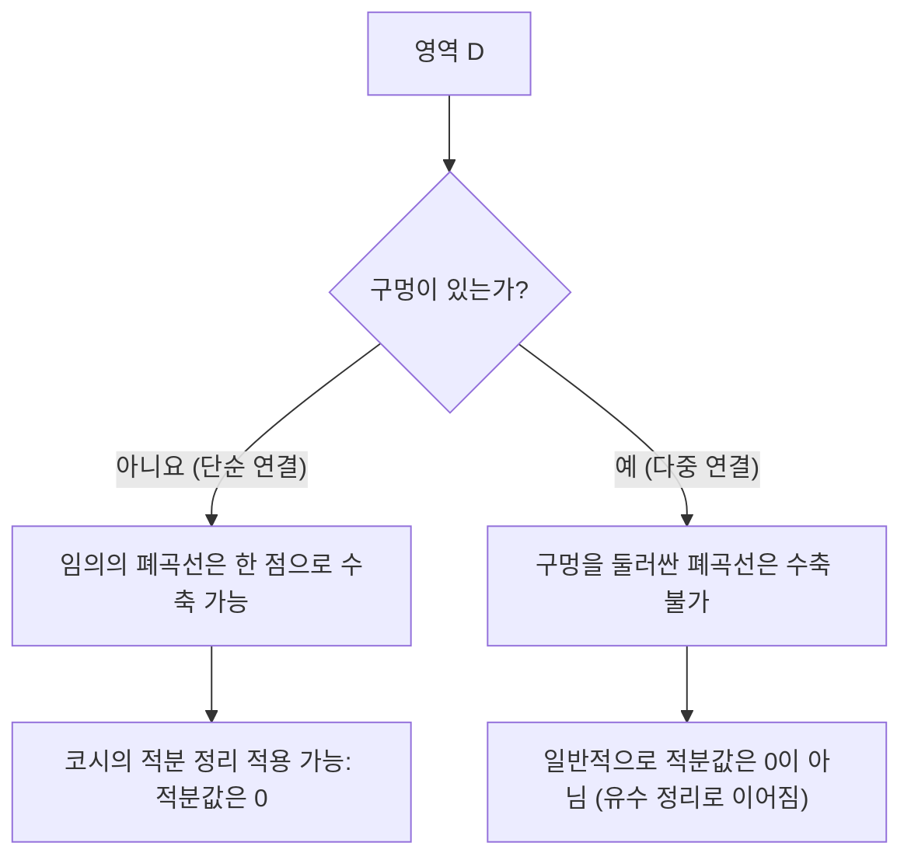

## 1. 머리말

복소해석학이라는 수학 분야에서 가장 아름답고, 그리고 가장 강력한 정리 중 하나로 알려진 것이 **코시의 적분 정리** ([Cauchy](https://kenji.blog/ko/p/cauchy/)'s integral theorem)입니다. 이 정리는 "어떤 조건을 만족하는 복소함수를 닫힌 경로로 적분하면 그 값은 반드시 0이 된다"는, 언뜻 보면 매우 놀라운 사실을 주장하고 있습니다.

실수 함수의 적분을 배운 경험에 비추어 볼 때, 적분이라는 것은 "넓이"나 "경로 상의 누적"을 나타내는 것이므로, 경로를 따라 긴 거리를 적분하면 어떤 값이 남는 것이 자연스러워 보일지도 모릅니다. 하지만 복소평면 위에서 함수가 **정칙** (holomorphic)이라는 특별한 성질을 가질 경우, 경로의 차이를 뛰어넘어 적분 결과가 경로에 의존하지 않는다는 경이로운 대칭성이 나타납니다.

본 글에서는 이 코시의 적분 정리에 대해, 그 기초가 되는 복소평면과 정칙 함수의 정의에서 출발하여, 정리의 직관적인 의미, 물리적인 해석, 그리고 그린 정리를 이용한 고전적인 증명 스케치까지 매우 상세하게 해설합니다. 나아가 이 정리가 어떻게 코시의 적분 공식이나 [유수 정리](https://kenji.blog/ko/p/residue-theorem/)와 같은 더 고도의 복소해석학 주제로 이어지는지에 대해서도 다룰 것입니다. 수학적인 엄밀함과 직관적인 이미지 양쪽 측면에서 이 정리의 깊이를 음미해 봅시다.

## 2. 복소평면과 정칙 함수의 기초

코시의 적분 정리를 깊이 이해하기 위해서는 먼저 복소평면과 복소함수의 미분에 대한 기본 사항을 확실히 해 둘 필요가 있습니다. 여기서의 이해가 이후의 증명이나 정리의 해석에 있어 중요한 토대가 됩니다.

### 복소평면 상의 함수

복소함수 $f(z)$는 복소수 $z = x + iy$를 다른 복소수 $w = u + iv$로 사상하는 함수입니다. 여기서 $x, y$는 실수, $i$는 허수 단위($i^2 = -1$)이며, $u, v$는 각각 $x, y$에 의존하는 실숫값 함수입니다. 따라서 복소함수는 다음과 같이 두 실변수의 실숫값 함수의 조합으로 나타낼 수 있습니다.

$$
f(z) = u(x, y) + i v(x, y)
$$

예를 들어, $f(z) = z^2$이라는 함수의 경우, $z = x + iy$를 대입하여 전개하면 $z^2 = (x + iy)^2 = x^2 - y^2 + 2ixy$가 됩니다. 따라서 이 경우에는 실숫값 함수 $u(x, y) = x^2 - y^2$와 $v(x, y) = 2xy$에 의해 구성되어 있음을 알 수 있습니다.

### 복소 미분과 코시-리만 방정식

복소함수 $f(z)$가 어떤 점 $z_0$에서 **미분 가능**하다는 것은 다음의 극한이 존재함을 의미합니다.

$$
f'(z_0) = \lim_{\Delta z \to 0} \frac{f(z_0 + \Delta z) - f(z_0)}{\Delta z}
$$

여기서 극히 중요한 것은, $\Delta z$가 복소평면 상의 "어떤 방향에서" 0에 접근하더라도 이 극한이 완전히 똑같은 값으로 수렴해야 한다는 점입니다. 실수의 세계에서는 오른쪽에서 접근하느냐 왼쪽에서 접근하느냐의 2가지 방법밖에 없었지만, 복소평면에서는 무한한 접근 방법이 있습니다. 이 엄격한 조건에 의해, 실함수의 미분과는 비교할 수 없을 정도로 강한 성질이 유도됩니다.

함수 $f(z)$가 어떤 영역 내의 모든 점에서 미분 가능할 때, 그 함수는 그 영역에서 **정칙** (holomorphic)이라고 합니다. 정칙이기 위한 필요충분조건으로서 실수부 $u$와 허수부 $v$가 다음의 편미분 방정식을 만족해야 한다는 것이 알려져 있습니다. 이를 **코시-리만 방정식** ([Cauchy](https://kenji.blog/ko/p/cauchy/)-[Riemann](https://kenji.blog/ko/p/riemann/) equations)이라고 부릅니다.

$$
\frac{\partial u}{\partial x} = \frac{\partial v}{\partial y}, \quad \frac{\partial u}{\partial y} = -\frac{\partial v}{\partial x}
$$

나아가 $u$와 $v$가 연속인 편도함수를 가질 경우, 이 방정식이 성립하는 것과 $f(z)$가 정칙이라는 것은 동치가 됩니다. 아름다운 대칭성을 가지는 이 관계식은 후술할 코시의 적분 정리의 증명에서 극히 중요한 역할을 합니다.

## 3. 복소 적분의 정의와 성질

다음으로, 복소평면 상에서의 선적분을 정의합니다. 코시의 적분 정리는 복소평면 상의 "곡선"을 따라가는 적분에 관한 정리이므로, 적분의 정의를 명확히 해 두는 것이 필수적입니다.

복소평면 상의 매끄러운 곡선 $C$가 실수 변수 $t \in [a, b]$를 이용하여 $z(t) = x(t) + i y(t)$로 매개변수 표현되어 있다고 가정합시다. 이 곡선 $C$를 따르는 복소함수 $f(z)$의 선적분은 다음과 같이 정의됩니다.

$$
\int_C f(z) dz = \int_a^b f(z(t)) z'(t) dt
$$

여기서 $z'(t) = \frac{dx}{dt} + i \frac{dy}{dt}$이며, $dz = dx + i dy$라는 형식적인 치환을 수행함으로써 최종적으로는 실변수의 적분으로 귀착시켜 계산할 수 있습니다.

복소 적분은 실함수의 선적분과 마찬가지로 다음과 같은 기본적인 성질을 가지고 있습니다.

1. **선형성** : 임의의 복소 상수 $\alpha, \beta$에 대하여 $\int_C (\alpha f(z) + \beta g(z)) dz = \alpha \int_C f(z) dz + \beta \int_C g(z) dz$가 성립합니다.
2. **경로의 반전** : 곡선 $C$의 방향(시점에서 종점으로의 진행 방향)을 역으로 한 것을 $-C$로 표기하면, $\int_{-C} f(z) dz = -\int_C f(z) dz$가 됩니다. 적분 경로를 역주행하면 부호가 반전됩니다.
3. **경로의 분할과 결합** : 곡선 $C$를 도중의 점에서 $C_1$과 $C_2$로 분할할 수 있을 때, 전체의 적분은 부분 적분의 합으로 표현됩니다. 즉, $\int_C f(z) dz = \int_{C_1} f(z) dz + \int_{C_2} f(z) dz$가 됩니다.

이러한 성질들은 당연해 보이지만, 나중에 경로를 여러 가지로 변형하여 논의를 진행하는 데 있어 매우 강력한 도구가 됩니다.

## 4. 코시의 적분 정리의 정식화

여기까지 준비가 갖추어졌으니, 드디어 본론인 코시의 적분 정리의 정확한 주장을 서술합니다.

**정리 (코시의 적분 정리)**
단순 연결된 영역 $D$ 상에서 정칙인 복소함수 $f(z)$와, $D$ 내의 임의의 단순 폐곡선 $C$에 대하여 다음 등식이 성립한다.

$$
\oint_C f(z) dz = 0
$$

여기서 정리의 전제 조건으로 등장하는 몇 가지 중요한 용어를 보충해 두겠습니다.

- **단순 연결 영역** (Simply connected domain) : 직관적으로 말하면 "구멍이 없는" 영역을 뜻합니다. 수학적으로 엄밀하게 표현하면, 영역 내의 임의의 폐곡선을 영역을 벗어나지 않고 연속적으로 변형하여 한 점으로 수축시킬 수 있는 영역을 가리킵니다.
- **단순 폐곡선** (Simple closed contour) : 시점과 종점이 일치하며(폐곡선), 도중에 자기 자신과 교차하지 않는(단순) 곡선입니다. "조르당 폐곡선"이라고도 불리며, 평면을 "내부"와 "외부"의 두 가지로 분할하는 것으로 알려져 있습니다(조르당 곡선 정리).

아래 그림은 단순 연결 영역과 다중 연결(구멍이 있는) 영역에서 폐곡선의 행동 차이를 시각적으로 보여줍니다.

## 5. 정리의 직관적인 이해와 물리적 해석

왜 정칙 함수의 폐곡선 상의 적분이 반드시 0이 될까요? 단순한 수식의 나열이 아니라 이를 직관적으로 이해하기 위해 복소 적분을 실수부와 허수부로 분해해 봅시다.

$f(z) = u + iv$로 두고, $dz = dx + i dy$라 하면, 적분은 다음과 같이 전개할 수 있습니다.

$$
\oint_C f(z) dz = \oint_C (u + iv)(dx + idy) = \oint_C (u dx - v dy) + i \oint_C (v dx + u dy)
$$

이 식의 우변을 주목해 보십시오. 두 개의 실수 적분이 나타났는데, 이는 2차원 평면 상의 벡터장의 선적분과 완전히 같은 형태를 띠고 있습니다. 구체적으로 실수부는 $\vec{F}_1 = (u, -v)$라는 벡터장의 선적분으로, 허수부는 $\vec{F}_2 = (v, u)$라는 벡터장의 선적분으로 해석할 수 있습니다.

물리학(특히 유체역학이나 전자기학)의 맥락에서 생각해보면, 벡터장의 폐곡선 상의 선적분은 그 장의 "순환 (circulation)"을 나타냅니다. 만약 벡터장이 "회전 없음 (irrotational)"이자 "용솟음 없음 (비압축성, incompressible)"이라면 어떤 폐곡선을 따라 순환을 계산하더라도 결과는 0이 됩니다.

여기서 앞서 배운 코시-리만 방정식 $\frac{\partial u}{\partial y} = -\frac{\partial v}{\partial x}$를 떠올려 보십시오. 이것은 바로 벡터장 $\vec{F}_1$이나 $\vec{F}_2$가 "회전 없음"임을 보장하는 조건이 되어 있습니다. 마찬가지로 다른 하나의 식 $\frac{\partial u}{\partial x} = \frac{\partial v}{\partial y}$은 "용솟음 없음"을 보장합니다.

즉, 정칙 함수라는 조건은 물리적으로 보아 매우 "얌전한" (소용돌이도 용솟음도 없는) 벡터장을 형성함을 의미하며, 그 결과로 닫힌 루프 상의 적분이 필연적으로 0이 되는 것입니다. 이것이 코시의 적분 정리 이면에 있는 물리적·직관적인 의미입니다.

## 6. 그린 정리를 이용한 엄밀한 증명 스케치

여기서는 코시의 적분 정리의 고전적이고 직관적인 증명으로서, 미적분학에서의 **그린 정리** (Green's theorem)를 이용한 방법을 소개합니다. (주의: 이 증명에서는 편도함수가 연속이라는 것, 즉 $f'(z)$가 연속임을 가정하고 있습니다.)

그린 정리는 평면 상의 폐곡선을 따르는 선적분을 그 폐곡선이 둘러싸는 영역 $D'$ 상의 이중 적분으로 변환하는 강력한 정리입니다.

**그린 정리**
$$
\oint_{\partial D'} (P dx + Q dy) = \iint_{D'} \left( \frac{\partial Q}{\partial x} - \frac{\partial P}{\partial y} \right) dx dy
$$

앞서 분해한 복소 적분의 실수부에 이 그린 정리를 적용해 봅시다. 여기서는 $P = u, Q = -v$로 둡니다.

$$
\oint_C (u dx - v dy) = \iint_{D'} \left( \frac{\partial (-v)}{\partial x} - \frac{\partial u}{\partial y} \right) dx dy
$$

여기서 정칙 함수의 성질인 코시-리만 방정식 $\frac{\partial u}{\partial y} = -\frac{\partial v}{\partial x}$를 대입합니다. 그러면 피적분 함수는 다음과 같이 됩니다.

$$
-\frac{\partial v}{\partial x} - \left( -\frac{\partial v}{\partial x} \right) = 0
$$

피적분 함수가 영역 내의 모든 점에서 $0$이 되므로, 이중 적분 전체가 0이 되어 실수부의 선적분이 0임이 증명되었습니다.

완전히 동일한 절차로 허수부 $i \oint_C (v dx + u dy)$에 대해서도 그린 정리를 적용합니다. 여기서는 $P = v, Q = u$로 둡니다.

$$
\oint_C (v dx + u dy) = \iint_{D'} \left( \frac{\partial u}{\partial x} - \frac{\partial v}{\partial y} \right) dx dy
$$

여기서도 또 하나의 코시-리만 방정식 $\frac{\partial u}{\partial x} = \frac{\partial v}{\partial y}$를 대입하면 피적분 함수는 $\frac{\partial v}{\partial y} - \frac{\partial v}{\partial y} = 0$이 되어 허수부의 적분 또한 0이 됩니다.

결론적으로 실수부도 허수부도 0이 되므로 다음이 성립합니다.

$$
\oint_C f(z) dz = 0 + i0 = 0
$$

이것이 코시의 적분 정리 증명의 골격입니다. 코시-리만 방정식과 그린 정리가 훌륭하게 맞물림으로써 놀라울 정도로 간결하게 증명이 가능함을 알 수 있습니다.

## 7. 구르사 정리: 연속적 미분 가능성의 가정을 제거하다

위의 그린 정리를 이용한 증명은 매우 이해하기 쉽고 직관적이지만, 수학적으로는 하나의 약점이 있습니다. 그것은 "$f'(z)$가 연속이다"라는 가정(즉 $u, v$의 편도함수가 연속이라는 가정)을 암묵적으로 사용하고 있다는 것입니다. 초기의 코시의 증명도 이 가정에 의존하고 있었습니다.

하지만 19세기 말에 프랑스의 수학자 에두아르 구르사(Édouard Goursat)는 이 연속성의 가정이 실은 불필요함을 증명했습니다. 즉, 함수가 단지 "각 점에서 미분 가능(정칙)하다"라는 것만으로 코시의 적분 정리가 성립함을 보인 것입니다.

구르사의 증명은 영역을 잘게 삼각형으로 분할해 나가며 귀류법을 이용해 모순을 이끌어내는 교묘한 수법(삼각형 분할법)을 이용하고 있으며, 현대의 복소해석학 교과서에서는 이 결과를 "코시-구르사 정리"로 소개하는 것이 일반적입니다. 이 결과로 인해 "단 한 번이라도 복소 미분 가능하다"는 조건이 실함수의 경우와는 비교가 되지 않을 정도로 강력한 제약(결과적으로 무한 번 미분 가능하게 됨)임이 다시 한번 부각되었습니다.

## 8. 경로의 변형과 경로 독립성

코시의 적분 정리의 극히 중요한 귀결 중 하나로 **적분의 경로 독립성**이 있습니다.

단순 연결 영역 $D$ 내에 2개의 점 $A$와 $B$가 있고, 이들을 연결하는 2개의 서로 다른 경로 $C_1$과 $C_2$가 있다고 가정합시다. 이때, 함수 $f(z)$가 $D$ 내에서 정칙이면 다음이 성립합니다.

$$
\int_{C_1} f(z) dz = \int_{C_2} f(z) dz
$$

증명은 매우 간단합니다. $C_1$을 통과하여 $B$로 가고, 역방향 경로 $-C_2$를 통과하여 $A$로 돌아오는 경로를 생각합니다. 이는 하나의 폐곡선 $C = C_1 + (-C_2)$가 됩니다. 코시의 적분 정리에 의해 이 폐곡선을 따르는 적분은 0이 됩니다.

$$
\oint_C f(z) dz = \int_{C_1} f(z) dz + \int_{-C_2} f(z) dz = \int_{C_1} f(z) dz - \int_{C_2} f(z) dz = 0
$$

이를 이항하면 $\int_{C_1} f(z) dz = \int_{C_2} f(z) dz$를 얻습니다.

이 성질에 의해 정칙 함수의 적분은 "어떤 경로를 거쳤는가"에는 의존하지 않고, "시점과 종점만으로 결정"됩니다. 이로 인해 복소평면 상에서도 원시함수(부정적분) $F(z)$를 유일하게(적분 상수의 차이를 제외하고) 정의하는 것이 가능해져, 실함수의 "미적분학의 기본 정리"가 복소평면 상에서도 아름답게 성립함이 보장되는 것입니다.

## 9. 응용: 코시의 적분 공식과 다중 연결 영역으로의 확장

코시의 적분 정리는 단독으로도 아름다운 정리이지만, 복소해석학의 다른 중요한 정리들을 차례로 이끌어내기 위한 강력한 기반이 됩니다.

### 코시의 적분 공식

정리의 가장 직접적이고 응용 범위가 넓은 귀결이 **코시의 적분 공식** ([Cauchy](https://kenji.blog/ko/p/cauchy/)'s integral formula)입니다. 함수 $f(z)$가 영역 $D$에서 정칙일 때, $D$ 내의 단순 폐곡선 $C$와 그 내부의 임의의 점 $a$에 대하여 다음이 성립합니다.

$$
f(a) = \frac{1}{2\pi i} \oint_C \frac{f(z)}{z - a} dz
$$

이 공식은 "폐곡선의 경계 상에서의 함수의 값만 알고 있으면, 영역 내부의 모든 점에서의 함수의 값이 적분 계산에 의해 완전히 결정된다"라는, 정칙 함수의 놀라운 강직성(rigidity)을 보여줍니다.

### 다중 연결 영역과 [유수 정리](https://kenji.blog/ko/p/residue-theorem/)

만약 영역에 "구멍"이 뚫려 있어 단순 연결이 아닌 경우(다중 연결 영역), 코시의 적분 정리는 그대로는 적용할 수 없습니다. 예를 들어 $f(z) = 1/z$라는 함수는 원점 $z=0$에서 정의되지 않으며 정칙이 아닙니다. 원점을 둘러싸는 단위원에 따라 적분하면 결과는 0이 아니라 $2\pi i$라는 값이 됩니다.

하지만 코시의 적분 정리를 교묘하게 응용하여 적분 경로를 변형함으로써, 구멍 주위의 적분을 체계적으로 평가하는 수법이 확립되었습니다. 이것이 현대 복소해석학에서 가장 실용적인 도구 중 하나인 **[유수 정리](https://kenji.blog/ko/p/residue-theorem/)** (Residue theorem)로 이어집니다. [유수 정리](https://kenji.blog/ko/p/residue-theorem/)를 이용하면, 실함수의 복잡한 정적분이나 이상적분을 복소평면 상의 대수적인 계산으로 선명하게 치환하여 풀 수 있게 됩니다.

## 10. 맺음말

코시의 적분 정리는 언뜻 보면 단순한 "적분이 0이 된다"라는 평범한 정리로 보일지도 모릅니다. 그러나 그 배후에는 복소함수의 "정칙성"이라는 일견 심플한 조건이 가져오는 심오하고 아름다운 대칭성이 숨겨져 있습니다.

이 정리를 출발점으로 하여, 코시의 적분 공식, 함수가 무한 번 미분 가능함의 증명(테일러 전개나 로랑 전개의 보장), 그리고 [유수 정리](https://kenji.blog/ko/p/residue-theorem/)와 같은 복소해석학의 화려한 성과들이 차례로 유도됩니다. 코시의 적분 정리는 그야말로 복소해석학이라는 장대한 수학적 건조물을 근저에서 지탱하는, 가장 견고하고 아름다운 토대라고 말할 수 있을 것입니다.

독자 여러분도 꼭 종이와 펜을 들고 그린 정리를 이용한 증명을 직접 손으로 따라가 보시길 바랍니다. 수식의 이면에 펼쳐지는, 아름답고 조화로운 복소평면의 세계를 확실하게 느낄 수 있을 것입니다.

