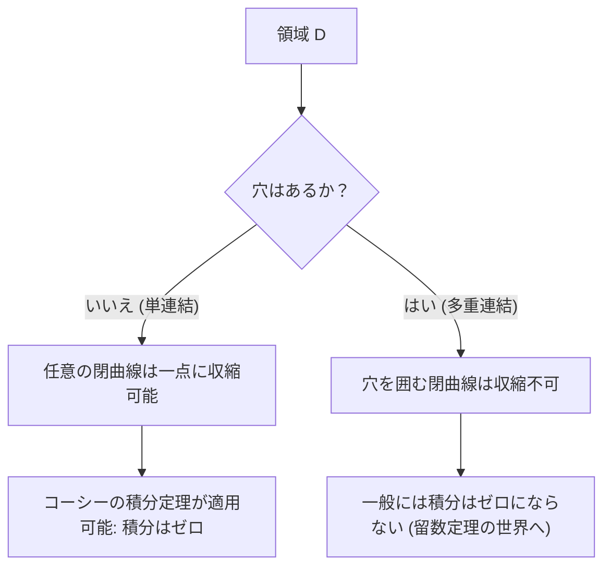

## 1. はじめに

複素解析という数学の分野において、最も美しく、そして最も強力な定理の一つとして知られているのが **[コーシーの積分定理](https://kenji.blog/p/cauchys-integral-theorem/)** (Cauchy's integral theorem) です。この定理は、「ある条件を満たす複素関数を閉じた経路で積分すると、その値は必ずゼロになる」という、一見すると非常に驚くべき事実を主張しています。

実関数の積分を学んだ経験からすると、積分というものは「面積」や「経路上の蓄積」を表すものであり、経路に沿って長い距離の積分を行えば、何らかの値が残るのが自然に思えるかもしれません。しかし、複素平面上において、関数が **正則** (holomorphic) であるという特別な性質を持つ場合、経路の違いを飛び越えて、積分結果が経路に依存しないという驚異的な対称性が現れます。

本記事では、この[コーシーの積分定理](https://kenji.blog/p/cauchys-integral-theorem/)について、その基礎となる複素平面と正則関数の定義から出発し、定理の直感的な意味、物理的な解釈、そしてグリーンの定理を用いた古典的な証明のスケッチまでを、非常に詳細に解説していきます。さらに、この定理がどのようにしてコーシーの積分公式や[留数定理](https://kenji.blog/p/residue-theorem/)といった、より高度な複素解析のトピックへと繋がっていくのかについても触れていきます。数学的な厳密さと直感的なイメージの双方から、この定理の奥深さを味わってみましょう。

## 2. 複素平面と正則関数の基礎

[コーシーの積分定理](https://kenji.blog/p/cauchys-integral-theorem/)を深く理解するためには、まず複素平面と複素関数の微分についての基本事項を確実にしておく必要があります。ここでの理解が、後の証明や定理の解釈における重要な土台となります。

### 複素平面上の関数

複素関数 $f(z)$ は、複素数 $z = x + iy$ を別の複素数 $w = u + iv$ に写像する関数です。ここで $x, y$ は実数、$i$ は虚数単位 ($i^2 = -1$) であり、$u, v$ はそれぞれ $x, y$ に依存する実数値関数です。したがって、複素関数は次のように2つの実変数の実数値関数の組み合わせとして表すことができます。

$$
f(z) = u(x, y) + i v(x, y)
$$

例えば、$f(z) = z^2$ という関数の場合、$z = x + iy$ を代入して展開すると、$z^2 = (x + iy)^2 = x^2 - y^2 + 2ixy$ となります。したがって、この場合は $u(x, y) = x^2 - y^2$、$v(x, y) = 2xy$ という実数値関数によって構成されていることがわかります。

### 複素微分とコーシー・リーマンの方程式

複素関数 $f(z)$ がある点 $z_0$ において **微分可能** であるとは、次の極限が存在することを意味します。

$$
f'(z_0) = \lim_{\Delta z \to 0} \frac{f(z_0 + \Delta z) - f(z_0)}{\Delta z}
$$

ここで極めて重要なのは、$\Delta z$ が複素平面上の「どのような方向から」ゼロに近づいても、この極限が全く同じ値に収束しなければならないという点です。実数の世界では右から近づくか左から近づくかの2通りしかありませんでしたが、複素平面では無限の近づき方があります。この厳しい条件により、実関数の微分とは比べ物にならないほどの強い性質が導かれます。

関数 $f(z)$ がある領域内のすべての点で微分可能であるとき、その関数はその領域で **正則** (holomorphic) であると言います。正則であるための必要十分条件として、実部 $u$ と虚部 $v$ が以下の偏微分方程式を満たすことが知られています。これを **コーシー・リーマンの方程式** (Cauchy-Riemann equations) と呼びます。

$$
\frac{\partial u}{\partial x} = \frac{\partial v}{\partial y}, \quad \frac{\partial u}{\partial y} = -\frac{\partial v}{\partial x}
$$

さらに、$u$ と $v$ が連続な偏導関数を持つ場合、この方程式が成り立つことと $f(z)$ が正則であることは同値になります。この美しい対称性を持つ関係式は、後述する[コーシーの積分定理](https://kenji.blog/p/cauchys-integral-theorem/)の証明において極めて重要な役割を果たします。

## 3. 複素積分の定義と性質

次に、複素平面上での線積分を定義します。[コーシーの積分定理](https://kenji.blog/p/cauchys-integral-theorem/)は、複素平面上の「曲線」に沿った積分に関する定理ですので、積分の定義を明確にしておくことが不可欠です。

複素平面上の滑らかな曲線 $C$ が、実変数 $t \in [a, b]$ を用いて $z(t) = x(t) + i y(t)$ とパラメータ表示されているとします。この曲線 $C$ に沿った複素関数 $f(z)$ の線積分は、次のように定義されます。

$$
\int_C f(z) dz = \int_a^b f(z(t)) z'(t) dt
$$

ここで、$z'(t) = \frac{dx}{dt} + i \frac{dy}{dt}$ であり、$dz = dx + i dy$ という形式的な置き換えを行うことで、最終的には実変数の積分に帰着させて計算することができます。

複素積分は、実関数の線積分と同様に次のような基本的な性質を持っています。

1. **線形性** : 任意の複素定数 $\alpha, \beta$ に対して、$\int_C (\alpha f(z) + \beta g(z)) dz = \alpha \int_C f(z) dz + \beta \int_C g(z) dz$ が成り立ちます。
2. **経路の反転** : 曲線 $C$ の向き（始点から終点への進行方向）を逆にしたものを $-C$ と表記すると、$\int_{-C} f(z) dz = -\int_C f(z) dz$ となります。積分経路を逆走すると符号が反転します。
3. **経路の分割と結合** : 曲線 $C$ を途中の点で $C_1$ と $C_2$ に分割できるとき、全体の積分は部分の積分の和として表されます。すなわち、$\int_C f(z) dz = \int_{C_1} f(z) dz + \int_{C_2} f(z) dz$ となります。

これらの性質は、後で経路を様々に変形して議論を進める上で、当たり前のようですが非常に強力な道具となります。

## 4. [コーシーの積分定理](https://kenji.blog/p/cauchys-integral-theorem/)の定式化

ここまでの準備が整ったところで、いよいよ本題である[コーシーの積分定理](https://kenji.blog/p/cauchys-integral-theorem/)の正確な主張を述べます。

**定理 ([コーシーの積分定理](https://kenji.blog/p/cauchys-integral-theorem/))**
単連結な領域 $D$ 上で正則な複素関数 $f(z)$ と、$D$ 内の任意の単純閉曲線 $C$ について、次の等式が成り立つ。

$$
\oint_C f(z) dz = 0
$$

ここで、定理の前提条件として登場するいくつかの重要な用語を補足しておきましょう。

- **単連結な領域** (Simply connected domain) : 直感的に言えば「穴の空いていない」領域のことです。数学的に厳密に表現すると、領域内の任意の閉曲線を、領域をはみ出すことなく連続的に変形して一点に収縮させることができる領域を指します。
- **単純閉曲線** (Simple closed contour) : 始点と終点が一致しており（閉曲線）、途中で自分自身と交差しない（単純）曲線のことです。「ジョルダン閉曲線」とも呼ばれ、平面を「内側」と「外側」の2つに分割することが知られています（ジョルダンの閉曲線定理）。

以下の図は、単連結な領域と多重連結（穴のある）領域における閉曲線の振る舞いの違いを視覚的に示しています。

## 5. 定理の直感的な理解と物理的解釈

なぜ正則関数の閉曲線上の積分が必ずゼロになるのでしょうか。ただの数式の羅列ではなく、これを直感的に理解するために、複素積分を実部と虚部に分解してみましょう。

$f(z) = u + iv$ とし、$dz = dx + i dy$ とすると、積分は次のように展開できます。

$$
\oint_C f(z) dz = \oint_C (u + iv)(dx + idy) = \oint_C (u dx - v dy) + i \oint_C (v dx + u dy)
$$

この式の右辺に注目してください。2つの実積分が現れましたが、これは2次元平面上のベクトル場の線積分と全く同じ形をしています。具体的には、実部は $\vec{F}_1 = (u, -v)$ というベクトル場の線積分として、虚部は $\vec{F}_2 = (v, u)$ というベクトル場の線積分として解釈できます。

物理学（特に流体力学や電磁気学）の文脈で考えると、ベクトル場の閉曲線上の線積分は、その場の「循環 (circulation)」を表します。もしベクトル場が「渦なし (irrotational)」かつ「湧き出しなし (incompressible)」であれば、どんな閉曲線に沿って循環を計算しても結果はゼロになります。

ここで先ほど学んだコーシー・リーマンの方程式 $\frac{\partial u}{\partial y} = -\frac{\partial v}{\partial x}$ を思い出してください。これは、まさにベクトル場 $\vec{F}_1$ や $\vec{F}_2$ が「渦なし」であることを保証する条件になっています。同様に、もう一つの式 $\frac{\partial u}{\partial x} = \frac{\partial v}{\partial y}$ は「湧き出しなし」を保証します。

つまり、正則関数という条件は、物理的に見て非常に「行儀の良い」（渦も湧き出しもない）ベクトル場を形成することを意味しており、その結果として閉ループ上の積分が必然的にゼロになるのです。これが[コーシーの積分定理](https://kenji.blog/p/cauchys-integral-theorem/)の背後にある物理的・直感的な意味です。

## 6. グリーンの定理を用いた厳密な証明のスケッチ

ここでは、[コーシーの積分定理](https://kenji.blog/p/cauchys-integral-theorem/)の古典的で直感的な証明として、微積分学における **グリーンの定理** (Green's theorem) を用いた方法を紹介します。（注：この証明では、偏導関数が連続であること、すなわち $f'(z)$ が連続であることを仮定しています。）

グリーンの定理は、平面上の閉曲線に沿った線積分を、その閉曲線が囲む領域 $D'$ 上の二重積分に変換する強力な定理です。

**グリーンの定理**
$$
\oint_{\partial D'} (P dx + Q dy) = \iint_{D'} \left( \frac{\partial Q}{\partial x} - \frac{\partial P}{\partial y} \right) dx dy
$$

先ほど分解した複素積分の実部に、このグリーンの定理を適用してみましょう。ここでは $P = u, Q = -v$ とします。

$$
\oint_C (u dx - v dy) = \iint_{D'} \left( \frac{\partial (-v)}{\partial x} - \frac{\partial u}{\partial y} \right) dx dy
$$

ここで、正則関数の性質であるコーシー・リーマンの方程式 $\frac{\partial u}{\partial y} = -\frac{\partial v}{\partial x}$ を代入します。すると、被積分関数は次のようになります。

$$
-\frac{\partial v}{\partial x} - \left( -\frac{\partial v}{\partial x} \right) = 0
$$

被積分関数が領域内のすべての点で $0$ になるため、二重積分全体がゼロとなり、実部の線積分がゼロであることが証明されました。

全く同様の手順で、虚部 $i \oint_C (v dx + u dy)$ についてもグリーンの定理を適用します。ここでは $P = v, Q = u$ とします。

$$
\oint_C (v dx + u dy) = \iint_{D'} \left( \frac{\partial u}{\partial x} - \frac{\partial v}{\partial y} \right) dx dy
$$

ここでもう一つのコーシー・リーマンの方程式 $\frac{\partial u}{\partial x} = \frac{\partial v}{\partial y}$ を代入すると、被積分関数は $\frac{\partial v}{\partial y} - \frac{\partial v}{\partial y} = 0$ となり、虚部の積分もまたゼロになります。

結論として、実部も虚部もゼロになるため、次が成り立ちます。

$$
\oint_C f(z) dz = 0 + i0 = 0
$$

これが[コーシーの積分定理](https://kenji.blog/p/cauchys-integral-theorem/)の証明の骨格です。コーシー・リーマンの方程式とグリーンの定理が見事に噛み合うことで、驚くほど簡潔に証明ができることがわかります。

## 7. グルサの定理：連続的微分可能性の仮定を外す

上記のグリーンの定理を用いた証明は非常に分かりやすく直感的ですが、数学的には一つ弱点があります。それは「$f'(z)$ が連続である」という仮定（すなわち $u, v$ の偏導関数が連続であるという仮定）を暗黙のうちに用いていることです。初期のコーシーの証明もこの仮定に依存していました。

しかし、19世紀の終わりにフランスの数学者エドゥアール・グルサ (Édouard Goursat) は、この連続性の仮定が実は不要であることを証明しました。つまり、関数が単に「各点で微分可能（正則）である」というだけで、[コーシーの積分定理](https://kenji.blog/p/cauchys-integral-theorem/)が成り立つことを示したのです。

グルサの証明は、領域を細かな三角形に分割していき、背理法を用いて矛盾を導くという巧妙な手法（三角形分割の手法）を用いており、現代の複素解析の教科書ではこの結果を「コーシー・グルサの定理」として紹介することが一般的です。この結果により、「1回でも複素微分可能である」という条件が、実関数の場合とは比較にならないほど強い制約（結果として無限回微分可能にまでなる）であることが改めて浮き彫りになりました。

## 8. 経路の変形と経路非依存性

[コーシーの積分定理](https://kenji.blog/p/cauchys-integral-theorem/)の極めて重要な帰結の一つに、 **積分の経路非依存性** があります。

単連結領域 $D$ 内に2つの点 $A$ と $B$ があり、これらを結ぶ2つの異なる経路 $C_1$ と $C_2$ があるとします。このとき、関数 $f(z)$ が $D$ 内で正則であれば、次が成り立ちます。

$$
\int_{C_1} f(z) dz = \int_{C_2} f(z) dz
$$

証明は非常に簡単です。$C_1$ を通って $B$ に行き、逆向きの経路 $-C_2$ を通って $A$ に戻る経路を考えます。これは一つの閉曲線 $C = C_1 + (-C_2)$ になります。[コーシーの積分定理](https://kenji.blog/p/cauchys-integral-theorem/)により、この閉曲線に沿った積分はゼロになります。

$$
\oint_C f(z) dz = \int_{C_1} f(z) dz + \int_{-C_2} f(z) dz = \int_{C_1} f(z) dz - \int_{C_2} f(z) dz = 0
$$

これを移項すれば、$\int_{C_1} f(z) dz = \int_{C_2} f(z) dz$ が得られます。

この性質により、正則関数の積分は「どのような道筋を辿ったか」には依存せず、「始点と終点だけで決まる」ことになります。これにより、複素平面上でも原始関数（不定積分） $F(z)$ を一意に（積分定数の違いを除いて）定義することが可能になり、実関数の「微積分学の基本定理」が複素平面上でも美しく成り立つことが保証されるのです。

## 9. 応用：コーシーの積分公式と多重連結領域への拡張

[コーシーの積分定理](https://kenji.blog/p/cauchys-integral-theorem/)は、単独でも美しい定理ですが、複素解析の他の重要な定理を次々と導き出すための強力な基盤となります。

### コーシーの積分公式

定理の最も直接的で、そして応用範囲の広い帰結が **コーシーの積分公式** (Cauchy's integral formula) です。関数 $f(z)$ が領域 $D$ で正則であるとき、$D$ 内の単純閉曲線 $C$ とその内部の任意の点 $a$ について、次が成り立ちます。

$$
f(a) = \frac{1}{2\pi i} \oint_C \frac{f(z)}{z - a} dz
$$

この公式は、「閉曲線の境界上での関数の値さえ分かっていれば、領域内部のあらゆる点における関数の値が積分計算によって完全に決定される」という、正則関数の驚くべき剛性（rigidity）を示しています。

### 多重連結領域と[留数定理](https://kenji.blog/p/residue-theorem/)

もし領域に「穴」が開いていて単連結でない場合（多重連結領域）、[コーシーの積分定理](https://kenji.blog/p/cauchys-integral-theorem/)はそのままでは適用できません。例えば、$f(z) = 1/z$ という関数は原点 $z=0$ において定義されず、正則ではありません。原点を囲む単位円に沿って積分すると、結果はゼロではなく $2\pi i$ という値になります。

しかし、[コーシーの積分定理](https://kenji.blog/p/cauchys-integral-theorem/)を巧妙に応用し、積分経路を変形させることで、穴の周りの積分を系統的に評価する手法が確立されました。これが、現代の複素解析において最も実用的なツールの一つである **[留数定理](https://kenji.blog/p/residue-theorem/)** (Residue theorem) へと繋がっていきます。[留数定理](https://kenji.blog/p/residue-theorem/)を用いれば、実関数の複雑な定積分や無限積分を、複素平面上の代数的な計算へと鮮やかに置き換えて解くことができるようになります。

## 10. おわりに

[コーシーの積分定理](https://kenji.blog/p/cauchys-integral-theorem/)は、一見すると単なる「積分がゼロになる」という地味な定理に見えるかもしれません。しかし、その背後には、複素関数の「正則性」という一見シンプルな条件がもたらす、深遠で美しい対称性が隠されています。

この定理を出発点として、コーシーの積分公式、関数が無限回微分可能であることの証明（テイラー展開やローラン展開の保証）、そして[留数定理](https://kenji.blog/p/residue-theorem/)といった、複素解析の華やかな成果が次々と導き出されていきます。[コーシーの積分定理](https://kenji.blog/p/cauchys-integral-theorem/)は、まさに複素解析という壮大な数学的建造物を根底から支える、最も堅牢で美しい土台であると言えるでしょう。

読者の皆様も、ぜひ紙とペンを手に取り、グリーンの定理を用いた証明を自らの手で追ってみてください。数式の背後に広がる、美しく調和のとれた複素平面の世界を確かに感じることができるはずです。
