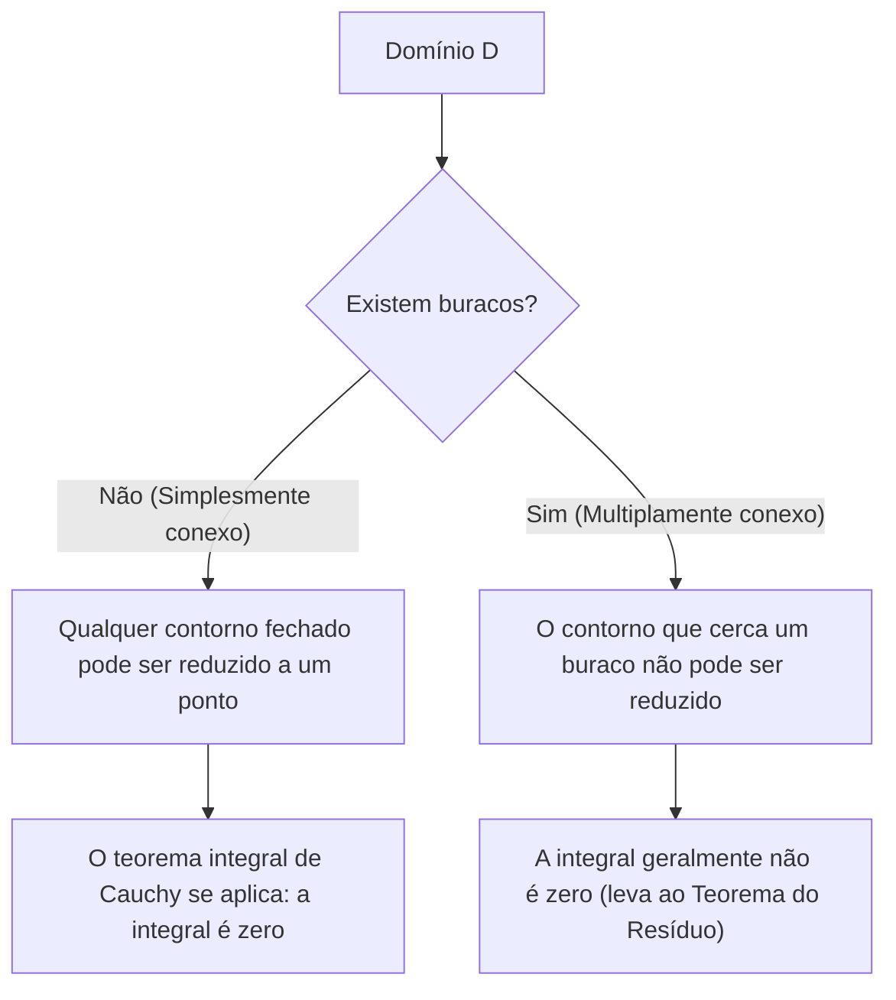

## 1. Introdução

No campo da matemática conhecido como análise complexa, um dos teoremas mais belos e poderosos é o **Teorema integral de [Cauchy](https://kenji.blog/pt/p/cauchy/)**. Este teorema afirma o que à primeira vista parece ser um fato altamente surpreendente: "Integrar uma função complexa que satisfaz certas condições ao longo de um contorno fechado sempre resultará em exatamente zero."

A partir da experiência de aprender a integração de funções reais, a integração é naturalmente pensada como representando "área" ou "acumulação ao longo de um caminho", então se você integrar por uma longa distância ao longo de um caminho, parece natural que algum valor permaneça. No entanto, no plano complexo, quando uma função possui a propriedade especial de ser **holomorfa**, emerge uma simetria surpreendente onde o resultado da integração se torna completamente independente do caminho percorrido, saltando as diferenças nos caminhos.

Neste artigo, explicaremos o teorema integral de [Cauchy](https://kenji.blog/pt/p/cauchy/) em grandes detalhes, começando pelas definições fundamentais do plano complexo e das funções holomorfas, passando pelo significado intuitivo do teorema, sua interpretação física e um esboço de sua prova clássica usando o teorema de Green. Além disso, abordaremos como este teorema se conecta a tópicos mais avançados da análise complexa, como a fórmula integral de [Cauchy](https://kenji.blog/pt/p/cauchy/) e o Teorema do Resíduo. Apreciemos a profundidade insondável deste teorema tanto da perspectiva do rigor matemático quanto da imaginação intuitiva.

## 2. Fundações do Plano Complexo e Funções Holomorfas

Para entender profundamente o teorema integral de [Cauchy](https://kenji.blog/pt/p/cauchy/), devemos primeiro consolidar nossa compreensão dos fundamentos do plano complexo e da diferenciação de funções complexas. O entendimento aqui forma uma base importante para as provas e interpretações dos teoremas que se seguem.

### Funções no Plano Complexo

Uma função complexa $f(z)$ é uma função que mapeia um número complexo $z = x + iy$ para outro número complexo $w = u + iv$. Aqui, $x, y$ são números reais, $i$ é a unidade imaginária ($i^2 = -1$), e $u, v$ são funções de valor real que dependem de $x, y$, respectivamente. Portanto, uma função complexa pode ser representada como uma combinação de duas funções de valor real de duas variáveis reais da seguinte forma:

$$
f(z) = u(x, y) + i v(x, y)
$$

Por exemplo, para a função $f(z) = z^2$, substituir $z = x + iy$ e expandir dá $z^2 = (x + iy)^2 = x^2 - y^2 + 2ixy$. Assim, neste caso, podemos ver que é composto pelas funções de valor real $u(x, y) = x^2 - y^2$ e $v(x, y) = 2xy$.

### Diferenciação Complexa e as Equações de [Cauchy](https://kenji.blog/pt/p/cauchy/)-[Riemann](https://kenji.blog/pt/p/riemann/)

Diz-se que uma função complexa $f(z)$ é **diferenciável** em um ponto $z_0$ se existir o seguinte limite:

$$
f'(z_0) = \lim_{\Delta z \to 0} \frac{f(z_0 + \Delta z) - f(z_0)}{\Delta z}
$$

O que é extremamente importante aqui é que este limite deve convergir exatamente para o mesmo valor, não importa "de que direção" $\Delta z$ se aproxime de zero no plano complexo. No mundo dos números reais, havia apenas duas maneiras: aproximar-se pela direita ou pela esquerda, mas no plano complexo, existem infinitas maneiras de se aproximar. Devido a essa condição estrita, propriedades muito mais fortes do que a diferenciação de funções reais são derivadas.

Quando uma função $f(z)$ é diferenciável em todos os pontos dentro de um certo domínio, diz-se que a função é **holomorfa** nesse domínio. Sabe-se que uma condição necessária e suficiente para ser holomorfa é que a parte real $u$ e a parte imaginária $v$ satisfaçam as seguintes equações diferenciais parciais. Estas são chamadas de **Equações de [Cauchy](https://kenji.blog/pt/p/cauchy/)-[Riemann](https://kenji.blog/pt/p/riemann/)**.

$$
\frac{\partial u}{\partial x} = \frac{\partial v}{\partial y}, \quad \frac{\partial u}{\partial y} = -\frac{\partial v}{\partial x}
$$

Além disso, se $u$ e $v$ tiverem derivadas parciais contínuas, a satisfação dessas equações é equivalente a $f(z)$ ser holomorfa. Essas equações relacionais, que possuem uma bela simetria, desempenham um papel crucial na prova do teorema integral de [Cauchy](https://kenji.blog/pt/p/cauchy/) descrita posteriormente.

## 3. Definição e Propriedades da Integração Complexa

A seguir, definimos a integral de linha no plano complexo. Uma vez que o teorema integral de [Cauchy](https://kenji.blog/pt/p/cauchy/) é um teorema sobre a integração ao longo de uma "curva" no plano complexo, é essencial esclarecer a definição desta integração.

Suponha que uma curva suave $C$ no plano complexo seja parametrizada usando uma variável real $t \in [a, b]$ como $z(t) = x(t) + i y(t)$. A integral de linha da função complexa $f(z)$ ao longo desta curva $C$ é definida da seguinte forma:

$$
\int_C f(z) dz = \int_a^b f(z(t)) z'(t) dt
$$

Aqui, $z'(t) = \frac{dx}{dt} + i \frac{dy}{dt}$, e ao realizar a substituição formal $dz = dx + i dy$, o cálculo pode, em última análise, ser reduzido à integração de variáveis reais.

A integração complexa possui propriedades fundamentais semelhantes à integral de linha de funções reais, tais como:

1. **Linearidade** : Para quaisquer constantes complexas $\alpha, \beta$, é válido que $\int_C (\alpha f(z) + \beta g(z)) dz = \alpha \int_C f(z) dz + \beta \int_C g(z) dz$.
2. **Reversão do Caminho** : Se a direção da curva $C$ (a direção do progresso do ponto de partida para o ponto de chegada) for invertida e denotada como $-C$, então $\int_{-C} f(z) dz = -\int_C f(z) dz$. Percorrer o caminho de integração ao inverso inverte o sinal.
3. **Divisão e Combinação de Caminhos** : Quando uma curva $C$ puder ser dividida em um ponto intermediário em $C_1$ e $C_2$, a integral geral é expressa como a soma das integrais parciais. Ou seja, $\int_C f(z) dz = \int_{C_1} f(z) dz + \int_{C_2} f(z) dz$.

Essas propriedades, embora aparentemente óbvias, tornam-se ferramentas muito poderosas quando mais tarde avançamos em nossos argumentos, distorcendo os caminhos de várias maneiras.

## 4. Formulação do Teorema Integral de [Cauchy](https://kenji.blog/pt/p/cauchy/)

Agora que nossos preparativos estão completos, finalmente declaramos a formulação exata do assunto principal, o teorema integral de [Cauchy](https://kenji.blog/pt/p/cauchy/).

**Teorema (Teorema Integral de [Cauchy](https://kenji.blog/pt/p/cauchy/))**
Para uma função complexa $f(z)$ que é holomorfa em um domínio simplesmente conexo $D$, e para qualquer contorno fechado simples $C$ dentro de $D$, a seguinte igualdade é válida.

$$
\oint_C f(z) dz = 0
$$

Vamos complementar isso com algumas terminologias importantes que aparecem como condições prévias do teorema.

- **Domínio simplesmente conexo** : Falando de forma intuitiva, isso se refere a um domínio "sem buracos". Expresso com rigor matemático, refere-se a um domínio onde qualquer curva fechada dentro dele pode ser contínua e deformada até ser encolhida em um único ponto, sem nunca sair do domínio.
- **Contorno fechado simples** : Esta é uma curva onde o ponto inicial e o ponto final coincidem (curva fechada) e não se cruza ao longo do caminho (simples). Também conhecida como "curva de Jordan", é conhecida por dividir o plano em duas partes: um "interior" e um "exterior" (teorema da curva de Jordan).

O diagrama abaixo mostra visualmente a diferença no comportamento das curvas fechadas em domínios simplesmente conexos versus domínios multiplamente conexos (domínios com buracos).

## 5. Compreensão Intuitiva e Interpretação Física do Teorema

Por que a integral de uma função holomorfa sobre um contorno fechado sempre se torna zero? Para entender isso intuitivamente, em vez de apenas como uma sequência de fórmulas matemáticas, vamos dividir a integral complexa em suas partes real e imaginária.

Seja $f(z) = u + iv$ e $dz = dx + i dy$. A integral pode então ser expandida da seguinte forma:

$$
\oint_C f(z) dz = \oint_C (u + iv)(dx + idy) = \oint_C (u dx - v dy) + i \oint_C (v dx + u dy)
$$

Observe o lado direito dessa equação. Duas integrais reais apareceram, e elas têm exatamente a mesma forma que as integrais de linha de campos vetoriais em um plano 2D. Especificamente, a parte real pode ser interpretada como a integral de linha de um campo vetorial $\vec{F}_1 = (u, -v)$, e a parte imaginária como a integral de linha de um campo vetorial $\vec{F}_2 = (v, u)$.

Considerado no contexto da física (especialmente dinâmica de fluidos ou eletromagnetismo), a integral de linha de um campo vetorial ao longo de um contorno fechado representa a "circulação" desse campo. Se um campo vetorial for tanto "irrotacional" quanto "incompressível", então não importa ao longo de qual curva fechada você calcule a circulação, o resultado será zero.

Lembre-se das equações de [Cauchy](https://kenji.blog/pt/p/cauchy/)-[Riemann](https://kenji.blog/pt/p/riemann/) que aprendemos anteriormente: $\frac{\partial u}{\partial y} = -\frac{\partial v}{\partial x}$. Esta é exatamente a condição que garante que os campos vetoriais $\vec{F}_1$ e $\vec{F}_2$ sejam "irrotacionais". Da mesma forma, a outra equação $\frac{\partial u}{\partial x} = \frac{\partial v}{\partial y}$ garante que sejam "incompressíveis".

Em outras palavras, a condição de ser uma função holomorfa significa formar campos vetoriais que são muito "bem comportados" (sem vórtices, sem fontes ou sorvedouros) do ponto de vista físico e, como resultado, a integral em um loop fechado torna-se necessariamente zero. Este é o significado físico e intuitivo por trás do teorema integral de [Cauchy](https://kenji.blog/pt/p/cauchy/).

## 6. Esboço de uma Prova Rigorosa Usando o Teorema de Green

Aqui, como uma prova clássica e intuitiva do teorema integral de [Cauchy](https://kenji.blog/pt/p/cauchy/), introduzimos um método utilizando o **Teorema de Green** do cálculo. (Nota: Esta prova pressupõe que as derivadas parciais são contínuas, isto é, $f'(z)$ é contínuo.)

O teorema de Green é um poderoso teorema que converte uma integral de linha ao longo de uma curva fechada em um plano numa integral dupla sobre o domínio $D'$ circunscrito por essa curva.

**Teorema de Green**
$$
\oint_{\partial D'} (P dx + Q dy) = \iint_{D'} \left( \frac{\partial Q}{\partial x} - \frac{\partial P}{\partial y} \right) dx dy
$$

Apliquemos este teorema de Green à parte real da integral complexa decomposta de antes. Aqui deixamos $P = u, Q = -v$.

$$
\oint_C (u dx - v dy) = \iint_{D'} \left( \frac{\partial (-v)}{\partial x} - \frac{\partial u}{\partial y} \right) dx dy
$$

Agora, substituímos a equação de [Cauchy](https://kenji.blog/pt/p/cauchy/)-[Riemann](https://kenji.blog/pt/p/riemann/) $\frac{\partial u}{\partial y} = -\frac{\partial v}{\partial x}$, que é uma propriedade de funções holomorfas. Então, o integrando se torna o seguinte:

$$
-\frac{\partial v}{\partial x} - \left( -\frac{\partial v}{\partial x} \right) = 0
$$

Uma vez que o integrando se torna $0$ em todos os pontos dentro do domínio, toda a integral dupla se torna zero, provando que a integral de linha da parte real é zero.

Pelo mesmo procedimento, aplicamos o teorema de Green à parte imaginária $i \oint_C (v dx + u dy)$. Aqui $P = v, Q = u$.

$$
\oint_C (v dx + u dy) = \iint_{D'} \left( \frac{\partial u}{\partial x} - \frac{\partial v}{\partial y} \right) dx dy
$$

Novamente, substituindo a outra equação de [Cauchy](https://kenji.blog/pt/p/cauchy/)-[Riemann](https://kenji.blog/pt/p/riemann/) $\frac{\partial u}{\partial x} = \frac{\partial v}{\partial y}$, o integrando se torna $\frac{\partial v}{\partial y} - \frac{\partial v}{\partial y} = 0$, e a integral da parte imaginária também se torna zero.

Em conclusão, como as partes real e imaginária se tornam zero, o seguinte é válido:

$$
\oint_C f(z) dz = 0 + i0 = 0
$$

Este é o esqueleto da prova do teorema integral de [Cauchy](https://kenji.blog/pt/p/cauchy/). Podemos ver que ao unir perfeitamente as equações de [Cauchy](https://kenji.blog/pt/p/cauchy/)-[Riemann](https://kenji.blog/pt/p/riemann/) e o teorema de Green, a prova pode ser realizada de uma forma surpreendentemente simples.

## 7. O Teorema de Goursat: Removendo a Suposição de Diferenciabilidade Contínua

A prova usando o teorema de Green acima é muito fácil de entender e intuitiva, mas matematicamente ela possui uma fraqueza. Isso significa que ela utiliza implicitamente a suposição de que "$f'(z)$ é contínuo" (isto é, a suposição de que as derivadas parciais de $u, v$ são contínuas). A prova inicial de [Cauchy](https://kenji.blog/pt/p/cauchy/) também se baseou nesta suposição.

No entanto, no final do século XIX, o matemático francês Édouard Goursat provou que essa suposição de continuidade é de fato desnecessária. Quer dizer, ele mostrou que o teorema integral de [Cauchy](https://kenji.blog/pt/p/cauchy/) se mantém verdadeiro simplesmente pelo fato de a função ser "diferenciável (holomorfa) em cada ponto".

A prova de Goursat emprega um método engenhoso de divisão do domínio em pequenos triângulos e o uso de uma prova por contradição para derivar uma contradição (o método da triangulação). Em livros didáticos modernos de análise complexa, esse resultado é geralmente introduzido como o "teorema de [Cauchy](https://kenji.blog/pt/p/cauchy/)-Goursat". Este resultado destacou, mais uma vez, que a condição de ser "complexamente diferenciável pelo menos uma vez" é uma restrição muito mais forte (resultando em ser infinitamente diferenciável) do que se poderia comparar ao caso das funções reais.

## 8. Deformação do Caminho e Independência do Caminho

Uma das consequências extremamente importantes do teorema integral de [Cauchy](https://kenji.blog/pt/p/cauchy/) é a **independência do caminho das integrais**.

Suponha que existam dois pontos $A$ e $B$ dentro de um domínio simplesmente conexo $D$, e há dois caminhos diferentes $C_1$ e $C_2$ conectando-os. Neste momento, se a função $f(z)$ for holomorfa dentro de $D$, o seguinte se aplica:

$$
\int_{C_1} f(z) dz = \int_{C_2} f(z) dz
$$

A prova é muito simples. Considere um caminho que vai para $B$ através de $C_1$ e retorna para $A$ através do caminho reverso $-C_2$. Isto forma uma única curva fechada $C = C_1 + (-C_2)$. Pelo teorema integral de [Cauchy](https://kenji.blog/pt/p/cauchy/), a integral ao longo dessa curva fechada é zero.

$$
\oint_C f(z) dz = \int_{C_1} f(z) dz + \int_{-C_2} f(z) dz = \int_{C_1} f(z) dz - \int_{C_2} f(z) dz = 0
$$

Transpondo isso, obtemos $\int_{C_1} f(z) dz = \int_{C_2} f(z) dz$.

Devido a esta propriedade, a integração de uma função holomorfa não depende da "rota escolhida", mas é determinada "apenas pelos pontos de partida e de chegada". Isso torna possível definir uma primitiva (integral indefinida) $F(z)$ de forma única mesmo no plano complexo (a menos de uma constante de integração), garantindo que o "Teorema Fundamental do Cálculo" para funções reais também seja mantido perfeitamente no plano complexo.

## 9. Aplicação: A Fórmula Integral de [Cauchy](https://kenji.blog/pt/p/cauchy/) e a Extensão para Domínios Multiplamente Conexos

O teorema integral de [Cauchy](https://kenji.blog/pt/p/cauchy/) é um teorema belo por si só, mas serve como um fundamento poderoso para a derivação sucessiva de outros teoremas importantes na análise complexa.

### Fórmula Integral de [Cauchy](https://kenji.blog/pt/p/cauchy/)

A consequência mais direta e amplamente aplicável do teorema é a **fórmula integral de [Cauchy](https://kenji.blog/pt/p/cauchy/)**. Quando uma função $f(z)$ for holomorfa num domínio $D$, para uma curva fechada simples $C$ dentro de $D$ e um ponto qualquer $a$ no seu interior, é válido que:

$$
f(a) = \frac{1}{2\pi i} \oint_C \frac{f(z)}{z - a} dz
$$

Esta fórmula mostra a incrível rigidez das funções holomorfas: "Desde que os valores da função no limite da curva fechada sejam conhecidos, o valor da função em cada ponto dentro do domínio é completamente determinado pelo cálculo integral."

### Domínios Multiplamente Conexos e o Teorema do Resíduo

Se o domínio tem "buracos" e não é simplesmente conexo (domínio multiplamente conexo), o teorema integral de [Cauchy](https://kenji.blog/pt/p/cauchy/) não pode ser aplicado como está. Por exemplo, a função $f(z) = 1/z$ não é definida na origem $z=0$ e não é holomorfa ali. Se integrarmos ao longo da circunferência unitária circunscrita na origem, o resultado não é zero, mas o valor de $2\pi i$.

No entanto, ao aplicar engenhosamente o teorema integral de [Cauchy](https://kenji.blog/pt/p/cauchy/) e deformar o caminho da integração, um método sistemático para avaliar integrais ao redor de buracos foi estabelecido. Isto conduz ao **Teorema do Resíduo**, uma das ferramentas mais práticas da análise complexa moderna. Usando o Teorema do Resíduo, integrais complexas definidas e integrais infinitas de funções reais podem ser brilhantemente substituídas por cálculos algébricos no plano complexo e resolvidos.

## 10. Conclusão

À primeira vista, o teorema integral de [Cauchy](https://kenji.blog/pt/p/cauchy/) pode parecer um modesto teorema que simplesmente afirma "a integral se torna zero". Contudo, oculto por trás disso, há uma simetria profunda e bela trazida pela condição aparentemente simples da "holomorfia" das funções complexas.

A partir desse teorema, glórias conquistas da análise complexa, como a fórmula integral de [Cauchy](https://kenji.blog/pt/p/cauchy/), a prova de que uma função é infinitamente diferenciável (garantindo expansões de Taylor e de Laurent), e o Teorema do Resíduo, são sucessivamente derivadas. O teorema integral de [Cauchy](https://kenji.blog/pt/p/cauchy/) pode, de fato, ser dito como o alicerce mais robusto e belo, que sustenta, a partir das raízes, a magnífica estrutura matemática da análise complexa.

Nós incentivamos os leitores a pegar uma folha e uma caneta, e acompanhar a prova utilizando o Teorema de Green, com as suas próprias mãos. Certamente será possível sentir o harmonioso e lindo universo do plano complexo que se desdobra por trás das fórmulas matemáticas.
