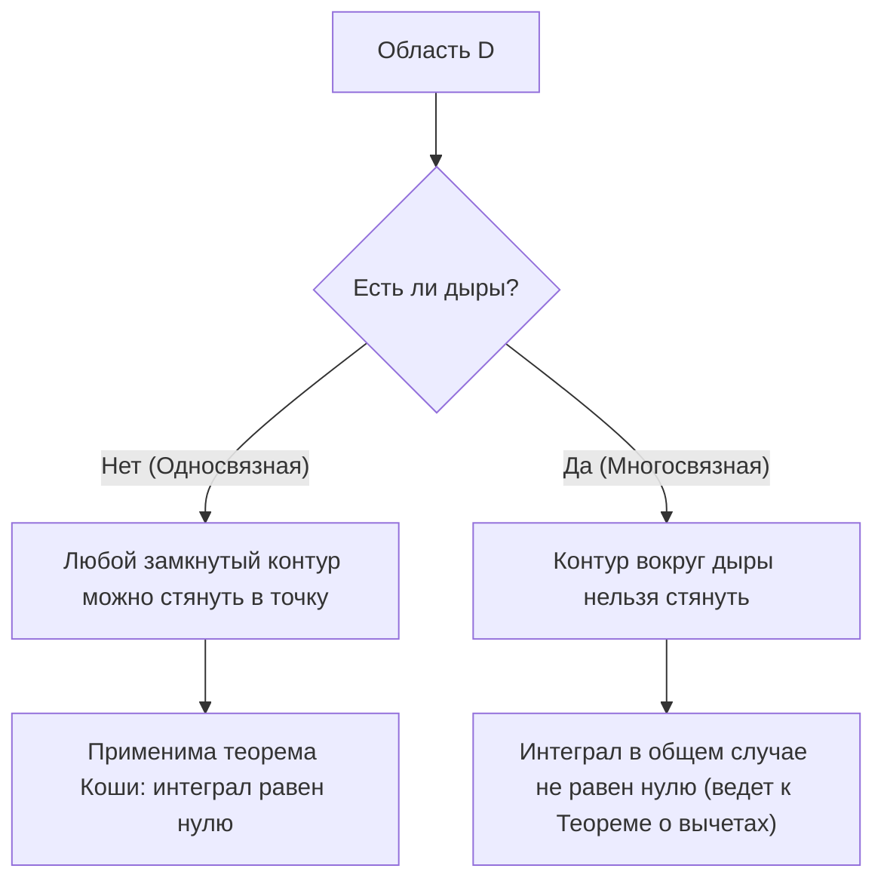

## 1. Введение

В области математики, известной как комплексный анализ, одной из самых красивых и мощных теорем является **интегральная теорема Коши**. Эта теорема утверждает то, что на первый взгляд кажется весьма удивительным фактом: «Интегрирование комплексной функции, удовлетворяющей определенным условиям, по замкнутому контуру всегда дает ровно ноль».

Из опыта изучения интегрирования действительных функций интегрирование естественно воспринимается как представление «площади» или «накопления вдоль пути», поэтому, если вы интегрируете на большом расстоянии вдоль пути, кажется естественным, что останется какое-то значение. Однако на комплексной плоскости, когда функция обладает особым свойством **голоморфности** (аналитичности), возникает поразительная симметрия, при которой результат интегрирования становится совершенно независимым от пройденного пути, перепрыгивая через различия в путях.

В этой статье мы очень подробно объясним интегральную теорему Коши, начиная с фундаментальных определений комплексной плоскости и голоморфных функций, переходя к интуитивному смыслу теоремы, ее физической интерпретации и наброску ее классического доказательства с использованием теоремы Грина. Более того, мы коснемся того, как эта теорема связана с более продвинутыми темами комплексного анализа, такими как интегральная формула Коши и [теорема о вычетах](/ru/p/residue-theorem/). Давайте оценим невероятную глубину этой теоремы как с точки зрения математической строгости, так и с точки зрения интуитивного представления.

## 2. Основы комплексной плоскости и голоморфных функций

Чтобы глубоко понять интегральную теорему Коши, мы должны сначала закрепить наше понимание основ комплексной плоскости и дифференцирования комплексных функций. Понимание этого вопроса формирует важную основу для доказательств и интерпретаций последующих теорем.

### Функции на комплексной плоскости

Комплексная функция $f(z)$ — это функция, которая отображает комплексное число $z = x + iy$ в другое комплексное число $w = u + iv$. Здесь $x, y$ — действительные числа, $i$ — мнимая единица ($i^2 = -1$), а $u, v$ — действительные функции, зависящие от $x, y$ соответственно. Следовательно, комплексная функция может быть представлена как комбинация двух действительных функций двух действительных переменных следующим образом:

$$
f(z) = u(x, y) + i v(x, y)
$$

Например, для функции $f(z) = z^2$ подстановка $z = x + iy$ и раскрытие скобок дает $z^2 = (x + iy)^2 = x^2 - y^2 + 2ixy$. Таким образом, в этом случае мы видим, что она состоит из действительных функций $u(x, y) = x^2 - y^2$ и $v(x, y) = 2xy$.

### Комплексное дифференцирование и условия Коши-Римана

Говорят, что комплексная функция $f(z)$ **дифференцируема** в точке $z_0$, если существует следующий предел:

$$
f'(z_0) = \lim_{\Delta z \to 0} \frac{f(z_0 + \Delta z) - f(z_0)}{\Delta z}
$$

Здесь чрезвычайно важно то, что этот предел должен сходиться к абсолютно одному и тому же значению, независимо от того, «с какого направления» $\Delta z$ приближается к нулю на комплексной плоскости. В мире действительных чисел было только два пути: приближение справа или слева, но в комплексной плоскости существует бесконечное множество способов приближения. Из-за этого строгого условия выводятся свойства, которые намного сильнее, чем при дифференцировании действительных функций.

Когда функция $f(z)$ дифференцируема во всех точках внутри некоторой области, говорят, что функция является **голоморфной** (аналитической) в этой области. Известно, что необходимым и достаточным условием голоморфности является то, чтобы действительная часть $u$ и мнимая часть $v$ удовлетворяли следующим дифференциальным уравнениям в частных производных. Они называются **условиями Коши-Римана**.

$$
\frac{\partial u}{\partial x} = \frac{\partial v}{\partial y}, \quad \frac{\partial u}{\partial y} = -\frac{\partial v}{\partial x}
$$

Более того, если $u$ и $v$ имеют непрерывные частные производные, выполнение этих уравнений эквивалентно тому, что $f(z)$ голоморфна. Эти соотношения, обладающие прекрасной симметрией, играют решающую роль в доказательстве интегральной теоремы Коши, описанной ниже.

## 3. Определение и свойства комплексного интегрирования

Далее мы определяем криволинейный интеграл на комплексной плоскости. Поскольку интегральная теорема Коши — это теорема об интегрировании вдоль «кривой» на комплексной плоскости, необходимо прояснить определение этого интегрирования.

Предположим, гладкая кривая $C$ на комплексной плоскости параметризована с помощью действительной переменной $t \in [a, b]$ как $z(t) = x(t) + i y(t)$. Криволинейный интеграл комплексной функции $f(z)$ вдоль этой кривой $C$ определяется следующим образом:

$$
\int_C f(z) dz = \int_a^b f(z(t)) z'(t) dt
$$

Здесь $z'(t) = \frac{dx}{dt} + i \frac{dy}{dt}$, и путем формальной замены $dz = dx + i dy$ расчет в конечном итоге может быть сведен к интегрированию действительных переменных.

Комплексное интегрирование обладает фундаментальными свойствами, сходными с криволинейным интегрированием действительных функций, такими как:

1. **Линейность** : Для любых комплексных констант $\alpha, \beta$ выполняется $\int_C (\alpha f(z) + \beta g(z)) dz = \alpha \int_C f(z) dz + \beta \int_C g(z) dz$.
2. **Обращение пути** : Если направление кривой $C$ (направление движения от начальной точки к конечной) изменить на противоположное и обозначить как $-C$, то $\int_{-C} f(z) dz = -\int_C f(z) dz$. Прохождение пути интегрирования в обратном направлении меняет знак на противоположный.
3. **Разделение и объединение путей** : Когда кривая $C$ может быть разделена в промежуточной точке на $C_1$ и $C_2$, общий интеграл выражается как сумма частичных интегралов. То есть, $\int_C f(z) dz = \int_{C_1} f(z) dz + \int_{C_2} f(z) dz$.

Эти свойства, хотя и кажутся очевидными, становятся очень мощными инструментами, когда мы позже будем развивать наши аргументы, по-разному деформируя пути.

## 4. Формулировка интегральной теоремы Коши

Теперь, когда наша подготовка завершена, мы, наконец, излагаем точную формулировку главного предмета — интегральной теоремы Коши.

**Теорема (Интегральная теорема Коши)**
Для комплексной функции $f(z)$, которая голоморфна в односвязной области $D$, и для любого простого замкнутого контура $C$ внутри $D$, выполняется следующее равенство.

$$
\oint_C f(z) dz = 0
$$

Давайте дополним это несколькими важными терминами, которые выступают в качестве предварительных условий теоремы.

- **Односвязная область** : Интуитивно говоря, это относится к области «без дыр». Выражаясь со строгой математической точностью, это относится к области, где любая замкнутая кривая внутри нее может быть непрерывно деформирована и стянута в одну точку, никогда не покидая область.
- **Простой замкнутый контур** : Это кривая, где начальная и конечная точки совпадают (замкнутая кривая) и которая не пересекает саму себя по пути (простая). Также известная как «жорданова кривая», она, как известно, делит плоскость на две части: «внутреннюю» и «внешнюю» (теорема Жордана о кривой).

Приведенная ниже диаграмма наглядно демонстрирует разницу в поведении замкнутых кривых в односвязных областях по сравнению с многосвязными областями (областями с дырами).

## 5. Интуитивное понимание и физическая интерпретация теоремы

Почему интеграл голоморфной функции по замкнутому контуру всегда равен нулю? Чтобы понять это интуитивно, а не просто как последовательность математических формул, давайте разобьем комплексный интеграл на действительную и мнимую части.

Пусть $f(z) = u + iv$ и $dz = dx + i dy$. Тогда интеграл можно разложить следующим образом:

$$
\oint_C f(z) dz = \oint_C (u + iv)(dx + idy) = \oint_C (u dx - v dy) + i \oint_C (v dx + u dy)
$$

Обратите внимание на правую часть этого уравнения. Появились два действительных интеграла, и они имеют точно такую же форму, как криволинейные интегралы векторных полей на 2D плоскости. В частности, действительную часть можно интерпретировать как криволинейный интеграл векторного поля $\vec{F}_1 = (u, -v)$, а мнимую часть как криволинейный интеграл векторного поля $\vec{F}_2 = (v, u)$.

Рассматриваемый в контексте физики (особенно гидродинамики или электромагнетизма), криволинейный интеграл векторного поля вдоль замкнутого контура представляет собой «циркуляцию» этого поля. Если векторное поле является одновременно «безвихревым» (irrotational) и «несжимаемым» (incompressible), то независимо от того, по какой замкнутой кривой вы вычисляете циркуляцию, результат будет равен нулю.

Вспомните условия Коши-Римана, которые мы изучили ранее: $\frac{\partial u}{\partial y} = -\frac{\partial v}{\partial x}$. Это именно то условие, которое гарантирует, что векторные поля $\vec{F}_1$ и $\vec{F}_2$ являются «безвихревыми». Точно так же другое уравнение $\frac{\partial u}{\partial x} = \frac{\partial v}{\partial y}$ гарантирует, что они являются «несжимаемыми».

Другими словами, условие голоморфности функции означает формирование векторных полей, которые очень «хорошо себя ведут» (нет вихрей, нет источников или стоков) с физической точки зрения, и в результате интеграл по замкнутому контуру неизбежно становится равным нулю. В этом заключается физический и интуитивный смысл интегральной теоремы Коши.

## 6. Набросок строгого доказательства с использованием теоремы Грина

Здесь в качестве классического и интуитивно понятного доказательства интегральной теоремы Коши мы приводим метод, использующий **теорему Грина** из математического анализа. (Примечание: это доказательство предполагает, что частные производные непрерывны, то есть $f'(z)$ непрерывна.)

Теорема Грина — это мощная теорема, которая преобразует криволинейный интеграл вдоль замкнутой кривой на плоскости в двойной интеграл по области $D'$, ограниченной этой кривой.

**Теорема Грина**
$$
\oint_{\partial D'} (P dx + Q dy) = \iint_{D'} \left( \frac{\partial Q}{\partial x} - \frac{\partial P}{\partial y} \right) dx dy
$$

Давайте применим эту теорему Грина к действительной части разложенного ранее комплексного интеграла. Здесь мы полагаем $P = u, Q = -v$.

$$
\oint_C (u dx - v dy) = \iint_{D'} \left( \frac{\partial (-v)}{\partial x} - \frac{\partial u}{\partial y} \right) dx dy
$$

Теперь мы подставляем условие Коши-Римана $\frac{\partial u}{\partial y} = -\frac{\partial v}{\partial x}$, которое является свойством голоморфных функций. Тогда подынтегральное выражение принимает следующий вид:

$$
-\frac{\partial v}{\partial x} - \left( -\frac{\partial v}{\partial x} \right) = 0
$$

Поскольку подынтегральное выражение становится равным $0$ во всех точках внутри области, весь двойной интеграл становится равным нулю, доказывая, что криволинейный интеграл действительной части равен нулю.

Совершенно аналогичным образом мы применяем теорему Грина к мнимой части $i \oint_C (v dx + u dy)$. Здесь $P = v, Q = u$.

$$
\oint_C (v dx + u dy) = \iint_{D'} \left( \frac{\partial u}{\partial x} - \frac{\partial v}{\partial y} \right) dx dy
$$

Опять же, подставляя другое условие Коши-Римана $\frac{\partial u}{\partial x} = \frac{\partial v}{\partial y}$, подынтегральное выражение становится $\frac{\partial v}{\partial y} - \frac{\partial v}{\partial y} = 0$, и интеграл мнимой части также становится равным нулю.

В заключение, поскольку и действительная, и мнимая части становятся равными нулю, выполняется следующее:

$$
\oint_C f(z) dz = 0 + i0 = 0
$$

Это остов доказательства интегральной теоремы Коши. Мы видим, что благодаря прекрасному сочетанию условий Коши-Римана и теоремы Грина доказательство может быть выполнено удивительно просто.

## 7. Теорема Гурса: отказ от предположения о непрерывной дифференцируемости

Приведенное выше доказательство с использованием теоремы Грина очень легко для понимания и интуитивно, но с математической точки зрения оно имеет одну слабость. А именно, в нем неявно используется предположение о том, что «$f'(z)$ непрерывна» (т. е. предположение о том, что частные производные $u, v$ непрерывны). Первоначальное доказательство Коши также опиралось на это предположение.

Однако в конце 19 века французский математик Эдуард Гурса доказал, что это предположение о непрерывности на самом деле излишне. То есть он показал, что интегральная теорема Коши выполняется просто потому, что функция «дифференцируема (голоморфна) в каждой точке».

В доказательстве Гурса применяется хитроумный метод разбиения области на небольшие треугольники и использования доказательства от противного для вывода противоречия (метод триангуляции). В современных учебниках по комплексному анализу этот результат обычно вводится как «теорема Коши-Гурса». Этот результат еще раз подчеркнул, что условие «комплексной дифференцируемости хотя бы один раз» является гораздо более сильным ограничением (приводящим к бесконечной дифференцируемости), чем можно было бы сравнить со случаем действительных функций.

## 8. Деформация пути и независимость от пути

Одним из чрезвычайно важных следствий интегральной теоремы Коши является **независимость интегралов от пути**.

Предположим, что в односвязной области $D$ есть две точки $A$ и $B$, и есть два различных пути $C_1$ и $C_2$, соединяющих их. В это время, если функция $f(z)$ голоморфна внутри $D$, выполняется следующее:

$$
\int_{C_1} f(z) dz = \int_{C_2} f(z) dz
$$

Доказательство очень простое. Рассмотрим путь, который идет в $B$ через $C_1$ и возвращается в $A$ через обратный путь $-C_2$. Это образует единственную замкнутую кривую $C = C_1 + (-C_2)$. По интегральной теоремы Коши интеграл вдоль этой замкнутой кривой равен нулю.

$$
\oint_C f(z) dz = \int_{C_1} f(z) dz + \int_{-C_2} f(z) dz = \int_{C_1} f(z) dz - \int_{C_2} f(z) dz = 0
$$

Перенося это, мы получаем $\int_{C_1} f(z) dz = \int_{C_2} f(z) dz$.

Благодаря этому свойству интегрирование голоморфной функции не зависит от того, «какой маршрут был выбран», а определяется «только начальной и конечной точками». Это делает возможным однозначно определить первообразную (неопределенный интеграл) $F(z)$ даже на комплексной плоскости (с точностью до константы интегрирования), гарантируя, что «Основная теорема анализа» для действительных функций также прекрасно выполняется на комплексной плоскости.

## 9. Применение: Интегральная формула Коши и расширение на многосвязные области

Интегральная теорема Коши — красивая теорема сама по себе, но она служит мощной основой для последовательного вывода других важных теорем комплексного анализа.

### Интегральная формула Коши

Наиболее прямым и широко применимым следствием теоремы является **интегральная формула Коши**. Когда функция $f(z)$ голоморфна в области $D$, для простой замкнутой кривой $C$ внутри $D$ и любой точки $a$ внутри нее выполняется следующее:

$$
f(a) = \frac{1}{2\pi i} \oint_C \frac{f(z)}{z - a} dz
$$

Эта формула показывает поразительную жесткость голоморфных функций: «Пока известны значения функции на границе замкнутой кривой, значение функции в каждой точке внутри области полностью определяется с помощью интегрального исчисления».

### Многосвязные области и теорема о вычетах

Если область имеет «дыры» и не является односвязной (многосвязная область), интегральная теорема Коши не может быть применена в таком виде. Например, функция $f(z) = 1/z$ не определена в начале координат $z=0$ и не является там голоморфной. Если мы проинтегрируем по единичной окружности, охватывающей начало координат, результатом будет не ноль, а значение $2\pi i$.

Однако, благодаря искусному применению интегральной теоремы Коши и деформации пути интегрирования, был разработан систематический метод оценки интегралов вокруг дыр. Это ведет к **теореме о вычетах**, одному из самых практичных инструментов в современном комплексном анализе. Используя теорему о вычетах, сложные определенные интегралы и несобственные интегралы от действительных функций можно блестяще заменить алгебраическими вычислениями на комплексной плоскости и решить.

## 10. Заключение

На первый взгляд интегральная теорема Коши может показаться скромной теоремой, которая просто гласит: «интеграл равен нулю». Однако за этим скрывается глубокая и прекрасная симметрия, вызванная на первый взгляд простым условием «голоморфности» комплексных функций.

Начиная с этой теоремы, последовательно выводятся такие славные достижения комплексного анализа, как интегральная формула Коши, доказательство бесконечной дифференцируемости функции (гарантирующее разложения Тейлора и Лорана) и [теорема о вычетах](/ru/p/residue-theorem/). Воистину можно сказать, что интегральная теорема Коши — это самый прочный и прекрасный фундамент, который поддерживает великолепное математическое здание комплексного анализа от самых его корней.

Мы призываем читателей взять в руки лист бумаги и ручку и проследить доказательство с использованием теоремы Грина своими собственными руками. Тогда вы наверняка сможете почувствовать прекрасно гармоничный мир комплексной плоскости, который раскинулся за математическими формулами.

