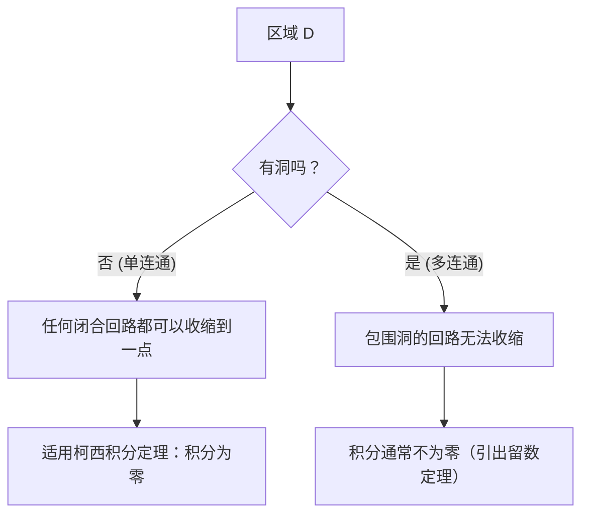

## 1. 引言

在被称为复分析的数学领域中，最美丽且最强大的定理之一便是 **柯西积分定理** ([Cauchy](https://kenji.blog/zh-cn/p/cauchy/)'s integral theorem)。该定理断言了一个乍看之下非常令人惊讶的事实：“沿着闭合路径对满足特定条件的复变函数进行积分，其结果将总是等于零。”

根据学习实函数积分的经验，人们自然地将积分视为代表“面积”或“沿着路径的积累”，因此如果你沿着路径进行长距离的积分，似乎理所当然会留下一些值。然而，在复平面上，当函数拥有 **全纯** (holomorphic) 这一特殊性质时，就会出现一种惊人的对称性，积分的结果变得完全独立于所走的路径，从而跨越了路径之间的差异。

在本文中，我们将非常详细地解释柯西积分定理，从复平面和全纯函数的基础定义出发，探讨该定理的直观含义、物理诠释，以及使用格林定理进行经典证明的草图。此外，我们还将涉及该定理如何与复分析中更高级的主题（如柯西积分公式和[留数定理](https://kenji.blog/zh-cn/p/residue-theorem/)）相联系。让我们从数学的严谨性和直观的想象力这两个角度，共同体会这一定理的深邃之处。

## 2. 复平面与全纯函数的基础

为了深刻理解柯西积分定理，我们必须首先巩固对复平面基础知识和复变函数微分的理解。这里的理解构成了后续定理证明和诠释的重要基石。

### 复平面上的函数

复变函数 $f(z)$ 是一个将复数 $z = x + iy$ 映射到另一个复数 $w = u + iv$ 的函数。这里，$x, y$ 是实数，$i$ 是虚数单位（$i^2 = -1$），而 $u, v$ 分别是依赖于 $x, y$ 的实值函数。因此，复变函数可以表示为两个实变量的两个实值函数的组合，如下所示：

$$
f(z) = u(x, y) + i v(x, y)
$$

例如，对于函数 $f(z) = z^2$，代入 $z = x + iy$ 并展开得到 $z^2 = (x + iy)^2 = x^2 - y^2 + 2ixy$。因此，在这种情况下，我们可以看到它是由实值函数 $u(x, y) = x^2 - y^2$ 和 $v(x, y) = 2xy$ 组成的。

### 复微分与柯西-黎曼方程

如果以下极限存在，则称复变函数 $f(z)$ 在某一点 $z_0$ 处是 **可微的**：

$$
f'(z_0) = \lim_{\Delta z \to 0} \frac{f(z_0 + \Delta z) - f(z_0)}{\Delta z}
$$

这里极其重要的是，无论 $\Delta z$ 在复平面上“从哪个方向”趋近于零，这个极限都必须收敛到完全相同的值。在实数世界中，只有两种方式：从右边或从左边趋近，但在复平面中，有无限多种趋近的方式。由于这种严格的条件，它推导出了比实函数微分要强得多的性质。

当函数 $f(z)$ 在某个区域内的所有点都可微时，则称该函数在该区域内是 **全纯的** (holomorphic)。已知函数全纯的一个充要条件是，其实部 $u$ 和虚部 $v$ 满足以下的偏微分方程。这被称为 **柯西-黎曼方程** ([Cauchy](https://kenji.blog/zh-cn/p/cauchy/)-[Riemann](https://kenji.blog/zh-cn/p/riemann/) equations)。

$$
\frac{\partial u}{\partial x} = \frac{\partial v}{\partial y}, \quad \frac{\partial u}{\partial y} = -\frac{\partial v}{\partial x}
$$

此外，如果 $u$ 和 $v$ 具有连续的偏导数，那么满足这些方程就等价于 $f(z)$ 是全纯的。这些具有美丽对称性的关系式，在后文所述的柯西积分定理的证明中发挥着至关重要的作用。

## 3. 复积分的定义与性质

接下来，我们定义复平面上的线积分。由于柯西积分定理是一个关于沿着复平面上“曲线”积分的定理，因此弄清这个积分的定义是必不可少的。

假设复平面上的一条平滑曲线 $C$ 使用实变量 $t \in [a, b]$ 参数化为 $z(t) = x(t) + i y(t)$。复变函数 $f(z)$ 沿着这条曲线 $C$ 的线积分定义如下：

$$
\int_C f(z) dz = \int_a^b f(z(t)) z'(t) dt
$$

这里，$z'(t) = \frac{dx}{dt} + i \frac{dy}{dt}$，并且通过执行形式上的替换 $dz = dx + i dy$，计算最终可以归结为对实变量的积分。

复积分具有类似于实函数线积分的基本性质，例如：

1. **线性**：对于任意复常数 $\alpha, \beta$，均有 $\int_C (\alpha f(z) + \beta g(z)) dz = \alpha \int_C f(z) dz + \beta \int_C g(z) dz$ 成立。
2. **路径反转**：如果曲线 $C$ 的方向（从起点到终点的行进方向）被反转并记为 $-C$，则 $\int_{-C} f(z) dz = -\int_C f(z) dz$。反向运行积分路径会使符号翻转。
3. **路径的分割与结合**：当一条曲线 $C$ 可以在中间某个点被分割为 $C_1$ 和 $C_2$ 时，整体的积分表示为部分积分的和。即，$\int_C f(z) dz = \int_{C_1} f(z) dz + \int_{C_2} f(z) dz$。

这些性质虽然看似显而易见，但当我们稍后通过各种方式使路径变形来推进论证时，它们将成为非常强大的工具。

## 4. 柯西积分定理的表述

至此我们的准备工作已经完成，终于可以陈述主题——柯西积分定理的精确表述了。

**定理（柯西积分定理）**
对于在单连通区域 $D$ 上全纯的复变函数 $f(z)$，以及 $D$ 内的任意简单闭曲线 $C$，以下等式成立。

$$
\oint_C f(z) dz = 0
$$

让我们补充一些作为该定理先决条件出现的重要术语。

- **单连通区域** (Simply connected domain)：直观地说，这是指“没有洞”的区域。用数学的严谨性来表达，它是指这样一个区域：其内部的任何闭曲线都可以连续地变形并收缩到一个单一的点，而绝不会离开该区域。
- **简单闭曲线** (Simple closed contour)：这是一条起点和终点重合（闭合），并且在途中不与自身相交（简单）的曲线。它也被称为“若尔当曲线” (Jordan curve)，已知它将平面分为两部分：“内部”和“外部”（若尔当曲线定理）。

下面的图表直观地展示了单连通区域与多连通区域（有洞的区域）中闭曲线行为的差异。

## 5. 定理的直观理解与物理诠释

为什么全纯函数在闭合回路上的积分总是变为零？为了直观地理解这一点，而不仅仅是把它看作一串数学公式，让我们将复积分分解为实部和虚部。

令 $f(z) = u + iv$ 且 $dz = dx + i dy$。那么积分可以展开如下：

$$
\oint_C f(z) dz = \oint_C (u + iv)(dx + idy) = \oint_C (u dx - v dy) + i \oint_C (v dx + u dy)
$$

请注意这个方程的右侧。出现了两个实积分，它们与二维平面上向量场的线积分具有完全相同的形式。具体来说，实部可以解释为向量场 $\vec{F}_1 = (u, -v)$ 的线积分，而虚部可以解释为向量场 $\vec{F}_2 = (v, u)$ 的线积分。

在物理学（特别是流体力学或电磁学）的语境中考虑，向量场沿着闭合回路的线积分代表了该场的“环量” (circulation)。如果一个向量场既是“无旋的” (irrotational) 也是“无源的”（不可压缩的，incompressible），那么无论你沿着哪条闭曲线计算环量，结果都将是零。

回想一下我们之前学过的柯西-黎曼方程：$\frac{\partial u}{\partial y} = -\frac{\partial v}{\partial x}$。这正是保证向量场 $\vec{F}_1$ 和 $\vec{F}_2$ 为“无旋”的条件。同样，另一个方程 $\frac{\partial u}{\partial x} = \frac{\partial v}{\partial y}$ 则保证了它们是“无源的”。

换言之，作为全纯函数的条件，意味着从物理的角度来看形成了非常“表现良好”（没有漩涡，没有源或汇）的向量场，结果，闭合回路上的积分必然变为零。这就是柯西积分定理背后的物理和直观含义。

## 6. 使用格林定理的严谨证明草图

在这里，作为柯西积分定理一个经典而直观的证明，我们介绍一种利用微积分中 **格林定理** (Green's theorem) 的方法。（注：该证明假设偏导数是连续的，即 $f'(z)$ 是连续的。）

格林定理是一个强大的定理，它将平面上沿着闭合曲线的线积分转换为该曲线所包围的区域 $D'$ 上的二重积分。

**格林定理**
$$
\oint_{\partial D'} (P dx + Q dy) = \iint_{D'} \left( \frac{\partial Q}{\partial x} - \frac{\partial P}{\partial y} \right) dx dy
$$

让我们将这个格林定理应用到前面分解出的复积分的实部。在这里，我们令 $P = u, Q = -v$。

$$
\oint_C (u dx - v dy) = \iint_{D'} \left( \frac{\partial (-v)}{\partial x} - \frac{\partial u}{\partial y} \right) dx dy
$$

现在，我们代入柯西-黎曼方程 $\frac{\partial u}{\partial y} = -\frac{\partial v}{\partial x}$，这是全纯函数的一个性质。于是，被积函数变为如下形式：

$$
-\frac{\partial v}{\partial x} - \left( -\frac{\partial v}{\partial x} \right) = 0
$$

由于被积函数在区域内的所有点都变为 $0$，整个二重积分变为零，这就证明了实部的线积分为零。

通过完全相同的过程，我们将格林定理应用于虚部 $i \oint_C (v dx + u dy)$。这里 $P = v, Q = u$。

$$
\oint_C (v dx + u dy) = \iint_{D'} \left( \frac{\partial u}{\partial x} - \frac{\partial v}{\partial y} \right) dx dy
$$

同样地，代入另一个柯西-黎曼方程 $\frac{\partial u}{\partial x} = \frac{\partial v}{\partial y}$，被积函数变为 $\frac{\partial v}{\partial y} - \frac{\partial v}{\partial y} = 0$，虚部的积分也变为零。

综上所述，由于实部和虚部都变为零，以下等式成立：

$$
\oint_C f(z) dz = 0 + i0 = 0
$$

这就是柯西积分定理证明的骨架。我们可以看到，通过柯西-黎曼方程和格林定理的美妙结合，证明可以令人惊讶地简单完成。

## 7. 古尔萨定理：移除连续可微性的假设

上述使用格林定理的证明非常容易理解和直观，但在数学上存在一个弱点。也就是说，它隐式地使用了“$f'(z)$ 是连续的”这一假设（即假设 $u, v$ 的偏导数是连续的）。柯西最初的证明也依赖于这一假设。

然而，在19世纪末，法国数学家爱德华·古尔萨 (Édouard Goursat) 证明了这种连续性假设实际上是不必要的。也就是说，他证明了只要函数“在每一点都可微（全纯）”，柯西积分定理就能成立。

古尔萨的证明采用了一种巧妙的方法，将区域划分为小三角形，并使用反证法来推导出矛盾（三角剖分法）。在现代复分析教科书中，这个结果通常被介绍为“柯西-古尔萨定理”。这个结果再次强调，与实函数的情况相比，“即使只有一次复可微”的条件也是一个强得多的约束（其结果是无限次可微的）。

## 8. 路径变形与路径无关性

柯西积分定理一个极其重要的推论是 **积分的路径无关性**。

假设在单连通区域 $D$ 内有两个点 $A$ 和 $B$，并且有两条不同的路径 $C_1$ 和 $C_2$ 连接它们。此时，如果函数 $f(z)$ 在 $D$ 内是全纯的，则以下等式成立：

$$
\int_{C_1} f(z) dz = \int_{C_2} f(z) dz
$$

证明非常简单。考虑一条通过 $C_1$ 到达 $B$，然后通过反向路径 $-C_2$ 返回到 $A$ 的路径。这就形成了一条单一的闭合曲线 $C = C_1 + (-C_2)$。根据柯西积分定理，沿着这条闭合曲线的积分为零。

$$
\oint_C f(z) dz = \int_{C_1} f(z) dz + \int_{-C_2} f(z) dz = \int_{C_1} f(z) dz - \int_{C_2} f(z) dz = 0
$$

通过移项，我们得到 $\int_{C_1} f(z) dz = \int_{C_2} f(z) dz$。

由于这个性质，全纯函数的积分不依赖于“采取了哪条路线”，而是“仅仅由起点和终点决定”。这使得即使在复平面上也能唯一地定义一个原函数（不定积分） $F(z)$（不考虑积分常数），从而保证了实函数的“微积分基本定理”在复平面上也能美妙地成立。

## 9. 应用：柯西积分公式与多连通区域的推广

柯西积分定理本身就是一个美丽的定理，但它更是作为复分析中相继推导出其他重要定理的强大基础。

### 柯西积分公式

该定理最直接、应用最广泛的推论是 **柯西积分公式** ([Cauchy](https://kenji.blog/zh-cn/p/cauchy/)'s integral formula)。当函数 $f(z)$ 在区域 $D$ 中是全纯的时，对于 $D$ 内的一条简单闭合曲线 $C$ 及其内部的任意点 $a$，以下等式成立：

$$
f(a) = \frac{1}{2\pi i} \oint_C \frac{f(z)}{z - a} dz
$$

这个公式展示了全纯函数令人震惊的刚性：“只要闭曲线边界上的函数值是已知的，区域内部每个点处的函数值都可以通过积分计算完全确定。”

### 多连通区域与[留数定理](https://kenji.blog/zh-cn/p/residue-theorem/)

如果区域有“洞”并且不是单连通的（多连通区域），柯西积分定理就不能直接应用。例如，函数 $f(z) = 1/z$ 在原点 $z=0$ 处未定义，因此在那里不是全纯的。如果我们沿着包围原点的单位圆进行积分，结果不是零，而是 $2\pi i$ 这个值。

然而，通过巧妙地应用柯西积分定理并使积分路径变形，建立了一种系统的方法来评估洞周围的积分。这引出了 **[留数定理](https://kenji.blog/zh-cn/p/residue-theorem/)** (Residue theorem)，它是现代复分析中最实用的工具之一。利用[留数定理](https://kenji.blog/zh-cn/p/residue-theorem/)，实函数的复杂定积分和反常积分可以被精彩地替换为复平面上的代数计算并得到解决。

## 10. 结语

乍一看，柯西积分定理可能像是一个普通的定理，仅仅说“积分变为零”。然而，隐藏在其背后的是由复变函数“全纯性”这一看似简单的条件所带来的深邃而美丽的对称性。

从这一定理出发，复分析的光辉成就如柯西积分公式、函数无限次可微的证明（保证了泰勒展开和洛朗展开），以及[留数定理](https://kenji.blog/zh-cn/p/residue-theorem/)，都被相继推导出来。可以说，柯西积分定理确实是从根源上支撑起复分析这座宏伟数学大厦的最坚固、最美丽的基石。

我们鼓励读者拿起纸和笔，亲手走一遍使用格林定理的证明过程。这样你必定能够真切地感受到，在数学公式的背后展开的那片和谐而美丽的复平面世界。

