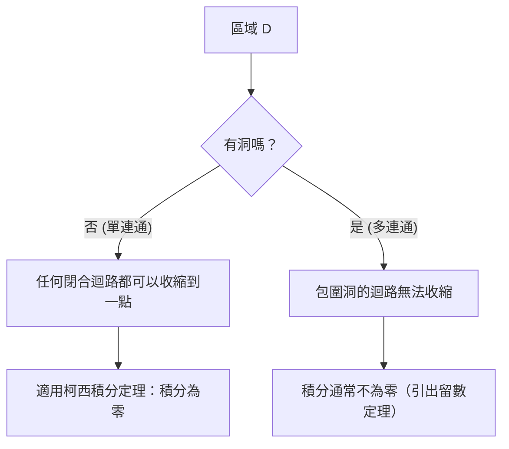

## 1. 引言

在被稱為複變分析的數學領域中，最美麗且最強大的定理之一便是 **柯西積分定理** ([Cauchy](https://kenji.blog/zh-tw/p/cauchy/)'s integral theorem)。該定理斷言了一個乍看之下非常令人驚訝的事實：「沿著閉合路徑對滿足特定條件的複變函數進行積分，其結果將總是等於零。」

根據學習實函數積分的經驗，人們自然地將積分視為代表「面積」或「沿著路徑的累積」，因此如果你沿著路徑進行長距離的積分，似乎理所當然會留下一些值。然而，在複數平面上，當函數擁有 **全純** (holomorphic) 這一特殊性質時，就會出現一種驚人的對稱性，積分的結果變得完全獨立於所走的路徑，從而跨越了路徑之間的差異。

在本文中，我們將非常詳細地解釋柯西積分定理，從複數平面和全純函數的基礎定義出發，探討該定理的直觀含義、物理詮釋，以及使用格林定理進行經典證明的草圖。此外，我們還將涉及該定理如何與複變分析中更高級的主題（如柯西積分公式和[留數定理](https://kenji.blog/zh-tw/p/residue-theorem/)）相聯繫。讓我們從數學的嚴謹性和直觀的想像力這兩個角度，共同體會這一定理的深邃之處。

## 2. 複數平面與全純函數的基礎

為了深刻理解柯西積分定理，我們必須首先鞏固對複數平面基礎知識和複變函數微分的理解。這裡的理解構成了後續定理證明和詮釋的重要基石。

### 複數平面上的函數

複變函數 $f(z)$ 是一個將複數 $z = x + iy$ 映射到另一個複數 $w = u + iv$ 的函數。這裡，$x, y$ 是實數，$i$ 是虛數單位（$i^2 = -1$），而 $u, v$ 分別是依賴於 $x, y$ 的實值函數。因此，複變函數可以表示為兩個實變數的兩個實值函數的組合，如下所示：

$$
f(z) = u(x, y) + i v(x, y)
$$

例如，對於函數 $f(z) = z^2$，代入 $z = x + iy$ 並展開得到 $z^2 = (x + iy)^2 = x^2 - y^2 + 2ixy$。因此，在這種情況下，我們可以看到它是由實值函數 $u(x, y) = x^2 - y^2$ 和 $v(x, y) = 2xy$ 組成的。

### 複微分與柯西-黎曼方程式

如果以下極限存在，則稱複變函數 $f(z)$ 在某一點 $z_0$ 處是 **可微的**：

$$
f'(z_0) = \lim_{\Delta z \to 0} \frac{f(z_0 + \Delta z) - f(z_0)}{\Delta z}
$$

這裡極其重要的是，無論 $\Delta z$ 在複數平面上「從哪個方向」趨近於零，這個極限都必須收斂到完全相同的值。在實數世界中，只有兩種方式：從右邊或從左邊趨近，但在複數平面中，有無限多種趨近的方式。由於這種嚴格的條件，它推導出了比實函數微分要強得多的性質。

當函數 $f(z)$ 在某個區域內的所有點都可微時，則稱該函數在該區域內是 **全純的** (holomorphic)。已知函數全純的一個充要條件是，其實部 $u$ 和虛部 $v$ 滿足以下的偏微分方程式。這被稱為 **柯西-黎曼方程式** ([Cauchy](https://kenji.blog/zh-tw/p/cauchy/)-[Riemann](https://kenji.blog/zh-tw/p/riemann/) equations)。

$$
\frac{\partial u}{\partial x} = \frac{\partial v}{\partial y}, \quad \frac{\partial u}{\partial y} = -\frac{\partial v}{\partial x}
$$

此外，如果 $u$ 和 $v$ 具有連續的偏導數，那麼滿足這些方程式就等價於 $f(z)$ 是全純的。這些具有美麗對稱性的關係式，在後文所述的柯西積分定理的證明中發揮著至關重要的作用。

## 3. 複積分的定義與性質

接下來，我們定義複數平面上的線積分。由於柯西積分定理是一個關於沿著複數平面上「曲線」積分的定理，因此弄清這個積分的定義是必不可少的。

假設複數平面上的一條平滑曲線 $C$ 使用實變數 $t \in [a, b]$ 參數化為 $z(t) = x(t) + i y(t)$。複變函數 $f(z)$ 沿著這條曲線 $C$ 的線積分定義如下：

$$
\int_C f(z) dz = \int_a^b f(z(t)) z'(t) dt
$$

這裡，$z'(t) = \frac{dx}{dt} + i \frac{dy}{dt}$，並且通過執行形式上的替換 $dz = dx + i dy$，計算最終可以歸結為對實變數的積分。

複積分具有類似於實函數線積分的基本性質，例如：

1. **線性**：對於任意複數常數 $\alpha, \beta$，均有 $\int_C (\alpha f(z) + \beta g(z)) dz = \alpha \int_C f(z) dz + \beta \int_C g(z) dz$ 成立。
2. **路徑反轉**：如果曲線 $C$ 的方向（從起點到終點的行進方向）被反轉並記為 $-C$，則 $\int_{-C} f(z) dz = -\int_C f(z) dz$。反向運行積分路徑會使符號翻轉。
3. **路徑的分割與結合**：當一條曲線 $C$ 可以在中間某個點被分割為 $C_1$ 和 $C_2$ 時，整體的積分表示為部分積分的和。即，$\int_C f(z) dz = \int_{C_1} f(z) dz + \int_{C_2} f(z) dz$。

這些性質雖然看似顯而易見，但當我們稍後通過各種方式使路徑變形來推進論證時，它們將成為非常強大的工具。

## 4. 柯西積分定理的表述

至此我們的準備工作已經完成，終於可以陳述主題——柯西積分定理的精確表述了。

**定理（柯西積分定理）**
對於在單連通區域 $D$ 上全純的複變函數 $f(z)$，以及 $D$ 內的任意簡單閉曲線 $C$，以下等式成立。

$$
\oint_C f(z) dz = 0
$$

讓我們補充一些作為該定理先決條件出現的重要術語。

- **單連通區域** (Simply connected domain)：直觀地說，這是指「沒有洞」的區域。用數學的嚴謹性來表達，它是指這樣一個區域：其內部的任何閉曲線都可以連續地變形並收縮到一個單一的點，而絕不會離開該區域。
- **簡單閉曲線** (Simple closed contour)：這是一條起點和終點重合（閉合），並且在途中不與自身相交（簡單）的曲線。它也被稱為「若爾當曲線」 (Jordan curve)，已知它將平面分為兩部分：「內部」和「外部」（若爾當曲線定理）。

下面的圖表直觀地展示了單連通區域與多連通區域（有洞的區域）中閉曲線行為的差異。

## 5. 定理的直觀理解與物理詮釋

為什麼全純函數在閉合迴路上的積分總是變為零？為了直觀地理解這一點，而不僅僅是把它看作一串數學公式，讓我們將複積分分解為實部和虛部。

令 $f(z) = u + iv$ 且 $dz = dx + i dy$。那麼積分可以展開如下：

$$
\oint_C f(z) dz = \oint_C (u + iv)(dx + idy) = \oint_C (u dx - v dy) + i \oint_C (v dx + u dy)
$$

請注意這個方程式的右側。出現了兩個實積分，它們與二維平面上向量場的線積分具有完全相同的形式。具體來說，實部可以解釋為向量場 $\vec{F}_1 = (u, -v)$ 的線積分，而虛部可以解釋為向量場 $\vec{F}_2 = (v, u)$ 的線積分。

在物理學（特別是流體力學或電磁學）的語境中考慮，向量場沿著閉合迴路的線積分代表了該場的「環量」 (circulation)。如果一個向量場既是「無旋的」 (irrotational) 也是「無源的」（不可壓縮的，incompressible），那麼無論你沿著哪條閉曲線計算環量，結果都將是零。

回想一下我們之前學過的柯西-黎曼方程式：$\frac{\partial u}{\partial y} = -\frac{\partial v}{\partial x}$。這正是保證向量場 $\vec{F}_1$ 和 $\vec{F}_2$ 為「無旋」的條件。同樣，另一個方程式 $\frac{\partial u}{\partial x} = \frac{\partial v}{\partial y}$ 則保證了它們是「無源的」。

換言之，作為全純函數的條件，意味著從物理的角度來看形成了非常「表現良好」（沒有漩渦，沒有源或匯）的向量場，結果，閉合迴路上的積分必然變為零。這就是柯西積分定理背後的物理和直觀含義。

## 6. 使用格林定理的嚴謹證明草圖

在這裡，作為柯西積分定理一個經典而直觀的證明，我們介紹一種利用微積分中 **格林定理** (Green's theorem) 的方法。（注：該證明假設偏導數是連續的，即 $f'(z)$ 是連續的。）

格林定理是一個強大的定理，它將平面上沿著閉合曲線的線積分轉換為該曲線所包圍的區域 $D'$ 上的二重積分。

**格林定理**
$$
\oint_{\partial D'} (P dx + Q dy) = \iint_{D'} \left( \frac{\partial Q}{\partial x} - \frac{\partial P}{\partial y} \right) dx dy
$$

讓我們將這個格林定理應用到前面分解出的複積分的實部。在這裡，我們令 $P = u, Q = -v$。

$$
\oint_C (u dx - v dy) = \iint_{D'} \left( \frac{\partial (-v)}{\partial x} - \frac{\partial u}{\partial y} \right) dx dy
$$

現在，我們代入柯西-黎曼方程式 $\frac{\partial u}{\partial y} = -\frac{\partial v}{\partial x}$，這是全純函數的一個性質。於是，被積函數變為如下形式：

$$
-\frac{\partial v}{\partial x} - \left( -\frac{\partial v}{\partial x} \right) = 0
$$

由於被積函數在區域內的所有點都變為 $0$，整個二重積分變為零，這就證明了實部的線積分為零。

通過完全相同的過程，我們將格林定理應用於虛部 $i \oint_C (v dx + u dy)$。這裡 $P = v, Q = u$。

$$
\oint_C (v dx + u dy) = \iint_{D'} \left( \frac{\partial u}{\partial x} - \frac{\partial v}{\partial y} \right) dx dy
$$

同樣地，代入另一個柯西-黎曼方程式 $\frac{\partial u}{\partial x} = \frac{\partial v}{\partial y}$，被積函數變為 $\frac{\partial v}{\partial y} - \frac{\partial v}{\partial y} = 0$，虛部的積分也變為零。

綜上所述，由於實部和虛部都變為零，以下等式成立：

$$
\oint_C f(z) dz = 0 + i0 = 0
$$

這就是柯西積分定理證明的骨架。我們可以看到，通過柯西-黎曼方程式和格林定理的美妙結合，證明可以令人驚訝地簡單完成。

## 7. 古爾薩定理：移除連續可微性的假設

上述使用格林定理的證明非常容易理解和直觀，但在數學上存在一個弱點。也就是說，它隱式地使用了「$f'(z)$ 是連續的」這一假設（即假設 $u, v$ 的偏導數是連續的）。柯西最初的證明也依賴於這一假設。

然而，在19世紀末，法國數學家愛德華·古爾薩 (Édouard Goursat) 證明了這種連續性假設實際上是不必要的。也就是說，他證明了只要函數「在每一點都可微（全純）」，柯西積分定理就能成立。

古爾薩的證明採用了一種巧妙的方法，將區域劃分為小三角形，並使用反證法來推導出矛盾（三角剖分法）。在現代複變分析教科書中，這個結果通常被介紹為「柯西-古爾薩定理」。這個結果再次強調，與實函數的情況相比，「即使只有一次複可微」的條件也是一個強得多的約束（其結果是無限次可微的）。

## 8. 路徑變形與路徑無關性

柯西積分定理一個極其重要的推論是 **積分的路徑無關性**。

假設在單連通區域 $D$ 內有兩個點 $A$ 和 $B$，並且有兩條不同的路徑 $C_1$ 和 $C_2$ 連接它們。此時，如果函數 $f(z)$ 在 $D$ 內是全純的，則以下等式成立：

$$
\int_{C_1} f(z) dz = \int_{C_2} f(z) dz
$$

證明非常簡單。考慮一條通過 $C_1$ 到達 $B$，然後通過反向路徑 $-C_2$ 返回到 $A$ 的路徑。這就形成了一條單一的閉合曲線 $C = C_1 + (-C_2)$。根據柯西積分定理，沿著這條閉合曲線的積分為零。

$$
\oint_C f(z) dz = \int_{C_1} f(z) dz + \int_{-C_2} f(z) dz = \int_{C_1} f(z) dz - \int_{C_2} f(z) dz = 0
$$

通過移項，我們得到 $\int_{C_1} f(z) dz = \int_{C_2} f(z) dz$。

由於這個性質，全純函數的積分不依賴於「採取了哪條路線」，而是「僅僅由起點和終點決定」。這使得即使在複數平面上也能唯一地定義一個反導函數（不定積分） $F(z)$（不考慮積分常數），從而保證了實函數的「微積分基本定理」在複數平面上也能美妙地成立。

## 9. 應用：柯西積分公式與多連通區域的推廣

柯西積分定理本身就是一個美麗的定理，但它更是作為複變分析中相繼推導出其他重要定理的強大基礎。

### 柯西積分公式

該定理最直接、應用最廣泛的推論是 **柯西積分公式** ([Cauchy](https://kenji.blog/zh-tw/p/cauchy/)'s integral formula)。當函數 $f(z)$ 在區域 $D$ 中是全純的時，對於 $D$ 內的一條簡單閉合曲線 $C$ 及其內部的任意點 $a$，以下等式成立：

$$
f(a) = \frac{1}{2\pi i} \oint_C \frac{f(z)}{z - a} dz
$$

這個公式展示了全純函數令人震驚的剛性：「只要閉曲線邊界上的函數值是已知的，區域內部每個點處的函數值都可以通過積分計算完全確定。」

### 多連通區域與[留數定理](https://kenji.blog/zh-tw/p/residue-theorem/)

如果區域有「洞」並且不是單連通的（多連通區域），柯西積分定理就不能直接應用。例如，函數 $f(z) = 1/z$ 在原點 $z=0$ 處未定義，因此在那裡不是全純的。如果我們沿著包圍原點的單位圓進行積分，結果不是零，而是 $2\pi i$ 這個值。

然而，通過巧妙地應用柯西積分定理並使積分路徑變形，建立了一種系統的方法來評估洞周圍的積分。這引出了 **[留數定理](https://kenji.blog/zh-tw/p/residue-theorem/)** (Residue theorem)，它是現代複變分析中最實用的工具之一。利用[留數定理](https://kenji.blog/zh-tw/p/residue-theorem/)，實函數的複雜定積分和瑕積分可以被精彩地替換為複數平面上的代數計算並得到解決。

## 10. 結語

乍看之下，柯西積分定理可能像是一個普通的定理，僅僅說「積分變為零」。然而，隱藏在其背後的是由複變函數「全純性」這一看似簡單的條件所帶來的深邃而美麗的對稱性。

從這一定理出發，複變分析的光輝成就如柯西積分公式、函數無限次可微的證明（保證了泰勒展開和羅朗展開），以及[留數定理](https://kenji.blog/zh-tw/p/residue-theorem/)，都被相繼推導出來。可以說，柯西積分定理確實是從根源上支撐起複變分析這座宏偉數學大廈的最堅固、最美麗的基石。

我們鼓勵讀者拿起紙和筆，親手走一遍使用格林定理的證明過程。這樣你必定能夠真切地感受到，在數學公式的背後展開的那片和諧而美麗的複數平面世界。
