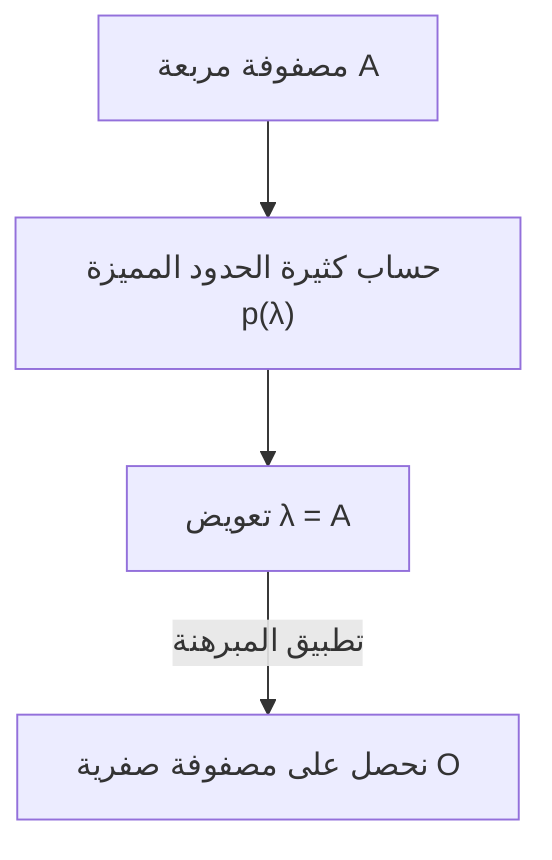

## 1. مقدمة

عند دراسة الجبر الخطي، تصادف العديد من المبرهنات والصيغ الجميلة. ومن بينها، **[مبرهنة كيلي-هاميلتون](https://kenji.blog/p/cayley-hamilton-theorem/)** (Cayley-Hamilton theorem) هي واحدة من أكثر النتائج عجباً، والتي تبدو للوهلة الأولى وكأنها سحر.

باختصار، تنص هذه المبرهنة على أن "كل مصفوفة مربعة تحقق معادلتها المميزة". المعادلة المميزة هي معادلة جبرية تُحل لإيجاد القيم الذاتية (Eigenvalues) لمصفوفة. وتدّعي المبرهنة ادعاءً مدهشاً وهو أن التعويض بالمصفوفة نفسها في متغير هذه المعادلة ينتج عنه المصفوفة الصفرية. إنها ظاهرة رائعة أن تكون مصفوفة - وهي مجرد ترتيب من الأرقام - جذراً لكثيرة حدود مشتقة من خصائصها الخاصة.

في هذا المقال، سنشرح **[مبرهنة كيلي-هاميلتون](https://kenji.blog/p/cayley-hamilton-theorem/)** بالتفصيل، بدءًا من مراجعة المفاهيم الأساسية، وصولاً إلى معناها البديهي، وإثباتها الدقيق، وتطبيقاتها العملية في حساب قوى المصفوفات ومعكوساتها، مع إعطاء العديد من الأمثلة الملموسة.

## 2. المكانة والأهمية في الجبر الخطي

يعد الجبر الخطي اليوم تخصصًا أساسيًا للعديد من المجالات، من الرياضيات والفيزياء إلى الهندسة والتعلم الآلي وعلوم البيانات. وتعتبر المصفوفات أدوات قوية لتمثيل التحويلات الخطية في هذه المجالات.

تُعد **[مبرهنة كيلي-هاميلتون](https://kenji.blog/p/cayley-hamilton-theorem/)** مفتاحًا للفهم العميق للخصائص الجبرية للمصفوفات. فهي تتيح اختزال كثيرات الحدود المصفوفية من الدرجات العليا إلى درجات أقل، وتعمل كجسر بين الفضاءات ذات الأبعاد اللانهائية والأبعاد المنتهية. وتظهر المبرهنة مرارًا في سيناريوهات عملية، مثل تحليل قابلية التحكم والمراقبة في نظرية التحكم، وحساب المؤثرات في ميكانيكا الكم.

## 3. مراجعة المعادلات المميزة والقيم الذاتية

لفهم المبرهنة، دعونا نراجع أولاً مفاهيم **المعادلة المميزة** (characteristic equation) و **القيم الذاتية** (eigenvalues).

بالنسبة لمصفوفة مربعة $A$ من الرتبة $n \times n$، إذا وجد كمية قياسية (سكالر) $\lambda$ ومتجه غير صفري $\mathbf{x}$ يحققان العلاقة التالية، فإن $\lambda$ يُسمى قيمة ذاتية للمصفوفة $A$، ويُسمى $\mathbf{x}$ المتجه الذاتي (eigenvector).

$$
A \mathbf{x} = \lambda \mathbf{x}
$$

تعني هذه المعادلة أن نتيجة ضرب المتجه $\mathbf{x}$ في المصفوفة $A$ هي مجرد المتجه $\mathbf{x}$ مضروبًا (مقياسًا) بـ $\lambda$. دعونا نعدل هذه المعادلة قليلاً. لتكن $I$ هي مصفوفة الوحدة من الرتبة $n$.

$$
(\lambda I - A) \mathbf{x} = \mathbf{0}
$$

الشرط الضروري والكافي لكي يكون للمتجه $\mathbf{x}$ حل غير صفري (غير بديهي) هو أن تكون مصفوفة المعاملات $(\lambda I - A)$ غير قابلة للعكس، مما يعني أن محددها يجب أن يكون صفراً.

$$
\det(\lambda I - A) = 0
$$

تُسمى هذه المعادلة **المعادلة المميزة** للمصفوفة $A$. كما أن كثيرة الحدود في الجانب الأيسر $p(\lambda) = \det(\lambda I - A)$ تُسمى **كثيرة الحدود المميزة** (characteristic polynomial). بحسب تعريف المحدد، فإن $p(\lambda)$ هي كثيرة حدود من الدرجة $n$ بالنسبة للمتغير $\lambda$.

$$
p(\lambda) = \lambda^n + c_{n-1}\lambda^{n-1} + \dots + c_1\lambda + c_0
$$

ومن المعروف هنا أن $c_{n-1} = -\text{tr}(A)$ (سالب الأثر) وأن $c_0 = (-1)^n \det(A)$.

## 4. نص [مبرهنة كيلي-هاميلتون](https://kenji.blog/p/cayley-hamilton-theorem/)

الآن نصل إلى جوهر **[مبرهنة كيلي-هاميلتون](https://kenji.blog/p/cayley-hamilton-theorem/)**. نص المبرهنة بسيط للغاية ولكنه ذو تأثير قوي.

> **مبرهنة ([مبرهنة كيلي-هاميلتون](https://kenji.blog/p/cayley-hamilton-theorem/))**
> لأي مصفوفة مربعة $A$ من الرتبة $n$ وكثيرة حدودها المميزة $p(\lambda) = \det(\lambda I - A)$، فإن التعويض عن المتغير $\lambda$ بالمصفوفة $A$ ينتج عنه المصفوفة الصفرية $O$. أي أن:
> $$ p(A) = A^n + c_{n-1}A^{n-1} + \dots + c_1 A + c_0 I = O $$
> صحيحة دائماً.

إحدى النقاط المهمة التي يجب ملاحظتها هنا هي أن الحد الثابت $c_0$ يصبح $c_0 I$ (مضاعف قياسي لمصفوفة الوحدة) في كثيرة الحدود المصفوفية. وبما أنه لا يمكنك جمع كمية قياسية (رقم) مباشرة مع مصفوفة، يجب تعويض ذلك بالضرب في مصفوفة الوحدة.

## 5. مثال عملي وحساب لمصفوفة 2x2

قد يكون من الصعب استيعاب التعريفات المجردة، لذا دعونا نتحقق من المبرهنة عملياً بحسابها للحالة الأكثر دراية: مصفوفة من الرتبة $2 \times 2$.

لنعرّف مصفوفة عامة $A$ كالتالي:

$$
A = \begin{pmatrix} a & b \\ c & d \end{pmatrix}
$$

أولاً، نحسب كثيرة الحدود المميزة $p(\lambda)$.

$$
\begin{aligned}
p(\lambda) &= \det(\lambda I - A) \\
&= \det \begin{pmatrix} \lambda - a & -b \\ -c & \lambda - d \end{pmatrix} \\
&= (\lambda - a)(\lambda - d) - (-b)(-c) \\
&= \lambda^2 - (a + d)\lambda + (ad - bc)
\end{aligned}
$$

هنا، $a + d$ يمثل **أثر** (trace) المصفوفة $A$، و $ad - bc$ يمثل **محدد** (determinant) المصفوفة $A$. وبكتابتهما على التوالي كـ $\text{tr}(A)$ و $\det(A)$، تصبح المعادلة المميزة:

$$
p(\lambda) = \lambda^2 - \text{tr}(A)\lambda + \det(A)
$$

تؤكد [مبرهنة كيلي-هاميلتون](https://kenji.blog/p/cayley-hamilton-theorem/) أن التعويض بـ $\lambda = A$ فيها سيعطي المصفوفة الصفرية، أي أن المعادلة التالية صحيحة:

$$
A^2 - \text{tr}(A)A + \det(A)I = O
$$

هذه هي الصيغة القياسية لمصفوفات $2 \times 2$ التي تظهر غالباً في رياضيات المرحلة الثانوية. دعونا نحسب فعلياً العناصر للتأكد.

$$
A^2 = \begin{pmatrix} a & b \\ c & d \end{pmatrix} \begin{pmatrix} a & b \\ c & d \end{pmatrix} = \begin{pmatrix} a^2 + bc & ab + bd \\ ac + cd & bc + d^2 \end{pmatrix}
$$

نكمل حساب الجانب الأيسر:

$$
\begin{aligned}
& A^2 - (a+d)A + (ad-bc)I \\
&= \begin{pmatrix} a^2 + bc & ab + bd \\ ac + cd & bc + d^2 \end{pmatrix} - \begin{pmatrix} a^2 + ad & ab + bd \\ ac + cd & ad + d^2 \end{pmatrix} + \begin{pmatrix} ad - bc & 0 \\ 0 & ad - bc \end{pmatrix} \\
&= \begin{pmatrix} a^2 + bc - a^2 - ad + ad - bc & ab + bd - ab - bd + 0 \\ ac + cd - ac - cd + 0 & bc + d^2 - ad - d^2 + ad - bc \end{pmatrix} \\
&= \begin{pmatrix} 0 & 0 \\ 0 & 0 \end{pmatrix} = O
\end{aligned}
$$

يلغي كل عنصر الآخر ببراعة، مما يؤدي بالفعل إلى المصفوفة الصفرية!

## 6. الفهم البديهي والمفاهيم الخاطئة الشائعة

عندما يصادف الناس [مبرهنة كيلي-هاميلتون](https://kenji.blog/p/cayley-hamilton-theorem/) لأول مرة، يقع الكثيرون في **مفهوم خاطئ شائع** .

> **مثال على إثبات خاطئ:**
> كثيرة الحدود المميزة هي $p(\lambda) = \det(\lambda I - A)$.
> لذلك، بما أن $p(A)$ يتم الحصول عليها بتعويض $A$ في $\lambda$،
> $p(A) = \det(A I - A) = \det(A - A) = \det(O) = 0$.
> وبذلك تم إثبات المبرهنة.

هذا الاستنتاج **خاطئ تماماً** . والسبب هو أن $p(\lambda)$ هي دالة تخرج "قيمة قياسية" (كثيرة حدود)، بينما عملية $p(A)$ المتمثلة في تعويض المصفوفة في $\lambda$ تخلق "مصفوفة" باستبدال $\lambda$ بـ $A$ في كل حد. من ناحية أخرى، فإن الإثبات الخاطئ أعلاه يعوض بالمصفوفة $A$ مباشرة داخل المحدد لاستخراج القيمة القياسية $0$، مما يخلط بين أنواع غير متطابقة (مصفوفة في الجانب الأيسر وقيمة قياسية في الجانب الأيمن).

بديهياً، من الأسهل فهم ذلك إذا اعتبرنا الحالة التي تكون فيها المصفوفة $A$ قابلة للتقطير (diagonalizable).
لنفترض أنه يمكن تقطير المصفوفة $A$ على الشكل $A = P D P^{-1}$ (حيث $D$ هي مصفوفة قطرية تقع القيم الذاتية $\lambda_1, \dots, \lambda_n$ على قطرها).

$$ p(A) = p(P D P^{-1}) = P p(D) P^{-1} $$

تتكون كثيرة الحدود لمصفوفة قطرية ببساطة عن طريق تطبيق كثيرة الحدود على كل عنصر من عناصر القطر:

$$
p(D) = \begin{pmatrix} p(\lambda_1) & & 0 \\ & \ddots & \\ 0 & & p(\lambda_n) \end{pmatrix}
$$

من خلال تعريف كثيرة الحدود المميزة، تحقق كل قيمة ذاتية $\lambda_i$ المعادلة $p(\lambda_i) = 0$. وبالتالي، تصبح $p(D)$ المصفوفة الصفرية، مما يؤدي إلى $p(A) = P O P^{-1} = O$.

ومع ذلك، نظراً لأن ليست كل المصفوفات قابلة للتقطير (مثل تلك التي لا تمتلك مجموعة كاملة من المتجهات الذاتية المستقلة خطياً)، فإن هذا التفسير لا يُعد إثباتاً كاملاً. وهناك حاجة إلى نهج آخر للإثبات العام.

## 7. الإثبات الدقيق ل[مبرهنة كيلي-هاميلتون](https://kenji.blog/p/cayley-hamilton-theorem/)

نقدم هنا إثباتاً عاماً (باستخدام المصفوفة المرافقة) ينطبق على أي مصفوفة مربعة $A$ من الرتبة $n \times n$. هذا الإثبات أنيق للغاية ويُظهر براعة جبرية.

لتكن $B(\lambda)$ هي **المصفوفة المرافقة** (adjugate matrix) للمصفوفة $\lambda I - A$. نستخدم الخاصية التي تنص على أنه لأي مصفوفة مربعة $M$، فإن $M \cdot \text{adj}(M) = \det(M) I$ تتحقق. يعطينا هذا المتطابقة التالية:

$$
(\lambda I - A) B(\lambda) = \det(\lambda I - A) I = p(\lambda) I
$$

بما أن كل عنصر من عناصر المصفوفة $\lambda I - A$ هو كثيرة حدود في $\lambda$ من الدرجة 1 أو أقل، فإن محدد كل عنصر من مصفوفتها المرافقة $B(\lambda)$ سيكون كثيرة حدود في $\lambda$ من الدرجة $(n-1)$ أو أقل. وبالتالي، يمكن التعبير عن $B(\lambda)$ ككثيرة حدود في $\lambda$ بمعاملات مصفوفية كما يلي:

$$
B(\lambda) = B_{n-1}\lambda^{n-1} + B_{n-2}\lambda^{n-2} + \dots + B_1\lambda + B_0
$$
(حيث $B_k$ مصفوفات ثابتة من الرتبة $n \times n$)

نعوض هذا في المتطابقة السابقة. بنشر الجانب الأيسر نحصل على:

$$
\begin{aligned}
(\lambda I - A) B(\lambda) &= (\lambda I - A)(B_{n-1}\lambda^{n-1} + B_{n-2}\lambda^{n-2} + \dots + B_1\lambda + B_0) \\
&= B_{n-1}\lambda^n + (B_{n-2} - A B_{n-1})\lambda^{n-1} + \dots + (B_0 - A B_1)\lambda - A B_0
\end{aligned}
$$

في الوقت نفسه، إذا كُتبت كثيرة الحدود المميزة على الشكل $p(\lambda) = \lambda^n + c_{n-1}\lambda^{n-1} + \dots + c_1\lambda + c_0$، فإن الجانب الأيمن هو:

$$
p(\lambda)I = I\lambda^n + c_{n-1}I\lambda^{n-1} + \dots + c_1 I\lambda + c_0 I
$$

بما أن كلا الجانبين هما كثيرة حدود متطابقة لأي $\lambda$، فيمكننا مساواة المعاملات المقابلة لكل قوة من قوى $\lambda$ (والتي هي مصفوفات).

$$
\begin{aligned}
B_{n-1} &= I \quad \text{(معامل λ^n)} \\
B_{n-2} - A B_{n-1} &= c_{n-1} I \quad \text{(معامل λ^{n-1})} \\
&\vdots \\
B_0 - A B_1 &= c_1 I \quad \text{(معامل λ^1)} \\
-A B_0 &= c_0 I \quad \text{(معامل λ^0)}
\end{aligned}
$$

هنا يأتي ذروة الإثبات. نضرب كلا الجانبين من هذه المعادلات بـ $A^n, A^{n-1}, \dots, A, I$ من اليسار، على التوالي من الأعلى إلى الأسفل.

$$
\begin{aligned}
A^n B_{n-1} &= A^n \\
A^{n-1} B_{n-2} - A^n B_{n-1} &= c_{n-1} A^{n-1} \\
&\vdots \\
A B_0 - A^2 B_1 &= c_1 A \\
-A B_0 &= c_0 I
\end{aligned}
$$

الآن نجمع كل هذه المعادلات البالغ عددها $n+1$. يلغي الجانب الأيسر بعضه بعضاً بشكل متداخل جميل (Telescoping)، تاركاً فقط المصفوفة الصفرية $O$.

$$
O = A^n + c_{n-1}A^{n-1} + \dots + c_1 A + c_0 I
$$

وهذا هو بالضبط $p(A) = O$، وبذلك تم إثبات [مبرهنة كيلي-هاميلتون](https://kenji.blog/p/cayley-hamilton-theorem/).

## 8. التطبيق 1: حساب قوى المصفوفات

أحد التطبيقات القوية ل[مبرهنة كيلي-هاميلتون](https://kenji.blog/p/cayley-hamilton-theorem/) هو أنها يمكن أن تبسط حساب قوى المصفوفات العالية $A^m$ بشكل كبير.

على سبيل المثال، لنفترض أن لدينا مصفوفة مربعة $A$ من الرتبة $2 \times 2$ تحقق المعادلة $p(A) = A^2 - 3A + 2I = O$. ونريد حساب $A^{10}$.
حساب هذا بالطريقة العادية يتطلب 9 عمليات ضرب مصفوفات، ولكن باستخدام المبرهنة، يتقلص الأمر إلى عملية قسمة كثيرات الحدود.

لنجعل $Q(\lambda)$ هو الناتج و $R(\lambda) = \alpha \lambda + \beta$ هو الباقي عند قسمة $\lambda^{10}$ على كثيرة الحدود المميزة $p(\lambda) = \lambda^2 - 3\lambda + 2$.

$$
\lambda^{10} = Q(\lambda)(\lambda^2 - 3\lambda + 2) + (\alpha \lambda + \beta)
$$

بما أن $p(\lambda) = (\lambda - 1)(\lambda - 2)$، نعوض بـ $\lambda = 1$ و $\lambda = 2$ لإيجاد المجاهيل $\alpha, \beta$.

عندما $\lambda = 1$: $1^{10} = \alpha + \beta \implies \alpha + \beta = 1$
عندما $\lambda = 2$: $2^{10} = 2\alpha + \beta \implies 2\alpha + \beta = 1024$

بحل هذا النظام نحصل على $\alpha = 1023, \beta = -1022$. وبالتالي،
$$ \lambda^{10} = Q(\lambda)p(\lambda) + 1023\lambda - 1022 $$
وبالتعويض بـ $\lambda = A$ هنا، وبما أن $p(A) = O$، يختفي الحد الأول ويبقى:

$$
A^{10} = 1023A - 1022I
$$

بهذه الطريقة، وبغض النظر عن مدى ارتفاع الأس، يكفي فقط حساب الباقي $R(A)$ لإيجاد $A^m$، مما يقلل بشكل كبير من عبء الحساب.

## 9. التطبيق 2: حساب المصفوفة المعكوسة

إذا كانت المصفوفة قابلة للعكس (أي $\det(A) \neq 0$، وبالتالي فإن الحد الثابت $c_0 \neq 0$)، فإنه يمكن أيضاً استخدام [مبرهنة كيلي-هاميلتون](https://kenji.blog/p/cayley-hamilton-theorem/) لحساب المصفوفة المعكوسة $A^{-1}$.

نقوم بإعادة ترتيب معادلة المبرهنة:

$$
A^n + c_{n-1}A^{n-1} + \dots + c_1 A + c_0 I = O
$$

ننقل الجزء الذي يحتوي على الحد الثابت، $c_0 I$، إلى الجانب الأيمن.

$$
A(A^{n-1} + c_{n-1}A^{n-2} + \dots + c_1 I) = -c_0 I
$$

نقسم كلا الجانبين على $-c_0$.

$$
A \left[ -\frac{1}{c_0} (A^{n-1} + c_{n-1}A^{n-2} + \dots + c_1 I) \right] = I
$$

من تعريف المصفوفة المعكوسة $A A^{-1} = I$، فإن المحتوى داخل الأقواس يمثل بالضبط $A^{-1}$.

$$
A^{-1} = -\frac{1}{c_0} (A^{n-1} + c_{n-1}A^{n-2} + \dots + c_1 I)
$$

وبهذا يتم اختزال مشكلة إيجاد المعكوس إلى حسابات تتم فقط عن طريق ضرب وجمع المصفوفات. وعند البرمجة، يكون هذا في بعض الأحيان أسهل في التنفيذ من حساب المصفوفة المرافقة مباشرة.

## 10. خاتمة

في هذا المقال، أوضحنا بالتفصيل **[مبرهنة كيلي-هاميلتون](https://kenji.blog/p/cayley-hamilton-theorem/)** ، إحدى أهم مبرهنات الجبر الخطي.

* الخاصية المدهشة حيث أن التعويض بمصفوفة في كثيرة حدودها المميزة $p(\lambda)$ يعطي المصفوفة الصفرية ($p(A) = O$).
* الفهم البديهي من خلال التقطير، والمفهوم الخاطئ الشائع الذي يخلط بينه وبين التعويض بالقيم القياسية.
* الإثبات الأنيق والدقيق باستخدام المتطابقة مع المصفوفة المرافقة.
* التطبيقات العملية مثل الحساب السريع لقوى المصفوفات باستخدام قسمة كثيرات الحدود، وصيغ لإيجاد المعكوسات.

لا تمتلك [مبرهنة كيلي-هاميلتون](https://kenji.blog/p/cayley-hamilton-theorem/) جمالاً نظرياً فحسب، بل هي أداة مفيدة للغاية في الحسابات الملموسة. إن إدراكك الدائم لوجود هذه المبرهنة في الخلفية عند التعامل مع المصفوفات سيعمق بلا شك من فهمك للجبر الخطي.
