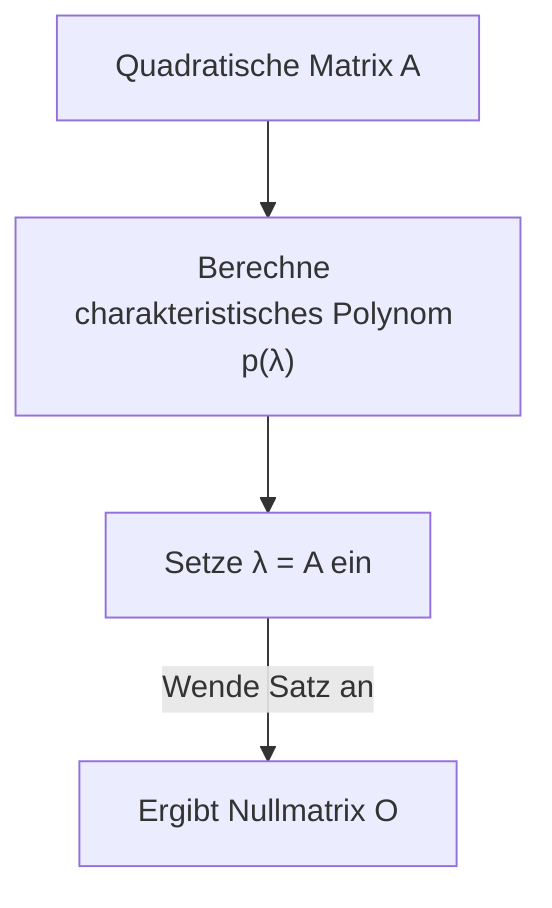

## 1. Einleitung

Beim Studium der linearen Algebra begegnet man vielen schönen Sätzen und Formeln. Unter ihnen ist der **[Satz von Cayley-Hamilton](https://kenji.blog/p/cayley-hamilton-theorem/)** (Cayley-Hamilton theorem) eines der wundersamsten Ergebnisse, das auf den ersten Blick fast wie Magie wirkt.

Kurz gesagt besagt dieser Satz, dass "jede quadratische Matrix ihre eigene charakteristische Gleichung erfüllt". Die charakteristische Gleichung ist eine algebraische Gleichung, die gelöst wird, um die Eigenwerte einer Matrix zu finden. Der Satz stellt die überraschende Behauptung auf, dass das Einsetzen der Matrix selbst in die Variable dieser Gleichung die Nullmatrix ergibt. Es ist ein faszinierendes Phänomen, dass eine Anordnung von Zahlen – eine Matrix – die Wurzel eines Polynoms ist, das aus ihren eigenen Eigenschaften abgeleitet wurde.

In diesem Artikel werden wir den **[Satz von Cayley-Hamilton](https://kenji.blog/p/cayley-hamilton-theorem/)** im Detail erklären, beginnend mit einer Wiederholung der Grundbegriffe über seine intuitive Bedeutung und den strengen Beweis bis hin zu praktischen Anwendungen bei der Berechnung von Matrixpotenzen und Inversen, ergänzt durch zahlreiche konkrete Beispiele.

## 2. Stellung und Bedeutung in der linearen Algebra

Die lineare Algebra ist heute eine Grundlagendisziplin für viele Bereiche, von Mathematik und Physik bis hin zu Ingenieurwesen, maschinellem Lernen und Datenwissenschaft. Matrizen sind dabei mächtige Werkzeuge zur Darstellung linearer Abbildungen.

Der **[Satz von Cayley-Hamilton](https://kenji.blog/p/cayley-hamilton-theorem/)** ist der Schlüssel zu einem tieferen Verständnis der algebraischen Eigenschaften von Matrizen. Er ermöglicht es, Matrixpolynome höheren Grades auf Polynome niedrigeren Grades zu reduzieren, und fungiert als Brücke zwischen unendlichdimensionalen und endlichdimensionalen Räumen. Er taucht häufig in praktischen Situationen auf, etwa bei der Analyse von Steuerbarkeit und Beobachtbarkeit in der Regelungstechnik oder der Berechnung von Operatoren in der Quantenmechanik.

## 3. Wiederholung von charakteristischer Gleichung und Eigenwerten

Um den Satz zu verstehen, wollen wir zunächst die Konzepte der **charakteristischen Gleichung** (characteristic equation) und der **Eigenwerte** (eigenvalues) wiederholen.

Wenn für eine quadratische $n \times n$-Matrix $A$ ein Skalar $\lambda$ und ein Vektor $\mathbf{x}$ ungleich Null existieren, die folgende Beziehung erfüllen, dann nennt man $\lambda$ einen Eigenwert der Matrix $A$ und $\mathbf{x}$ einen Eigenvektor (eigenvector).

$$
A \mathbf{x} = \lambda \mathbf{x}
$$

Diese Gleichung bedeutet, dass das Ergebnis der Multiplikation des Vektors $\mathbf{x}$ mit der Matrix $A$ einfach der mit $\lambda$ skalierte Vektor $\mathbf{x}$ ist. Formen wir diese Gleichung leicht um. Sei $I$ die $n \times n$-Einheitsmatrix.

$$
(\lambda I - A) \mathbf{x} = \mathbf{0}
$$

Die notwendige und hinreichende Bedingung dafür, dass der Vektor $\mathbf{x}$ eine nicht-triviale Lösung hat, ist, dass die Koeffizientenmatrix $(\lambda I - A)$ nicht invertierbar ist, was bedeutet, dass ihre Determinante null sein muss.

$$
\det(\lambda I - A) = 0
$$

Diese Gleichung wird die **charakteristische Gleichung** der Matrix $A$ genannt. Das Polynom auf der linken Seite, $p(\lambda) = \det(\lambda I - A)$, heißt **charakteristisches Polynom** (characteristic polynomial). Gemäß der Definition der Determinante ist $p(\lambda)$ ein Polynom vom Grad $n$ in Abhängigkeit von $\lambda$.

$$
p(\lambda) = \lambda^n + c_{n-1}\lambda^{n-1} + \dots + c_1\lambda + c_0
$$

Hierbei ist bekannt, dass $c_{n-1} = -\text{tr}(A)$ (das Negative der Spur) und $c_0 = (-1)^n \det(A)$ ist.

## 4. Aussage des Satzes von Cayley-Hamilton

Nun kommen wir zum Kern des **Satzes von Cayley-Hamilton**. Die Aussage des Satzes ist sehr einfach, aber wirkungsvoll.

> **Satz ([Satz von Cayley-Hamilton](https://kenji.blog/p/cayley-hamilton-theorem/))**
> Für jede quadratische $n \times n$-Matrix $A$ und ihr charakteristisches Polynom $p(\lambda) = \det(\lambda I - A)$ liefert das Einsetzen der Matrix $A$ für die Variable $\lambda$ im Polynom die Nullmatrix $O$. Das heißt,
> $$ p(A) = A^n + c_{n-1}A^{n-1} + \dots + c_1 A + c_0 I = O $$
> ist erfüllt.

Ein wichtiger Punkt, den es hierbei zu beachten gilt, ist, dass der konstante Term $c_0$ im Matrixpolynom zu $c_0 I$ (einem skalaren Vielfachen der Einheitsmatrix) wird. Da man nicht direkt einen Skalar und eine Matrix addieren kann, muss mit der Einheitsmatrix multipliziert werden.

## 5. Konkretes Beispiel und Berechnung an einer 2x2-Matrix

Abstrakte Definitionen können schwer greifbar sein. Überprüfen wir den Satz daher durch konkrete Berechnung an einem vertrauten Fall: einer $2 \times 2$-Matrix.

Wir definieren eine allgemeine Matrix $A$ wie folgt:

$$
A = \begin{pmatrix} a & b \\ c & d \end{pmatrix}
$$

Zuerst berechnen wir das charakteristische Polynom $p(\lambda)$.

$$
\begin{aligned}
p(\lambda) &= \det(\lambda I - A) \\
&= \det \begin{pmatrix} \lambda - a & -b \\ -c & \lambda - d \end{pmatrix} \\
&= (\lambda - a)(\lambda - d) - (-b)(-c) \\
&= \lambda^2 - (a + d)\lambda + (ad - bc)
\end{aligned}
$$

Hierbei ist $a + d$ die **Spur** (trace) der Matrix $A$ und $ad - bc$ die **Determinante** (determinant) der Matrix $A$. Wenn wir sie als $\text{tr}(A)$ bzw. $\det(A)$ bezeichnen, lautet die charakteristische Gleichung:

$$
p(\lambda) = \lambda^2 - \text{tr}(A)\lambda + \det(A)
$$

Der [Satz von Cayley-Hamilton](https://kenji.blog/p/cayley-hamilton-theorem/) besagt, dass das Einsetzen von $\lambda = A$ die Nullmatrix ergibt, was bedeutet, dass folgende Gleichung gilt:

$$
A^2 - \text{tr}(A)A + \det(A)I = O
$$

Dies ist die Standardformel für $2 \times 2$-Matrizen, die häufig in der Schulmathematik auftaucht. Berechnen wir die Komponenten, um dies zu überprüfen.

$$
A^2 = \begin{pmatrix} a & b \\ c & d \end{pmatrix} \begin{pmatrix} a & b \\ c & d \end{pmatrix} = \begin{pmatrix} a^2 + bc & ab + bd \\ ac + cd & bc + d^2 \end{pmatrix}
$$

Wir setzen mit der linken Seite der Gleichung fort:

$$
\begin{aligned}
& A^2 - (a+d)A + (ad-bc)I \\
&= \begin{pmatrix} a^2 + bc & ab + bd \\ ac + cd & bc + d^2 \end{pmatrix} - \begin{pmatrix} a^2 + ad & ab + bd \\ ac + cd & ad + d^2 \end{pmatrix} + \begin{pmatrix} ad - bc & 0 \\ 0 & ad - bc \end{pmatrix} \\
&= \begin{pmatrix} a^2 + bc - a^2 - ad + ad - bc & ab + bd - ab - bd + 0 \\ ac + cd - ac - cd + 0 & bc + d^2 - ad - d^2 + ad - bc \end{pmatrix} \\
&= \begin{pmatrix} 0 & 0 \\ 0 & 0 \end{pmatrix} = O
\end{aligned}
$$

Jede Komponente hebt sich perfekt auf, was tatsächlich die Nullmatrix ergibt!

## 6. Intuitives Verständnis und häufige Missverständnisse

Wenn Menschen den [Satz von Cayley-Hamilton](https://kenji.blog/p/cayley-hamilton-theorem/) zum ersten Mal sehen, verfallen sie oft einem **häufigen Missverständnis**.

> **Beispiel für einen falschen Beweis:**
> Das charakteristische Polynom ist $p(\lambda) = \det(\lambda I - A)$.
> Da $p(A)$ durch Einsetzen von $A$ in $\lambda$ gebildet wird, folgt daraus:
> $p(A) = \det(A I - A) = \det(A - A) = \det(O) = 0$.
> Somit ist der Satz bewiesen.

Diese Schlussfolgerung ist **völlig falsch**. Dies liegt daran, dass $p(\lambda)$ eine Funktion ist, die einen "Skalarwert" (ein Polynom) liefert, während die Operation $p(A)$, bei der eine Matrix in $\lambda$ eingesetzt wird, durch Einsetzen von $A$ in jeden Term des Polynoms eine "Matrix" erzeugt. Der obige falsche Beweis setzt hingegen die Matrix $A$ direkt in die Determinante ein, um den Skalar $0$ abzuleiten, und vermischt so inkompatible Typen (Matrix auf der linken Seite, Skalar auf der rechten Seite).

Intuitiv ist der Satz leichter zu verstehen, wenn man den Fall betrachtet, in dem die Matrix $A$ diagonalisierbar ist.
Angenommen, die Matrix $A$ kann als $A = P D P^{-1}$ diagonalisiert werden (wobei $D$ eine Diagonalmatrix mit den Eigenwerten $\lambda_1, \dots, \lambda_n$ auf der Diagonale ist).

$$ p(A) = p(P D P^{-1}) = P p(D) P^{-1} $$

Das Polynom einer Diagonalmatrix wird gebildet, indem das Polynom einfach auf jedes Element der Diagonale angewendet wird:

$$
p(D) = \begin{pmatrix} p(\lambda_1) & & 0 \\ & \ddots & \\ 0 & & p(\lambda_n) \end{pmatrix}
$$

Nach der Definition des charakteristischen Polynoms erfüllt jeder Eigenwert $\lambda_i$ die Gleichung $p(\lambda_i) = 0$. Daher wird $p(D)$ zur Nullmatrix, was zu $p(A) = P O P^{-1} = O$ führt.

Da jedoch nicht alle Matrizen diagonalisierbar sind (z. B. solche ohne vollständigen Satz linear unabhängiger Eigenvektoren), stellt diese Erklärung keinen vollständigen Beweis dar. Für einen allgemeinen Beweis ist ein anderer Ansatz erforderlich.

## 7. Strenger Beweis des Satzes von Cayley-Hamilton

Hier stellen wir einen allgemeinen Beweis vor (unter Verwendung der Adjunkten-Matrix), der für jede quadratische $n \times n$-Matrix $A$ gilt. Dieser Beweis ist sehr elegant und zeugt von algebraischem Einfallsreichtum.

Sei $B(\lambda)$ die **Adjunkte** (adjugate matrix) der Matrix $\lambda I - A$. Wir nutzen die Eigenschaft, dass für jede quadratische Matrix $M$ die Beziehung $M \cdot \text{adj}(M) = \det(M) I$ gilt. Dies liefert uns folgende Identität:

$$
(\lambda I - A) B(\lambda) = \det(\lambda I - A) I = p(\lambda) I
$$

Da jedes Element der Matrix $\lambda I - A$ ein Polynom in $\lambda$ vom Grad 1 oder kleiner ist, ist die Determinante jeder Komponente ihrer Adjunkten $B(\lambda)$ ein Polynom in $\lambda$ vom Grad $(n-1)$ oder kleiner. Daher kann $B(\lambda)$ als Polynom in $\lambda$ mit Matrixkoeffizienten ausgedrückt werden:

$$
B(\lambda) = B_{n-1}\lambda^{n-1} + B_{n-2}\lambda^{n-2} + \dots + B_1\lambda + B_0
$$
(Wobei $B_k$ konstante $n \times n$-Matrizen sind)

Wir setzen dies in die obige Identität ein. Ausmultiplizieren der linken Seite ergibt:

$$
\begin{aligned}
(\lambda I - A) B(\lambda) &= (\lambda I - A)(B_{n-1}\lambda^{n-1} + B_{n-2}\lambda^{n-2} + \dots + B_1\lambda + B_0) \\
&= B_{n-1}\lambda^n + (B_{n-2} - A B_{n-1})\lambda^{n-1} + \dots + (B_0 - A B_1)\lambda - A B_0
\end{aligned}
$$

Wenn wir andererseits das charakteristische Polynom als $p(\lambda) = \lambda^n + c_{n-1}\lambda^{n-1} + \dots + c_1\lambda + c_0$ schreiben, so lautet die rechte Seite:

$$
p(\lambda)I = I\lambda^n + c_{n-1}I\lambda^{n-1} + \dots + c_1 I\lambda + c_0 I
$$

Da beide Seiten für jedes $\lambda$ identische Polynome sind, können wir die Koeffizienten für jede Potenz von $\lambda$ gleichsetzen (dies sind Matrizen).

$$
\begin{aligned}
B_{n-1} &= I \quad \text{(Koeffizient von λ^n)} \\
B_{n-2} - A B_{n-1} &= c_{n-1} I \quad \text{(Koeffizient von λ^{n-1})} \\
&\vdots \\
B_0 - A B_1 &= c_1 I \quad \text{(Koeffizient von λ^1)} \\
-A B_0 &= c_0 I \quad \text{(Koeffizient von λ^0)}
\end{aligned}
$$

Hier kommt der Höhepunkt des Beweises. Multiplizieren wir beide Seiten dieser Gleichungen von links mit $A^n, A^{n-1}, \dots, A, I$, jeweils von oben nach unten.

$$
\begin{aligned}
A^n B_{n-1} &= A^n \\
A^{n-1} B_{n-2} - A^n B_{n-1} &= c_{n-1} A^{n-1} \\
&\vdots \\
A B_0 - A^2 B_1 &= c_1 A \\
-A B_0 &= c_0 I
\end{aligned}
$$

Nun summieren wir all diese $n+1$ Gleichungen. Die linke Seite hebt sich wunderbar in einer Teleskopsumme auf und hinterlässt nur die Nullmatrix $O$.

$$
O = A^n + c_{n-1}A^{n-1} + \dots + c_1 A + c_0 I
$$

Dies ist genau $p(A) = O$, und somit ist der [Satz von Cayley-Hamilton](https://kenji.blog/p/cayley-hamilton-theorem/) bewiesen.

## 8. Anwendung 1: Berechnung von Matrixpotenzen

Eine der leistungsstarken Anwendungen des Satzes von Cayley-Hamilton ist, dass er die Berechnung hoher Matrixpotenzen $A^m$ drastisch vereinfachen kann.

Angenommen, wir haben eine quadratische $2 \times 2$-Matrix $A$, die $p(A) = A^2 - 3A + 2I = O$ erfüllt. Wir möchten $A^{10}$ berechnen.
Dies auf normale Weise zu berechnen, würde 9 Matrixmultiplikationen erfordern. Durch Anwendung des Satzes lässt sich das Problem jedoch auf eine Polynomdivision reduzieren.

Seien $Q(\lambda)$ der Quotient und $R(\lambda) = \alpha \lambda + \beta$ der Rest bei der Division von $\lambda^{10}$ durch das charakteristische Polynom $p(\lambda) = \lambda^2 - 3\lambda + 2$.

$$
\lambda^{10} = Q(\lambda)(\lambda^2 - 3\lambda + 2) + (\alpha \lambda + \beta)
$$

Da $p(\lambda) = (\lambda - 1)(\lambda - 2)$ ist, setzen wir $\lambda = 1$ und $\lambda = 2$ ein, um die Unbekannten $\alpha, \beta$ zu finden.

Für $\lambda = 1$: $1^{10} = \alpha + \beta \implies \alpha + \beta = 1$
Für $\lambda = 2$: $2^{10} = 2\alpha + \beta \implies 2\alpha + \beta = 1024$

Das Lösen dieses Gleichungssystems ergibt $\alpha = 1023, \beta = -1022$. Daher gilt:
$$ \lambda^{10} = Q(\lambda)p(\lambda) + 1023\lambda - 1022 $$
Durch Einsetzen von $\lambda = A$ verschwindet der erste Term, da $p(A) = O$ ist, und es bleibt:

$$
A^{10} = 1023A - 1022I
$$

Auf diese Weise reicht es, den Rest $R(A)$ zu berechnen, um $A^m$ zu erhalten, unabhängig davon, wie hoch die Potenz ist. Dies reduziert den Rechenaufwand erheblich.

## 9. Anwendung 2: Berechnung der inversen Matrix

Wenn die inverse Matrix existiert (d. h. $\det(A) \neq 0$ und somit der konstante Term $c_0 \neq 0$ ist), kann der [Satz von Cayley-Hamilton](https://kenji.blog/p/cayley-hamilton-theorem/) auch verwendet werden, um die inverse Matrix $A^{-1}$ zu berechnen.

Wir stellen die Gleichung des Satzes um:

$$
A^n + c_{n-1}A^{n-1} + \dots + c_1 A + c_0 I = O
$$

Bringen wir den Teil mit dem konstanten Term, $c_0 I$, auf die rechte Seite.

$$
A(A^{n-1} + c_{n-1}A^{n-2} + \dots + c_1 I) = -c_0 I
$$

Wir teilen beide Seiten durch $-c_0$.

$$
A \left[ -\frac{1}{c_0} (A^{n-1} + c_{n-1}A^{n-2} + \dots + c_1 I) \right] = I
$$

Nach der Definition der inversen Matrix $A A^{-1} = I$ ist der Inhalt in den eckigen Klammern genau $A^{-1}$.

$$
A^{-1} = -\frac{1}{c_0} (A^{n-1} + c_{n-1}A^{n-2} + \dots + c_1 I)
$$

Somit reduziert sich das Problem, eine inverse Matrix zu finden, auf Berechnungen mit reinen Matrixadditionen und -multiplikationen. Bei der Programmierung ist dies manchmal einfacher zu implementieren als die direkte Berechnung über die Adjunkte.

## 10. Fazit

In diesem Artikel haben wir den **[Satz von Cayley-Hamilton](https://kenji.blog/p/cayley-hamilton-theorem/)**, einen der Höhepunkte der linearen Algebra, ausführlich erklärt.

* Die erstaunliche Eigenschaft, dass das Einsetzen einer Matrix in ihr eigenes charakteristisches Polynom $p(\lambda)$ die Nullmatrix ergibt ($p(A) = O$).
* Das intuitive Verständnis durch Diagonalisierung sowie das häufige Missverständnis einer Verwechslung mit einer skalaren Substitution.
* Ein eleganter und strenger Beweis, der Identitäten mit der Adjunkten nutzt.
* Praktische Anwendungen wie die schnelle Berechnung von Matrixpotenzen mittels Polynomdivision und Formeln zur Bestimmung der Inversen.

Der [Satz von Cayley-Hamilton](https://kenji.blog/p/cayley-hamilton-theorem/) besitzt nicht nur eine große theoretische Eleganz, sondern ist auch ein äußerst nützliches Werkzeug bei konkreten Berechnungen. Wenn Sie sich bei der Arbeit mit Matrizen stets bewusst machen, dass dieser Satz im Hintergrund wirkt, wird dies zweifellos Ihr Verständnis der linearen Algebra vertiefen.
