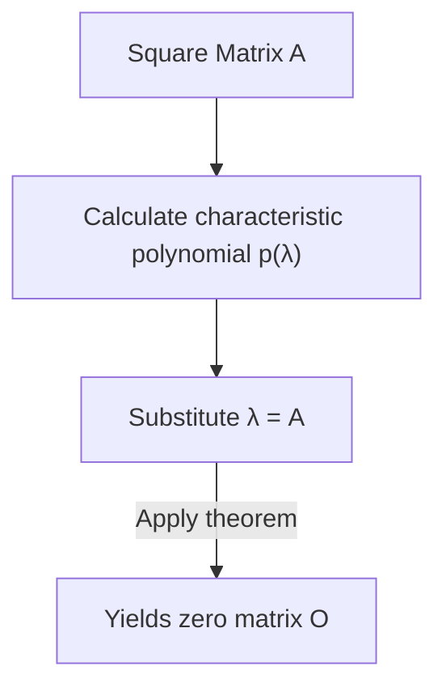

## 1. Introduction

When studying linear algebra, you encounter many beautiful theorems and formulas. Among them, the **Cayley-Hamilton theorem** is one of the most wondrous results, feeling almost like magic at first glance.

In a word, this theorem states that "every square matrix satisfies its own characteristic equation." The characteristic equation is an algebraic equation solved to find the eigenvalues of a matrix. The theorem makes the surprising claim that substituting the matrix itself into the variable of this equation results in the zero matrix. It is a fascinating phenomenon that an array of numbers—a matrix—is the root of a polynomial derived from its own properties.

In this article, we will explain the **Cayley-Hamilton theorem** in detail, starting from a review of fundamental concepts to its intuitive meaning, rigorous proof, and practical applications in calculating matrix powers and inverses, complete with plenty of concrete examples.

## 2. Positioning and Importance in Linear Algebra

Linear algebra is a foundational discipline for a wide range of fields today, from mathematics and physics to engineering, machine learning, and data science. Matrices are powerful tools for representing linear mappings within this context.

The **Cayley-Hamilton theorem** is key to deeply understanding the algebraic properties of matrices. It makes it possible to reduce higher-degree matrix polynomials to lower-degree ones, acting as a bridge from infinite-dimensional spaces to finite-dimensional ones. It frequently appears in practical scenarios, such as analyzing controllability and observability in control theory, and calculating operators in quantum mechanics.

## 3. Review of Characteristic Equations and Eigenvalues

To understand the theorem, let's first review the concepts of the **characteristic equation** and **eigenvalues**.

For an $n \times n$ square matrix $A$, if there exists a scalar $\lambda$ and a non-zero vector $\mathbf{x}$ that satisfy the following relationship, $\lambda$ is called an eigenvalue of matrix $A$, and $\mathbf{x}$ is called an eigenvector.

$$
A \mathbf{x} = \lambda \mathbf{x}
$$

This equation means that multiplying the vector $\mathbf{x}$ by the matrix $A$ results in a vector that is simply $\mathbf{x}$ scaled by $\lambda$. Let's slightly rearrange this equation. Let $I$ be the $n \times n$ identity matrix.

$$
(\lambda I - A) \mathbf{x} = \mathbf{0}
$$

The necessary and sufficient condition for the vector $\mathbf{x}$ to have a non-zero (non-trivial) solution is that the coefficient matrix $(\lambda I - A)$ is not invertible, which means its determinant must be zero.

$$
\det(\lambda I - A) = 0
$$

This equation is called the **characteristic equation** of matrix $A$. Additionally, the polynomial on the left side, $p(\lambda) = \det(\lambda I - A)$, is called the **characteristic polynomial**. By the definition of the determinant, $p(\lambda)$ is an $n$-th degree polynomial in terms of $\lambda$.

$$
p(\lambda) = \lambda^n + c_{n-1}\lambda^{n-1} + \dots + c_1\lambda + c_0
$$

Here, it is known that $c_{n-1} = -\text{tr}(A)$ (the negative trace) and $c_0 = (-1)^n \det(A)$.

## 4. Statement of the Cayley-Hamilton Theorem

Now we come to the core of the **Cayley-Hamilton theorem**. The statement of the theorem is very simple yet profound.

> **Theorem (Cayley-Hamilton Theorem)**
> For any $n \times n$ square matrix $A$ and its characteristic polynomial $p(\lambda) = \det(\lambda I - A)$, substituting the matrix $A$ for the variable $\lambda$ in the polynomial yields the zero matrix $O$. That is,
> $$ p(A) = A^n + c_{n-1}A^{n-1} + \dots + c_1 A + c_0 I = O $$
> holds true.

An important point to note here is that the constant term $c_0$ becomes $c_0 I$ (a scalar multiple of the identity matrix) in the matrix polynomial. Since you cannot directly add a scalar to a matrix, it must be multiplied by the identity matrix.

## 5. Concrete Example and Calculation for a 2x2 Matrix

Abstract definitions can be hard to grasp, so let's verify the theorem concretely by calculating it for the most familiar case: a $2 \times 2$ square matrix.

Let's define a general matrix $A$ as follows:

$$
A = \begin{pmatrix} a & b \\ c & d \end{pmatrix}
$$

First, we calculate the characteristic polynomial $p(\lambda)$.

$$
\begin{aligned}
p(\lambda) &= \det(\lambda I - A) \\
&= \det \begin{pmatrix} \lambda - a & -b \\ -c & \lambda - d \end{pmatrix} \\
&= (\lambda - a)(\lambda - d) - (-b)(-c) \\
&= \lambda^2 - (a + d)\lambda + (ad - bc)
\end{aligned}
$$

Here, $a + d$ is the **trace** of matrix $A$, and $ad - bc$ is the **determinant** of matrix $A$. Denoting them as $\text{tr}(A)$ and $\det(A)$ respectively, the characteristic equation becomes:

$$
p(\lambda) = \lambda^2 - \text{tr}(A)\lambda + \det(A)
$$

The Cayley-Hamilton theorem asserts that substituting $\lambda = A$ into this gives the zero matrix, meaning the following equation holds:

$$
A^2 - \text{tr}(A)A + \det(A)I = O
$$

This is the standard formula for the $2 \times 2$ matrix version that often appears in high school mathematics. Let's actually calculate the components to verify this.

$$
A^2 = \begin{pmatrix} a & b \\ c & d \end{pmatrix} \begin{pmatrix} a & b \\ c & d \end{pmatrix} = \begin{pmatrix} a^2 + bc & ab + bd \\ ac + cd & bc + d^2 \end{pmatrix}
$$

Continuing with the left side of the equation:

$$
\begin{aligned}
& A^2 - (a+d)A + (ad-bc)I \\
&= \begin{pmatrix} a^2 + bc & ab + bd \\ ac + cd & bc + d^2 \end{pmatrix} - \begin{pmatrix} a^2 + ad & ab + bd \\ ac + cd & ad + d^2 \end{pmatrix} + \begin{pmatrix} ad - bc & 0 \\ 0 & ad - bc \end{pmatrix} \\
&= \begin{pmatrix} a^2 + bc - a^2 - ad + ad - bc & ab + bd - ab - bd + 0 \\ ac + cd - ac - cd + 0 & bc + d^2 - ad - d^2 + ad - bc \end{pmatrix} \\
&= \begin{pmatrix} 0 & 0 \\ 0 & 0 \end{pmatrix} = O
\end{aligned}
$$

Each component perfectly cancels out, indeed resulting in the zero matrix!

## 6. Intuitive Understanding and Common Misconceptions

When people first encounter the Cayley-Hamilton theorem, there is a **common misconception** they often fall into.

> **Example of a False Proof:**
> The characteristic polynomial is $p(\lambda) = \det(\lambda I - A)$.
> Therefore, since $p(A)$ is obtained by substituting $A$ into $\lambda$,
> $p(A) = \det(A I - A) = \det(A - A) = \det(O) = 0$.
> Thus, the theorem is proved.

This reasoning is **completely wrong**. This is because $p(\lambda)$ is a function that outputs a "scalar value" (a polynomial), whereas the operation $p(A)$ of substituting a matrix into $\lambda$ involves substituting $A$ into each term of the polynomial to create a "matrix". On the other hand, the false proof above substitutes the matrix $A$ straight into the determinant to derive a scalar $0$, mixing up the types on the left side (matrix) and the right side (scalar).

Intuitively, the theorem is easier to understand by considering the case where matrix $A$ is diagonalizable.
Suppose matrix $A$ can be diagonalized as $A = P D P^{-1}$ (where $D$ is a diagonal matrix with eigenvalues $\lambda_1, \dots, \lambda_n$ on its diagonal).

$$ p(A) = p(P D P^{-1}) = P p(D) P^{-1} $$

Since the polynomial of a diagonal matrix is formed by applying the polynomial to each diagonal component:

$$
p(D) = \begin{pmatrix} p(\lambda_1) & & 0 \\ & \ddots & \\ 0 & & p(\lambda_n) \end{pmatrix}
$$

By definition of the characteristic polynomial, each eigenvalue $\lambda_i$ satisfies $p(\lambda_i) = 0$. Therefore, $p(D)$ becomes the zero matrix, leading to $p(A) = P O P^{-1} = O$.

However, since not all matrices are diagonalizable (e.g., those without a full set of eigenvectors), this explanation does not constitute a complete proof. A different approach is needed for a general proof.

## 7. Rigorous Proof of the Cayley-Hamilton Theorem

Here is a general proof (using the adjugate matrix) that holds for any $n \times n$ square matrix $A$. This proof is very elegant and showcases algebraic ingenuity.

Let $B(\lambda)$ be the **adjugate matrix** for the matrix $\lambda I - A$. We use the property that for any square matrix $M$, $M \cdot \text{adj}(M) = \det(M) I$ holds true. This gives us the following identity:

$$
(\lambda I - A) B(\lambda) = \det(\lambda I - A) I = p(\lambda) I
$$

Since each element of the matrix $\lambda I - A$ is a polynomial in $\lambda$ of degree 1 or less, the determinant of each component of its adjugate matrix $B(\lambda)$ will be a polynomial in $\lambda$ of degree $(n-1)$ or less. Therefore, $B(\lambda)$ can be expressed as a polynomial in $\lambda$ with matrix coefficients as follows:

$$
B(\lambda) = B_{n-1}\lambda^{n-1} + B_{n-2}\lambda^{n-2} + \dots + B_1\lambda + B_0
$$
(Here, $B_k$ are $n \times n$ constant matrices)

Substitute this into the previous identity. Expanding the left side gives:

$$
\begin{aligned}
(\lambda I - A) B(\lambda) &= (\lambda I - A)(B_{n-1}\lambda^{n-1} + B_{n-2}\lambda^{n-2} + \dots + B_1\lambda + B_0) \\
&= B_{n-1}\lambda^n + (B_{n-2} - A B_{n-1})\lambda^{n-1} + \dots + (B_0 - A B_1)\lambda - A B_0
\end{aligned}
$$

Meanwhile, if the characteristic polynomial on the right side is $p(\lambda) = \lambda^n + c_{n-1}\lambda^{n-1} + \dots + c_1\lambda + c_0$, the right side is:

$$
p(\lambda)I = I\lambda^n + c_{n-1}I\lambda^{n-1} + \dots + c_1 I\lambda + c_0 I
$$

Since both sides are identical polynomials in $\lambda$, we can equate the coefficients for each power of $\lambda$ (which are matrices).

$$
\begin{aligned}
B_{n-1} &= I \quad \text{(Coefficient of λ^n)} \\
B_{n-2} - A B_{n-1} &= c_{n-1} I \quad \text{(Coefficient of λ^{n-1})} \\
&\vdots \\
B_0 - A B_1 &= c_1 I \quad \text{(Coefficient of λ^1)} \\
-A B_0 &= c_0 I \quad \text{(Coefficient of λ^0)}
\end{aligned}
$$

Here comes the highlight of the proof. Multiply both sides of these equations by $A^n, A^{n-1}, \dots, A, I$ from the left, respectively from top to bottom.

$$
\begin{aligned}
A^n B_{n-1} &= A^n \\
A^{n-1} B_{n-2} - A^n B_{n-1} &= c_{n-1} A^{n-1} \\
&\vdots \\
A B_0 - A^2 B_1 &= c_1 A \\
-A B_0 &= c_0 I
\end{aligned}
$$

Now sum all these $n+1$ equations. The left side beautifully cancels out in a telescoping manner, leaving the zero matrix $O$.

$$
O = A^n + c_{n-1}A^{n-1} + \dots + c_1 A + c_0 I
$$

This is exactly $p(A) = O$, and thus the Cayley-Hamilton theorem is proved.

## 8. Application 1: Calculating Matrix Powers

One of the powerful applications of the Cayley-Hamilton theorem is that it can drastically simplify the calculation of large matrix powers $A^m$.

For example, suppose we have a $2 \times 2$ square matrix $A$ that satisfies $p(A) = A^2 - 3A + 2I = O$. We want to calculate $A^{10}$.
Calculating this normally would require 9 matrix multiplications, but using the theorem reduces the problem to polynomial division.

Let $Q(\lambda)$ be the quotient and $R(\lambda) = \alpha \lambda + \beta$ be the remainder when $\lambda^{10}$ is divided by the characteristic polynomial $p(\lambda) = \lambda^2 - 3\lambda + 2$.

$$
\lambda^{10} = Q(\lambda)(\lambda^2 - 3\lambda + 2) + (\alpha \lambda + \beta)
$$

Since $p(\lambda) = (\lambda - 1)(\lambda - 2)$, we substitute $\lambda = 1$ and $\lambda = 2$ to find the unknowns $\alpha, \beta$.

When $\lambda = 1$: $1^{10} = \alpha + \beta \implies \alpha + \beta = 1$
When $\lambda = 2$: $2^{10} = 2\alpha + \beta \implies 2\alpha + \beta = 1024$

Solving this yields $\alpha = 1023, \beta = -1022$. Therefore,
$$ \lambda^{10} = Q(\lambda)p(\lambda) + 1023\lambda - 1022 $$
Substitute $\lambda = A$ here. Since $p(A) = O$, the first term vanishes, leaving:

$$
A^{10} = 1023A - 1022I
$$

In this way, no matter how high the degree is, calculating the remainder $R(A)$ is enough to find $A^m$, significantly reducing the computational workload.

## 9. Application 2: Calculating Inverse Matrices

If an inverse matrix exists (i.e., $\det(A) \neq 0$, and thus the constant term $c_0 \neq 0$), the Cayley-Hamilton theorem can also be used to calculate the inverse matrix $A^{-1}$.

We rearrange the theorem's equation:

$$
A^n + c_{n-1}A^{n-1} + \dots + c_1 A + c_0 I = O
$$

Move the part containing the constant term, $c_0 I$, to the right side.

$$
A(A^{n-1} + c_{n-1}A^{n-2} + \dots + c_1 I) = -c_0 I
$$

Divide both sides by $-c_0$.

$$
A \left[ -\frac{1}{c_0} (A^{n-1} + c_{n-1}A^{n-2} + \dots + c_1 I) \right] = I
$$

From the definition of an inverse matrix $A A^{-1} = I$, the contents inside the brackets represent $A^{-1}$.

$$
A^{-1} = -\frac{1}{c_0} (A^{n-1} + c_{n-1}A^{n-2} + \dots + c_1 I)
$$

Thus, the problem of finding an inverse matrix is reduced to calculations completed solely with matrix multiplication and addition. This can sometimes be easier to implement in programming than computing the adjugate expansion directly.

## 10. Conclusion

In this article, we thoroughly explained the **Cayley-Hamilton theorem**, one of the highlights of linear algebra.

* The astonishing property that substituting a matrix into its own characteristic polynomial $p(\lambda)$ yields the zero matrix ($p(A) = O$).
* Intuitive understanding through diagonalization, along with the common misconception of mixing up scalar substitution.
* An elegant and rigorous proof utilizing the identity with the adjugate matrix.
* Practical applications such as high-speed computation of matrix powers using polynomial division, and expressions for finding inverse matrices.

The Cayley-Hamilton theorem possesses not only theoretical elegance but is also an extremely useful tool in concrete calculations. Being aware of this theorem lurking in the background whenever dealing with matrices will undoubtedly deepen your understanding of linear algebra.
