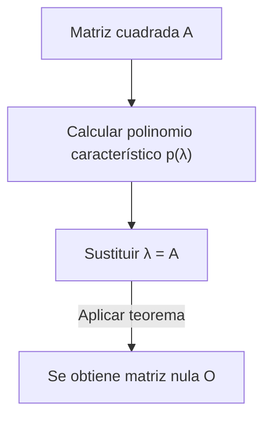

## 1. Introducción

Al estudiar álgebra lineal, se encuentran muchos teoremas y fórmulas hermosas. Entre ellos, el **teorema de Cayley-Hamilton** (Cayley-Hamilton theorem) es uno de los resultados más sorprendentes, y a primera vista parece casi mágico.

En pocas palabras, este teorema afirma que "toda matriz cuadrada satisface su propia ecuación característica". La ecuación característica es una ecuación algebraica que se resuelve para encontrar los valores propios (eigenvalores) de una matriz, y este teorema hace la sorprendente afirmación de que sustituir la matriz misma en la variable de esta ecuación da como resultado la matriz nula. Es un fenómeno fascinante que una disposición de números (una matriz) sea la raíz de un polinomio derivado de sus propias propiedades.

En este artículo, explicaremos en detalle el **teorema de Cayley-Hamilton**, comenzando con un repaso de los conceptos básicos, su significado intuitivo, su demostración rigurosa y sus aplicaciones prácticas en el cálculo de potencias e inversas de matrices, con muchos ejemplos concretos.

## 2. Posición e importancia en el álgebra lineal

El álgebra lineal es una disciplina fundamental para muchos campos en la actualidad, desde las matemáticas y la física hasta la ingeniería, el aprendizaje automático y la ciencia de datos. Las matrices son herramientas poderosas para representar aplicaciones lineales en estos campos.

El **teorema de Cayley-Hamilton** es clave para comprender profundamente las propiedades algebraicas de las matrices. Permite reducir polinomios de matrices de alto grado a polinomios de menor grado, actuando como un puente entre espacios de dimensión infinita y finita. Aparece con frecuencia en situaciones prácticas, como el análisis de controlabilidad y observabilidad en la teoría de control y el cálculo de operadores en la mecánica cuántica.

## 3. Repaso de ecuaciones características y valores propios

Para entender el teorema, primero repasemos los conceptos de **ecuación característica** (characteristic equation) y **valores propios** (eigenvalues).

Para una matriz cuadrada $A$ de dimensión $n \times n$, si existe un escalar $\lambda$ y un vector no nulo $\mathbf{x}$ que satisfacen la siguiente relación, entonces $\lambda$ se denomina valor propio de la matriz $A$, y $\mathbf{x}$ se denomina vector propio (eigenvector).

$$
A \mathbf{x} = \lambda \mathbf{x}
$$

Esta ecuación significa que el resultado de multiplicar el vector $\mathbf{x}$ por la matriz $A$ es simplemente el vector $\mathbf{x}$ escalado $\lambda$ veces. Transformemos ligeramente esta ecuación. Sea $I$ la matriz identidad de orden $n$.

$$
(\lambda I - A) \mathbf{x} = \mathbf{0}
$$

La condición necesaria y suficiente para que el vector $\mathbf{x}$ tenga una solución no nula (no trivial) es que la matriz de coeficientes $(\lambda I - A)$ no sea invertible, lo que significa que su determinante debe ser cero.

$$
\det(\lambda I - A) = 0
$$

Esta ecuación se llama la **ecuación característica** de la matriz $A$. Además, el polinomio en el lado izquierdo, $p(\lambda) = \det(\lambda I - A)$, se llama **polinomio característico** (characteristic polynomial). Por la definición del determinante, $p(\lambda)$ es un polinomio de grado $n$ en términos de $\lambda$.

$$
p(\lambda) = \lambda^n + c_{n-1}\lambda^{n-1} + \dots + c_1\lambda + c_0
$$

Aquí se sabe que $c_{n-1} = -\text{tr}(A)$ (el negativo de la traza) y $c_0 = (-1)^n \det(A)$.

## 4. Enunciado del teorema de Cayley-Hamilton

Ahora llegamos al núcleo del **teorema de Cayley-Hamilton**. El enunciado del teorema es muy simple pero impactante.

> **Teorema (Teorema de Cayley-Hamilton)**
> Para cualquier matriz cuadrada $A$ de orden $n$ y su polinomio característico $p(\lambda) = \det(\lambda I - A)$, sustituir la variable $\lambda$ por la matriz $A$ da como resultado la matriz nula $O$. Es decir,
> $$ p(A) = A^n + c_{n-1}A^{n-1} + \dots + c_1 A + c_0 I = O $$
> se cumple.

Un punto importante a tener en cuenta aquí es que el término constante $c_0$ se convierte en $c_0 I$ (un múltiplo escalar de la matriz identidad) en el polinomio de matriz. Dado que no se puede sumar directamente un escalar y una matriz, se debe multiplicar por la matriz identidad.

## 5. Ejemplo concreto y cálculo con una matriz de 2x2

Las definiciones abstractas pueden ser difíciles de comprender, así que verifiquemos el teorema calculándolo concretamente para el caso más familiar: una matriz de $2 \times 2$.

Definimos una matriz general $A$ de la siguiente manera:

$$
A = \begin{pmatrix} a & b \\ c & d \end{pmatrix}
$$

Primero, calculamos el polinomio característico $p(\lambda)$.

$$
\begin{aligned}
p(\lambda) &= \det(\lambda I - A) \\
&= \det \begin{pmatrix} \lambda - a & -b \\ -c & \lambda - d \end{pmatrix} \\
&= (\lambda - a)(\lambda - d) - (-b)(-c) \\
&= \lambda^2 - (a + d)\lambda + (ad - bc)
\end{aligned}
$$

Aquí, $a + d$ es la **traza** (trace) de la matriz $A$, y $ad - bc$ es el **determinante** (determinant) de la matriz $A$. Denotándolos como $\text{tr}(A)$ y $\det(A)$ respectivamente, la ecuación característica queda así:

$$
p(\lambda) = \lambda^2 - \text{tr}(A)\lambda + \det(A)
$$

El teorema de Cayley-Hamilton afirma que sustituir $\lambda = A$ en esta ecuación da la matriz nula, es decir:

$$
A^2 - \text{tr}(A)A + \det(A)I = O
$$

Esta es la fórmula de la matriz de $2 \times 2$ que a menudo aparece en las matemáticas de secundaria. Calculemos realmente los componentes para comprobarlo.

$$
A^2 = \begin{pmatrix} a & b \\ c & d \end{pmatrix} \begin{pmatrix} a & b \\ c & d \end{pmatrix} = \begin{pmatrix} a^2 + bc & ab + bd \\ ac + cd & bc + d^2 \end{pmatrix}
$$

Continuamos calculando el lado izquierdo:

$$
\begin{aligned}
& A^2 - (a+d)A + (ad-bc)I \\
&= \begin{pmatrix} a^2 + bc & ab + bd \\ ac + cd & bc + d^2 \end{pmatrix} - \begin{pmatrix} a^2 + ad & ab + bd \\ ac + cd & ad + d^2 \end{pmatrix} + \begin{pmatrix} ad - bc & 0 \\ 0 & ad - bc \end{pmatrix} \\
&= \begin{pmatrix} a^2 + bc - a^2 - ad + ad - bc & ab + bd - ab - bd + 0 \\ ac + cd - ac - cd + 0 & bc + d^2 - ad - d^2 + ad - bc \end{pmatrix} \\
&= \begin{pmatrix} 0 & 0 \\ 0 & 0 \end{pmatrix} = O
\end{aligned}
$$

Cada componente se cancela perfectamente, ¡resultando de hecho en la matriz nula!

## 6. Comprensión intuitiva y malentendidos comunes

Cuando las personas se encuentran por primera vez con el teorema de Cayley-Hamilton, hay un **malentendido común** en el que suelen caer.

> **Ejemplo de demostración incorrecta:**
> El polinomio característico es $p(\lambda) = \det(\lambda I - A)$.
> Por lo tanto, dado que $p(A)$ es el resultado de sustituir $A$ en $\lambda$,
> $p(A) = \det(A I - A) = \det(A - A) = \det(O) = 0$.
> Así, el teorema queda demostrado.

Este razonamiento es **completamente erróneo**. Esto se debe a que $p(\lambda)$ es una función que da como resultado un "valor escalar" (un polinomio), mientras que la operación $p(A)$ de sustituir una matriz en $\lambda$ crea una "matriz" al reemplazar $\lambda$ por $A$ en cada término. Por otro lado, la demostración falsa anterior sustituye la matriz $A$ directamente dentro del determinante para derivar el escalar $0$, mezclando tipos incompatibles (matriz en el lado izquierdo y escalar en el derecho).

Intuitivamente, es más fácil de entender si consideramos el caso en que la matriz $A$ es diagonalizable.
Supongamos que la matriz $A$ se puede diagonalizar como $A = P D P^{-1}$ (donde $D$ es una matriz diagonal con los valores propios $\lambda_1, \dots, \lambda_n$ en su diagonal principal).

$$ p(A) = p(P D P^{-1}) = P p(D) P^{-1} $$

El polinomio de una matriz diagonal se obtiene simplemente aplicando el polinomio a cada elemento de la diagonal:

$$
p(D) = \begin{pmatrix} p(\lambda_1) & & 0 \\ & \ddots & \\ 0 & & p(\lambda_n) \end{pmatrix}
$$

Por la definición de polinomio característico, cada valor propio $\lambda_i$ satisface $p(\lambda_i) = 0$. Por tanto, $p(D)$ se convierte en la matriz nula, lo que lleva a $p(A) = P O P^{-1} = O$.

Sin embargo, dado que no todas las matrices son diagonalizables (por ejemplo, aquellas sin suficientes vectores propios independientes), esta explicación no constituye una demostración completa. Se necesita otro enfoque para una demostración general.

## 7. Demostración rigurosa del teorema de Cayley-Hamilton

Aquí presentamos una demostración general (usando la matriz adjunta) que es válida para cualquier matriz cuadrada $A$ de orden $n$. Esta prueba es muy elegante y hace brillar el ingenio algebraico.

Sea $B(\lambda)$ la **matriz adjunta** (adjugate matrix) de la matriz $\lambda I - A$. Utilizamos la propiedad de que para cualquier matriz cuadrada $M$, se cumple $M \cdot \text{adj}(M) = \det(M) I$. Esto nos da la siguiente identidad:

$$
(\lambda I - A) B(\lambda) = \det(\lambda I - A) I = p(\lambda) I
$$

Como cada elemento de la matriz $\lambda I - A$ es un polinomio en $\lambda$ de grado 1 o menor, el determinante de cada componente de su matriz adjunta $B(\lambda)$ será un polinomio en $\lambda$ de grado $(n-1)$ o menor. Por tanto, $B(\lambda)$ se puede expresar como un polinomio en $\lambda$ con coeficientes matriciales:

$$
B(\lambda) = B_{n-1}\lambda^{n-1} + B_{n-2}\lambda^{n-2} + \dots + B_1\lambda + B_0
$$
(Donde $B_k$ son matrices constantes de orden $n$)

Sustituyamos esto en la identidad anterior. Expandiendo el lado izquierdo obtenemos:

$$
\begin{aligned}
(\lambda I - A) B(\lambda) &= (\lambda I - A)(B_{n-1}\lambda^{n-1} + B_{n-2}\lambda^{n-2} + \dots + B_1\lambda + B_0) \\
&= B_{n-1}\lambda^n + (B_{n-2} - A B_{n-1})\lambda^{n-1} + \dots + (B_0 - A B_1)\lambda - A B_0
\end{aligned}
$$

Por otro lado, si escribimos el polinomio característico como $p(\lambda) = \lambda^n + c_{n-1}\lambda^{n-1} + \dots + c_1\lambda + c_0$, el lado derecho es:

$$
p(\lambda)I = I\lambda^n + c_{n-1}I\lambda^{n-1} + \dots + c_1 I\lambda + c_0 I
$$

Como ambas expresiones son idénticas para cualquier $\lambda$, podemos igualar los coeficientes correspondientes a cada potencia de $\lambda$ (que son matrices).

$$
\begin{aligned}
B_{n-1} &= I \quad \text{(Coeficiente de λ^n)} \\
B_{n-2} - A B_{n-1} &= c_{n-1} I \quad \text{(Coeficiente de λ^{n-1})} \\
&\vdots \\
B_0 - A B_1 &= c_1 I \quad \text{(Coeficiente de λ^1)} \\
-A B_0 &= c_0 I \quad \text{(Coeficiente de λ^0)}
\end{aligned}
$$

Aquí viene el punto culminante de la demostración. Multipliquemos ambos lados de estas ecuaciones por $A^n, A^{n-1}, \dots, A, I$ por la izquierda, respectivamente, de arriba a abajo.

$$
\begin{aligned}
A^n B_{n-1} &= A^n \\
A^{n-1} B_{n-2} - A^n B_{n-1} &= c_{n-1} A^{n-1} \\
&\vdots \\
A B_0 - A^2 B_1 &= c_1 A \\
-A B_0 &= c_0 I
\end{aligned}
$$

Ahora sumamos estas $n+1$ ecuaciones. El lado izquierdo se cancela bellamente de forma telescópica, dejando solo la matriz nula $O$.

$$
O = A^n + c_{n-1}A^{n-1} + \dots + c_1 A + c_0 I
$$

Esto es exactamente $p(A) = O$, por lo que el teorema de Cayley-Hamilton queda demostrado.

## 8. Aplicación 1: Cálculo de potencias de matrices

Una de las potentes aplicaciones del teorema de Cayley-Hamilton es que simplifica drásticamente el cálculo de altas potencias de una matriz $A^m$.

Por ejemplo, supongamos que tenemos una matriz cuadrada $A$ de $2 \times 2$ que cumple $p(A) = A^2 - 3A + 2I = O$. Queremos calcular $A^{10}$.
Hacer esto de manera normal requeriría 9 multiplicaciones de matrices, pero utilizando el teorema, el problema se reduce a la división de polinomios.

Sea $Q(\lambda)$ el cociente y $R(\lambda) = \alpha \lambda + \beta$ el resto al dividir $\lambda^{10}$ por el polinomio característico $p(\lambda) = \lambda^2 - 3\lambda + 2$.

$$
\lambda^{10} = Q(\lambda)(\lambda^2 - 3\lambda + 2) + (\alpha \lambda + \beta)
$$

Como $p(\lambda) = (\lambda - 1)(\lambda - 2)$, sustituimos $\lambda = 1$ y $\lambda = 2$ para encontrar las incógnitas $\alpha, \beta$.

Cuando $\lambda = 1$: $1^{10} = \alpha + \beta \implies \alpha + \beta = 1$
Cuando $\lambda = 2$: $2^{10} = 2\alpha + \beta \implies 2\alpha + \beta = 1024$

Resolviendo el sistema se obtiene $\alpha = 1023, \beta = -1022$. Por lo tanto,
$$ \lambda^{10} = Q(\lambda)p(\lambda) + 1023\lambda - 1022 $$
Sustituyendo $\lambda = A$, como $p(A) = O$, el primer término desaparece y queda:

$$
A^{10} = 1023A - 1022I
$$

De esta forma, por muy alto que sea el exponente, basta con calcular el resto $R(A)$ para obtener $A^m$, reduciendo enormemente los cálculos.

## 9. Aplicación 2: Cálculo de matrices inversas

Si la matriz inversa existe (es decir, $\det(A) \neq 0$ y por lo tanto el término constante $c_0 \neq 0$), el teorema de Cayley-Hamilton también se puede usar para calcular la matriz inversa $A^{-1}$.

Reorganizamos la ecuación del teorema:

$$
A^n + c_{n-1}A^{n-1} + \dots + c_1 A + c_0 I = O
$$

Pasamos la parte que contiene el término constante, $c_0 I$, al lado derecho.

$$
A(A^{n-1} + c_{n-1}A^{n-2} + \dots + c_1 I) = -c_0 I
$$

Dividimos ambos lados por $-c_0$.

$$
A \left[ -\frac{1}{c_0} (A^{n-1} + c_{n-1}A^{n-2} + \dots + c_1 I) \right] = I
$$

Por la definición de matriz inversa $A A^{-1} = I$, el contenido entre corchetes es precisamente $A^{-1}$.

$$
A^{-1} = -\frac{1}{c_0} (A^{n-1} + c_{n-1}A^{n-2} + \dots + c_1 I)
$$

Así, el problema de encontrar la inversa se reduce a cálculos de sumas y multiplicaciones de matrices. En programación, a veces es más fácil de implementar esto que la matriz adjunta directamente.

## 10. Conclusión

En este artículo, explicamos en detalle el **teorema de Cayley-Hamilton**, uno de los teoremas más destacados del álgebra lineal.

* La asombrosa propiedad de que sustituir una matriz en su propio polinomio característico $p(\lambda)$ da como resultado la matriz nula ($p(A) = O$).
* La comprensión intuitiva mediante la diagonalización y el malentendido común de confundirlo con una sustitución escalar.
* Una elegante y rigurosa demostración utilizando identidades con la matriz adjunta.
* Aplicaciones prácticas como el cálculo rápido de potencias de matrices usando división de polinomios y fórmulas para encontrar inversas.

El teorema de Cayley-Hamilton no solo posee una gran belleza teórica, sino que también es una herramienta sumamente útil en cálculos concretos. Ser consciente de que este teorema subyace siempre en el fondo al trabajar con matrices sin duda profundizará tu comprensión del álgebra lineal.
