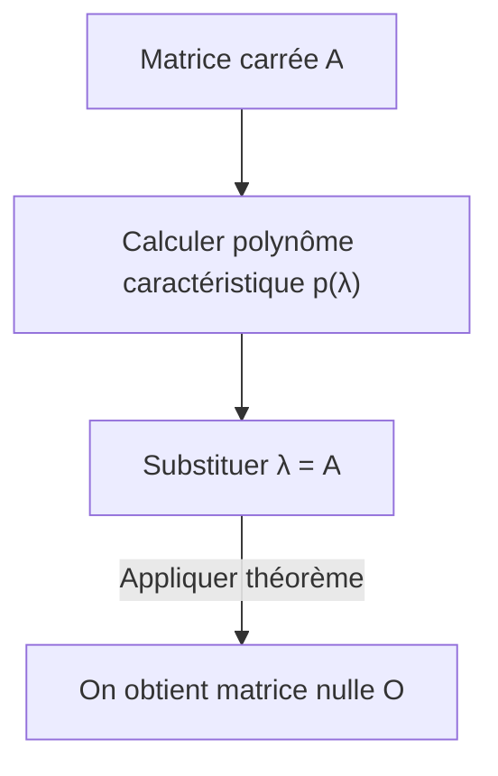

## 1. Introduction

Lorsque l'on étudie l'algèbre linéaire, on rencontre de nombreux théorèmes et formules magnifiques. Parmi eux, le **théorème de Cayley-Hamilton** (Cayley-Hamilton theorem) est l'un des résultats les plus étonnants, et semble presque magique à première vue.

En un mot, ce théorème affirme que « toute matrice carrée satisfait sa propre équation caractéristique ». L'équation caractéristique est une équation algébrique que l'on résout pour trouver les valeurs propres d'une matrice. Ce théorème avance l'idée surprenante que remplacer la variable de cette équation par la matrice elle-même donne la matrice nulle. C'est un phénomène fascinant qu'un tableau de nombres — une matrice — soit la racine d'un polynôme dérivé de ses propres propriétés.

Dans cet article, nous expliquerons en détail le **théorème de Cayley-Hamilton**, en partant d'un rappel des concepts de base jusqu'à sa signification intuitive, sa démonstration rigoureuse et ses applications pratiques dans le calcul des puissances et des inverses de matrices, le tout illustré d'exemples concrets.

## 2. Place et importance dans l'algèbre linéaire

L'algèbre linéaire est aujourd'hui une discipline fondamentale pour de nombreux domaines, allant des mathématiques et de la physique à l'ingénierie, en passant par l'apprentissage automatique et la science des données. Les matrices y sont des outils puissants pour représenter des applications linéaires.

Le **théorème de Cayley-Hamilton** est clé pour comprendre en profondeur les propriétés algébriques des matrices. Il permet de réduire des polynômes de matrices de haut degré en polynômes de degré inférieur, servant de pont entre les espaces de dimension infinie et de dimension finie. Il apparaît fréquemment dans des situations pratiques, comme l'analyse de contrôlabilité et d'observabilité en théorie du contrôle ou le calcul d'opérateurs en mécanique quantique.

## 3. Rappel sur les équations caractéristiques et les valeurs propres

Pour comprendre le théorème, revoyons d'abord les concepts d'**équation caractéristique** (characteristic equation) et de **valeurs propres** (eigenvalues).

Pour une matrice carrée $A$ de taille $n \times n$, s'il existe un scalaire $\lambda$ et un vecteur non nul $\mathbf{x}$ satisfaisant la relation suivante, alors $\lambda$ est appelé valeur propre de la matrice $A$, et $\mathbf{x}$ est appelé vecteur propre (eigenvector).

$$
A \mathbf{x} = \lambda \mathbf{x}
$$

Cette équation signifie que le résultat de la multiplication du vecteur $\mathbf{x}$ par la matrice $A$ est simplement le vecteur $\mathbf{x}$ multiplié par $\lambda$. Transformons légèrement cette équation. Soit $I$ la matrice identité d'ordre $n$.

$$
(\lambda I - A) \mathbf{x} = \mathbf{0}
$$

La condition nécessaire et suffisante pour que le vecteur $\mathbf{x}$ ait une solution non nulle (non triviale) est que la matrice des coefficients $(\lambda I - A)$ ne soit pas inversible, ce qui signifie que son déterminant doit être zéro.

$$
\det(\lambda I - A) = 0
$$

Cette équation est appelée l'**équation caractéristique** de la matrice $A$. De plus, le polynôme du côté gauche, $p(\lambda) = \det(\lambda I - A)$, est appelé **polynôme caractéristique** (characteristic polynomial). Par la définition du déterminant, $p(\lambda)$ est un polynôme de degré $n$ en $\lambda$.

$$
p(\lambda) = \lambda^n + c_{n-1}\lambda^{n-1} + \dots + c_1\lambda + c_0
$$

Ici, il est connu que $c_{n-1} = -\text{tr}(A)$ (l'opposé de la trace) et que $c_0 = (-1)^n \det(A)$.

## 4. Énoncé du théorème de Cayley-Hamilton

Nous en arrivons maintenant au cœur du **théorème de Cayley-Hamilton**. L'énoncé du théorème est très simple mais puissant.

> **Théorème ([Théorème de Cayley-Hamilton](https://kenji.blog/fr/p/cayley-hamilton-theorem/))**
> Pour toute matrice carrée $A$ d'ordre $n$ et son polynôme caractéristique $p(\lambda) = \det(\lambda I - A)$, substituer la matrice $A$ à la variable $\lambda$ dans le polynôme donne la matrice nulle $O$. C'est-à-dire que
> $$ p(A) = A^n + c_{n-1}A^{n-1} + \dots + c_1 A + c_0 I = O $$
> est vrai.

Un point important à noter ici est que le terme constant $c_0$ devient $c_0 I$ (un multiple scalaire de la matrice identité) dans le polynôme matriciel. Comme on ne peut pas additionner directement un scalaire et une matrice, il faut multiplier par la matrice identité.

## 5. Exemple concret et calcul avec une matrice 2x2

Les définitions abstraites peuvent être difficiles à saisir, alors vérifions le théorème en le calculant concrètement pour le cas le plus familier : une matrice $2 \times 2$.

Définissons une matrice générale $A$ de la manière suivante :

$$
A = \begin{pmatrix} a & b \\ c & d \end{pmatrix}
$$

Calculons d'abord le polynôme caractéristique $p(\lambda)$.

$$
\begin{aligned}
p(\lambda) &= \det(\lambda I - A) \\
&= \det \begin{pmatrix} \lambda - a & -b \\ -c & \lambda - d \end{pmatrix} \\
&= (\lambda - a)(\lambda - d) - (-b)(-c) \\
&= \lambda^2 - (a + d)\lambda + (ad - bc)
\end{aligned}
$$

Ici, $a + d$ est la **trace** de la matrice $A$, et $ad - bc$ est le **déterminant** de la matrice $A$. En les notant respectivement $\text{tr}(A)$ et $\det(A)$, l'équation caractéristique s'écrit :

$$
p(\lambda) = \lambda^2 - \text{tr}(A)\lambda + \det(A)
$$

Le théorème de Cayley-Hamilton affirme que substituer $\lambda = A$ donne la matrice nulle, c'est-à-dire que l'équation suivante est vérifiée :

$$
A^2 - \text{tr}(A)A + \det(A)I = O
$$

C'est la formule classique pour les matrices $2 \times 2$ souvent rencontrée au lycée. Calculons réellement les composantes pour le confirmer.

$$
A^2 = \begin{pmatrix} a & b \\ c & d \end{pmatrix} \begin{pmatrix} a & b \\ c & d \end{pmatrix} = \begin{pmatrix} a^2 + bc & ab + bd \\ ac + cd & bc + d^2 \end{pmatrix}
$$

Poursuivons avec le côté gauche de l'équation :

$$
\begin{aligned}
& A^2 - (a+d)A + (ad-bc)I \\
&= \begin{pmatrix} a^2 + bc & ab + bd \\ ac + cd & bc + d^2 \end{pmatrix} - \begin{pmatrix} a^2 + ad & ab + bd \\ ac + cd & ad + d^2 \end{pmatrix} + \begin{pmatrix} ad - bc & 0 \\ 0 & ad - bc \end{pmatrix} \\
&= \begin{pmatrix} a^2 + bc - a^2 - ad + ad - bc & ab + bd - ab - bd + 0 \\ ac + cd - ac - cd + 0 & bc + d^2 - ad - d^2 + ad - bc \end{pmatrix} \\
&= \begin{pmatrix} 0 & 0 \\ 0 & 0 \end{pmatrix} = O
\end{aligned}
$$

Chaque composante s'annule parfaitement, ce qui donne bien la matrice nulle !

## 6. Compréhension intuitive et idées fausses fréquentes

Lorsque l'on découvre le théorème de Cayley-Hamilton, il y a une **idée fausse fréquente** dans laquelle beaucoup tombent.

> **Exemple de fausse démonstration :**
> Le polynôme caractéristique est $p(\lambda) = \det(\lambda I - A)$.
> Par conséquent, comme $p(A)$ est obtenu en substituant $A$ à $\lambda$,
> $p(A) = \det(A I - A) = \det(A - A) = \det(O) = 0$.
> Ainsi, le théorème est prouvé.

Ce raisonnement est **complètement faux**. En effet, $p(\lambda)$ est une fonction qui renvoie une « valeur scalaire » (un polynôme), tandis que l'opération $p(A)$ consistant à substituer une matrice à $\lambda$ crée une « matrice » en remplaçant $\lambda$ par $A$ dans chaque terme. À l'inverse, la fausse preuve ci-dessus substitue la matrice $A$ directement à l'intérieur du déterminant pour obtenir le scalaire $0$, mélangeant les types (matrice à gauche, scalaire à droite).

Intuitivement, il est plus facile de comprendre en considérant le cas où la matrice $A$ est diagonalisable.
Supposons que la matrice $A$ puisse être diagonalisée sous la forme $A = P D P^{-1}$ (où $D$ est une matrice diagonale avec les valeurs propres $\lambda_1, \dots, \lambda_n$ sur sa diagonale).

$$ p(A) = p(P D P^{-1}) = P p(D) P^{-1} $$

Le polynôme d'une matrice diagonale s'obtient simplement en appliquant le polynôme à chaque élément de la diagonale :

$$
p(D) = \begin{pmatrix} p(\lambda_1) & & 0 \\ & \ddots & \\ 0 & & p(\lambda_n) \end{pmatrix}
$$

Par définition du polynôme caractéristique, chaque valeur propre $\lambda_i$ satisfait $p(\lambda_i) = 0$. Par conséquent, $p(D)$ devient la matrice nulle, ce qui conduit à $p(A) = P O P^{-1} = O$.

Cependant, comme toutes les matrices ne sont pas diagonalisables (par exemple, celles qui manquent de vecteurs propres indépendants), cette explication ne constitue pas une démonstration complète. Une autre approche est nécessaire pour une preuve générale.

## 7. Démonstration rigoureuse du théorème de Cayley-Hamilton

Voici une preuve générale (utilisant la matrice complémentaire, ou comatrice transposée) valable pour toute matrice carrée $A$ d'ordre $n$. Cette démonstration est très élégante et fait preuve d'ingéniosité algébrique.

Soit $B(\lambda)$ la **matrice complémentaire** (adjugate matrix) de la matrice $\lambda I - A$. Nous utilisons la propriété que pour toute matrice carrée $M$, on a $M \cdot \text{adj}(M) = \det(M) I$. Cela nous donne l'identité suivante :

$$
(\lambda I - A) B(\lambda) = \det(\lambda I - A) I = p(\lambda) I
$$

Comme chaque élément de la matrice $\lambda I - A$ est un polynôme en $\lambda$ de degré au plus 1, le déterminant de chaque composante de sa matrice complémentaire $B(\lambda)$ sera un polynôme en $\lambda$ de degré au plus $(n-1)$. Ainsi, $B(\lambda)$ peut être exprimé comme un polynôme en $\lambda$ avec des coefficients matriciels :

$$
B(\lambda) = B_{n-1}\lambda^{n-1} + B_{n-2}\lambda^{n-2} + \dots + B_1\lambda + B_0
$$
(Où $B_k$ sont des matrices constantes d'ordre $n$)

Substituons cela dans l'identité précédente. En développant le côté gauche, on obtient :

$$
\begin{aligned}
(\lambda I - A) B(\lambda) &= (\lambda I - A)(B_{n-1}\lambda^{n-1} + B_{n-2}\lambda^{n-2} + \dots + B_1\lambda + B_0) \\
&= B_{n-1}\lambda^n + (B_{n-2} - A B_{n-1})\lambda^{n-1} + \dots + (B_0 - A B_1)\lambda - A B_0
\end{aligned}
$$

D'autre part, si l'on écrit le polynôme caractéristique comme $p(\lambda) = \lambda^n + c_{n-1}\lambda^{n-1} + \dots + c_1\lambda + c_0$, le côté droit est :

$$
p(\lambda)I = I\lambda^n + c_{n-1}I\lambda^{n-1} + \dots + c_1 I\lambda + c_0 I
$$

Puisque les deux expressions sont identiques pour tout $\lambda$, nous pouvons égaler les coefficients correspondant à chaque puissance de $\lambda$ (qui sont des matrices).

$$
\begin{aligned}
B_{n-1} &= I \quad \text{(Coefficient de λ^n)} \\
B_{n-2} - A B_{n-1} &= c_{n-1} I \quad \text{(Coefficient de λ^{n-1})} \\
&\vdots \\
B_0 - A B_1 &= c_1 I \quad \text{(Coefficient de λ^1)} \\
-A B_0 &= c_0 I \quad \text{(Coefficient de λ^0)}
\end{aligned}
$$

Voici le point culminant de la preuve. Multiplions les deux côtés de ces équations par $A^n, A^{n-1}, \dots, A, I$ par la gauche, respectivement de haut en bas.

$$
\begin{aligned}
A^n B_{n-1} &= A^n \\
A^{n-1} B_{n-2} - A^n B_{n-1} &= c_{n-1} A^{n-1} \\
&\vdots \\
A B_0 - A^2 B_1 &= c_1 A \\
-A B_0 &= c_0 I
\end{aligned}
$$

Additionnons maintenant ces $n+1$ équations. Le côté gauche s'annule magnifiquement de façon télescopique, ne laissant que la matrice nulle $O$.

$$
O = A^n + c_{n-1}A^{n-1} + \dots + c_1 A + c_0 I
$$

Ceci est exactement $p(A) = O$, le théorème de Cayley-Hamilton est donc prouvé.

## 8. Application 1 : Calcul de puissances de matrices

Une des applications puissantes du théorème de Cayley-Hamilton est de simplifier considérablement le calcul de grandes puissances d'une matrice $A^m$.

Par exemple, supposons une matrice carrée $A$ de $2 \times 2$ satisfaisant $p(A) = A^2 - 3A + 2I = O$. Nous voulons calculer $A^{10}$.
Le faire normalement nécessiterait 9 multiplications de matrices, mais en utilisant le théorème, le problème se réduit à une division polynomiale.

Soient $Q(\lambda)$ le quotient et $R(\lambda) = \alpha \lambda + \beta$ le reste de la division de $\lambda^{10}$ par le polynôme caractéristique $p(\lambda) = \lambda^2 - 3\lambda + 2$.

$$
\lambda^{10} = Q(\lambda)(\lambda^2 - 3\lambda + 2) + (\alpha \lambda + \beta)
$$

Comme $p(\lambda) = (\lambda - 1)(\lambda - 2)$, on substitue $\lambda = 1$ et $\lambda = 2$ pour trouver les inconnues $\alpha, \beta$.

Pour $\lambda = 1$ : $1^{10} = \alpha + \beta \implies \alpha + \beta = 1$
Pour $\lambda = 2$ : $2^{10} = 2\alpha + \beta \implies 2\alpha + \beta = 1024$

La résolution de ce système donne $\alpha = 1023, \beta = -1022$. Ainsi,
$$ \lambda^{10} = Q(\lambda)p(\lambda) + 1023\lambda - 1022 $$
En substituant $\lambda = A$, comme $p(A) = O$, le premier terme disparaît et il reste :

$$
A^{10} = 1023A - 1022I
$$

Ainsi, quelle que soit la puissance, il suffit de calculer le reste $R(A)$ pour obtenir $A^m$, ce qui réduit considérablement les calculs.

## 9. Application 2 : Calcul de la matrice inverse

Si la matrice inverse existe (c'est-à-dire $\det(A) \neq 0$ et donc le terme constant $c_0 \neq 0$), le théorème de Cayley-Hamilton peut également être utilisé pour calculer la matrice inverse $A^{-1}$.

Réorganisons l'équation du théorème :

$$
A^n + c_{n-1}A^{n-1} + \dots + c_1 A + c_0 I = O
$$

Déplaçons la partie contenant le terme constant, $c_0 I$, vers le côté droit.

$$
A(A^{n-1} + c_{n-1}A^{n-2} + \dots + c_1 I) = -c_0 I
$$

Divisons les deux côtés par $-c_0$.

$$
A \left[ -\frac{1}{c_0} (A^{n-1} + c_{n-1}A^{n-2} + \dots + c_1 I) \right] = I
$$

Par définition de la matrice inverse $A A^{-1} = I$, le contenu entre crochets représente précisément $A^{-1}$.

$$
A^{-1} = -\frac{1}{c_0} (A^{n-1} + c_{n-1}A^{n-2} + \dots + c_1 I)
$$

Le problème de trouver l'inverse est ainsi réduit à des calculs de sommes et de multiplications de matrices. En programmation, c'est parfois plus simple à implémenter que le développement par la comatrice directement.

## 10. Conclusion

Dans cet article, nous avons expliqué en détail le **théorème de Cayley-Hamilton**, l'un des théorèmes phares de l'algèbre linéaire.

* La propriété étonnante que substituer une matrice dans son propre polynôme caractéristique $p(\lambda)$ donne la matrice nulle ($p(A) = O$).
* La compréhension intuitive par diagonalisation et l'idée fausse fréquente de la confondre avec une substitution scalaire.
* Une démonstration élégante et rigoureuse utilisant des identités avec la matrice complémentaire.
* Des applications pratiques telles que le calcul rapide de puissances de matrices par division polynomiale et des formules pour trouver des inverses.

Le théorème de Cayley-Hamilton possède non seulement une grande beauté théorique, mais il est aussi un outil extrêmement utile dans les calculs concrets. Avoir conscience que ce théorème agit en coulisses lors de la manipulation de matrices approfondira sans aucun doute votre compréhension de l'algèbre linéaire.
