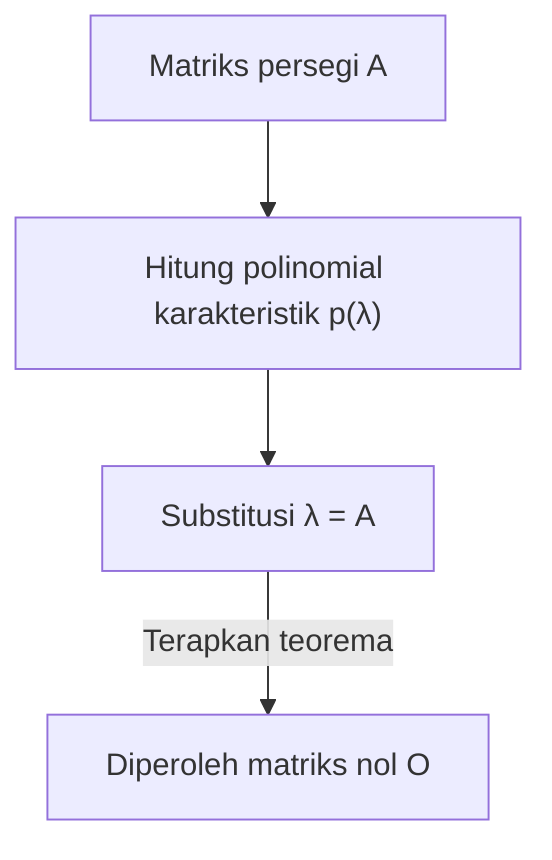

## 1. Pendahuluan

Saat mempelajari aljabar linear, kita akan menemui banyak teorema dan rumus yang indah. Di antaranya, **teorema Cayley-Hamilton** (Cayley-Hamilton theorem) adalah salah satu hasil yang paling menakjubkan, dan pada pandangan pertama terasa hampir seperti sihir.

Singkatnya, teorema ini menyatakan bahwa "setiap matriks persegi memenuhi persamaan karakteristiknya sendiri". Persamaan karakteristik adalah persamaan aljabar yang diselesaikan untuk mencari nilai eigen dari suatu matriks. Teorema ini memberikan pernyataan mengejutkan bahwa dengan mensubstitusikan matriks itu sendiri ke dalam variabel persamaan tersebut, hasilnya adalah matriks nol. Sungguh fenomena yang menarik bahwa susunan angka — sebuah matriks — adalah akar dari polinomial yang diturunkan dari sifat-sifatnya sendiri.

Dalam artikel ini, kita akan menjelaskan **teorema Cayley-Hamilton** secara terperinci, mulai dari tinjauan konsep dasar hingga makna intuitifnya, pembuktian yang ketat, dan aplikasi praktisnya dalam menghitung pangkat dan invers matriks, dilengkapi dengan banyak contoh konkret.

## 2. Posisi dan Pentingnya dalam Aljabar Linear

Aljabar linear merupakan disiplin ilmu dasar untuk banyak bidang saat ini, mulai dari matematika dan fisika hingga teknik, pembelajaran mesin, dan ilmu data. Matriks adalah alat yang ampuh untuk merepresentasikan pemetaan linear di dalam bidang-bidang tersebut.

**Teorema Cayley-Hamilton** adalah kunci untuk memahami sifat aljabar matriks secara mendalam. Teorema ini memungkinkan reduksi polinomial matriks berderajat tinggi menjadi polinomial berderajat lebih rendah, bertindak sebagai jembatan antara ruang berdimensi tak hingga dengan ruang berdimensi hingga. Teorema ini sering muncul dalam situasi praktis, seperti menganalisis keterkendalian dan keteramatan dalam teori kendali, serta menghitung operator dalam mekanika kuantum.

## 3. Tinjauan Persamaan Karakteristik dan Nilai Eigen

Untuk memahami teorema ini, mari kita tinjau terlebih dahulu konsep **persamaan karakteristik** (characteristic equation) dan **nilai eigen** (eigenvalues).

Untuk matriks persegi $A$ berukuran $n \times n$, jika terdapat suatu skalar $\lambda$ dan vektor tak nol $\mathbf{x}$ yang memenuhi hubungan berikut, maka $\lambda$ disebut nilai eigen dari matriks $A$, dan $\mathbf{x}$ disebut vektor eigen (eigenvector).

$$
A \mathbf{x} = \lambda \mathbf{x}
$$

Persamaan ini berarti bahwa hasil perkalian vektor $\mathbf{x}$ oleh matriks $A$ hanyalah vektor $\mathbf{x}$ yang diskalakan sebesar $\lambda$ kali. Mari kita ubah sedikit persamaan ini. Misalkan $I$ adalah matriks identitas berukuran $n \times n$.

$$
(\lambda I - A) \mathbf{x} = \mathbf{0}
$$

Syarat perlu dan cukup agar vektor $\mathbf{x}$ memiliki solusi tak nol (non-trivial) adalah matriks koefisien $(\lambda I - A)$ tidak memiliki invers, yang berarti determinannya harus nol.

$$
\det(\lambda I - A) = 0
$$

Persamaan ini disebut **persamaan karakteristik** dari matriks $A$. Selain itu, polinomial di ruas kiri, $p(\lambda) = \det(\lambda I - A)$, disebut **polinomial karakteristik** (characteristic polynomial). Berdasarkan definisi determinan, $p(\lambda)$ adalah polinomial berderajat $n$ dalam variabel $\lambda$.

$$
p(\lambda) = \lambda^n + c_{n-1}\lambda^{n-1} + \dots + c_1\lambda + c_0
$$

Di sini diketahui bahwa $c_{n-1} = -\text{tr}(A)$ (negatif dari trace) dan $c_0 = (-1)^n \det(A)$.

## 4. Pernyataan Teorema Cayley-Hamilton

Sekarang kita tiba pada inti dari **teorema Cayley-Hamilton**. Pernyataan teoremanya sangat sederhana namun berdampak kuat.

> **Teorema (Teorema Cayley-Hamilton)**
> Untuk sembarang matriks persegi $A$ berukuran $n \times n$ dan polinomial karakteristiknya $p(\lambda) = \det(\lambda I - A)$, mensubstitusikan matriks $A$ untuk variabel $\lambda$ dalam polinomial tersebut akan menghasilkan matriks nol $O$. Yakni,
> $$ p(A) = A^n + c_{n-1}A^{n-1} + \dots + c_1 A + c_0 I = O $$
> bernilai benar.

Poin penting yang perlu diperhatikan di sini adalah bahwa suku konstanta $c_0$ berubah menjadi $c_0 I$ (kelipatan skalar dari matriks identitas) di dalam polinomial matriks. Karena kita tidak dapat menambahkan skalar langsung ke matriks, maka konstanta tersebut harus dikalikan dengan matriks identitas.

## 5. Contoh Konkret dan Perhitungan dengan Matriks 2x2

Definisi abstrak bisa jadi sulit dipahami, jadi mari kita buktikan teorema ini secara konkret dengan menghitungnya untuk kasus yang paling umum: matriks $2 \times 2$.

Kita definisikan matriks umum $A$ sebagai berikut:

$$
A = \begin{pmatrix} a & b \\ c & d \end{pmatrix}
$$

Pertama, kita hitung polinomial karakteristik $p(\lambda)$.

$$
\begin{aligned}
p(\lambda) &= \det(\lambda I - A) \\
&= \det \begin{pmatrix} \lambda - a & -b \\ -c & \lambda - d \end{pmatrix} \\
&= (\lambda - a)(\lambda - d) - (-b)(-c) \\
&= \lambda^2 - (a + d)\lambda + (ad - bc)
\end{aligned}
$$

Di sini, $a + d$ adalah **trace** matriks $A$, dan $ad - bc$ adalah **determinan** (determinant) matriks $A$. Dengan menyatakannya masing-masing sebagai $\text{tr}(A)$ dan $\det(A)$, persamaan karakteristiknya menjadi:

$$
p(\lambda) = \lambda^2 - \text{tr}(A)\lambda + \det(A)
$$

Teorema Cayley-Hamilton menyatakan bahwa mensubstitusikan $\lambda = A$ ke dalam persamaan ini menghasilkan matriks nol, yang berarti persamaan berikut berlaku:

$$
A^2 - \text{tr}(A)A + \det(A)I = O
$$

Ini adalah rumus standar untuk matriks $2 \times 2$ yang sering muncul dalam matematika sekolah menengah. Mari kita hitung komponen-komponennya untuk membuktikannya.

$$
A^2 = \begin{pmatrix} a & b \\ c & d \end{pmatrix} \begin{pmatrix} a & b \\ c & d \end{pmatrix} = \begin{pmatrix} a^2 + bc & ab + bd \\ ac + cd & bc + d^2 \end{pmatrix}
$$

Melanjutkan perhitungan pada ruas kiri:

$$
\begin{aligned}
& A^2 - (a+d)A + (ad-bc)I \\
&= \begin{pmatrix} a^2 + bc & ab + bd \\ ac + cd & bc + d^2 \end{pmatrix} - \begin{pmatrix} a^2 + ad & ab + bd \\ ac + cd & ad + d^2 \end{pmatrix} + \begin{pmatrix} ad - bc & 0 \\ 0 & ad - bc \end{pmatrix} \\
&= \begin{pmatrix} a^2 + bc - a^2 - ad + ad - bc & ab + bd - ab - bd + 0 \\ ac + cd - ac - cd + 0 & bc + d^2 - ad - d^2 + ad - bc \end{pmatrix} \\
&= \begin{pmatrix} 0 & 0 \\ 0 & 0 \end{pmatrix} = O
\end{aligned}
$$

Setiap komponen saling meniadakan dengan sempurna, benar-benar menghasilkan matriks nol!

## 6. Pemahaman Intuitif dan Kesalahpahaman Umum

Saat orang pertama kali mempelajari teorema Cayley-Hamilton, ada suatu **kesalahpahaman umum** yang sering terjadi.

> **Contoh Pembuktian yang Salah:**
> Polinomial karakteristik adalah $p(\lambda) = \det(\lambda I - A)$.
> Oleh karena itu, karena $p(A)$ diperoleh dengan mensubstitusikan $A$ ke $\lambda$,
> $p(A) = \det(A I - A) = \det(A - A) = \det(O) = 0$.
> Dengan demikian, teorema terbukti.

Penalaran ini **sangat keliru**. Hal ini karena $p(\lambda)$ adalah fungsi yang menghasilkan "nilai skalar" (sebuah polinomial), sedangkan operasi $p(A)$ untuk mensubstitusikan matriks ke $\lambda$ akan menciptakan "matriks" dengan mengganti $\lambda$ dengan $A$ pada setiap suku. Sebaliknya, pembuktian salah di atas mensubstitusikan matriks $A$ langsung ke dalam determinan untuk mendapatkan skalar $0$, sehingga mencampuradukkan tipe yang tidak cocok (matriks di ruas kiri dan skalar di ruas kanan).

Secara intuitif, akan lebih mudah dipahami jika kita mempertimbangkan kasus ketika matriks $A$ dapat didiagonalkan.
Misalkan matriks $A$ dapat didiagonalkan sebagai $A = P D P^{-1}$ (di mana $D$ adalah matriks diagonal dengan nilai eigen $\lambda_1, \dots, \lambda_n$ pada diagonal utamanya).

$$ p(A) = p(P D P^{-1}) = P p(D) P^{-1} $$

Polinomial dari matriks diagonal diperoleh hanya dengan menerapkan polinomial pada setiap elemen diagonal:

$$
p(D) = \begin{pmatrix} p(\lambda_1) & & 0 \\ & \ddots & \\ 0 & & p(\lambda_n) \end{pmatrix}
$$

Berdasarkan definisi polinomial karakteristik, setiap nilai eigen $\lambda_i$ memenuhi $p(\lambda_i) = 0$. Oleh karena itu, $p(D)$ menjadi matriks nol, yang mengarah pada $p(A) = P O P^{-1} = O$.

Namun, karena tidak semua matriks dapat didiagonalkan (misalnya, yang kekurangan vektor eigen yang independen linear), penjelasan ini tidak dapat dianggap sebagai pembuktian yang lengkap. Pendekatan lain diperlukan untuk pembuktian secara umum.

## 7. Pembuktian Ketat Teorema Cayley-Hamilton

Berikut adalah pembuktian umum (menggunakan matriks adjoin) yang berlaku untuk sembarang matriks persegi $A$ berukuran $n \times n$. Pembuktian ini sangat elegan dan memancarkan kecerdikan aljabar.

Misalkan $B(\lambda)$ adalah **matriks adjoin** (adjugate matrix) dari matriks $\lambda I - A$. Kita menggunakan sifat bahwa untuk matriks persegi $M$ apa pun, berlaku $M \cdot \text{adj}(M) = \det(M) I$. Ini memberi kita identitas berikut:

$$
(\lambda I - A) B(\lambda) = \det(\lambda I - A) I = p(\lambda) I
$$

Karena setiap elemen dari matriks $\lambda I - A$ adalah polinomial dalam $\lambda$ berderajat 1 atau kurang, determinan dari setiap komponen matriks adjoinnya, $B(\lambda)$, akan menjadi polinomial dalam $\lambda$ berderajat $(n-1)$ atau kurang. Oleh karena itu, $B(\lambda)$ dapat dinyatakan sebagai polinomial dalam $\lambda$ dengan koefisien matriks:

$$
B(\lambda) = B_{n-1}\lambda^{n-1} + B_{n-2}\lambda^{n-2} + \dots + B_1\lambda + B_0
$$
(Di mana $B_k$ adalah matriks konstanta berukuran $n \times n$)

Kita substitusikan ini ke dalam identitas sebelumnya. Mengekspansi ruas kiri akan menghasilkan:

$$
\begin{aligned}
(\lambda I - A) B(\lambda) &= (\lambda I - A)(B_{n-1}\lambda^{n-1} + B_{n-2}\lambda^{n-2} + \dots + B_1\lambda + B_0) \\
&= B_{n-1}\lambda^n + (B_{n-2} - A B_{n-1})\lambda^{n-1} + \dots + (B_0 - A B_1)\lambda - A B_0
\end{aligned}
$$

Sementara itu, jika polinomial karakteristik ditulis sebagai $p(\lambda) = \lambda^n + c_{n-1}\lambda^{n-1} + \dots + c_1\lambda + c_0$, maka ruas kanannya adalah:

$$
p(\lambda)I = I\lambda^n + c_{n-1}I\lambda^{n-1} + \dots + c_1 I\lambda + c_0 I
$$

Karena kedua ruas identik untuk setiap $\lambda$, kita dapat menyamakan koefisien yang bersesuaian dengan setiap pangkat dari $\lambda$ (yang berupa matriks).

$$
\begin{aligned}
B_{n-1} &= I \quad \text{(Koefisien λ^n)} \\
B_{n-2} - A B_{n-1} &= c_{n-1} I \quad \text{(Koefisien λ^{n-1})} \\
&\vdots \\
B_0 - A B_1 &= c_1 I \quad \text{(Koefisien λ^1)} \\
-A B_0 &= c_0 I \quad \text{(Koefisien λ^0)}
\end{aligned}
$$

Di sinilah puncak pembuktian tersebut. Kalikan kedua ruas dari persamaan-persamaan ini dari kiri dengan $A^n, A^{n-1}, \dots, A, I$ masing-masing dari atas ke bawah.

$$
\begin{aligned}
A^n B_{n-1} &= A^n \\
A^{n-1} B_{n-2} - A^n B_{n-1} &= c_{n-1} A^{n-1} \\
&\vdots \\
A B_0 - A^2 B_1 &= c_1 A \\
-A B_0 &= c_0 I
\end{aligned}
$$

Sekarang kita jumlahkan semua $n+1$ persamaan ini. Ruas kiri akan saling meniadakan dengan sangat indah layaknya deret teleskopik, hanya menyisakan matriks nol $O$.

$$
O = A^n + c_{n-1}A^{n-1} + \dots + c_1 A + c_0 I
$$

Ini tidak lain adalah $p(A) = O$, dan dengan demikian teorema Cayley-Hamilton telah terbukti.

## 8. Aplikasi 1: Menghitung Pangkat Matriks

Salah satu aplikasi kuat dari teorema Cayley-Hamilton adalah kemampuannya menyederhanakan perhitungan pangkat matriks tinggi $A^m$ secara drastis.

Sebagai contoh, misalkan kita memiliki matriks persegi $A$ berukuran $2 \times 2$ yang memenuhi $p(A) = A^2 - 3A + 2I = O$. Kita ingin menghitung $A^{10}$.
Menghitung ini secara biasa akan membutuhkan 9 perkalian matriks, tetapi dengan menggunakan teorema ini, masalah tersebut dapat direduksi menjadi pembagian polinomial.

Misalkan $Q(\lambda)$ adalah hasil bagi dan $R(\lambda) = \alpha \lambda + \beta$ adalah sisa saat membagi $\lambda^{10}$ dengan polinomial karakteristik $p(\lambda) = \lambda^2 - 3\lambda + 2$.

$$
\lambda^{10} = Q(\lambda)(\lambda^2 - 3\lambda + 2) + (\alpha \lambda + \beta)
$$

Karena $p(\lambda) = (\lambda - 1)(\lambda - 2)$, kita substitusikan $\lambda = 1$ dan $\lambda = 2$ untuk mencari nilai $\alpha, \beta$ yang belum diketahui.

Saat $\lambda = 1$: $1^{10} = \alpha + \beta \implies \alpha + \beta = 1$
Saat $\lambda = 2$: $2^{10} = 2\alpha + \beta \implies 2\alpha + \beta = 1024$

Penyelesaian sistem ini menghasilkan $\alpha = 1023, \beta = -1022$. Karena itu,
$$ \lambda^{10} = Q(\lambda)p(\lambda) + 1023\lambda - 1022 $$
Mensubstitusikan $\lambda = A$ di sini, suku pertamanya lenyap karena $p(A) = O$, menyisakan:

$$
A^{10} = 1023A - 1022I
$$

Dengan cara ini, setinggi apa pun pangkatnya, kita hanya perlu menghitung sisa $R(A)$ untuk mendapatkan $A^m$, sehingga sangat mengurangi beban komputasi.

## 9. Aplikasi 2: Menghitung Invers Matriks

Jika matriks invers ada (yakni, $\det(A) \neq 0$, dan dengan demikian suku konstanta $c_0 \neq 0$), teorema Cayley-Hamilton juga dapat digunakan untuk menghitung invers matriks $A^{-1}$.

Kita susun ulang persamaan dari teorema:

$$
A^n + c_{n-1}A^{n-1} + \dots + c_1 A + c_0 I = O
$$

Pindahkan bagian yang mengandung suku konstanta, $c_0 I$, ke ruas kanan.

$$
A(A^{n-1} + c_{n-1}A^{n-2} + \dots + c_1 I) = -c_0 I
$$

Bagi kedua ruas dengan $-c_0$.

$$
A \left[ -\frac{1}{c_0} (A^{n-1} + c_{n-1}A^{n-2} + \dots + c_1 I) \right] = I
$$

Dari definisi invers matriks $A A^{-1} = I$, isi di dalam tanda kurung siku adalah tepat $A^{-1}$.

$$
A^{-1} = -\frac{1}{c_0} (A^{n-1} + c_{n-1}A^{n-2} + \dots + c_1 I)
$$

Dengan ini, masalah mencari matriks invers direduksi menjadi perhitungan yang diselesaikan murni melalui perkalian dan penjumlahan matriks. Dalam pemrograman, cara ini kadang-kadang lebih mudah diimplementasikan ketimbang secara langsung melakukan ekspansi adjoin.

## 10. Kesimpulan

Dalam artikel ini, kita telah menjelaskan secara terperinci tentang **teorema Cayley-Hamilton**, salah satu teorema yang menjadi sorotan dalam aljabar linear.

* Sifat menakjubkan di mana mensubstitusikan matriks ke dalam polinomial karakteristiknya sendiri $p(\lambda)$ menghasilkan matriks nol ($p(A) = O$).
* Pemahaman intuitif melalui diagonalisasi dan kesalahpahaman umum yang menyamakannya dengan substitusi skalar.
* Pembuktian yang elegan dan ketat menggunakan identitas matriks adjoin.
* Aplikasi praktis seperti perhitungan cepat untuk matriks berpangkat tinggi menggunakan pembagian polinomial dan rumus untuk mencari invers matriks.

Teorema Cayley-Hamilton tidak hanya memiliki keindahan teori yang mendalam, tetapi juga menjadi alat bantu yang sangat berguna dalam perhitungan konkret. Menyadari bahwa teorema ini selalu hadir di latar belakang ketika Anda berurusan dengan matriks tidak diragukan lagi akan memperdalam pemahaman Anda tentang aljabar linear.
