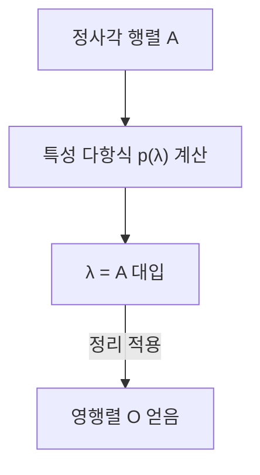

## 1. 서론

선형대수학을 공부하다 보면 많은 아름다운 정리와 공식을 만나게 됩니다. 그중에서도 **케일리-해밀턴 정리** (Cayley-Hamilton theorem)는 처음 보았을 때 매우 신기하고 마치 마법처럼 느껴지는 결과 중 하나입니다.

이 정리를 한마디로 요약하면 "모든 정사각 행렬은 자기 자신의 특성 방정식을 만족한다"는 것입니다. 특성 방정식은 행렬의 고윳값을 구하기 위해 푸는 대수 방정식인데, 그 변수에 행렬 자체를 대입하면 영행렬이 된다는 놀라운 주장을 하고 있습니다. 수의 배열인 행렬이 자기 자신의 성질로부터 유도된 다항식의 근이 된다는 것은 매우 흥미로운 현상입니다.

본 기사에서는 이 **케일리-해밀턴 정리** 에 대해 기초적인 개념 복습부터 시작하여 직관적인 의미, 엄밀한 증명, 그리고 행렬의 거듭제곱이나 역행렬을 계산할 때의 응용 사례까지 풍부한 구체적 예시와 함께 자세히 해설합니다.

## 2. 선형대수학에서의 위치와 중요성

선형대수학은 현대 수학이나 물리학, 공학, 나아가 기계 학습이나 데이터 과학에 이르기까지 모든 분야의 기초가 되는 학문입니다. 그중에서도 행렬은 선형 사상을 표현하기 위한 강력한 도구입니다.

**케일리-해밀턴 정리** 는 행렬의 대수적 성질을 깊이 이해하기 위한 핵심이 됩니다. 이 정리에 의해 행렬의 고차 다항식을 저차 다항식으로 환원하는 것이 가능해지며, 무한 차원의 공간에서 유한 차원의 공간으로 이어주는 다리 역할을 합니다. 특히 제어 공학에서의 가제어성이나 가관측성 분석, 양자 역학에서의 연산자 계산 등 실용적인 상황에서도 빈번하게 등장하는 중요한 정리입니다.

## 3. 특성 방정식과 고윳값의 복습

정리를 이해하기 위해 먼저 **특성 방정식** (characteristic equation)과 **고윳값** (eigenvalues)에 대해 복습해 보겠습니다.

$n$ 차 정사각 행렬 $A$ 에 대해, 다음 관계를 만족하는 스칼라 $\lambda$ 와 0이 아닌 벡터 $\mathbf{x}$ 가 존재할 때, $\lambda$ 를 행렬 $A$ 의 고윳값, $\mathbf{x}$ 를 고유 벡터라고 부릅니다.

$$
A \mathbf{x} = \lambda \mathbf{x}
$$

이 식은 행렬 $A$ 를 벡터 $\mathbf{x}$ 에 곱한 결과가 $\mathbf{x}$ 를 단순히 $\lambda$ 배 한 벡터가 된다는 것을 의미합니다. 이 식을 조금 변형해 보겠습니다. $I$ 를 $n$ 차 단위 행렬이라고 합니다.

$$
(\lambda I - A) \mathbf{x} = \mathbf{0}
$$

벡터 $\mathbf{x}$ 가 0벡터가 아닌(자명하지 않은) 해를 가질 필요충분조건은 계수 행렬 $(\lambda I - A)$ 가 역행렬을 가지지 않는 것, 즉 그 행렬식이 0이 되는 것입니다.

$$
\det(\lambda I - A) = 0
$$

이 방정식을 행렬 $A$ 의 **특성 방정식** 이라고 부릅니다. 또한 좌변의 다항식 $p(\lambda) = \det(\lambda I - A)$ 를 **특성 다항식** (characteristic polynomial)이라고 부릅니다. 행렬식의 정의로부터 $p(\lambda)$ 는 $\lambda$ 에 대한 $n$ 차 다항식이 됩니다.

$$
p(\lambda) = \lambda^n + c_{n-1}\lambda^{n-1} + \dots + c_1\lambda + c_0
$$

여기서 $c_{n-1} = -\text{tr}(A)$ (대각합의 마이너스), $c_0 = (-1)^n \det(A)$ 가 되는 것으로 알려져 있습니다.

## 4. 케일리-해밀턴 정리의 내용

자, 이제부터가 **케일리-해밀턴 정리** 의 본론입니다. 정리의 주장은 매우 단순하면서도 강렬합니다.

> **정리 (케일리-해밀턴 정리)**
> 임의의 $n$ 차 정사각 행렬 $A$ 와 그 특성 다항식 $p(\lambda) = \det(\lambda I - A)$ 에 대해, 다항식의 변수 $\lambda$ 에 행렬 $A$ 를 대입하면 그 결과는 영행렬 $O$ 가 된다. 즉,
> $$ p(A) = A^n + c_{n-1}A^{n-1} + \dots + c_1 A + c_0 I = O $$
> 가 성립한다.

여기서 주의해야 할 중요한 점은 상수항 $c_0$ 는 행렬의 다항식에서는 $c_0 I$ (단위 행렬의 스칼라 배)가 된다는 것입니다. 행렬과 스칼라를 직접 더할 수는 없으므로 단위 행렬을 보충해야 합니다.

## 5. 2차 정사각 행렬에서의 구체적 예시와 직접 계산

추상적인 정의만으로는 이해하기 어려우므로, 가장 친숙한 2차 정사각 행렬의 경우를 구체적으로 계산하여 정리가 정말 성립하는지 확인해 보겠습니다.

행렬 $A$ 를 다음과 같이 일반적으로 둡니다.

$$
A = \begin{pmatrix} a & b \\ c & d \end{pmatrix}
$$

먼저 특성 다항식 $p(\lambda)$ 를 계산합니다.

$$
\begin{aligned}
p(\lambda) &= \det(\lambda I - A) \\
&= \det \begin{pmatrix} \lambda - a & -b \\ -c & \lambda - d \end{pmatrix} \\
&= (\lambda - a)(\lambda - d) - (-b)(-c) \\
&= \lambda^2 - (a + d)\lambda + (ad - bc)
\end{aligned}
$$

여기서 $a + d$ 는 행렬 $A$ 의 **대각합** (trace), $ad - bc$ 는 행렬 $A$ 의 **행렬식** (determinant)입니다. 각각 $\text{tr}(A)$, $\det(A)$ 라고 쓰면 특성 방정식은 다음과 같이 됩니다.

$$
p(\lambda) = \lambda^2 - \text{tr}(A)\lambda + \det(A)
$$

케일리-해밀턴 정리는 여기에 $\lambda = A$ 를 대입하면 영행렬이 된다, 즉 다음 식이 성립한다고 주장하고 있습니다.

$$
A^2 - \text{tr}(A)A + \det(A)I = O
$$

이것이 고등학교 수학 등에서도 자주 등장하는 2차 정사각 행렬에서의 공식입니다. 실제로 성분을 계산하여 확인해 보겠습니다.

$$
A^2 = \begin{pmatrix} a & b \\ c & d \end{pmatrix} \begin{pmatrix} a & b \\ c & d \end{pmatrix} = \begin{pmatrix} a^2 + bc & ab + bd \\ ac + cd & bc + d^2 \end{pmatrix}
$$

좌변의 계산을 계속합니다.

$$
\begin{aligned}
& A^2 - (a+d)A + (ad-bc)I \\
&= \begin{pmatrix} a^2 + bc & ab + bd \\ ac + cd & bc + d^2 \end{pmatrix} - \begin{pmatrix} a^2 + ad & ab + bd \\ ac + cd & ad + d^2 \end{pmatrix} + \begin{pmatrix} ad - bc & 0 \\ 0 & ad - bc \end{pmatrix} \\
&= \begin{pmatrix} a^2 + bc - a^2 - ad + ad - bc & ab + bd - ab - bd + 0 \\ ac + cd - ac - cd + 0 & bc + d^2 - ad - d^2 + ad - bc \end{pmatrix} \\
&= \begin{pmatrix} 0 & 0 \\ 0 & 0 \end{pmatrix} = O
\end{aligned}
$$

각 성분이 보기 좋게 소거되어 확실히 영행렬이 되었습니다!

## 6. 직관적 이해와 자주 하는 오해

케일리-해밀턴 정리를 처음 접했을 때 많은 사람이 빠지는 **자주 하는 오해** 가 있습니다.

> **잘못된 증명의 예:**
> 특성 다항식은 $p(\lambda) = \det(\lambda I - A)$ 이다.
> 따라서 $p(A)$ 는 $\lambda$ 에 $A$ 를 대입한 것이므로,
> $p(A) = \det(A I - A) = \det(A - A) = \det(O) = 0$.
> 고로 증명되었다.

이 추론은 **완전히 잘못된** 것입니다. 왜냐하면 $p(\lambda)$ 는 어디까지나 '스칼라 값(다항식)'을 출력하는 함수이며, $\lambda$ 에 행렬을 대입하는 조작인 $p(A)$ 는 다항식의 각 항에 $A$ 를 대입하여 '행렬'을 만드는 조작이기 때문입니다. 반면 위의 잘못된 증명에서는 행렬식 안에 그대로 행렬 $A$ 를 대입하여 스칼라 0을 도출해 내고 있어, 좌변(행렬)과 우변(스칼라)의 형태가 일치하지 않습니다.

직관적으로는 행렬 $A$ 가 대각화 가능한 경우를 생각하면 이해하기 쉽습니다.
행렬 $A$ 가 $A = P D P^{-1}$ ( $D$ 는 고윳값 $\lambda_1, \dots, \lambda_n$ 이 대각선에 나열된 대각 행렬)로 대각화될 수 있는 경우를 생각합니다.

$$ p(A) = p(P D P^{-1}) = P p(D) P^{-1} $$

대각 행렬의 다항식은 각 대각 성분에 다항식을 적용한 것이 되므로,

$$
p(D) = \begin{pmatrix} p(\lambda_1) & & 0 \\ & \ddots & \\ 0 & & p(\lambda_n) \end{pmatrix}
$$

가 됩니다. 특성 다항식의 정의에 따라 각 고윳값 $\lambda_i$ 는 $p(\lambda_i) = 0$ 을 만족합니다. 따라서 $p(D)$ 는 영행렬이 되고 $p(A) = P O P^{-1} = O$ 가 유도됩니다.

그러나 모든 행렬이 대각화 가능한 것은 아니기 때문에(완전한 고유 벡터를 갖지 않는 행렬 등), 이 설명이 완전한 증명이 되지는 않습니다. 일반적인 증명에는 다른 방법이 필요합니다.

## 7. 케일리-해밀턴 정리의 엄밀한 증명

임의의 $n$ 차 정사각 행렬 $A$ 에 대해 성립하는 일반적인 증명(수반 행렬을 이용한 증명)을 소개합니다. 이 증명은 매우 아름답고 대수적인 기교가 빛납니다.

행렬 $\lambda I - A$ 에 대한 **수반 행렬** (adjugate matrix)을 $B(\lambda)$ 라고 합니다. 임의의 정사각 행렬 $M$ 에 대해 $M \cdot \text{adj}(M) = \det(M) I$ 가 성립한다는 성질을 이용합니다. 이로 인해 다음의 항등식이 성립합니다.

$$
(\lambda I - A) B(\lambda) = \det(\lambda I - A) I = p(\lambda) I
$$

행렬 $\lambda I - A$ 의 각 성분은 $\lambda$ 의 1차 이하의 다항식이므로, 그 수반 행렬 $B(\lambda)$ 의 각 성분의 행렬식은 $\lambda$ 의 $(n-1)$ 차 이하의 다항식이 됩니다. 따라서 $B(\lambda)$ 는 행렬을 계수로 하는 $\lambda$ 의 다항식으로서 다음과 같이 나타낼 수 있습니다.

$$
B(\lambda) = B_{n-1}\lambda^{n-1} + B_{n-2}\lambda^{n-2} + \dots + B_1\lambda + B_0
$$
(여기서 $B_k$ 는 $n$ 차 상수 행렬입니다)

이것을 앞서 본 항등식에 대입합니다. 좌변을 전개하면:

$$
\begin{aligned}
(\lambda I - A) B(\lambda) &= (\lambda I - A)(B_{n-1}\lambda^{n-1} + B_{n-2}\lambda^{n-2} + \dots + B_1\lambda + B_0) \\
&= B_{n-1}\lambda^n + (B_{n-2} - A B_{n-1})\lambda^{n-1} + \dots + (B_0 - A B_1)\lambda - A B_0
\end{aligned}
$$

한편 우변의 특성 다항식을 $p(\lambda) = \lambda^n + c_{n-1}\lambda^{n-1} + \dots + c_1\lambda + c_0$ 이라고 하면 우변은:

$$
p(\lambda)I = I\lambda^n + c_{n-1}I\lambda^{n-1} + \dots + c_1 I\lambda + c_0 I
$$

양변은 임의의 $\lambda$ 에 대해 성립하는 항등식이므로 $\lambda$ 의 각 차수의 계수(이들은 행렬입니다)를 비교할 수 있습니다.

$$
\begin{aligned}
B_{n-1} &= I \quad \text{(λ^n 의 계수)} \\
B_{n-2} - A B_{n-1} &= c_{n-1} I \quad \text{(λ^{n-1} 의 계수)} \\
&\vdots \\
B_0 - A B_1 &= c_1 I \quad \text{(λ^1 의 계수)} \\
-A B_0 &= c_0 I \quad \text{(λ^0 의 계수)}
\end{aligned}
$$

이제부터가 증명의 하이라이트입니다. 이 식들의 양변에 위에서부터 순서대로 $A^n, A^{n-1}, \dots, A, I$ 를 왼쪽에서 곱합니다.

$$
\begin{aligned}
A^n B_{n-1} &= A^n \\
A^{n-1} B_{n-2} - A^n B_{n-1} &= c_{n-1} A^{n-1} \\
&\vdots \\
A B_0 - A^2 B_1 &= c_1 A \\
-A B_0 &= c_0 I
\end{aligned}
$$

이 $n+1$ 개의 식을 모두 더합니다. 그러면 좌변은 깔끔하게 상쇄되어 영행렬 $O$ 가 됩니다.

$$
O = A^n + c_{n-1}A^{n-1} + \dots + c_1 A + c_0 I
$$

이것이 바로 $p(A) = O$ 이며, 이로써 케일리-해밀턴 정리가 증명되었습니다.

## 8. 응용 사례 1: 행렬의 거듭제곱 계산

케일리-해밀턴 정리의 강력한 응용 중 하나는 행렬의 거듭제곱 $A^m$ 계산을 극적으로 단순화할 수 있다는 점입니다.

예를 들어 2차 정사각 행렬 $A$ 가 존재하고 $p(A) = A^2 - 3A + 2I = O$ 를 만족한다고 합시다. 이때 $A^{10}$ 을 계산하고 싶다고 해봅시다.
곧이곧대로 계산하면 행렬의 곱셈을 9번 해야 하지만 정리를 이용하면 다항식의 나눗셈으로 귀결됩니다.

$\lambda^{10}$ 을 특성 다항식 $p(\lambda) = \lambda^2 - 3\lambda + 2$ 로 나눈 몫을 $Q(\lambda)$, 나머지를 $R(\lambda) = \alpha \lambda + \beta$ 라고 합니다.

$$
\lambda^{10} = Q(\lambda)(\lambda^2 - 3\lambda + 2) + (\alpha \lambda + \beta)
$$

$p(\lambda) = (\lambda - 1)(\lambda - 2)$ 이므로 $\lambda = 1$ 과 $\lambda = 2$ 를 대입하여 미지수 $\alpha, \beta$ 를 구합니다.

$\lambda = 1$ 일 때: $1^{10} = \alpha + \beta \implies \alpha + \beta = 1$
$\lambda = 2$ 일 때: $2^{10} = 2\alpha + \beta \implies 2\alpha + \beta = 1024$

이것을 풀면 $\alpha = 1023, \beta = -1022$ 가 됩니다. 따라서,
$$ \lambda^{10} = Q(\lambda)p(\lambda) + 1023\lambda - 1022 $$
여기에 $\lambda = A$ 를 대입하면 $p(A) = O$ 이므로 첫 번째 항은 소멸하고,

$$
A^{10} = 1023A - 1022I
$$

가 됩니다. 이처럼 아무리 높은 차수라도 나머지 $R(A)$ 를 계산하는 것만으로 $A^m$ 을 구할 수 있어 계산량을 대폭 줄일 수 있습니다.

## 9. 응용 사례 2: 역행렬의 계산

역행렬이 존재하는 경우(즉 $\det(A) \neq 0$ 이고 따라서 상수항 $c_0 \neq 0$ 인 경우), 케일리-해밀턴 정리를 이용하여 역행렬 $A^{-1}$ 을 계산할 수도 있습니다.

정리의 식을 변형합니다.

$$
A^n + c_{n-1}A^{n-1} + \dots + c_1 A + c_0 I = O
$$

상수항을 포함하는 부분 $c_0 I$ 를 우변으로 이항합니다.

$$
A(A^{n-1} + c_{n-1}A^{n-2} + \dots + c_1 I) = -c_0 I
$$

양변을 $-c_0$ 로 나눕니다.

$$
A \left[ -\frac{1}{c_0} (A^{n-1} + c_{n-1}A^{n-2} + \dots + c_1 I) \right] = I
$$

역행렬의 정의 $A A^{-1} = I$ 에 의해 괄호 안의 내용이 $A^{-1}$ 가 됩니다.

$$
A^{-1} = -\frac{1}{c_0} (A^{n-1} + c_{n-1}A^{n-2} + \dots + c_1 I)
$$

이로써 역행렬을 구하는 문제가 행렬의 곱셈과 덧셈만으로 완결되는 계산으로 귀결됩니다. 이는 수반 행렬 전개를 직접 계산하는 것보다 프로그래밍 등으로 구현하기 더 쉬운 경우가 있습니다.

## 10. 결론

본 기사에서는 선형대수학의 하이라이트 중 하나인 **케일리-해밀턴 정리** 에 대해 자세히 해설했습니다.

* 특성 다항식 $p(\lambda)$ 에 행렬 자체를 대입하면 영행렬이 된다는 놀라운 성질($p(A) = O$).
* 대각화를 통한 직관적인 이해와 스칼라 대입을 혼동하는 자주 하는 오해.
* 수반 행렬을 이용한 항등식을 활용한 아름답고 엄밀한 증명.
* 다항식의 나눗셈을 이용한 행렬의 거듭제곱 고속 계산이나 역행렬의 표현 등 실용적인 응용.

케일리-해밀턴 정리는 이론적인 아름다움을 가지면서도 구체적인 계산에 있어서도 매우 유용한 도구입니다. 행렬을 다룰 때는 항상 배경에 숨어 있는 이 정리를 의식함으로써 선형대수학에 대한 이해가 더욱 깊어질 것입니다.
