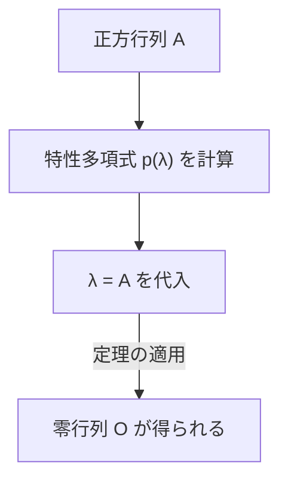

## 1. はじめに

線形代数学を学んでいると、多くの美しい定理や公式に出会います。その中でも、 **[ケーリー・ハミルトンの定理](https://kenji.blog/p/cayley-hamilton-theorem/)** (Cayley-Hamilton theorem) は、初見では非常に不思議で、まるで魔法のように感じられる結果の一つです。

この定理は一言で言えば、「すべての正方行列は、自分自身の特性方程式を満たす」というものです。特性方程式とは、行列の固有値を求めるために解く代数方程式のことですが、その変数に行列自身を代入すると、零行列になるという驚くべき主張をしています。行列という数の配列が、自分自身の性質から導き出される多項式の根になっているというのは、非常に興味深い現象です。

本記事では、この **[ケーリー・ハミルトンの定理](https://kenji.blog/p/cayley-hamilton-theorem/)** について、基礎的な概念の復習から始まり、直感的な意味、厳密な証明、そして行列の累乗や逆行列を計算する際の応用例まで、豊富な具体例を交えながら詳しく解説します。

## 2. 線形代数における位置づけと重要性

線形代数は、現代の数学や物理学、工学、さらには機械学習やデータサイエンスに至るまで、あらゆる分野で基礎となる学問です。その中で行列は、線形写像を表現するための強力なツールです。

**[ケーリー・ハミルトンの定理](https://kenji.blog/p/cayley-hamilton-theorem/)** は、行列の代数的な性質を深く理解するための鍵となります。この定理により、行列の高次多項式を低次の多項式に還元することが可能になり、無限次元の空間から有限次元の空間への橋渡しのような役割を果たします。特に、制御工学における可制御性や可観測性の解析、量子力学における演算子の計算など、実用的な場面でも頻繁に登場する重要な定理です。

## 3. 特性方程式と固有値の復習

定理を理解するために、まずは **特性方程式** (characteristic equation) と **固有値** (eigenvalues) について復習しましょう。

$n$ 次正方行列 $A$ に対して、スカラー $\lambda$ とゼロでないベクトル $\mathbf{x}$ が存在して、以下の関係を満たすとき、$\lambda$ を行列 $A$ の固有値、$\mathbf{x}$ を固有ベクトルと呼びます。

$$
A \mathbf{x} = \lambda \mathbf{x}
$$

この式は、行列 $A$ をベクトル $\mathbf{x}$ に掛けた結果が、$\mathbf{x}$ を単に $\lambda$ 倍したベクトルになることを意味しています。この式を少し変形してみましょう。$I$ を $n$ 次の単位行列とします。

$$
(\lambda I - A) \mathbf{x} = \mathbf{0}
$$

ベクトル $\mathbf{x}$ がゼロベクトルでない（自明でない）解を持つための必要十分条件は、係数行列 $(\lambda I - A)$ が逆行列を持たないこと、つまりその行列式がゼロになることです。

$$
\det(\lambda I - A) = 0
$$

この方程式を、行列 $A$ の **特性方程式** と呼びます。また、左辺の多項式 $p(\lambda) = \det(\lambda I - A)$ を **特性多項式** (characteristic polynomial) と呼びます。行列式の定義から、$p(\lambda)$ は $\lambda$ についての $n$ 次多項式になります。

$$
p(\lambda) = \lambda^n + c_{n-1}\lambda^{n-1} + \dots + c_1\lambda + c_0
$$

ここで、$c_{n-1} = -\text{tr}(A)$ （トレースのマイナス）、$c_0 = (-1)^n \det(A)$ となることが知られています。

## 4. [ケーリー・ハミルトンの定理](https://kenji.blog/p/cayley-hamilton-theorem/)の主張

さて、ここからが **[ケーリー・ハミルトンの定理](https://kenji.blog/p/cayley-hamilton-theorem/)** の本題です。定理の主張は非常にシンプルかつ強烈です。

> **定理（[ケーリー・ハミルトンの定理](https://kenji.blog/p/cayley-hamilton-theorem/)）**
> 任意の $n$ 次正方行列 $A$ と、その特性多項式 $p(\lambda) = \det(\lambda I - A)$ について、多項式の変数 $\lambda$ に行列 $A$ を代入すると、その結果は零行列 $O$ になる。すなわち、
> $$ p(A) = A^n + c_{n-1}A^{n-1} + \dots + c_1 A + c_0 I = O $$
> が成り立つ。

ここで注意すべき重要な点は、定数項 $c_0$ は行列の多項式においては $c_0 I$ （単位行列のスカラー倍）になるということです。行列とスカラーを直接足し合わせることはできないため、単位行列を補う必要があります。

## 5. 2次正方行列での具体例と手計算

抽象的な定義だけでは分かりにくいので、最も身近な2次正方行列の場合で具体的に計算し、定理が本当に成り立つのかを確かめてみましょう。

行列 $A$ を次のように一般的に置きます。

$$
A = \begin{pmatrix} a & b \\ c & d \end{pmatrix}
$$

まず、特性多項式 $p(\lambda)$ を計算します。

$$
\begin{aligned}
p(\lambda) &= \det(\lambda I - A) \\
&= \det \begin{pmatrix} \lambda - a & -b \\ -c & \lambda - d \end{pmatrix} \\
&= (\lambda - a)(\lambda - d) - (-b)(-c) \\
&= \lambda^2 - (a + d)\lambda + (ad - bc)
\end{aligned}
$$

ここで、$a + d$ は行列 $A$ の **トレース** (trace)、$ad - bc$ は行列 $A$ の **行列式** (determinant) です。それぞれ $\text{tr}(A)$、$\det(A)$ と書くと、特性方程式は以下のようになります。

$$
p(\lambda) = \lambda^2 - \text{tr}(A)\lambda + \det(A)
$$

[ケーリー・ハミルトンの定理](https://kenji.blog/p/cayley-hamilton-theorem/)は、ここに $\lambda = A$ を代入すると零行列になる、すなわち以下の式が成り立つと主張しています。

$$
A^2 - \text{tr}(A)A + \det(A)I = O
$$

これが高校数学などでもよく登場する、2次正方行列における公式です。実際に成分を計算して確かめてみましょう。

$$
A^2 = \begin{pmatrix} a & b \\ c & d \end{pmatrix} \begin{pmatrix} a & b \\ c & d \end{pmatrix} = \begin{pmatrix} a^2 + bc & ab + bd \\ ac + cd & bc + d^2 \end{pmatrix}
$$

左辺の計算を続けます。

$$
\begin{aligned}
& A^2 - (a+d)A + (ad-bc)I \\
&= \begin{pmatrix} a^2 + bc & ab + bd \\ ac + cd & bc + d^2 \end{pmatrix} - \begin{pmatrix} a^2 + ad & ab + bd \\ ac + cd & ad + d^2 \end{pmatrix} + \begin{pmatrix} ad - bc & 0 \\ 0 & ad - bc \end{pmatrix} \\
&= \begin{pmatrix} a^2 + bc - a^2 - ad + ad - bc & ab + bd - ab - bd + 0 \\ ac + cd - ac - cd + 0 & bc + d^2 - ad - d^2 + ad - bc \end{pmatrix} \\
&= \begin{pmatrix} 0 & 0 \\ 0 & 0 \end{pmatrix} = O
\end{aligned}
$$

各成分が見事にキャンセルされ、確かに零行列になりました！

## 6. 直感的な理解とよくある誤解

[ケーリー・ハミルトンの定理](https://kenji.blog/p/cayley-hamilton-theorem/)を初めて見たとき、多くの人が陥る **よくある誤解** があります。

> **誤った証明の例：**
> 特性多項式は $p(\lambda) = \det(\lambda I - A)$ である。
> したがって、$p(A)$ は $\lambda$ に $A$ を代入したものなので、
> $p(A) = \det(A I - A) = \det(A - A) = \det(O) = 0$
> よって証明された。

この推論は **完全に間違い** です。なぜなら、$p(\lambda)$ はあくまで「スカラー値（多項式）」を出力する関数であり、$\lambda$ に行列を代入するという操作 $p(A)$ は、多項式の各項に $A$ を代入して「行列」を作る操作だからです。一方、上の誤った証明では、行列式の中にそのまま行列 $A$ を代入してスカラーの $0$ を導き出しており、左辺（行列）と右辺（スカラー）で型が一致していません。

直感的には、行列 $A$ が対角化可能な場合を考えると分かりやすいです。
行列 $A$ が $A = P D P^{-1}$ （$D$ は固有値 $\lambda_1, \dots, \lambda_n$ が対角に並ぶ対角行列）と対角化できる場合を考えます。

$$ p(A) = p(P D P^{-1}) = P p(D) P^{-1} $$

対角行列の多項式は、各対角成分に多項式を適用したものになるため、

$$
p(D) = \begin{pmatrix} p(\lambda_1) & & 0 \\ & \ddots & \\ 0 & & p(\lambda_n) \end{pmatrix}
$$

となります。特性多項式の定義から、各固有値 $\lambda_i$ は $p(\lambda_i) = 0$ を満たします。したがって、$p(D)$ は零行列となり、$p(A) = P O P^{-1} = O$ が導かれます。

しかし、すべての行列が対角化可能とは限らないため（ジョルダン標準形を持たない場合など）、この説明は完全な証明にはなりません。一般的な証明には別の手法が必要です。

## 7. [ケーリー・ハミルトンの定理](https://kenji.blog/p/cayley-hamilton-theorem/)の厳密な証明

任意の $n$ 次正方行列 $A$ に対して成り立つ、一般的な証明（余因子行列を用いた証明）を紹介します。この証明は非常に美しく、代数的な技巧が光ります。

行列 $\lambda I - A$ に対する **余因子行列** (adjugate matrix) を $B(\lambda)$ とします。任意の正方行列 $M$ に対して $M \cdot \text{adj}(M) = \det(M) I$ が成り立つという性質を利用します。これにより、以下の恒等式が成り立ちます。

$$
(\lambda I - A) B(\lambda) = \det(\lambda I - A) I = p(\lambda) I
$$

行列 $\lambda I - A$ の各成分は $\lambda$ の1次以下の多項式なので、その余因子行列 $B(\lambda)$ の各成分の行列式は $\lambda$ の $(n-1)$ 次以下の多項式になります。したがって、$B(\lambda)$ は行列を係数とする $\lambda$ の多項式として次のように表せます。

$$
B(\lambda) = B_{n-1}\lambda^{n-1} + B_{n-2}\lambda^{n-2} + \dots + B_1\lambda + B_0
$$
（ここで、$B_k$ は $n$ 次の定数行列です）

これを先ほどの恒等式に代入します。左辺を展開すると：

$$
\begin{aligned}
(\lambda I - A) B(\lambda) &= (\lambda I - A)(B_{n-1}\lambda^{n-1} + B_{n-2}\lambda^{n-2} + \dots + B_1\lambda + B_0) \\
&= B_{n-1}\lambda^n + (B_{n-2} - A B_{n-1})\lambda^{n-1} + \dots + (B_0 - A B_1)\lambda - A B_0
\end{aligned}
$$

一方、右辺の特性多項式を $p(\lambda) = \lambda^n + c_{n-1}\lambda^{n-1} + \dots + c_1\lambda + c_0$ とすると、右辺は：

$$
p(\lambda)I = I\lambda^n + c_{n-1}I\lambda^{n-1} + \dots + c_1 I\lambda + c_0 I
$$

両辺は任意の $\lambda$ について成り立つ恒等式であるため、$\lambda$ の各次数の係数（これらは行列です）を比較することができます。

$$
\begin{aligned}
B_{n-1} &= I \quad \text{(λ^n の係数)} \\
B_{n-2} - A B_{n-1} &= c_{n-1} I \quad \text{(λ^{n-1} の係数)} \\
&\vdots \\
B_0 - A B_1 &= c_1 I \quad \text{(λ^1 の係数)} \\
-A B_0 &= c_0 I \quad \text{(λ^0 の係数)}
\end{aligned}
$$

ここからが証明のハイライトです。これらの式の両辺に、上から順に $A^n, A^{n-1}, \dots, A, I$ を左から掛けます。

$$
\begin{aligned}
A^n B_{n-1} &= A^n \\
A^{n-1} B_{n-2} - A^n B_{n-1} &= c_{n-1} A^{n-1} \\
&\vdots \\
A B_0 - A^2 B_1 &= c_1 A \\
-A B_0 &= c_0 I
\end{aligned}
$$

これら $n+1$ 個の式をすべて足し合わせます。すると、左辺は綺麗に相殺されて零行列 $O$ になります。

$$
O = A^n + c_{n-1}A^{n-1} + \dots + c_1 A + c_0 I
$$

これはまさに $p(A) = O$ であり、[ケーリー・ハミルトンの定理](https://kenji.blog/p/cayley-hamilton-theorem/)が証明されました。

## 8. 応用例1：行列の累乗の計算

[ケーリー・ハミルトンの定理](https://kenji.blog/p/cayley-hamilton-theorem/)の強力な応用の一つが、行列の高い累乗 $A^m$ の計算を劇的に簡略化できることです。

例えば、ある2次正方行列 $A$ があり、$p(A) = A^2 - 3A + 2I = O$ を満たすとします。このとき、$A^{10}$ を計算したいとしましょう。
まともに計算すると行列の掛け算を9回行う必要がありますが、定理を使えば多項式の割り算に帰着できます。

$\lambda^{10}$ を特性多項式 $p(\lambda) = \lambda^2 - 3\lambda + 2$ で割った商を $Q(\lambda)$、余りを $R(\lambda) = \alpha \lambda + \beta$ とします。

$$
\lambda^{10} = Q(\lambda)(\lambda^2 - 3\lambda + 2) + (\alpha \lambda + \beta)
$$

$p(\lambda) = (\lambda - 1)(\lambda - 2)$ なので、$\lambda = 1$ と $\lambda = 2$ を代入して未知数 $\alpha, \beta$ を求めます。

$\lambda = 1$ のとき： $1^{10} = \alpha + \beta \implies \alpha + \beta = 1$
$\lambda = 2$ のとき： $2^{10} = 2\alpha + \beta \implies 2\alpha + \beta = 1024$

これを解くと、$\alpha = 1023, \beta = -1022$ となります。したがって、
$$ \lambda^{10} = Q(\lambda)p(\lambda) + 1023\lambda - 1022 $$
ここに $\lambda = A$ を代入すると、$p(A) = O$ なので最初の項は消滅し、

$$
A^{10} = 1023A - 1022I
$$

となります。このように、どんなに高い次数であっても、余り $R(A)$ を計算するだけで $A^m$ が求まり、計算量を大幅に削減できます。

## 9. 応用例2：逆行列の計算

逆行列が存在する場合（つまり $\det(A) \neq 0$、したがって定数項 $c_0 \neq 0$ の場合）、[ケーリー・ハミルトンの定理](https://kenji.blog/p/cayley-hamilton-theorem/)を使って逆行列 $A^{-1}$ を計算することもできます。

定理の式を変形します。

$$
A^n + c_{n-1}A^{n-1} + \dots + c_1 A + c_0 I = O
$$

定数項を含む部分 $c_0 I$ を右辺に移項します。

$$
A(A^{n-1} + c_{n-1}A^{n-2} + \dots + c_1 I) = -c_0 I
$$

両辺を $-c_0$ で割ります。

$$
A \left[ -\frac{1}{c_0} (A^{n-1} + c_{n-1}A^{n-2} + \dots + c_1 I) \right] = I
$$

逆行列の定義 $A A^{-1} = I$ より、括弧の中身が $A^{-1}$ となります。

$$
A^{-1} = -\frac{1}{c_0} (A^{n-1} + c_{n-1}A^{n-2} + \dots + c_1 I)
$$

これにより、逆行列を求める問題が、行列の掛け算と足し算だけで完結する計算に帰着されます。これは余因子展開を直接計算するよりも、プログラム等で実装しやすい場合があります。

## 10. まとめ

本記事では、線形代数のハイライトの一つである **[ケーリー・ハミルトンの定理](https://kenji.blog/p/cayley-hamilton-theorem/)** について詳しく解説しました。

* 特性多項式 $p(\lambda)$ に行列自身を代入すると零行列になるという驚くべき性質（$p(A) = O$）。
* 直感的な対角化による理解と、スカラー代入の混同というよくある誤解。
* 余因子行列を用いた恒等式を利用した美しく厳密な証明。
* 多項式の除算を利用した行列の高次累乗の高速計算や、逆行列の表現といった実用的な応用。

[ケーリー・ハミルトンの定理](https://kenji.blog/p/cayley-hamilton-theorem/)は、理論的な美しさを持ちながら、具体的な計算においても非常に役に立つ道具です。行列を扱う際には常に背景に潜んでいるこの定理を意識することで、線形代数の理解がさらに深まることでしょう。
