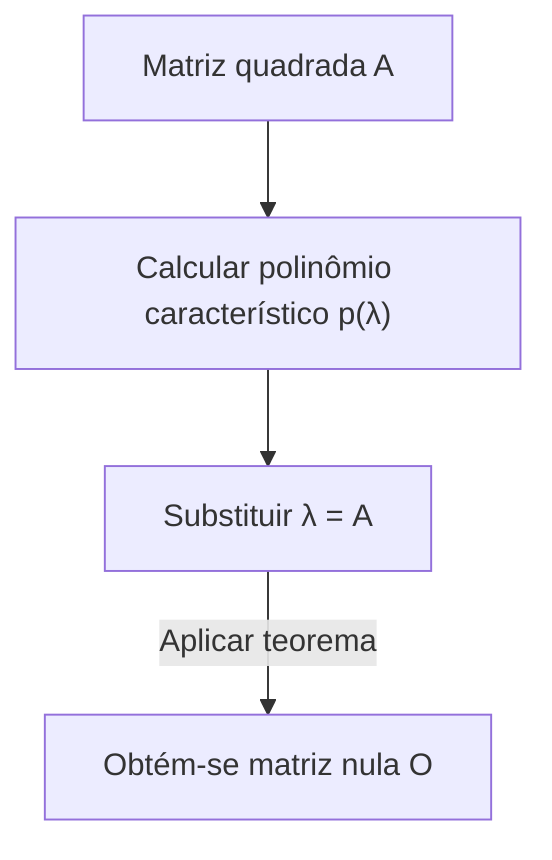

## 1. Introdução

Ao estudar álgebra linear, encontramos muitos teoremas e fórmulas belas. Entre eles, o **teorema de Cayley-Hamilton** (Cayley-Hamilton theorem) é um dos resultados mais maravilhosos, que à primeira vista parece quase magia.

Em suma, este teorema afirma que "toda matriz quadrada satisfaz sua própria equação característica". A equação característica é uma equação algébrica resolvida para encontrar os autovalores de uma matriz, e este teorema faz a afirmação surpreendente de que substituir a própria matriz na variável desta equação resulta na matriz nula. É um fenômeno fascinante que um arranjo de números — uma matriz — seja a raiz de um polinômio derivado de suas próprias propriedades.

Neste artigo, explicaremos o **teorema de Cayley-Hamilton** em detalhes, começando por uma revisão de conceitos fundamentais até seu significado intuitivo, demonstração rigorosa e aplicações práticas no cálculo de potências e inversas de matrizes, com muitos exemplos concretos.

## 2. Posição e importância na álgebra linear

A álgebra linear é hoje uma disciplina fundamental para muitas áreas, desde a matemática e física até a engenharia, aprendizado de máquina e ciência de dados. As matrizes são ferramentas poderosas para representar transformações lineares nesses contextos.

O **teorema de Cayley-Hamilton** é fundamental para compreender profundamente as propriedades algébricas das matrizes. Ele permite reduzir polinômios matriciais de alto grau a polinômios de grau inferior, atuando como uma ponte entre espaços de dimensão infinita e finita. Aparece com frequência em situações práticas, como a análise de controlabilidade e observabilidade na teoria de controle, ou o cálculo de operadores na mecânica quântica.

## 3. Revisão de equações características e autovalores

Para entender o teorema, vamos primeiro revisar os conceitos de **equação característica** (characteristic equation) e **autovalores** (eigenvalues).

Para uma matriz quadrada $A$ de ordem $n$, se existe um escalar $\lambda$ e um vetor não nulo $\mathbf{x}$ que satisfazem a seguinte relação, então $\lambda$ é chamado de autovalor da matriz $A$, e $\mathbf{x}$ é chamado de autovetor (eigenvector).

$$
A \mathbf{x} = \lambda \mathbf{x}
$$

Esta equação significa que o resultado de multiplicar o vetor $\mathbf{x}$ pela matriz $A$ é simplesmente o vetor $\mathbf{x}$ escalado por $\lambda$. Vamos transformar ligeiramente esta equação. Seja $I$ a matriz identidade de ordem $n$.

$$
(\lambda I - A) \mathbf{x} = \mathbf{0}
$$

A condição necessária e suficiente para que o vetor $\mathbf{x}$ tenha uma solução não nula (não trivial) é que a matriz dos coeficientes $(\lambda I - A)$ não seja invertível, o que significa que seu determinante deve ser zero.

$$
\det(\lambda I - A) = 0
$$

Esta equação é chamada de **equação característica** da matriz $A$. Além disso, o polinômio no lado esquerdo, $p(\lambda) = \det(\lambda I - A)$, é chamado de **polinômio característico** (characteristic polynomial). Pela definição do determinante, $p(\lambda)$ é um polinômio de grau $n$ em termos de $\lambda$.

$$
p(\lambda) = \lambda^n + c_{n-1}\lambda^{n-1} + \dots + c_1\lambda + c_0
$$

Aqui sabe-se que $c_{n-1} = -\text{tr}(A)$ (o oposto do traço) e $c_0 = (-1)^n \det(A)$.

## 4. Enunciado do teorema de Cayley-Hamilton

Agora chegamos ao cerne do **teorema de Cayley-Hamilton**. O enunciado do teorema é muito simples, mas impactante.

> **Teorema (Teorema de Cayley-Hamilton)**
> Para qualquer matriz quadrada $A$ de ordem $n$ e seu polinômio característico $p(\lambda) = \det(\lambda I - A)$, substituir a variável $\lambda$ pela matriz $A$ resulta na matriz nula $O$. Ou seja,
> $$ p(A) = A^n + c_{n-1}A^{n-1} + \dots + c_1 A + c_0 I = O $$
> é satisfeito.

Um ponto importante a notar aqui é que o termo constante $c_0$ torna-se $c_0 I$ (um múltiplo escalar da matriz identidade) no polinômio matricial. Como não se pode somar diretamente um escalar e uma matriz, deve-se multiplicar pela matriz identidade.

## 5. Exemplo concreto e cálculo com uma matriz 2x2

Definições abstratas podem ser difíceis de compreender, então vamos verificar o teorema calculando-o concretamente para o caso mais familiar: uma matriz $2 \times 2$.

Definimos uma matriz geral $A$ da seguinte maneira:

$$
A = \begin{pmatrix} a & b \\ c & d \end{pmatrix}
$$

Primeiro, calculamos o polinômio característico $p(\lambda)$.

$$
\begin{aligned}
p(\lambda) &= \det(\lambda I - A) \\
&= \det \begin{pmatrix} \lambda - a & -b \\ -c & \lambda - d \end{pmatrix} \\
&= (\lambda - a)(\lambda - d) - (-b)(-c) \\
&= \lambda^2 - (a + d)\lambda + (ad - bc)
\end{aligned}
$$

Aqui, $a + d$ é o **traço** (trace) da matriz $A$, e $ad - bc$ é o **determinante** (determinant) da matriz $A$. Denotando-os como $\text{tr}(A)$ e $\det(A)$ respectivamente, a equação característica fica assim:

$$
p(\lambda) = \lambda^2 - \text{tr}(A)\lambda + \det(A)
$$

O teorema de Cayley-Hamilton afirma que substituir $\lambda = A$ nesta equação resulta na matriz nula, ou seja:

$$
A^2 - \text{tr}(A)A + \det(A)I = O
$$

Esta é a fórmula para a matriz de $2 \times 2$ que costuma aparecer na matemática do ensino médio. Vamos calcular os componentes para comprovar.

$$
A^2 = \begin{pmatrix} a & b \\ c & d \end{pmatrix} \begin{pmatrix} a & b \\ c & d \end{pmatrix} = \begin{pmatrix} a^2 + bc & ab + bd \\ ac + cd & bc + d^2 \end{pmatrix}
$$

Continuamos com o lado esquerdo:

$$
\begin{aligned}
& A^2 - (a+d)A + (ad-bc)I \\
&= \begin{pmatrix} a^2 + bc & ab + bd \\ ac + cd & bc + d^2 \end{pmatrix} - \begin{pmatrix} a^2 + ad & ab + bd \\ ac + cd & ad + d^2 \end{pmatrix} + \begin{pmatrix} ad - bc & 0 \\ 0 & ad - bc \end{pmatrix} \\
&= \begin{pmatrix} a^2 + bc - a^2 - ad + ad - bc & ab + bd - ab - bd + 0 \\ ac + cd - ac - cd + 0 & bc + d^2 - ad - d^2 + ad - bc \end{pmatrix} \\
&= \begin{pmatrix} 0 & 0 \\ 0 & 0 \end{pmatrix} = O
\end{aligned}
$$

Cada componente é perfeitamente cancelado, resultando, de fato, na matriz nula!

## 6. Compreensão intuitiva e equívocos comuns

Quando as pessoas encontram o teorema de Cayley-Hamilton pela primeira vez, há um **equívoco comum** no qual costumam cair.

> **Exemplo de demonstração incorreta:**
> O polinômio característico é $p(\lambda) = \det(\lambda I - A)$.
> Portanto, como $p(A)$ é o resultado de substituir $A$ em $\lambda$,
> $p(A) = \det(A I - A) = \det(A - A) = \det(O) = 0$.
> Assim, o teorema está provado.

Este raciocínio está **completamente errado**. Isso ocorre porque $p(\lambda)$ é uma função que resulta em um "valor escalar" (um polinômio), enquanto a operação $p(A)$ de substituir uma matriz em $\lambda$ cria uma "matriz" substituindo $\lambda$ por $A$ em cada termo. Por outro lado, a falsa demonstração acima substitui a matriz $A$ diretamente dentro do determinante para derivar o escalar $0$, misturando tipos incompatíveis (matriz no lado esquerdo e escalar no direito).

Intuitivamente, é mais fácil entender se considerarmos o caso em que a matriz $A$ é diagonalizável.
Suponhamos que a matriz $A$ possa ser diagonalizada como $A = P D P^{-1}$ (onde $D$ é uma matriz diagonal com os autovalores $\lambda_1, \dots, \lambda_n$ em sua diagonal principal).

$$ p(A) = p(P D P^{-1}) = P p(D) P^{-1} $$

O polinômio de uma matriz diagonal é obtido simplesmente aplicando o polinômio a cada elemento da diagonal:

$$
p(D) = \begin{pmatrix} p(\lambda_1) & & 0 \\ & \ddots & \\ 0 & & p(\lambda_n) \end{pmatrix}
$$

Pela definição do polinômio característico, cada autovalor $\lambda_i$ satisfaz $p(\lambda_i) = 0$. Portanto, $p(D)$ torna-se a matriz nula, levando a $p(A) = P O P^{-1} = O$.

No entanto, como nem todas as matrizes são diagonalizáveis (por exemplo, as que não têm autovetores independentes suficientes), esta explicação não constitui uma demonstração completa. É necessária outra abordagem para uma demonstração geral.

## 7. Demonstração rigorosa do teorema de Cayley-Hamilton

Apresentamos aqui uma demonstração geral (usando a matriz adjunta clássica) que é válida para qualquer matriz quadrada $A$ de ordem $n$. Esta demonstração é muito elegante e mostra o engenho algébrico.

Seja $B(\lambda)$ a **matriz adjunta** (adjugate matrix) da matriz $\lambda I - A$. Utilizamos a propriedade de que para qualquer matriz quadrada $M$, satisfaz-se $M \cdot \text{adj}(M) = \det(M) I$. Isso nos dá a seguinte identidade:

$$
(\lambda I - A) B(\lambda) = \det(\lambda I - A) I = p(\lambda) I
$$

Como cada elemento da matriz $\lambda I - A$ é um polinômio em $\lambda$ de grau 1 ou menor, o determinante de cada componente da sua matriz adjunta $B(\lambda)$ será um polinômio em $\lambda$ de grau $(n-1)$ ou menor. Portanto, $B(\lambda)$ pode ser expresso como um polinômio em $\lambda$ com coeficientes matriciais:

$$
B(\lambda) = B_{n-1}\lambda^{n-1} + B_{n-2}\lambda^{n-2} + \dots + B_1\lambda + B_0
$$
(Onde $B_k$ são matrizes constantes de ordem $n$)

Substituímos isso na identidade anterior. Expandindo o lado esquerdo obtemos:

$$
\begin{aligned}
(\lambda I - A) B(\lambda) &= (\lambda I - A)(B_{n-1}\lambda^{n-1} + B_{n-2}\lambda^{n-2} + \dots + B_1\lambda + B_0) \\
&= B_{n-1}\lambda^n + (B_{n-2} - A B_{n-1})\lambda^{n-1} + \dots + (B_0 - A B_1)\lambda - A B_0
\end{aligned}
$$

Por outro lado, se escrevemos o polinômio característico como $p(\lambda) = \lambda^n + c_{n-1}\lambda^{n-1} + \dots + c_1\lambda + c_0$, o lado direito é:

$$
p(\lambda)I = I\lambda^n + c_{n-1}I\lambda^{n-1} + \dots + c_1 I\lambda + c_0 I
$$

Como ambas as expressões são polinômios idênticos para qualquer $\lambda$, podemos igualar os coeficientes correspondentes a cada potência de $\lambda$ (que são matrizes).

$$
\begin{aligned}
B_{n-1} &= I \quad \text{(Coeficiente de λ^n)} \\
B_{n-2} - A B_{n-1} &= c_{n-1} I \quad \text{(Coeficiente de λ^{n-1})} \\
&\vdots \\
B_0 - A B_1 &= c_1 I \quad \text{(Coeficiente de λ^1)} \\
-A B_0 &= c_0 I \quad \text{(Coeficiente de λ^0)}
\end{aligned}
$$

Aí vem o clímax da demonstração. Multiplicamos ambos os lados destas equações por $A^n, A^{n-1}, \dots, A, I$ pela esquerda, respectivamente de cima para baixo.

$$
\begin{aligned}
A^n B_{n-1} &= A^n \\
A^{n-1} B_{n-2} - A^n B_{n-1} &= c_{n-1} A^{n-1} \\
&\vdots \\
A B_0 - A^2 B_1 &= c_1 A \\
-A B_0 &= c_0 I
\end{aligned}
$$

Agora somamos todas essas $n+1$ equações. O lado esquerdo é maravilhosamente cancelado numa soma telescópica, deixando apenas a matriz nula $O$.

$$
O = A^n + c_{n-1}A^{n-1} + \dots + c_1 A + c_0 I
$$

Isso é exatamente $p(A) = O$, e o teorema de Cayley-Hamilton fica demonstrado.

## 8. Aplicação 1: Cálculo de potências de matrizes

Uma das aplicações poderosas do teorema de Cayley-Hamilton é que simplifica drasticamente o cálculo de grandes potências de uma matriz $A^m$.

Por exemplo, suponhamos uma matriz quadrada $A$ de $2 \times 2$ que satisfaz $p(A) = A^2 - 3A + 2I = O$. Queremos calcular $A^{10}$.
Fazer isso normalmente exigiria 9 multiplicações de matrizes, mas utilizando o teorema, o problema se reduz à divisão de polinômios.

Seja $Q(\lambda)$ o quociente e $R(\lambda) = \alpha \lambda + \beta$ o resto ao dividir $\lambda^{10}$ pelo polinômio característico $p(\lambda) = \lambda^2 - 3\lambda + 2$.

$$
\lambda^{10} = Q(\lambda)(\lambda^2 - 3\lambda + 2) + (\alpha \lambda + \beta)
$$

Como $p(\lambda) = (\lambda - 1)(\lambda - 2)$, substituímos $\lambda = 1$ e $\lambda = 2$ para encontrar as incógnitas $\alpha, \beta$.

Para $\lambda = 1$: $1^{10} = \alpha + \beta \implies \alpha + \beta = 1$
Para $\lambda = 2$: $2^{10} = 2\alpha + \beta \implies 2\alpha + \beta = 1024$

A resolução deste sistema dá $\alpha = 1023, \beta = -1022$. Portanto,
$$ \lambda^{10} = Q(\lambda)p(\lambda) + 1023\lambda - 1022 $$
Substituindo $\lambda = A$, como $p(A) = O$, o primeiro termo desaparece e fica:

$$
A^{10} = 1023A - 1022I
$$

Desta forma, não importa quão alta seja a potência, basta calcular o resto $R(A)$ para obter $A^m$, reduzindo enormemente os cálculos.

## 9. Aplicação 2: Cálculo da matriz inversa

Se a matriz inversa existir (ou seja, $\det(A) \neq 0$ e portanto o termo constante $c_0 \neq 0$), o teorema de Cayley-Hamilton também pode ser usado para calcular a matriz inversa $A^{-1}$.

Reorganizamos a equação do teorema:

$$
A^n + c_{n-1}A^{n-1} + \dots + c_1 A + c_0 I = O
$$

Passamos a parte que contém o termo constante, $c_0 I$, para o lado direito.

$$
A(A^{n-1} + c_{n-1}A^{n-2} + \dots + c_1 I) = -c_0 I
$$

Dividimos ambos os lados por $-c_0$.

$$
A \left[ -\frac{1}{c_0} (A^{n-1} + c_{n-1}A^{n-2} + \dots + c_1 I) \right] = I
$$

Pela definição de matriz inversa $A A^{-1} = I$, o conteúdo entre colchetes representa precisamente $A^{-1}$.

$$
A^{-1} = -\frac{1}{c_0} (A^{n-1} + c_{n-1}A^{n-2} + \dots + c_1 I)
$$

Assim, o problema de encontrar a inversa reduz-se a cálculos de somas e multiplicações de matrizes. Em programação, às vezes é mais fácil implementar isto do que diretamente a expansão pela matriz adjunta.

## 10. Conclusão

Neste artigo, explicamos em detalhes o **teorema de Cayley-Hamilton**, um dos teoremas de maior destaque da álgebra linear.

* A propriedade surpreendente de que substituir uma matriz em seu próprio polinômio característico $p(\lambda)$ resulta na matriz nula ($p(A) = O$).
* A compreensão intuitiva mediante diagonalização e o equívoco comum de confundi-la com uma substituição escalar.
* Uma elegante e rigorosa demonstração usando identidades com a matriz adjunta.
* Aplicações práticas como o cálculo rápido de potências de matrizes usando divisão de polinômios e fórmulas para encontrar inversas.

O teorema de Cayley-Hamilton não possui apenas grande beleza teórica, mas também é uma ferramenta extremamente útil em cálculos concretos. Ter em mente que este teorema está sempre nos bastidores ao trabalhar com matrizes sem dúvida aprofundará a sua compreensão da álgebra linear.
