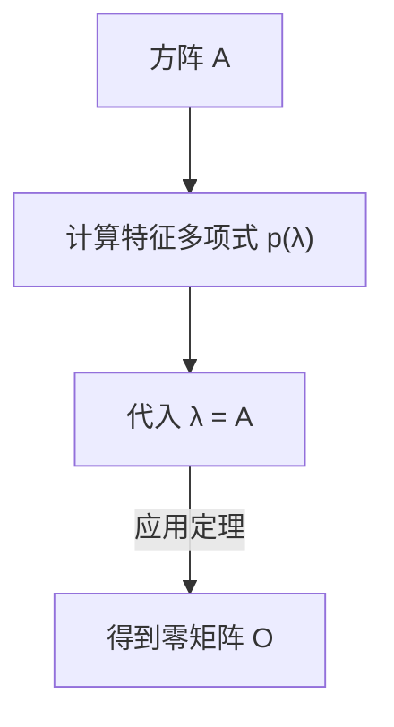

## 1. 引言

在学习线性代数的过程中，我们会遇到许多优美的定理和公式。其中， **[凯莱-哈密顿定理](https://kenji.blog/zh-cn/p/cayley-hamilton-theorem/)** (Cayley-Hamilton theorem) 初看非常不可思议，甚至让人感觉像是魔法一般。

简而言之，该定理指出：“所有方阵都满足其自身的特征方程”。特征方程是为了求解矩阵的特征值而需要解的代数方程。该定理令人惊讶地断言，将矩阵自身代入该方程的变量中，结果将是零矩阵。矩阵这种数字的排列，竟然是其自身性质推导出的多项式的根，这实在是一个非常有趣的现象。

本文将从基础概念的回顾开始，详细解读 **[凯莱-哈密顿定理](https://kenji.blog/zh-cn/p/cayley-hamilton-theorem/)** 的直观含义、严谨证明，并结合丰富的具体例子，探讨其在计算矩阵高次幂和逆矩阵时的实际应用。

## 2. 在线性代数中的定位与重要性

线性代数是当今数学、物理学、工程学乃至机器学习和数据科学等众多领域的基石。在这些领域中，矩阵是表示线性映射的强大工具。

**[凯莱-哈密顿定理](https://kenji.blog/zh-cn/p/cayley-hamilton-theorem/)** 是深入理解矩阵代数性质的关键。通过该定理，我们可以将矩阵的高次多项式化简为低次多项式，起到了连接无限维空间与有限维空间的桥梁作用。特别是在控制工程中的可控性与可观测性分析、量子力学中的算符计算等实际场景中，这都是一个频繁出现的重要定理。

## 3. 特征方程与特征值的回顾

为了理解这个定理，让我们先回顾一下 **特征方程** (characteristic equation) 和 **特征值** (eigenvalues) 的概念。

对于 $n$ 阶方阵 $A$，如果存在标量 $\lambda$ 和非零向量 $\mathbf{x}$ 满足以下关系，则称 $\lambda$ 为矩阵 $A$ 的特征值，$\mathbf{x}$ 为特征向量。

$$
A \mathbf{x} = \lambda \mathbf{x}
$$

这个等式意味着，矩阵 $A$ 乘以向量 $\mathbf{x}$ 的结果，仅仅是向量 $\mathbf{x}$ 被放大了 $\lambda$ 倍。让我们对这个等式稍作变形。设 $I$ 为 $n$ 阶单位矩阵。

$$
(\lambda I - A) \mathbf{x} = \mathbf{0}
$$

向量 $\mathbf{x}$ 具有非零（非平凡）解的充要条件是系数矩阵 $(\lambda I - A)$ 不可逆，即其行列式必须为零。

$$
\det(\lambda I - A) = 0
$$

这个方程被称为矩阵 $A$ 的 **特征方程** 。此外，左侧的多项式 $p(\lambda) = \det(\lambda I - A)$ 被称为 **特征多项式** (characteristic polynomial)。根据行列式的定义，$p(\lambda)$ 是一个关于 $\lambda$ 的 $n$ 次多项式。

$$
p(\lambda) = \lambda^n + c_{n-1}\lambda^{n-1} + \dots + c_1\lambda + c_0
$$

其中，已知 $c_{n-1} = -\text{tr}(A)$ （迹的相反数）且 $c_0 = (-1)^n \det(A)$。

## 4. [凯莱-哈密顿定理](https://kenji.blog/zh-cn/p/cayley-hamilton-theorem/)的表述

接下来是 **[凯莱-哈密顿定理](https://kenji.blog/zh-cn/p/cayley-hamilton-theorem/)** 的核心。定理的表述非常简单却极具震撼力。

> **定理（[凯莱-哈密顿定理](https://kenji.blog/zh-cn/p/cayley-hamilton-theorem/)）**
> 对于任意 $n$ 阶方阵 $A$ 及其特征多项式 $p(\lambda) = \det(\lambda I - A)$，将多项式中的变量 $\lambda$ 替换为矩阵 $A$，其结果将是零矩阵 $O$。也就是说，
> $$ p(A) = A^n + c_{n-1}A^{n-1} + \dots + c_1 A + c_0 I = O $$
> 成立。

这里需要注意的一个重要细节是，常数项 $c_0$ 在矩阵多项式中变成了 $c_0 I$（单位矩阵的标量乘积）。因为矩阵和标量不能直接相加，所以必须补充一个单位矩阵。

## 5. 2阶方阵的具体例子与手工计算

抽象的定义往往难以理解，所以让我们用最常见的2阶方阵来进行具体计算，看看定理是否真的成立。

我们将矩阵 $A$ 一般化地设为：

$$
A = \begin{pmatrix} a & b \\ c & d \end{pmatrix}
$$

首先计算特征多项式 $p(\lambda)$。

$$
\begin{aligned}
p(\lambda) &= \det(\lambda I - A) \\
&= \det \begin{pmatrix} \lambda - a & -b \\ -c & \lambda - d \end{pmatrix} \\
&= (\lambda - a)(\lambda - d) - (-b)(-c) \\
&= \lambda^2 - (a + d)\lambda + (ad - bc)
\end{aligned}
$$

这里，$a + d$ 是矩阵 $A$ 的 **迹** (trace)，$ad - bc$ 是矩阵 $A$ 的 **行列式** (determinant)。分别记作 $\text{tr}(A)$ 和 $\det(A)$，特征方程就变成了：

$$
p(\lambda) = \lambda^2 - \text{tr}(A)\lambda + \det(A)
$$

[凯莱-哈密顿定理](https://kenji.blog/zh-cn/p/cayley-hamilton-theorem/)断言，将 $\lambda = A$ 代入上式会得到零矩阵，即以下等式成立：

$$
A^2 - \text{tr}(A)A + \det(A)I = O
$$

这就是在高中数学中经常出现的2阶方阵的公式。让我们实际计算各个分量来验证一下。

$$
A^2 = \begin{pmatrix} a & b \\ c & d \end{pmatrix} \begin{pmatrix} a & b \\ c & d \end{pmatrix} = \begin{pmatrix} a^2 + bc & ab + bd \\ ac + cd & bc + d^2 \end{pmatrix}
$$

继续计算等式的左边：

$$
\begin{aligned}
& A^2 - (a+d)A + (ad-bc)I \\
&= \begin{pmatrix} a^2 + bc & ab + bd \\ ac + cd & bc + d^2 \end{pmatrix} - \begin{pmatrix} a^2 + ad & ab + bd \\ ac + cd & ad + d^2 \end{pmatrix} + \begin{pmatrix} ad - bc & 0 \\ 0 & ad - bc \end{pmatrix} \\
&= \begin{pmatrix} a^2 + bc - a^2 - ad + ad - bc & ab + bd - ab - bd + 0 \\ ac + cd - ac - cd + 0 & bc + d^2 - ad - d^2 + ad - bc \end{pmatrix} \\
&= \begin{pmatrix} 0 & 0 \\ 0 & 0 \end{pmatrix} = O
\end{aligned}
$$

每个分量都完美地抵消了，确实得到了零矩阵！

## 6. 直观理解与常见误区

初次接触[凯莱-哈密顿定理](https://kenji.blog/zh-cn/p/cayley-hamilton-theorem/)时，许多人会陷入一个 **常见误区** 。

> **错误的证明示例：**
> 特征多项式为 $p(\lambda) = \det(\lambda I - A)$。
> 因此，$p(A)$ 就是将 $A$ 代入 $\lambda$ 得到的结果，
> $p(A) = \det(A I - A) = \det(A - A) = \det(O) = 0$。
> 故定理得证。

这种推理是 **完全错误** 的。因为 $p(\lambda)$ 终究是一个输出“标量值（多项式）”的函数，而将矩阵代入 $\lambda$ 的操作 $p(A)$，是将 $A$ 代入多项式的每一项从而生成“矩阵”的操作。相反，上述错误证明直接将矩阵 $A$ 代入行列式内部从而得出标量 $0$，这导致左侧（矩阵）和右侧（标量）的类型不匹配。

直观上，我们可以通过考虑矩阵 $A$ 可对角化的情况来更容易地理解它。
假设矩阵 $A$ 可以对角化为 $A = P D P^{-1}$ （其中 $D$ 是对角线上排列着特征值 $\lambda_1, \dots, \lambda_n$ 的对角矩阵）。

$$ p(A) = p(P D P^{-1}) = P p(D) P^{-1} $$

由于对角矩阵的多项式等于对其各个对角分量应用该多项式，因此：

$$
p(D) = \begin{pmatrix} p(\lambda_1) & & 0 \\ & \ddots & \\ 0 & & p(\lambda_n) \end{pmatrix}
$$

根据特征多项式的定义，每个特征值 $\lambda_i$ 都满足 $p(\lambda_i) = 0$。因此，$p(D)$ 变成了零矩阵，进而推导出 $p(A) = P O P^{-1} = O$。

但是，因为并非所有矩阵都能被对角化（例如不具有完备特征向量的矩阵），所以这种解释不能构成完整的证明。一般情况的证明需要另一种方法。

## 7. [凯莱-哈密顿定理](https://kenji.blog/zh-cn/p/cayley-hamilton-theorem/)的严谨证明

这里介绍一个适用于任意 $n$ 阶方阵 $A$ 的一般性证明（使用伴随矩阵）。这个证明非常优美，闪烁着代数技巧的光芒。

设矩阵 $\lambda I - A$ 的 **伴随矩阵** (adjugate matrix) 为 $B(\lambda)$。我们利用对于任意方阵 $M$ 均成立的性质：$M \cdot \text{adj}(M) = \det(M) I$。由此，我们可以得到以下恒等式：

$$
(\lambda I - A) B(\lambda) = \det(\lambda I - A) I = p(\lambda) I
$$

由于矩阵 $\lambda I - A$ 的每个分量都是关于 $\lambda$ 的1次或0次多项式，因此其伴随矩阵 $B(\lambda)$ 的每个分量的行列式将是关于 $\lambda$ 的 $(n-1)$ 次或更低次的多项式。因此，可以将 $B(\lambda)$ 表示为以矩阵为系数的 $\lambda$ 多项式：

$$
B(\lambda) = B_{n-1}\lambda^{n-1} + B_{n-2}\lambda^{n-2} + \dots + B_1\lambda + B_0
$$
（其中，$B_k$ 是 $n$ 阶常数矩阵）

将其代入前面的恒等式中。展开左边可得：

$$
\begin{aligned}
(\lambda I - A) B(\lambda) &= (\lambda I - A)(B_{n-1}\lambda^{n-1} + B_{n-2}\lambda^{n-2} + \dots + B_1\lambda + B_0) \\
&= B_{n-1}\lambda^n + (B_{n-2} - A B_{n-1})\lambda^{n-1} + \dots + (B_0 - A B_1)\lambda - A B_0
\end{aligned}
$$

同时，如果将右边的特征多项式记作 $p(\lambda) = \lambda^n + c_{n-1}\lambda^{n-1} + \dots + c_1\lambda + c_0$，那么右边即为：

$$
p(\lambda)I = I\lambda^n + c_{n-1}I\lambda^{n-1} + \dots + c_1 I\lambda + c_0 I
$$

由于两边是关于任意 $\lambda$ 的恒等多项式，我们可以对比各个 $\lambda$ 次方的系数（这些系数是矩阵）。

$$
\begin{aligned}
B_{n-1} &= I \quad \text{(λ^n 的系数)} \\
B_{n-2} - A B_{n-1} &= c_{n-1} I \quad \text{(λ^{n-1} 的系数)} \\
&\vdots \\
B_0 - A B_1 &= c_1 I \quad \text{(λ^1 的系数)} \\
-A B_0 &= c_0 I \quad \text{(λ^0 的系数)}
\end{aligned}
$$

接下来是证明的精彩之处。将上述方程的左右两边，从上到下依次在左侧乘以 $A^n, A^{n-1}, \dots, A, I$。

$$
\begin{aligned}
A^n B_{n-1} &= A^n \\
A^{n-1} B_{n-2} - A^n B_{n-1} &= c_{n-1} A^{n-1} \\
&\vdots \\
A B_0 - A^2 B_1 &= c_1 A \\
-A B_0 &= c_0 I
\end{aligned}
$$

现在将这 $n+1$ 个方程全部相加。左边会像望远镜一样完美相消，只剩下零矩阵 $O$。

$$
O = A^n + c_{n-1}A^{n-1} + \dots + c_1 A + c_0 I
$$

这恰好就是 $p(A) = O$，[凯莱-哈密顿定理](https://kenji.blog/zh-cn/p/cayley-hamilton-theorem/)由此得证。

## 8. 应用实例1：计算矩阵的高次幂

[凯莱-哈密顿定理](https://kenji.blog/zh-cn/p/cayley-hamilton-theorem/)的一个强大应用是，它可以极大地简化计算矩阵高次幂 $A^m$ 的过程。

例如，假设有一个2阶方阵 $A$ 满足 $p(A) = A^2 - 3A + 2I = O$。现在我们想要计算 $A^{10}$。
如果直接计算，需要进行9次矩阵乘法，但利用该定理，可以将问题转化为多项式除法。

设将 $\lambda^{10}$ 除以特征多项式 $p(\lambda) = \lambda^2 - 3\lambda + 2$ 的商为 $Q(\lambda)$，余数为 $R(\lambda) = \alpha \lambda + \beta$。

$$
\lambda^{10} = Q(\lambda)(\lambda^2 - 3\lambda + 2) + (\alpha \lambda + \beta)
$$

因为 $p(\lambda) = (\lambda - 1)(\lambda - 2)$，我们代入 $\lambda = 1$ 和 $\lambda = 2$ 来求出未知数 $\alpha, \beta$。

当 $\lambda = 1$ 时： $1^{10} = \alpha + \beta \implies \alpha + \beta = 1$
当 $\lambda = 2$ 时： $2^{10} = 2\alpha + \beta \implies 2\alpha + \beta = 1024$

解得 $\alpha = 1023, \beta = -1022$。因此，
$$ \lambda^{10} = Q(\lambda)p(\lambda) + 1023\lambda - 1022 $$
将 $\lambda = A$ 代入此处。因为 $p(A) = O$，第一项消失，剩下：

$$
A^{10} = 1023A - 1022I
$$

这样一来，无论次数有多高，只需计算余数 $R(A)$ 就可以求出 $A^m$，大幅度减少了计算量。

## 9. 应用实例2：计算逆矩阵

如果逆矩阵存在（即 $\det(A) \neq 0$，从而常数项 $c_0 \neq 0$），也可以利用[凯莱-哈密顿定理](https://kenji.blog/zh-cn/p/cayley-hamilton-theorem/)来计算逆矩阵 $A^{-1}$。

我们对定理的等式进行变形：

$$
A^n + c_{n-1}A^{n-1} + \dots + c_1 A + c_0 I = O
$$

将包含常数项的部分 $c_0 I$ 移至等式右边。

$$
A(A^{n-1} + c_{n-1}A^{n-2} + \dots + c_1 I) = -c_0 I
$$

两边同时除以 $-c_0$。

$$
A \left[ -\frac{1}{c_0} (A^{n-1} + c_{n-1}A^{n-2} + \dots + c_1 I) \right] = I
$$

根据逆矩阵的定义 $A A^{-1} = I$，方括号内的内容即代表 $A^{-1}$。

$$
A^{-1} = -\frac{1}{c_0} (A^{n-1} + c_{n-1}A^{n-2} + \dots + c_1 I)
$$

由此，求逆矩阵的问题就转化为了仅需通过矩阵乘法和加法即可完成的计算。在编程实现时，这有时比直接计算伴随矩阵展开更容易。

## 10. 总结

本文详细解读了作为线性代数亮点之一的 **[凯莱-哈密顿定理](https://kenji.blog/zh-cn/p/cayley-hamilton-theorem/)** 。

* 将矩阵代入其自身的特征多项式 $p(\lambda)$ 会得到零矩阵这一惊人性质（$p(A) = O$）。
* 通过对角化进行的直观理解，以及混淆标量代入的常见误区。
* 利用伴随矩阵恒等式进行的优美而严谨的证明。
* 利用多项式除法高速计算矩阵高次幂，以及求逆矩阵表达式等实用应用。

[凯莱-哈密顿定理](https://kenji.blog/zh-cn/p/cayley-hamilton-theorem/)不仅具有理论上的美感，在具体计算中也是一个非常有用的工具。在处理矩阵时，时刻意识到这个隐藏在背景中的定理，无疑会加深你对线性代数的理解。
