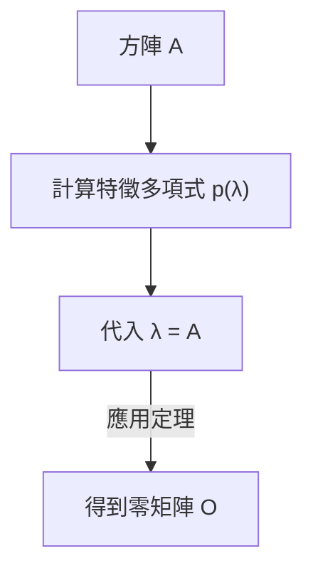

## 1. 引言

在學習線性代數的過程中，我們會遇到許多優美的定理和公式。其中， **[凱萊-哈密頓定理](https://kenji.blog/zh-tw/p/cayley-hamilton-theorem/)** (Cayley-Hamilton theorem) 初看非常不可思議，甚至讓人感覺像是魔法一般。

簡而言之，該定理指出：「所有方陣都滿足其自身的特徵方程式」。特徵方程式是為了求解矩陣的特徵值而需要解的代數方程式。該定理令人驚訝地斷言，將矩陣自身代入該方程式的變數中，結果將是零矩陣。矩陣這種數字的排列，竟然是其自身性質推導出的多項式的根，這實在是一個非常有趣的現象。

本文將從基礎概念的回顧開始，詳細解讀 **[凱萊-哈密頓定理](https://kenji.blog/zh-tw/p/cayley-hamilton-theorem/)** 的直觀含義、嚴謹證明，並結合豐富的具體例子，探討其在計算矩陣高次冪和逆矩陣時的實際應用。

## 2. 在線性代數中的定位與重要性

線性代數是當今數學、物理學、工程學乃至機器學習和數據科學等眾多領域的基石。在這些領域中，矩陣是表示線性映射的強大工具。

**[凱萊-哈密頓定理](https://kenji.blog/zh-tw/p/cayley-hamilton-theorem/)** 是深入理解矩陣代數性質的關鍵。透過該定理，我們可以將矩陣的高次多項式化簡為低次多項式，起到了連接無限維空間與有限維空間的橋樑作用。特別是在控制工程中的可控性與可觀測性分析、量子力學中的算符計算等實際場景中，這都是一個頻繁出現的重要定理。

## 3. 特徵方程式與特徵值的回顧

為了理解這個定理，讓我們先回顧一下 **特徵方程式** (characteristic equation) 和 **特徵值** (eigenvalues) 的概念。

對於 $n$ 階方陣 $A$，如果存在純量 $\lambda$ 和非零向量 $\mathbf{x}$ 滿足以下關係，則稱 $\lambda$ 為矩陣 $A$ 的特徵值，$\mathbf{x}$ 為特徵向量。

$$
A \mathbf{x} = \lambda \mathbf{x}
$$

這個等式意味著，矩陣 $A$ 乘以向量 $\mathbf{x}$ 的結果，僅僅是向量 $\mathbf{x}$ 被放大了 $\lambda$ 倍。讓我們對這個等式稍作變形。設 $I$ 為 $n$ 階單位矩陣。

$$
(\lambda I - A) \mathbf{x} = \mathbf{0}
$$

向量 $\mathbf{x}$ 具有非零（非平凡）解的充要條件是係數矩陣 $(\lambda I - A)$ 不可逆，即其行列式必須為零。

$$
\det(\lambda I - A) = 0
$$

這個方程式被稱為矩陣 $A$ 的 **特徵方程式** 。此外，左側的多項式 $p(\lambda) = \det(\lambda I - A)$ 被稱為 **特徵多項式** (characteristic polynomial)。根據行列式的定義，$p(\lambda)$ 是一個關於 $\lambda$ 的 $n$ 次多項式。

$$
p(\lambda) = \lambda^n + c_{n-1}\lambda^{n-1} + \dots + c_1\lambda + c_0
$$

其中，已知 $c_{n-1} = -\text{tr}(A)$ （跡的相反數）且 $c_0 = (-1)^n \det(A)$。

## 4. [凱萊-哈密頓定理](https://kenji.blog/zh-tw/p/cayley-hamilton-theorem/)的表述

接下來是 **[凱萊-哈密頓定理](https://kenji.blog/zh-tw/p/cayley-hamilton-theorem/)** 的核心。定理的表述非常簡單卻極具震撼力。

> **定理（[凱萊-哈密頓定理](https://kenji.blog/zh-tw/p/cayley-hamilton-theorem/)）**
> 對於任意 $n$ 階方陣 $A$ 及其特徵多項式 $p(\lambda) = \det(\lambda I - A)$，將多項式中的變數 $\lambda$ 替換為矩陣 $A$，其結果將是零矩陣 $O$。也就是說，
> $$ p(A) = A^n + c_{n-1}A^{n-1} + \dots + c_1 A + c_0 I = O $$
> 成立。

這裡需要注意的一個重要細節是，常數項 $c_0$ 在矩陣多項式中變成了 $c_0 I$（單位矩陣的純量乘積）。因為矩陣和純量不能直接相加，所以必須補充一個單位矩陣。

## 5. 2階方陣的具體例子與手工計算

抽象的定義往往難以理解，所以讓我們用最常見的2階方陣來進行具體計算，看看定理是否真的成立。

我們將矩陣 $A$ 一般化地設為：

$$
A = \begin{pmatrix} a & b \\ c & d \end{pmatrix}
$$

首先計算特徵多項式 $p(\lambda)$。

$$
\begin{aligned}
p(\lambda) &= \det(\lambda I - A) \\
&= \det \begin{pmatrix} \lambda - a & -b \\ -c & \lambda - d \end{pmatrix} \\
&= (\lambda - a)(\lambda - d) - (-b)(-c) \\
&= \lambda^2 - (a + d)\lambda + (ad - bc)
\end{aligned}
$$

這裡，$a + d$ 是矩陣 $A$ 的 **跡** (trace)，$ad - bc$ 是矩陣 $A$ 的 **行列式** (determinant)。分別記作 $\text{tr}(A)$ 和 $\det(A)$，特徵方程式就變成了：

$$
p(\lambda) = \lambda^2 - \text{tr}(A)\lambda + \det(A)
$$

[凱萊-哈密頓定理](https://kenji.blog/zh-tw/p/cayley-hamilton-theorem/)斷言，將 $\lambda = A$ 代入上式會得到零矩陣，即以下等式成立：

$$
A^2 - \text{tr}(A)A + \det(A)I = O
$$

這就是在高中數學中經常出現的2階方陣的公式。讓我們實際計算各個分量來驗證一下。

$$
A^2 = \begin{pmatrix} a & b \\ c & d \end{pmatrix} \begin{pmatrix} a & b \\ c & d \end{pmatrix} = \begin{pmatrix} a^2 + bc & ab + bd \\ ac + cd & bc + d^2 \end{pmatrix}
$$

繼續計算等式的左邊：

$$
\begin{aligned}
& A^2 - (a+d)A + (ad-bc)I \\
&= \begin{pmatrix} a^2 + bc & ab + bd \\ ac + cd & bc + d^2 \end{pmatrix} - \begin{pmatrix} a^2 + ad & ab + bd \\ ac + cd & ad + d^2 \end{pmatrix} + \begin{pmatrix} ad - bc & 0 \\ 0 & ad - bc \end{pmatrix} \\
&= \begin{pmatrix} a^2 + bc - a^2 - ad + ad - bc & ab + bd - ab - bd + 0 \\ ac + cd - ac - cd + 0 & bc + d^2 - ad - d^2 + ad - bc \end{pmatrix} \\
&= \begin{pmatrix} 0 & 0 \\ 0 & 0 \end{pmatrix} = O
\end{aligned}
$$

每個分量都完美地抵消了，確實得到了零矩陣！

## 6. 直觀理解與常見誤區

初次接觸[凱萊-哈密頓定理](https://kenji.blog/zh-tw/p/cayley-hamilton-theorem/)時，許多人會陷入一個 **常見誤區** 。

> **錯誤的證明示例：**
> 特徵多項式為 $p(\lambda) = \det(\lambda I - A)$。
> 因此，$p(A)$ 就是將 $A$ 代入 $\lambda$ 得到的結果，
> $p(A) = \det(A I - A) = \det(A - A) = \det(O) = 0$。
> 故定理得證。

這種推理是 **完全錯誤** 的。因為 $p(\lambda)$ 終究是一個輸出「純量值（多項式）」的函數，而將矩陣代入 $\lambda$ 的操作 $p(A)$，是將 $A$ 代入多項式的每一項從而生成「矩陣」的操作。相反，上述錯誤證明直接將矩陣 $A$ 代入行列式內部從而得出純量 $0$，這導致左側（矩陣）和右側（純量）的類型不匹配。

直觀上，我們可以透過考慮矩陣 $A$ 可對角化的情況來更容易地理解它。
假設矩陣 $A$ 可以對角化為 $A = P D P^{-1}$ （其中 $D$ 是對角線上排列著特徵值 $\lambda_1, \dots, \lambda_n$ 的對角矩陣）。

$$ p(A) = p(P D P^{-1}) = P p(D) P^{-1} $$

由於對角矩陣的多項式等於對其各個對角分量應用該多項式，因此：

$$
p(D) = \begin{pmatrix} p(\lambda_1) & & 0 \\ & \ddots & \\ 0 & & p(\lambda_n) \end{pmatrix}
$$

根據特徵多項式的定義，每個特徵值 $\lambda_i$ 都滿足 $p(\lambda_i) = 0$。因此，$p(D)$ 變成了零矩陣，進而推導出 $p(A) = P O P^{-1} = O$。

但是，因為並非所有矩陣都能被對角化（例如不具有完備特徵向量的矩陣），所以這種解釋不能構成完整的證明。一般情況的證明需要另一種方法。

## 7. [凱萊-哈密頓定理](https://kenji.blog/zh-tw/p/cayley-hamilton-theorem/)的嚴謹證明

這裡介紹一個適用於任意 $n$ 階方陣 $A$ 的一般性證明（使用伴隨矩陣）。這個證明非常優美，閃爍著代數技巧的光芒。

設矩陣 $\lambda I - A$ 的 **伴隨矩陣** (adjugate matrix) 為 $B(\lambda)$。我們利用對於任意方陣 $M$ 均成立的性質：$M \cdot \text{adj}(M) = \det(M) I$。由此，我們可以得到以下恆等式：

$$
(\lambda I - A) B(\lambda) = \det(\lambda I - A) I = p(\lambda) I
$$

由於矩陣 $\lambda I - A$ 的每個分量都是關於 $\lambda$ 的1次或0次多項式，因此其伴隨矩陣 $B(\lambda)$ 的每個分量的行列式將是關於 $\lambda$ 的 $(n-1)$ 次或更低次的多項式。因此，可以將 $B(\lambda)$ 表示為以矩陣為係數的 $\lambda$ 多項式：

$$
B(\lambda) = B_{n-1}\lambda^{n-1} + B_{n-2}\lambda^{n-2} + \dots + B_1\lambda + B_0
$$
（其中，$B_k$ 是 $n$ 階常數矩陣）

將其代入前面的恆等式中。展開左邊可得：

$$
\begin{aligned}
(\lambda I - A) B(\lambda) &= (\lambda I - A)(B_{n-1}\lambda^{n-1} + B_{n-2}\lambda^{n-2} + \dots + B_1\lambda + B_0) \\
&= B_{n-1}\lambda^n + (B_{n-2} - A B_{n-1})\lambda^{n-1} + \dots + (B_0 - A B_1)\lambda - A B_0
\end{aligned}
$$

同時，如果將右邊的特徵多項式記作 $p(\lambda) = \lambda^n + c_{n-1}\lambda^{n-1} + \dots + c_1\lambda + c_0$，那麼右邊即為：

$$
p(\lambda)I = I\lambda^n + c_{n-1}I\lambda^{n-1} + \dots + c_1 I\lambda + c_0 I
$$

由於兩邊是關於任意 $\lambda$ 的恆等多項式，我們可以對比各個 $\lambda$ 次方的係數（這些係數是矩陣）。

$$
\begin{aligned}
B_{n-1} &= I \quad \text{(λ^n 的係數)} \\
B_{n-2} - A B_{n-1} &= c_{n-1} I \quad \text{(λ^{n-1} 的係數)} \\
&\vdots \\
B_0 - A B_1 &= c_1 I \quad \text{(λ^1 的係數)} \\
-A B_0 &= c_0 I \quad \text{(λ^0 的係數)}
\end{aligned}
$$

接下來是證明的精彩之處。將上述方程式的左右兩邊，從上到下依次在左側乘以 $A^n, A^{n-1}, \dots, A, I$。

$$
\begin{aligned}
A^n B_{n-1} &= A^n \\
A^{n-1} B_{n-2} - A^n B_{n-1} &= c_{n-1} A^{n-1} \\
&\vdots \\
A B_0 - A^2 B_1 &= c_1 A \\
-A B_0 &= c_0 I
\end{aligned}
$$

現在將這 $n+1$ 個方程式全部相加。左邊會像望遠鏡一樣完美相消，只剩下零矩陣 $O$。

$$
O = A^n + c_{n-1}A^{n-1} + \dots + c_1 A + c_0 I
$$

這恰好就是 $p(A) = O$，[凱萊-哈密頓定理](https://kenji.blog/zh-tw/p/cayley-hamilton-theorem/)由此得證。

## 8. 應用實例1：計算矩陣的高次冪

[凱萊-哈密頓定理](https://kenji.blog/zh-tw/p/cayley-hamilton-theorem/)的一個強大應用是，它可以極大地簡化計算矩陣高次冪 $A^m$ 的過程。

例如，假設有一個2階方陣 $A$ 滿足 $p(A) = A^2 - 3A + 2I = O$。現在我們想要計算 $A^{10}$。
如果直接計算，需要進行9次矩陣乘法，但利用該定理，可以將問題轉化為多項式除法。

設將 $\lambda^{10}$ 除以特徵多項式 $p(\lambda) = \lambda^2 - 3\lambda + 2$ 的商為 $Q(\lambda)$，餘數為 $R(\lambda) = \alpha \lambda + \beta$。

$$
\lambda^{10} = Q(\lambda)(\lambda^2 - 3\lambda + 2) + (\alpha \lambda + \beta)
$$

因為 $p(\lambda) = (\lambda - 1)(\lambda - 2)$，我們代入 $\lambda = 1$ 和 $\lambda = 2$ 來求出未知數 $\alpha, \beta$。

當 $\lambda = 1$ 時： $1^{10} = \alpha + \beta \implies \alpha + \beta = 1$
當 $\lambda = 2$ 時： $2^{10} = 2\alpha + \beta \implies 2\alpha + \beta = 1024$

解得 $\alpha = 1023, \beta = -1022$。因此，
$$ \lambda^{10} = Q(\lambda)p(\lambda) + 1023\lambda - 1022 $$
將 $\lambda = A$ 代入此處。因為 $p(A) = O$，第一項消失，剩下：

$$
A^{10} = 1023A - 1022I
$$

這樣一來，無論次數有多高，只需計算餘數 $R(A)$ 就可以求出 $A^m$，大幅度減少了計算量。

## 9. 應用實例2：計算逆矩陣

如果逆矩陣存在（即 $\det(A) \neq 0$，從而常數項 $c_0 \neq 0$），也可以利用[凱萊-哈密頓定理](https://kenji.blog/zh-tw/p/cayley-hamilton-theorem/)來計算逆矩陣 $A^{-1}$。

我們對定理的等式進行變形：

$$
A^n + c_{n-1}A^{n-1} + \dots + c_1 A + c_0 I = O
$$

將包含常數項的部分 $c_0 I$ 移至等式右邊。

$$
A(A^{n-1} + c_{n-1}A^{n-2} + \dots + c_1 I) = -c_0 I
$$

兩邊同時除以 $-c_0$。

$$
A \left[ -\frac{1}{c_0} (A^{n-1} + c_{n-1}A^{n-2} + \dots + c_1 I) \right] = I
$$

根據逆矩陣的定義 $A A^{-1} = I$，方括號內的內容即代表 $A^{-1}$。

$$
A^{-1} = -\frac{1}{c_0} (A^{n-1} + c_{n-1}A^{n-2} + \dots + c_1 I)
$$

由此，求逆矩陣的問題就轉化為了僅需透過矩陣乘法和加法即可完成的計算。在程式實作時，這有時比直接計算伴隨矩陣展開更容易。

## 10. 總結

本文詳細解讀了作為線性代數亮點之一的 **[凱萊-哈密頓定理](https://kenji.blog/zh-tw/p/cayley-hamilton-theorem/)** 。

* 將矩陣代入其自身的特徵多項式 $p(\lambda)$ 會得到零矩陣這一驚人性質（$p(A) = O$）。
* 透過對角化進行的直觀理解，以及混淆純量代入的常見誤區。
* 利用伴隨矩陣恆等式進行的優美而嚴謹的證明。
* 利用多項式除法高速計算矩陣高次冪，以及求逆矩陣表達式等實用應用。

[凱萊-哈密頓定理](https://kenji.blog/zh-tw/p/cayley-hamilton-theorem/)不僅具有理論上的美感，在具體計算中也是一個非常有用的工具。在處理矩陣時，時刻意識到這個隱藏在背景中的定理，無疑會加深你對線性代數的理解。
