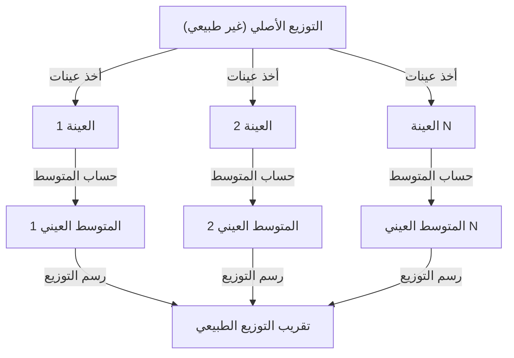

## 1. مقدمة

عند دراسة علم البيانات والإحصاء، لا يمكن تجنب **نظرية النهاية المركزية** (Central Limit Theorem). تمتلك هذه النظرية خاصية تبدو كالسحر، وهي أنه "مهما كان توزيع البيانات، فإن توزيع المتوسط العيني يقترب من التوزيع الطبيعي مع زيادة حجم العينة".

في هذه المقالة، نشرح نظرية النهاية المركزية بشكل شامل، من الصورة البديهية إلى التعريف الرياضي الصارم والتطبيقات العملية.

## 2. ما هي نظرية النهاية المركزية؟

نظرية النهاية المركزية (CLT) هي واحدة من أقوى النتائج وأكثرها إثارة للدهشة في نظرية الاحتمالات والإحصاء. ببساطة، مجموع (أو متوسط) عدد كبير من المتغيرات العشوائية المستقلة المأخوذة عشوائيًا يمكن تقريبه بالتوزيع الطبيعي، بغض النظر عن التوزيع الأصلي لتلك المتغيرات.

### 2.1 الفهم البديهي

لنفكر في حجر النرد. عند رمي حجر نرد واحد، يكون توزيع الأوجه توزيعًا منتظمًا. لكن عند رمي حجري نرد وأخذ مجموعهما، يصبح التوزيع على شكل مثلث تبلغ ذروته عند 7. ومع زيادة عدد أحجار النرد، يقترب توزيع المجموع من منحنى ناقوسي أملس، أي **التوزيع الطبيعي**.

### 2.2 التعريف الرياضي

لنفترض أن $n$ عينة $X_1, X_2, \dots, X_n$ مأخوذة عشوائيًا من مجتمع ما وهي مستقلة ومتطابقة التوزيع (i.i.d.). ليكن متوسط هذا المجتمع (القيمة المتوقعة) $\mu$ والتباين $\sigma^2$.

إذا كان المتوسط العيني $\bar{X} = \frac{1}{n} \sum_{i=1}^{n} X_i$، فوفقًا لنظرية النهاية المركزية، عندما يكون $n$ كبيرًا بما يكفي، فإن المتغير المعياري $Z$ التالي يتقارب نحو التوزيع الطبيعي المعياري $\mathcal{N}(0, 1)$.


$$
Z = \frac{\bar{X} - \mu}{\frac{\sigma}{\sqrt{n}}} \xrightarrow{d} \mathcal{N}(0, 1) \text{ عندما } n \to \infty
$$


هنا، $\xrightarrow{d}$ تعني التقارب في التوزيع. $\text{ عندما } n \to \infty$ تشير إلى اقتراب حجم العينة من اللانهاية.

## 3. التمثيل البصري لنظرية النهاية المركزية

لفهم كيفية عمل نظرية النهاية المركزية بصريًا، نعرض مخطط العملية باستخدام Mermaid.



## 4. المحاكاة باستخدام Python

دعونا نتحقق ليس فقط من الناحية النظرية، بل أيضًا بتشغيل البرنامج فعليًا. سنأخذ بيانات من التوزيع المنتظم ونحاكي كيفية توزيع متوسطاتها.

```python
import numpy as np
import matplotlib.pyplot as plt

# معاملات المجتمع (التوزيع المنتظم [0, 1])
mu = 0.5
sigma = np.sqrt(1/12)

# إعدادات المحاكاة
sample_sizes = [1, 5, 30, 100]
num_simulations = 10000

# إعدادات رسم الرسوم البيانية
fig, axes = plt.subplots(2, 2, figsize=(12, 8))
axes = axes.flatten()

for i, n in enumerate(sample_sizes):
    # سحب n عينة من التوزيع المنتظم num_simulations مرة
    samples = np.random.uniform(0, 1, (num_simulations, n))
    
    # حساب المتوسط العيني لكل تجربة
    sample_means = np.mean(samples, axis=1)
    
    # رسم المدرج التكراري
    ax = axes[i]
    ax.hist(sample_means, bins=50, density=True, alpha=0.7, color='skyblue')
    ax.set_title(f"حجم العينة n={n}")
    
    # إضافة منحنى التوزيع الطبيعي النظري
    x = np.linspace(mu - 4*sigma/np.sqrt(n), mu + 4*sigma/np.sqrt(n), 100)
    y = (1 / (np.sqrt(2 * np.pi) * (sigma/np.sqrt(n)))) * np.exp(-0.5 * ((x - mu) / (sigma/np.sqrt(n)))**2)
    ax.plot(x, y, 'r-', lw=2)

plt.tight_layout()
plt.show()
```

عند تشغيل هذا الكود، نلاحظ أنه عندما $n=1$ يكون التوزيع منتظمًا، ولكن مع زيادة $n$ يقترب المدرج التكراري من التوزيع الطبيعي (الخط الأحمر).

## 5. أهمية نظرية النهاية المركزية وتطبيقاتها

لماذا تعتبر نظرية النهاية المركزية مهمة جدًا؟ لأنه حتى لو لم نعرف بالضبط ما هو توزيع البيانات في العالم الحقيقي، يمكننا استخدام الإحصائيات مثل المتوسط العيني لافتراض التوزيع الطبيعي وإجراء اختبار الفرضيات وبناء فترات الثقة.

### 5.1 أساس الاستدلال الإحصائي
تعتمد العديد من عمليات الاستدلال من البيانات - مثل استطلاعات الرأي ومراقبة الجودة واختبار A/B - على نظرية النهاية المركزية.

### 5.2 تراكم الأخطاء
يمكن نمذجة أخطاء القياس والعديد من أنواع الضوضاء في الطبيعة كمجموع لعدد كبير من العوامل المستقلة الصغيرة، ولذلك غالبًا ما تتبع التوزيع الطبيعي. هذا هو السبب في أنه يُسمى أيضًا توزيع غاوس.

## 6. التعمق أكثر: مقاربة البرهان

يتطلب البرهان الصارم لنظرية النهاية المركزية استخدام الدالة المميزة وتوسيع تايلور. نقدم هنا ملخصًا عامًا.

باستخدام الدالة المميزة $\phi_X(t) = E[e^{itX}]$، تصبح الدالة المميزة لمجموع المتغيرات العشوائية المستقلة حاصل ضرب الدوال المميزة لكل منها. بحساب الدالة المميزة للمتغير المعياري $Z$ وأخذ النهاية عند $n \to \infty$، يمكن إثبات التقارب نحو الدالة المميزة للتوزيع الطبيعي المعياري $e^{-t^2/2}$. وهذا يثبت أن التوزيع نفسه يتقارب نحو التوزيع الطبيعي.

## 7. خاتمة

نظرية النهاية المركزية هي نظرية جميلة للغاية تكشف عن النظام الكامن خلف البيانات الفوضوية. إن فهم هذه النظرية يتيح الحصول على رؤى أعمق في تحليل البيانات وبناء النماذج الإحصائية.


## الملحق: الخلفية الرياضية المفصلة والتاريخ

### الملحق 1: التطورات في نظرية الاحتمالات
تاريخ نظرية النهاية المركزية عميق، وقد بدأ عندما أظهر أبراهام دو موافر التقريب الطبيعي للتوزيع ذي الحدين. ثم وسعها بيير سيمون لابلاس، وقدم ألكسندر لياپونوف البرهان في ظل شروط أكثر عمومية. في نظرية الاحتمالات الحديثة، توجد توسعات متعددة مثل شرط ليندبيرغ وشرط لياپونوف. تضمن هذه الشروط ألا يكون لأي متغير عشوائي فردي تأثير مهيمن على المجموع الكلي. وبذلك يُقدَّم إجابة على السؤال الجوهري: لماذا يمكن تقريب الظواهر المتنوعة في الطبيعة والعلوم الاجتماعية بالتوزيع الطبيعي.

### الملحق 2: الشروط والمعنى

تتطلب الصيغة الأساسية أن تكون $X_1,\ldots,X_n$ مستقلة ومتطابقة التوزيع، بمتوسط محدود $\mu$ وتباين محدود وموجب $0<\sigma^2<\infty$. ينبغي فهم عبارة «أي توزيع» ضمن هذه الشروط. الذي يقترب من التوزيع الطبيعي هو توزيع المجموع أو المتوسط بعد التوحيد المعياري، وليس توزيع المشاهدات الفردية.

### الملحق 3: الخطأ المعياري وقانون الأعداد الكبيرة

ينتج عن الاستقلال التوقع والتباين التاليان لمتوسط العينة. يقيس الخطأ المعياري تقلب متوسط العينة، ويختلف عن الانحراف المعياري للمشاهدات الفردية.

$$
E[\bar X_n]=\mu,\qquad \operatorname{Var}(\bar X_n)=\frac{\sigma^2}{n},\qquad \operatorname{SE}(\bar X_n)=\frac{\sigma}{\sqrt n}.
$$

عند مضاعفة حجم العينة أربع مرات ينخفض الخطأ المعياري إلى النصف. يصف قانون الأعداد الكبيرة اقتراب المتوسط من $\mu$، بينما تصف نظرية الحد المركزي شكل تقلباته بعد ضربها في $\sqrt{n}$.

### الملحق 4: استكمال البرهان بالدوال المميزة

نضع $Y_i=(X_i-\mu)/\sigma$ و$Z_n=n^{-1/2}\sum_{i=1}^nY_i$. بما أن $E[Y_i]=0$ و$E[Y_i^2]=1$، فللدالة المميزة التوسع التالي قرب الصفر.

$$
\phi_Y(t)=E[e^{itY}]=1-\frac{t^2}{2}+o(t^2)\quad(t\to0).
$$

يعطي الاستقلال التعبير التالي. حده هو الدالة المميزة للتوزيع الطبيعي المعياري، ومن ثم تضمن مبرهنة الاستمرارية لليفي التقارب في التوزيع. الدالة المميزة تختلف عن الدالة المولدة للعزوم؛ ولا يتطلب هذا البرهان وجود الأخيرة.

$$
\phi_{Z_n}(t)=\left[\phi_Y\!\left(\frac{t}{\sqrt n}\right)\right]^n
=\left[1-\frac{t^2}{2n}+o\!\left(\frac1n\right)\right]^n
\longrightarrow e^{-t^2/2}.
$$

### الملحق 5: أمثلة مضادة ودقة التقريب

لا يملك توزيع كوشي متوسطاً أو تبايناً محدودين؛ ويظل متوسط متغيرات كوشي المعيارية المستقلة موزعاً وفق كوشي المعياري. إذا كانت جميع $X_i$ تساوي المتغير العشوائي نفسه، فلا يوجد استقلال ولا يقل التقلب بأخذ المتوسط. لا يوجد ضمان عام بأن $n\ge30$ يكفي؛ فالالتواء وثقل الذيول يؤثران في حجم العينة المطلوب. عند التعامل مع متغيرات مستقلة غير متطابقة التوزيع، يلزم التحقق من شروط إضافية مثل شرط ليندبرغ أو ليابونوف.
