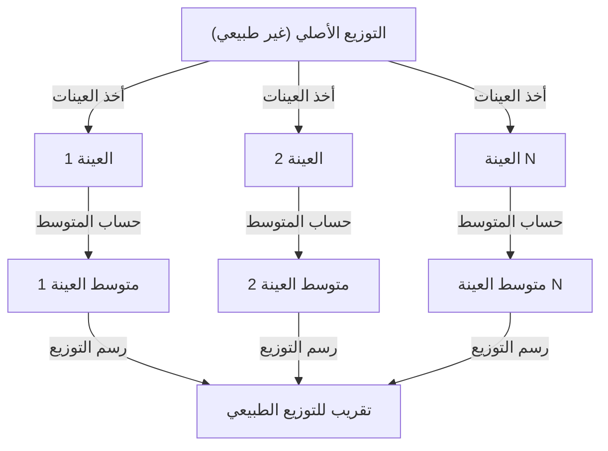

## 1. مقدمة

عند دراسة علوم البيانات والإحصاء، لا مفر من **[نظرية النهاية المركزية](https://kenji.blog/p/central-limit-theorem/)** (CLT). تمتلك هذه النظرية خاصية سحرية تقريباً: "بغض النظر عن التوزيع الذي تمتلكه البيانات، فإن توزيع متوسط عينتها يقترب من التوزيع الطبيعي كلما زاد حجم العينة."

في هذه المقالة، سنشرح [نظرية النهاية المركزية](https://kenji.blog/p/central-limit-theorem/) بشكل موسع، من الصورة البديهية إلى التعريف الرياضي الصارم وأمثلة التطبيق العملي.

## 2. ما هي [نظرية النهاية المركزية](https://kenji.blog/p/central-limit-theorem/)؟

[نظرية النهاية المركزية](https://kenji.blog/p/central-limit-theorem/) (CLT) هي واحدة من أقوى النتائج وأكثرها إثارة للدهشة في نظرية الاحتمالات والإحصاء. ببساطة، يقترب مجموع (أو متوسط) عدد كبير من المتغيرات العشوائية المستقلة المسحوبة عشوائياً من التوزيع الطبيعي، بغض النظر عن التوزيع الأصلي للمتغيرات.

### 2.1 الفهم البديهي

تأمل في حجر النرد. عندما ترمي حجراً واحداً، يكون توزيع النتائج توزيعاً منتظماً. ومع ذلك، عندما ترمي حجرين وتأخذ مجموعهما، يصبح التوزيع مثلثاً يبلغ ذروته عند 7 في المنتصف. وكلما قمت بزيادة عدد أحجار النرد بشكل أكبر، يقترب توزيع مجموعها من منحنى أملس على شكل جرس، أي **توزيع طبيعي**.

### 2.2 التعريف الرياضي

لنفترض أن $n$ من العينات $X_1, X_2, \dots, X_n$ المسحوبة عشوائياً من مجتمع ما تتبع توزيعات متطابقة ومستقلة (i.i.d.). ليكن المتوسط (القيمة المتوقعة) لهذا المجتمع $\mu$ والتباين $\sigma^2$.

ليكن متوسط العينة $\bar{X} = \frac{1}{n} \sum_{i=1}^{n} X_i$. وفقاً ل[نظرية النهاية المركزية](https://kenji.blog/p/central-limit-theorem/)، عندما يكون $n$ كبيراً بما يكفي، يتقارب المتغير الموحد $Z$ كما هو موضح أدناه إلى التوزيع الطبيعي القياسي $\mathcal{N}(0, 1)$.


$$
Z = \frac{\bar{X} - \mu}{\frac{\sigma}{\sqrt{n}}} \xrightarrow{d} \mathcal{N}(0, 1) \text{ عندما } n \to \infty
$$


هنا، تعني $\xrightarrow{d}$ التقارب في التوزيع. يشير $\text{ عندما } n \to \infty$ إلى أن حجم العينة يقترب من اللانهاية.

## 3. تصور [نظرية النهاية المركزية](https://kenji.blog/p/central-limit-theorem/)

لفهم كيفية عمل [نظرية النهاية المركزية](https://kenji.blog/p/central-limit-theorem/) بصرياً، إليك مخطط عملية باستخدام Mermaid.



## 4. المحاكاة باستخدام بايثون

بدلاً من مجرد النظرية، دعنا نقوم فعلياً بتشغيل برنامج للتحقق من ذلك. سنحاكي سحب البيانات من توزيع منتظم ونرى كيف يتم توزيع متوسطها.

```python
import numpy as np
import matplotlib.pyplot as plt

# معلمات المجتمع (توزيع منتظم [0, 1])
mu = 0.5
sigma = np.sqrt(1/12)

# إعدادات المحاكاة
sample_sizes = [1, 5, 30, 100]
num_simulations = 10000

# إعدادات رسم الرسم البياني
fig, axes = plt.subplots(2, 2, figsize=(12, 8))
axes = axes.flatten()

for i, n in enumerate(sample_sizes):
    # استخرج n عينات من التوزيع المنتظم num_simulations مرات
    samples = np.random.uniform(0, 1, (num_simulations, n))
    
    # احسب متوسط العينة لكل تجربة
    sample_means = np.mean(samples, axis=1)
    
    # رسم المدرج التكراري (الهيستوجرام)
    ax = axes[i]
    ax.hist(sample_means, bins=50, density=True, alpha=0.7, color='skyblue')
    ax.set_title(f"حجم العينة n={n}")
    
    # إضافة المنحنى النظري للتوزيع الطبيعي
    x = np.linspace(mu - 4*sigma/np.sqrt(n), mu + 4*sigma/np.sqrt(n), 100)
    y = (1 / (np.sqrt(2 * np.pi) * (sigma/np.sqrt(n)))) * np.exp(-0.5 * ((x - mu) / (sigma/np.sqrt(n)))**2)
    ax.plot(x, y, 'r-', lw=2)

plt.tight_layout()
plt.show()
```

عندما تقوم بتشغيل هذا الكود، يمكنك التأكد من أنه عندما يكون $n=1$ فإنه توزيع منتظم، ولكن كلما كبر $n$، يقترب المدرج التكراري من التوزيع الطبيعي للخط الأحمر.

## 5. أهمية وتطبيقات [نظرية النهاية المركزية](https://kenji.blog/p/central-limit-theorem/)

لماذا تعتبر [نظرية النهاية المركزية](https://kenji.blog/p/central-limit-theorem/) مهمة جداً؟ ذلك لأنه حتى لو كنا لا نعرف بالضبط التوزيع الذي تمتلكه العديد من بيانات العالم الحقيقي، يمكننا افتراض توزيع طبيعي عند استخدام إحصائيات مثل متوسط العينة لإجراء اختبار الفرضيات وبناء فترات الثقة.

### 5.1 أساس الاستدلال الإحصائي
عندما نستنتج شيئاً من البيانات، كما هو الحال في استطلاعات الرأي، ومراقبة الجودة، أو اختبار A/B، فإن الكثير من الأساس المنطقي يعتمد على [نظرية النهاية المركزية](https://kenji.blog/p/central-limit-theorem/).

### 5.2 تراكم الأخطاء
يمكن أيضاً نمذجة أخطاء القياس والعديد من الضوضاء في الطبيعة كمجموع للعديد من العوامل الصغيرة المستقلة، لذا فهي تتبع غالباً توزيعاً طبيعياً. وهذا هو السبب في أنها تسمى أيضاً التوزيع الغاوسي.

## 6. التعمق: نهج الإثبات

تُستخدم الدوال المميزة وتوسع تايلور للإثبات الصارم ل[نظرية النهاية المركزية](https://kenji.blog/p/central-limit-theorem/). إليك نظرة عامة موجزة.

باستخدام الدالة المميزة $\phi_X(t) = E[e^{itX}]$، فإن الدالة المميزة لمجموع المتغيرات العشوائية المستقلة هي حاصل ضرب دوالها المميزة كل على حدة. عندما نحسب الدالة المميزة للمتغير الموحد $Z$ ونأخذ النهاية عندما $n \to \infty$, يمكن إثبات أنها تتقارب إلى $e^{-t^2/2}$، وهي الدالة المميزة للتوزيع الطبيعي القياسي. هذا يثبت أن التوزيع نفسه يتقارب إلى توزيع طبيعي.

## 7. خاتمة

[نظرية النهاية المركزية](https://kenji.blog/p/central-limit-theorem/) هي نظرية جميلة للغاية تظهر النظام المختبئ وراء البيانات الفوضوية. من خلال فهم هذه النظرية، ستتمكن من اكتساب رؤى أعمق في تحليل البيانات وبناء النماذج الإحصائية.


## الملحق: الخلفية الرياضية التفصيلية والتاريخ

### الملحق 1: التطور في نظرية الاحتمالات
تاريخ [نظرية النهاية المركزية](https://kenji.blog/p/central-limit-theorem/) عميق، حيث نشأ من إثبات أبراهام دي موافر للتقريب الطبيعي للتوزيع ذي الحدين. تم توسيعه لاحقاً بواسطة بيير سيمون لابلاس، وقدم ألكسندر ليابونوف إثباتاً تحت شروط أكثر عمومية. في نظرية الاحتمالات الحديثة، هناك امتدادات مختلفة مثل شرط ليندبيرج وشرط ليابونوف. تضمن هذه الشروط أن المتغيرات العشوائية الفردية ليس لها تأثير مهيمن على المجموع الكلي. وهذا يوفر إجابة على السؤال الأساسي المتمثل في سبب إمكانية تقريب الظواهر المتنوعة في الطبيعة والعلوم الاجتماعية بواسطة توزيع طبيعي.

### الملحق 2: شروط التطبيق ومعنى النظرية

في الشكل الأساسي الذي نوقش في هذا النص، يشترط أن تكون $X_1,\ldots,X_n$ مستقلة وموزعة بشكل متطابق، بمتوسط محدود $\mu$ وتباين إيجابي ومحدود $0<\sigma^2<\infty$. يرجى فهم التفسير "أي توزيع" ضمن نطاق هذه الشروط. ما يقترب من التوزيع الطبيعي هو توزيع المجموع الموحد أو متوسط العينة، وتوزيع المشاهدات الفردية لا يتغير.

### الملحق 3: الخطأ المعياري و[قانون الأعداد الكبيرة](https://kenji.blog/p/law-of-large-numbers/)

بسبب الاستقلال، تكون القيمة المتوقعة وتباين متوسط العينة كما يلي. الخطأ المعياري هو تشتت متوسط العينة ويختلف عن الانحراف المعياري للبيانات الفردية.

$$
E[\bar X_n]=\mu,\qquad \operatorname{Var}(\bar X_n)=\frac{\sigma^2}{n},\qquad \operatorname{SE}(\bar X_n)=\frac{\sigma}{\sqrt n}.
$$

مضاعفة عدد العينات أربع مرات يقلل الخطأ المعياري إلى النصف. ينص [قانون الأعداد الكبيرة](https://kenji.blog/p/law-of-large-numbers/) على أن متوسط العينة يقترب من $\mu$، وتصف [نظرية النهاية المركزية](https://kenji.blog/p/central-limit-theorem/) شكل التوزيع عن طريق ضرب التقلب حوله بـ $\sqrt{n}$.

### الملحق 4: إثبات إضافي باستخدام الدوال المميزة

لنفترض $Y_i=(X_i-\mu)/\sigma$ و $Z_n=n^{-1/2}\sum_{i=1}^nY_i$. نظراً لأن $E[Y_i]=0$ و $E[Y_i^2]=1$، يمكن توسيع الدالة المميزة بالقرب من نقطة الأصل على النحو التالي.

$$
\phi_Y(t)=E[e^{itY}]=1-\frac{t^2}{2}+o(t^2)\quad(t\to0).
$$

من الاستقلال، يتم الحصول على المعادلة التالية. نظراً لأن النهاية هي الدالة المميزة للتوزيع الطبيعي القياسي، فإن التقارب في التوزيع يتبع من نظرية استمرارية ليفي. الدوال المميزة و[الدوال المولدة](https://kenji.blog/p/generating-functions/) للعزوم مختلفة، ووجود دالة مولدة للعزوم ليس ضرورياً لهذا الإثبات.

$$
\phi_{Z_n}(t)=\left[\phi_Y\!\left(\frac{t}{\sqrt n}\right)\right]^n
=\left[1-\frac{t^2}{2n}+o\!\left(\frac1n\right)\right]^n
\longrightarrow e^{-t^2/2}.
$$

### الملحق 5: الأمثلة غير القابلة للتطبيق ودقة التقريب

توزيع كوشي ليس له متوسط محدود ولا تباين محدود، ومتوسط العينة لمتغيرات كوشي القياسية المستقلة يظل توزيع كوشي قياسي. علاوة على ذلك، إذا كانت كل $X_i$ تساوي نفس المتغير، فلا يوجد استقلال، وأخذ المتوسط لن يقلل التشتت. لا يوجد ضمان بأن "$n\ge30$ دائماً كافية". يختلف حجم العينة المطلوب اعتماداً على الالتواء والذيول الثقيلة. للتوسع في الحالات المستقلة ولكنها غير موزعة بشكل متطابق، من الضروري التحقق من شروط إضافية مثل شروط ليندبيرج أو ليابونوف.
