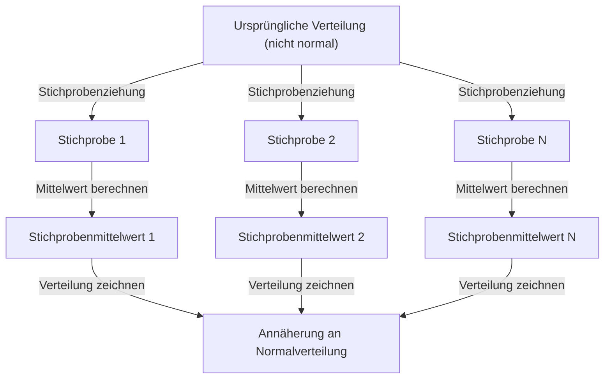

## 1. Einleitung

Beim Studium der Datenwissenschaft und Statistik ist der **zentrale Grenzwertsatz** (CLT) unvermeidlich. Dieses Theorem hat eine fast magische Eigenschaft: "Egal, welche Verteilung die Daten haben, die Verteilung ihres Stichprobenmittelwerts nähert sich mit zunehmendem Stichprobenumfang einer Normalverteilung an."

In diesem Artikel werden wir den zentralen Grenzwertsatz umfassend erklären, von einer intuitiven Vorstellung über eine strenge mathematische Definition bis hin zu praktischen Anwendungsbeispielen.

## 2. Was ist der zentrale Grenzwertsatz?

Der zentrale Grenzwertsatz (CLT) ist eines der leistungsstärksten und überraschendsten Ergebnisse der Wahrscheinlichkeitstheorie und Statistik. Einfach ausgedrückt nähert sich die Summe (oder der Durchschnitt) einer großen Anzahl von zufällig gezogenen, unabhängigen Zufallsvariablen einer Normalverteilung an, unabhängig von der ursprünglichen Verteilung der Variablen.

### 2.1 Intuitives Verständnis

Denken wir an Würfel. Wenn Sie einen einzelnen Würfel werfen, ist die Verteilung der Ergebnisse eine Gleichverteilung. Wenn Sie jedoch zwei Würfel werfen und deren Summe bilden, wird die Verteilung zu einem Dreieck mit einem Höhepunkt bei 7 in der Mitte. Wenn Sie die Anzahl der Würfel weiter erhöhen, nähert sich die Verteilung ihrer Summe einer glatten, glockenförmigen Kurve an, das heißt einer **Normalverteilung**.

### 2.2 Mathematische Definition

Angenommen, $n$ zufällig aus einer Population gezogene Stichproben $X_1, X_2, \dots, X_n$ folgen unabhängig identischen Verteilungen (i.i.d.). Sei der Mittelwert (Erwartungswert) dieser Population $\mu$ und die Varianz $\sigma^2$.

Sei der Stichprobenmittelwert $\bar{X} = \frac{1}{n} \sum_{i=1}^{n} X_i$. Gemäß dem zentralen Grenzwertsatz konvergiert die unten gezeigte standardisierte Variable $Z$ für ein ausreichend großes $n$ gegen die Standardnormalverteilung $\mathcal{N}(0, 1)$.


$$
Z = \frac{\bar{X} - \mu}{\frac{\sigma}{\sqrt{n}}} \xrightarrow{d} \mathcal{N}(0, 1) \text{ für } n \to \infty
$$


Hier bedeutet $\xrightarrow{d}$ Verteilungskonvergenz. $\text{ für } n \to \infty$ gibt an, dass sich der Stichprobenumfang der Unendlichkeit nähert.

## 3. Visualisierung des zentralen Grenzwertsatzes

Um visuell zu verstehen, wie der zentrale Grenzwertsatz funktioniert, ist hier ein Prozessdiagramm mit Mermaid.



## 4. Simulation mit Python

Anstatt nur Theorie zu behandeln, lassen Sie uns tatsächlich ein Programm ausführen, um dies zu überprüfen. Wir werden das Ziehen von Daten aus einer Gleichverteilung simulieren und sehen, wie deren Mittelwert verteilt ist.

```python
import numpy as np
import matplotlib.pyplot as plt

# Populationsparameter (Gleichverteilung [0, 1])
mu = 0.5
sigma = np.sqrt(1/12)

# Simulationseinstellungen
sample_sizes = [1, 5, 30, 100]
num_simulations = 10000

# Einstellungen zum Zeichnen von Diagrammen
fig, axes = plt.subplots(2, 2, figsize=(12, 8))
axes = axes.flatten()

for i, n in enumerate(sample_sizes):
    # Ziehe n Stichproben num_simulations mal aus der Gleichverteilung
    samples = np.random.uniform(0, 1, (num_simulations, n))
    
    # Berechne den Stichprobenmittelwert für jeden Versuch
    sample_means = np.mean(samples, axis=1)
    
    # Histogramm zeichnen
    ax = axes[i]
    ax.hist(sample_means, bins=50, density=True, alpha=0.7, color='skyblue')
    ax.set_title(f"Stichprobenumfang n={n}")
    
    # Theoretische Normalverteilungskurve hinzufügen
    x = np.linspace(mu - 4*sigma/np.sqrt(n), mu + 4*sigma/np.sqrt(n), 100)
    y = (1 / (np.sqrt(2 * np.pi) * (sigma/np.sqrt(n)))) * np.exp(-0.5 * ((x - mu) / (sigma/np.sqrt(n)))**2)
    ax.plot(x, y, 'r-', lw=2)

plt.tight_layout()
plt.show()
```

Wenn Sie diesen Code ausführen, können Sie bestätigen, dass bei $n=1$ eine Gleichverteilung vorliegt, das Histogramm sich jedoch mit zunehmendem $n$ der Normalverteilung der roten Linie annähert.

## 5. Bedeutung und Anwendungen des zentralen Grenzwertsatzes

Warum ist der zentrale Grenzwertsatz so wichtig? Weil wir selbst dann, wenn wir nicht genau wissen, welche Verteilung viele reale Daten haben, bei der Verwendung von Statistiken wie dem Stichprobenmittelwert eine Normalverteilung annehmen können, um Hypothesentests durchzuführen und Konfidenzintervalle zu konstruieren.

### 5.1 Grundlage der statistischen Inferenz
Wenn wir aus Daten etwas ableiten, wie bei Meinungsumfragen, Qualitätskontrolle oder A/B-Tests, beruht ein Großteil der Argumentation auf dem zentralen Grenzwertsatz.

### 5.2 Akkumulation von Fehlern
Messfehler und viele Rauscharten in der Natur können ebenfalls als Summe vieler kleiner unabhängiger Faktoren modelliert werden, weshalb sie oft einer Normalverteilung folgen. Aus diesem Grund wird sie auch als Gauß-Verteilung bezeichnet.

## 6. Vertiefung: Ansatz für den Beweis

Für einen strengen Beweis des zentralen Grenzwertsatzes werden charakteristische Funktionen und die Taylor-Entwicklung verwendet. Hier ein kurzer Überblick.

Unter Verwendung der charakteristischen Funktion $\phi_X(t) = E[e^{itX}]$ ist die charakteristische Funktion der Summe unabhängiger Zufallsvariablen das Produkt ihrer jeweiligen charakteristischen Funktionen. Wenn wir die charakteristische Funktion der standardisierten Variablen $Z$ berechnen und den Grenzwert für $n \to \infty$ nehmen, kann gezeigt werden, dass sie gegen die charakteristische Funktion der Standardnormalverteilung $e^{-t^2/2}$ konvergiert. Dies beweist, dass die Verteilung selbst gegen eine Normalverteilung konvergiert.

## 7. Fazit

Der zentrale Grenzwertsatz ist ein äußerst schönes Theorem, das die hinter chaotischen Daten verborgene Ordnung aufzeigt. Durch das Verständnis dieses Theorems werden Sie in der Datenanalyse und der Konstruktion statistischer Modelle tiefere Einblicke gewinnen können.


## Anhang: Detaillierter mathematischer Hintergrund und Geschichte

### Anhang 1: Entwicklung in der Wahrscheinlichkeitstheorie
Die Geschichte des zentralen Grenzwertsatzes ist tief verwurzelt und geht auf Abraham de Moivre zurück, der die Normalapproximation der Binomialverteilung zeigte. Er wurde später von Pierre-Simon Laplace, und Aleksandr Ljapunow lieferte einen Beweis unter allgemeineren Bedingungen. In der modernen Wahrscheinlichkeitstheorie gibt es verschiedene Erweiterungen, wie die Lindeberg-Bedingung und die Ljapunow-Bedingung. Diese Bedingungen stellen sicher, dass einzelne Zufallsvariablen keinen dominierenden Einfluss auf die Gesamtsumme haben. Dies liefert eine Antwort auf die grundlegende Frage, warum verschiedene Phänomene in der Natur und den Sozialwissenschaften durch eine Normalverteilung angenähert werden können.

### Anhang 2: Anwendungsbedingungen und die Bedeutung des Theorems

In der in diesem Text behandelten Grundform ist es erforderlich, dass $X_1,\ldots,X_n$ unabhängig und identisch verteilt sind, mit einem endlichen Mittelwert $\mu$ und einer endlichen, positiven Varianz $0<\sigma^2<\infty$. Bitte verstehen Sie die Erklärung "jede Verteilung" im Rahmen dieser Bedingungen. Was sich einer Normalverteilung nähert, ist die Verteilung der standardisierten Summe oder des Stichprobenmittelwerts, und die Verteilung der einzelnen Beobachtungen ändert sich nicht.

### Anhang 3: Standardfehler und das Gesetz der großen Zahlen

Aufgrund der Unabhängigkeit sind der Erwartungswert und die Varianz des Stichprobenmittelwerts wie folgt. Der Standardfehler ist die Streuung des Stichprobenmittelwerts und unterscheidet sich von der Standardabweichung der einzelnen Daten.

$$
E[\bar X_n]=\mu,\qquad \operatorname{Var}(\bar X_n)=\frac{\sigma^2}{n},\qquad \operatorname{SE}(\bar X_n)=\frac{\sigma}{\sqrt n}.
$$

Eine Vervierfachung des Stichprobenumfangs halbiert den Standardfehler. [Das Gesetz der großen Zahlen](https://kenji.blog/de/p/law-of-large-numbers/) besagt, dass sich der Stichprobenmittelwert $\mu$ nähert, und der zentrale Grenzwertsatz beschreibt die Form der Verteilung, indem die Schwankung darum mit $\sqrt{n}$ multipliziert wird.

### Anhang 4: Ergänzender Beweis mittels charakteristischer Funktionen

Sei $Y_i=(X_i-\mu)/\sigma$ und $Z_n=n^{-1/2}\sum_{i=1}^nY_i$. Da $E[Y_i]=0$ und $E[Y_i^2]=1$, kann die charakteristische Funktion nahe dem Ursprung wie folgt entwickelt werden.

$$
\phi_Y(t)=E[e^{itY}]=1-\frac{t^2}{2}+o(t^2)\quad(t\to0).
$$

Aus der Unabhängigkeit ergibt sich die folgende Gleichung. Da der Grenzwert die charakteristische Funktion der Standardnormalverteilung ist, folgt die Verteilungskonvergenz aus dem Stetigkeitssatz von Lévy. Charakteristische Funktionen und momenterzeugende Funktionen sind unterschiedlich, und die Existenz einer momenterzeugenden Funktion ist für diesen Beweis nicht erforderlich.

$$
\phi_{Z_n}(t)=\left[\phi_Y\!\left(\frac{t}{\sqrt n}\right)\right]^n
=\left[1-\frac{t^2}{2n}+o\!\left(\frac1n\right)\right]^n
\longrightarrow e^{-t^2/2}.
$$

### Anhang 5: Nicht anwendbare Beispiele und Approximationsgenauigkeit

Die [Cauchy](https://kenji.blog/de/p/cauchy/)-Verteilung hat weder einen endlichen Mittelwert noch eine endliche Varianz, und der Stichprobenmittelwert unabhängiger Standard-[Cauchy](https://kenji.blog/de/p/cauchy/)-Variablen bleibt eine Standard-[Cauchy](https://kenji.blog/de/p/cauchy/)-Verteilung. Wenn außerdem alle $X_i$ gleich derselben Variable sind, besteht keine Unabhängigkeit, und die Bildung des Mittelwerts verringert die Streuung nicht. Es gibt auch keine Garantie, dass "$n\ge30$ immer ausreichend ist". Der erforderliche Stichprobenumfang variiert je nach Schiefe und breiten Enden. Für Erweiterungen auf Fälle, die unabhängig, aber nicht identisch verteilt sind, ist es notwendig, zusätzliche Bedingungen wie die Lindeberg- oder Ljapunow-Bedingungen zu überprüfen.
