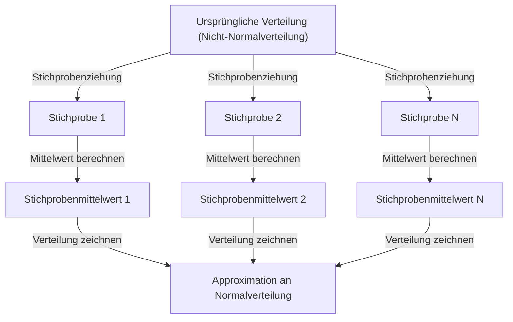

## 1. Einleitung

Beim Studium von Data Science und Statistik ist der **Zentrale Grenzwertsatz** (Central Limit Theorem) ein unvermeidliches Konzept. Dieser Satz besitzt die fast magische Eigenschaft, dass „unabhängig von der Verteilung der Daten die Verteilung der Stichprobenmittelwerte sich mit zunehmender Stichprobengröße einer Normalverteilung annähert."

In diesem Artikel erklären wir den Zentralen Grenzwertsatz umfassend, von intuitiven Vorstellungen über strenge mathematische Definitionen bis hin zu praktischen Anwendungsbeispielen.

## 2. Was ist der Zentrale Grenzwertsatz?

Der Zentrale Grenzwertsatz (ZGS) ist eines der mächtigsten und erstaunlichsten Ergebnisse der Wahrscheinlichkeitstheorie und Statistik. Einfach ausgedrückt wird die Summe (oder der Mittelwert) einer großen Anzahl zufällig gezogener unabhängiger Zufallsvariablen durch eine Normalverteilung approximiert, unabhängig von der ursprünglichen Verteilung dieser Variablen.

### 2.1 Intuitives Verständnis

Betrachten wir Würfel. Wenn man einen einzelnen Würfel wirft, ist die Verteilung der Augenzahlen gleichmäßig. Wirft man jedoch zwei Würfel und nimmt deren Summe, wird die Verteilung dreieckig mit einem Höhepunkt bei 7. Je mehr Würfel man hinzufügt, desto mehr nähert sich die Verteilung der Summe einer glatten glockenförmigen Kurve – also einer **Normalverteilung**.

### 2.2 Mathematische Definition

Angenommen, $n$ Stichproben $X_1, X_2, \dots, X_n$ werden zufällig aus einer Grundgesamtheit gezogen und sind unabhängig und identisch verteilt (i.i.d.). Sei der Mittelwert (Erwartungswert) der Grundgesamtheit $\mu$ und die Varianz $\sigma^2$.

Definiert man den Stichprobenmittelwert als $\bar{X} = \frac{1}{n} \sum_{i=1}^{n} X_i$, so konvergiert nach dem Zentralen Grenzwertsatz bei hinreichend großem $n$ die folgende standardisierte Variable $Z$ gegen die Standardnormalverteilung $\mathcal{N}(0, 1)$:


$$
Z = \frac{\bar{X} - \mu}{\frac{\sigma}{\sqrt{n}}} \xrightarrow{d} \mathcal{N}(0, 1) \text{ für } n \to \infty
$$


Dabei bezeichnet $\xrightarrow{d}$ die Verteilungskonvergenz. $\text{ für } n \to \infty$ bedeutet, dass die Stichprobengröße gegen unendlich strebt.

## 3. Visualisierung des Zentralen Grenzwertsatzes

Um visuell zu verstehen, wie der Zentrale Grenzwertsatz funktioniert, zeigen wir ein Prozessdiagramm mit Mermaid.



## 4. Simulation mit Python

Lassen Sie uns dies nicht nur theoretisch, sondern durch tatsächliche Programmausführung überprüfen. Wir entnehmen Daten aus einer Gleichverteilung und simulieren, wie die Mittelwerte verteilt sind.

```python
import numpy as np
import matplotlib.pyplot as plt

# Parameter der Grundgesamtheit (Gleichverteilung [0, 1])
mu = 0.5
sigma = np.sqrt(1/12)

# Simulationseinstellungen
sample_sizes = [1, 5, 30, 100]
num_simulations = 10000

# Diagramm-Einstellungen
fig, axes = plt.subplots(2, 2, figsize=(12, 8))
axes = axes.flatten()

for i, n in enumerate(sample_sizes):
    # n Stichproben aus der Gleichverteilung num_simulations Mal ziehen
    samples = np.random.uniform(0, 1, (num_simulations, n))
    
    # Stichprobenmittelwert für jeden Durchlauf berechnen
    sample_means = np.mean(samples, axis=1)
    
    # Histogramm plotten
    ax = axes[i]
    ax.hist(sample_means, bins=50, density=True, alpha=0.7, color='skyblue')
    ax.set_title(f"Stichprobengröße n={n}")
    
    # Theoretische Normalverteilungskurve hinzufügen
    x = np.linspace(mu - 4*sigma/np.sqrt(n), mu + 4*sigma/np.sqrt(n), 100)
    y = (1 / (np.sqrt(2 * np.pi) * (sigma/np.sqrt(n)))) * np.exp(-0.5 * ((x - mu) / (sigma/np.sqrt(n)))**2)
    ax.plot(x, y, 'r-', lw=2)

plt.tight_layout()
plt.show()
```

Wenn Sie diesen Code ausführen, können Sie bestätigen, dass bei $n=1$ eine Gleichverteilung vorliegt, aber mit zunehmendem $n$ nähert sich das Histogramm der roten Normalverteilungskurve an.

## 5. Bedeutung und Anwendungen des Zentralen Grenzwertsatzes

Warum ist der Zentrale Grenzwertsatz so wichtig? Weil man auch ohne genaues Wissen über die Verteilung realer Daten mithilfe von Statistiken wie Stichprobenmittelwerten eine Normalverteilung annehmen und so Hypothesentests und Konfidenzintervalle durchführen kann.

### 5.1 Grundlage der statistischen Inferenz
Bei Meinungsumfragen, Qualitätskontrolle, A/B-Tests und mehr – wenn wir aus Daten Schlüsse ziehen, beruht ein Großteil der Begründung auf dem Zentralen Grenzwertsatz.

### 5.2 Kumulation von Fehlern
Messfehler und viele Arten von Rauschen in der Natur können ebenfalls als Summe zahlreicher kleiner unabhängiger Faktoren modelliert werden, weshalb sie häufig einer Normalverteilung folgen. Dies ist auch der Grund, warum sie als Gaußverteilung bezeichnet wird.

## 6. Vertiefung: Ansätze zum Beweis

Der strenge Beweis des Zentralen Grenzwertsatzes verwendet charakteristische Funktionen und Taylor-Entwicklungen. Hier stellen wir eine Übersicht vor.

Unter Verwendung der charakteristischen Funktion $\phi_X(t) = E[e^{itX}]$ wird die charakteristische Funktion der Summe unabhängiger Zufallsvariablen zum Produkt ihrer einzelnen charakteristischen Funktionen. Berechnet man die charakteristische Funktion der standardisierten Variablen $Z$ und bildet den Grenzwert für $n \to \infty$, zeigt sich die Konvergenz zur charakteristischen Funktion der Standardnormalverteilung $e^{-t^2/2}$. Damit wird bewiesen, dass die Verteilung selbst gegen die Normalverteilung konvergiert.

## 7. Schlusswort

Der Zentrale Grenzwertsatz ist ein außerordentlich schöner Satz, der die hinter chaotischen Daten verborgene Ordnung offenbart. Durch das Verständnis dieses Satzes können Sie tiefere Erkenntnisse in der Datenanalyse und beim Aufbau statistischer Modelle gewinnen.


## Anhang: Detaillierter mathematischer Hintergrund und Geschichte

### Anhang 1: Entwicklungen in der Wahrscheinlichkeitstheorie
Die Geschichte des Zentralen Grenzwertsatzes reicht tief zurück und hat ihren Ursprung in Abraham de Moivres Nachweis der Normalapproximation der Binomialverteilung. Er wurde später von Pierre-Simon Laplace erweitert, und Aleksandr Ljapunow lieferte einen Beweis unter allgemeineren Bedingungen. In der modernen Wahrscheinlichkeitstheorie existieren verschiedene Erweiterungen wie die Lindeberg-Bedingung und die Ljapunow-Bedingung. Diese Bedingungen garantieren, dass keine einzelne Zufallsvariable einen dominierenden Einfluss auf die Gesamtsumme hat. Damit wird eine Antwort auf die fundamentale Frage gegeben, warum vielfältige Phänomene in der Natur und den Sozialwissenschaften durch die Normalverteilung approximiert werden können.

### Anhang 2: Voraussetzungen und Bedeutung

Die Grundform setzt unabhängige, identisch verteilte $X_1,\ldots,X_n$ mit endlichem Erwartungswert $\mu$ und endlicher, positiver Varianz $0<\sigma^2<\infty$ voraus. „Jede Verteilung“ gilt nur unter diesen Voraussetzungen. Die Verteilung der standardisierten Summe oder des Mittelwerts nähert sich der Normalverteilung; die Verteilung einzelner Beobachtungen ändert sich nicht.

### Anhang 3: Standardfehler und Gesetz der großen Zahlen

Aus der Unabhängigkeit folgen Erwartungswert und Varianz des Stichprobenmittels wie unten angegeben. Der Standardfehler beschreibt die Streuung des Mittelwerts, nicht die Standardabweichung einzelner Beobachtungen.

$$
E[\bar X_n]=\mu,\qquad \operatorname{Var}(\bar X_n)=\frac{\sigma^2}{n},\qquad \operatorname{SE}(\bar X_n)=\frac{\sigma}{\sqrt n}.
$$

Die vierfache Stichprobengröße halbiert den Standardfehler. Das Gesetz der großen Zahlen beschreibt die Annäherung des Mittels an $\mu$; der zentrale Grenzwertsatz beschreibt die Form seiner mit $\sqrt{n}$ skalierten Schwankungen.

### Anhang 4: Ergänzung zum Beweis mit charakteristischen Funktionen

Setze $Y_i=(X_i-\mu)/\sigma$ und $Z_n=n^{-1/2}\sum_{i=1}^nY_i$. Wegen $E[Y_i]=0$ und $E[Y_i^2]=1$ besitzt die charakteristische Funktion nahe null die folgende Entwicklung.

$$
\phi_Y(t)=E[e^{itY}]=1-\frac{t^2}{2}+o(t^2)\quad(t\to0).
$$

Aus der Unabhängigkeit folgt der nächste Ausdruck. Sein Grenzwert ist die charakteristische Funktion der Standardnormalverteilung; der Stetigkeitssatz von Lévy liefert die Verteilungskonvergenz. Charakteristische und momenterzeugende Funktionen sind verschieden; dieser Beweis benötigt die Existenz der letzteren nicht.

$$
\phi_{Z_n}(t)=\left[\phi_Y\!\left(\frac{t}{\sqrt n}\right)\right]^n
=\left[1-\frac{t^2}{2n}+o\!\left(\frac1n\right)\right]^n
\longrightarrow e^{-t^2/2}.
$$

### Anhang 5: Gegenbeispiele und Genauigkeit

Die Cauchy-Verteilung besitzt weder einen endlichen Erwartungswert noch eine endliche Varianz. Das Mittel unabhängiger standard-Cauchy-verteilter Variablen bleibt standard-Cauchy-verteilt. Sind alle $X_i$ dieselbe Zufallsvariable, fehlt die Unabhängigkeit und die Streuung nimmt durch Mitteln nicht ab. $n\ge30$ reicht nicht grundsätzlich aus: Schiefe und schwere Verteilungsschwänze beeinflussen den Stichprobenbedarf. Für unabhängige, unterschiedlich verteilte Variablen sind zusätzliche Voraussetzungen wie die Lindeberg- oder Lyapunov-Bedingung zu prüfen.
