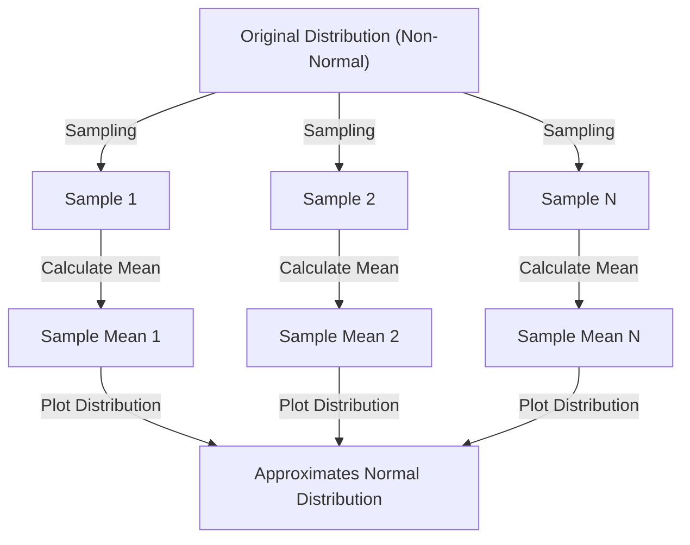

## 1. Introduction

When studying data science and statistics, one concept you cannot avoid is the **Central Limit Theorem** (CLT). This theorem possesses the almost magical property that "regardless of the distribution of the data, the distribution of sample means approaches a normal distribution as the sample size increases."

In this article, we provide a comprehensive explanation of the Central Limit Theorem, from intuitive images to rigorous mathematical definitions and practical applications.

## 2. What Is the Central Limit Theorem?

The Central Limit Theorem (CLT) is one of the most powerful and surprising results in probability theory and statistics. Simply put, the sum (or mean) of a large number of randomly sampled independent random variables is approximated by a normal distribution, regardless of the original distribution of those variables.

### 2.1 Intuitive Understanding

Consider dice. When you roll a single die, the distribution of outcomes is uniform. However, when you roll two dice and take their sum, the distribution becomes triangular, peaking at 7. As you increase the number of dice, the distribution of their sum approaches a smooth bell-shaped curve — that is, a **normal distribution**.

### 2.2 Mathematical Definition

Suppose $n$ samples $X_1, X_2, \dots, X_n$ are randomly drawn from a population and are independently and identically distributed (i.i.d.). Let the population mean (expected value) be $\mu$ and the variance be $\sigma^2$.

If we define the sample mean as $\bar{X} = \frac{1}{n} \sum_{i=1}^{n} X_i$, then according to the Central Limit Theorem, when $n$ is sufficiently large, the following standardized variable $Z$ converges to the standard normal distribution $\mathcal{N}(0, 1)$:


$$
Z = \frac{\bar{X} - \mu}{\frac{\sigma}{\sqrt{n}}} \xrightarrow{d} \mathcal{N}(0, 1) \text{ as } n \to \infty
$$


Here, $\xrightarrow{d}$ denotes convergence in distribution. $\text{ as } n \to \infty$ indicates that the sample size approaches infinity.

## 3. Visualizing the Central Limit Theorem

To visually understand how the Central Limit Theorem works, here is a process diagram using Mermaid.



## 4. Simulation with Python

Let's verify this not just with theory but by actually running a program. We will sample data from a uniform distribution and simulate how the means are distributed.

```python
import numpy as np
import matplotlib.pyplot as plt

# Population parameters (Uniform distribution [0, 1])
mu = 0.5
sigma = np.sqrt(1/12)

# Simulation settings
sample_sizes = [1, 5, 30, 100]
num_simulations = 10000

# Graph drawing settings
fig, axes = plt.subplots(2, 2, figsize=(12, 8))
axes = axes.flatten()

for i, n in enumerate(sample_sizes):
    # Draw n samples from a uniform distribution, num_simulations times
    samples = np.random.uniform(0, 1, (num_simulations, n))
    
    # Calculate the sample mean for each trial
    sample_means = np.mean(samples, axis=1)
    
    # Plot the histogram
    ax = axes[i]
    ax.hist(sample_means, bins=50, density=True, alpha=0.7, color='skyblue')
    ax.set_title(f"Sample size n={n}")
    
    # Add the theoretical normal distribution curve
    x = np.linspace(mu - 4*sigma/np.sqrt(n), mu + 4*sigma/np.sqrt(n), 100)
    y = (1 / (np.sqrt(2 * np.pi) * (sigma/np.sqrt(n)))) * np.exp(-0.5 * ((x - mu) / (sigma/np.sqrt(n)))**2)
    ax.plot(x, y, 'r-', lw=2)

plt.tight_layout()
plt.show()
```

When you run this code, you can confirm that for $n=1$ the distribution is uniform, but as $n$ increases, the histogram approaches the red normal distribution curve.

## 5. Importance and Applications of the Central Limit Theorem

Why is the Central Limit Theorem so important? It is because even without knowing the exact distribution of real-world data, we can assume a normal distribution for statistics such as sample means, enabling hypothesis testing and confidence interval construction.

### 5.1 Foundation of Statistical Inference
When we make inferences from data — in opinion polls, quality control, A/B testing, and more — much of the rationale relies on the Central Limit Theorem.

### 5.2 Accumulation of Errors
Measurement errors and many types of noise in nature can also be modeled as the sum of numerous small independent factors, which is why they often follow a normal distribution. This is also the reason it is called the Gaussian distribution.

## 6. Going Deeper: Approaches to the Proof

The rigorous proof of the Central Limit Theorem uses characteristic functions (moment-generating functions) and Taylor expansions. Here we present an outline.

Using the characteristic function $\phi_X(t) = E[e^{itX}]$, the characteristic function of the sum of independent random variables becomes the product of their individual characteristic functions. By computing the characteristic function of the standardized variable $Z$ and taking the limit as $n \to \infty$, it can be shown that it converges to the characteristic function of the standard normal distribution $e^{-t^2/2}$. This proves that the distribution itself converges to the normal distribution.

## 7. Conclusion

The Central Limit Theorem is an extraordinarily beautiful theorem that reveals the order hidden behind chaotic data. By understanding this theorem, you will be able to gain deeper insights in data analysis and statistical model construction.


## Appendix: Detailed Mathematical Background and History

### Appendix 1: Developments in Probability Theory
The history of the Central Limit Theorem runs deep, originating from Abraham de Moivre's demonstration of the normal approximation of the binomial distribution. It was later extended by Pierre-Simon Laplace, and a proof under more general conditions was given by Aleksandr Lyapunov. In modern probability theory, various extensions exist, such as the Lindeberg condition and the Lyapunov condition. These conditions guarantee that no individual random variable has a dominant influence on the overall sum. This provides an answer to the fundamental question of why diverse phenomena in nature and social sciences can be approximated by the normal distribution.

### Appendix 2: Developments in Probability Theory
The history of the Central Limit Theorem runs deep, originating from Abraham de Moivre's demonstration of the normal approximation of the binomial distribution. It was later extended by Pierre-Simon Laplace, and a proof under more general conditions was given by Aleksandr Lyapunov. In modern probability theory, various extensions exist, such as the Lindeberg condition and the Lyapunov condition. These conditions guarantee that no individual random variable has a dominant influence on the overall sum. This provides an answer to the fundamental question of why diverse phenomena in nature and social sciences can be approximated by the normal distribution.

### Appendix 3: Developments in Probability Theory
The history of the Central Limit Theorem runs deep, originating from Abraham de Moivre's demonstration of the normal approximation of the binomial distribution. It was later extended by Pierre-Simon Laplace, and a proof under more general conditions was given by Aleksandr Lyapunov. In modern probability theory, various extensions exist, such as the Lindeberg condition and the Lyapunov condition. These conditions guarantee that no individual random variable has a dominant influence on the overall sum. This provides an answer to the fundamental question of why diverse phenomena in nature and social sciences can be approximated by the normal distribution.

### Appendix 4: Developments in Probability Theory
The history of the Central Limit Theorem runs deep, originating from Abraham de Moivre's demonstration of the normal approximation of the binomial distribution. It was later extended by Pierre-Simon Laplace, and a proof under more general conditions was given by Aleksandr Lyapunov. In modern probability theory, various extensions exist, such as the Lindeberg condition and the Lyapunov condition. These conditions guarantee that no individual random variable has a dominant influence on the overall sum. This provides an answer to the fundamental question of why diverse phenomena in nature and social sciences can be approximated by the normal distribution.

### Appendix 5: Developments in Probability Theory
The history of the Central Limit Theorem runs deep, originating from Abraham de Moivre's demonstration of the normal approximation of the binomial distribution. It was later extended by Pierre-Simon Laplace, and a proof under more general conditions was given by Aleksandr Lyapunov. In modern probability theory, various extensions exist, such as the Lindeberg condition and the Lyapunov condition. These conditions guarantee that no individual random variable has a dominant influence on the overall sum. This provides an answer to the fundamental question of why diverse phenomena in nature and social sciences can be approximated by the normal distribution.

### Appendix 6: Developments in Probability Theory
The history of the Central Limit Theorem runs deep, originating from Abraham de Moivre's demonstration of the normal approximation of the binomial distribution. It was later extended by Pierre-Simon Laplace, and a proof under more general conditions was given by Aleksandr Lyapunov. In modern probability theory, various extensions exist, such as the Lindeberg condition and the Lyapunov condition. These conditions guarantee that no individual random variable has a dominant influence on the overall sum. This provides an answer to the fundamental question of why diverse phenomena in nature and social sciences can be approximated by the normal distribution.

### Appendix 7: Developments in Probability Theory
The history of the Central Limit Theorem runs deep, originating from Abraham de Moivre's demonstration of the normal approximation of the binomial distribution. It was later extended by Pierre-Simon Laplace, and a proof under more general conditions was given by Aleksandr Lyapunov. In modern probability theory, various extensions exist, such as the Lindeberg condition and the Lyapunov condition. These conditions guarantee that no individual random variable has a dominant influence on the overall sum. This provides an answer to the fundamental question of why diverse phenomena in nature and social sciences can be approximated by the normal distribution.

### Appendix 8: Developments in Probability Theory
The history of the Central Limit Theorem runs deep, originating from Abraham de Moivre's demonstration of the normal approximation of the binomial distribution. It was later extended by Pierre-Simon Laplace, and a proof under more general conditions was given by Aleksandr Lyapunov. In modern probability theory, various extensions exist, such as the Lindeberg condition and the Lyapunov condition. These conditions guarantee that no individual random variable has a dominant influence on the overall sum. This provides an answer to the fundamental question of why diverse phenomena in nature and social sciences can be approximated by the normal distribution.

### Appendix 9: Developments in Probability Theory
The history of the Central Limit Theorem runs deep, originating from Abraham de Moivre's demonstration of the normal approximation of the binomial distribution. It was later extended by Pierre-Simon Laplace, and a proof under more general conditions was given by Aleksandr Lyapunov. In modern probability theory, various extensions exist, such as the Lindeberg condition and the Lyapunov condition. These conditions guarantee that no individual random variable has a dominant influence on the overall sum. This provides an answer to the fundamental question of why diverse phenomena in nature and social sciences can be approximated by the normal distribution.

### Appendix 10: Developments in Probability Theory
The history of the Central Limit Theorem runs deep, originating from Abraham de Moivre's demonstration of the normal approximation of the binomial distribution. It was later extended by Pierre-Simon Laplace, and a proof under more general conditions was given by Aleksandr Lyapunov. In modern probability theory, various extensions exist, such as the Lindeberg condition and the Lyapunov condition. These conditions guarantee that no individual random variable has a dominant influence on the overall sum. This provides an answer to the fundamental question of why diverse phenomena in nature and social sciences can be approximated by the normal distribution.

### Appendix 11: Developments in Probability Theory
The history of the Central Limit Theorem runs deep, originating from Abraham de Moivre's demonstration of the normal approximation of the binomial distribution. It was later extended by Pierre-Simon Laplace, and a proof under more general conditions was given by Aleksandr Lyapunov. In modern probability theory, various extensions exist, such as the Lindeberg condition and the Lyapunov condition. These conditions guarantee that no individual random variable has a dominant influence on the overall sum. This provides an answer to the fundamental question of why diverse phenomena in nature and social sciences can be approximated by the normal distribution.

### Appendix 12: Developments in Probability Theory
The history of the Central Limit Theorem runs deep, originating from Abraham de Moivre's demonstration of the normal approximation of the binomial distribution. It was later extended by Pierre-Simon Laplace, and a proof under more general conditions was given by Aleksandr Lyapunov. In modern probability theory, various extensions exist, such as the Lindeberg condition and the Lyapunov condition. These conditions guarantee that no individual random variable has a dominant influence on the overall sum. This provides an answer to the fundamental question of why diverse phenomena in nature and social sciences can be approximated by the normal distribution.

### Appendix 13: Developments in Probability Theory
The history of the Central Limit Theorem runs deep, originating from Abraham de Moivre's demonstration of the normal approximation of the binomial distribution. It was later extended by Pierre-Simon Laplace, and a proof under more general conditions was given by Aleksandr Lyapunov. In modern probability theory, various extensions exist, such as the Lindeberg condition and the Lyapunov condition. These conditions guarantee that no individual random variable has a dominant influence on the overall sum. This provides an answer to the fundamental question of why diverse phenomena in nature and social sciences can be approximated by the normal distribution.

### Appendix 14: Developments in Probability Theory
The history of the Central Limit Theorem runs deep, originating from Abraham de Moivre's demonstration of the normal approximation of the binomial distribution. It was later extended by Pierre-Simon Laplace, and a proof under more general conditions was given by Aleksandr Lyapunov. In modern probability theory, various extensions exist, such as the Lindeberg condition and the Lyapunov condition. These conditions guarantee that no individual random variable has a dominant influence on the overall sum. This provides an answer to the fundamental question of why diverse phenomena in nature and social sciences can be approximated by the normal distribution.

### Appendix 15: Developments in Probability Theory
The history of the Central Limit Theorem runs deep, originating from Abraham de Moivre's demonstration of the normal approximation of the binomial distribution. It was later extended by Pierre-Simon Laplace, and a proof under more general conditions was given by Aleksandr Lyapunov. In modern probability theory, various extensions exist, such as the Lindeberg condition and the Lyapunov condition. These conditions guarantee that no individual random variable has a dominant influence on the overall sum. This provides an answer to the fundamental question of why diverse phenomena in nature and social sciences can be approximated by the normal distribution.

### Appendix 16: Developments in Probability Theory
The history of the Central Limit Theorem runs deep, originating from Abraham de Moivre's demonstration of the normal approximation of the binomial distribution. It was later extended by Pierre-Simon Laplace, and a proof under more general conditions was given by Aleksandr Lyapunov. In modern probability theory, various extensions exist, such as the Lindeberg condition and the Lyapunov condition. These conditions guarantee that no individual random variable has a dominant influence on the overall sum. This provides an answer to the fundamental question of why diverse phenomena in nature and social sciences can be approximated by the normal distribution.

### Appendix 17: Developments in Probability Theory
The history of the Central Limit Theorem runs deep, originating from Abraham de Moivre's demonstration of the normal approximation of the binomial distribution. It was later extended by Pierre-Simon Laplace, and a proof under more general conditions was given by Aleksandr Lyapunov. In modern probability theory, various extensions exist, such as the Lindeberg condition and the Lyapunov condition. These conditions guarantee that no individual random variable has a dominant influence on the overall sum. This provides an answer to the fundamental question of why diverse phenomena in nature and social sciences can be approximated by the normal distribution.

### Appendix 18: Developments in Probability Theory
The history of the Central Limit Theorem runs deep, originating from Abraham de Moivre's demonstration of the normal approximation of the binomial distribution. It was later extended by Pierre-Simon Laplace, and a proof under more general conditions was given by Aleksandr Lyapunov. In modern probability theory, various extensions exist, such as the Lindeberg condition and the Lyapunov condition. These conditions guarantee that no individual random variable has a dominant influence on the overall sum. This provides an answer to the fundamental question of why diverse phenomena in nature and social sciences can be approximated by the normal distribution.

### Appendix 19: Developments in Probability Theory
The history of the Central Limit Theorem runs deep, originating from Abraham de Moivre's demonstration of the normal approximation of the binomial distribution. It was later extended by Pierre-Simon Laplace, and a proof under more general conditions was given by Aleksandr Lyapunov. In modern probability theory, various extensions exist, such as the Lindeberg condition and the Lyapunov condition. These conditions guarantee that no individual random variable has a dominant influence on the overall sum. This provides an answer to the fundamental question of why diverse phenomena in nature and social sciences can be approximated by the normal distribution.

### Appendix 20: Developments in Probability Theory
The history of the Central Limit Theorem runs deep, originating from Abraham de Moivre's demonstration of the normal approximation of the binomial distribution. It was later extended by Pierre-Simon Laplace, and a proof under more general conditions was given by Aleksandr Lyapunov. In modern probability theory, various extensions exist, such as the Lindeberg condition and the Lyapunov condition. These conditions guarantee that no individual random variable has a dominant influence on the overall sum. This provides an answer to the fundamental question of why diverse phenomena in nature and social sciences can be approximated by the normal distribution.

### Appendix 21: Developments in Probability Theory
The history of the Central Limit Theorem runs deep, originating from Abraham de Moivre's demonstration of the normal approximation of the binomial distribution. It was later extended by Pierre-Simon Laplace, and a proof under more general conditions was given by Aleksandr Lyapunov. In modern probability theory, various extensions exist, such as the Lindeberg condition and the Lyapunov condition. These conditions guarantee that no individual random variable has a dominant influence on the overall sum. This provides an answer to the fundamental question of why diverse phenomena in nature and social sciences can be approximated by the normal distribution.

### Appendix 22: Developments in Probability Theory
The history of the Central Limit Theorem runs deep, originating from Abraham de Moivre's demonstration of the normal approximation of the binomial distribution. It was later extended by Pierre-Simon Laplace, and a proof under more general conditions was given by Aleksandr Lyapunov. In modern probability theory, various extensions exist, such as the Lindeberg condition and the Lyapunov condition. These conditions guarantee that no individual random variable has a dominant influence on the overall sum. This provides an answer to the fundamental question of why diverse phenomena in nature and social sciences can be approximated by the normal distribution.

### Appendix 23: Developments in Probability Theory
The history of the Central Limit Theorem runs deep, originating from Abraham de Moivre's demonstration of the normal approximation of the binomial distribution. It was later extended by Pierre-Simon Laplace, and a proof under more general conditions was given by Aleksandr Lyapunov. In modern probability theory, various extensions exist, such as the Lindeberg condition and the Lyapunov condition. These conditions guarantee that no individual random variable has a dominant influence on the overall sum. This provides an answer to the fundamental question of why diverse phenomena in nature and social sciences can be approximated by the normal distribution.

### Appendix 24: Developments in Probability Theory
The history of the Central Limit Theorem runs deep, originating from Abraham de Moivre's demonstration of the normal approximation of the binomial distribution. It was later extended by Pierre-Simon Laplace, and a proof under more general conditions was given by Aleksandr Lyapunov. In modern probability theory, various extensions exist, such as the Lindeberg condition and the Lyapunov condition. These conditions guarantee that no individual random variable has a dominant influence on the overall sum. This provides an answer to the fundamental question of why diverse phenomena in nature and social sciences can be approximated by the normal distribution.

### Appendix 25: Developments in Probability Theory
The history of the Central Limit Theorem runs deep, originating from Abraham de Moivre's demonstration of the normal approximation of the binomial distribution. It was later extended by Pierre-Simon Laplace, and a proof under more general conditions was given by Aleksandr Lyapunov. In modern probability theory, various extensions exist, such as the Lindeberg condition and the Lyapunov condition. These conditions guarantee that no individual random variable has a dominant influence on the overall sum. This provides an answer to the fundamental question of why diverse phenomena in nature and social sciences can be approximated by the normal distribution.

### Appendix 26: Developments in Probability Theory
The history of the Central Limit Theorem runs deep, originating from Abraham de Moivre's demonstration of the normal approximation of the binomial distribution. It was later extended by Pierre-Simon Laplace, and a proof under more general conditions was given by Aleksandr Lyapunov. In modern probability theory, various extensions exist, such as the Lindeberg condition and the Lyapunov condition. These conditions guarantee that no individual random variable has a dominant influence on the overall sum. This provides an answer to the fundamental question of why diverse phenomena in nature and social sciences can be approximated by the normal distribution.

### Appendix 27: Developments in Probability Theory
The history of the Central Limit Theorem runs deep, originating from Abraham de Moivre's demonstration of the normal approximation of the binomial distribution. It was later extended by Pierre-Simon Laplace, and a proof under more general conditions was given by Aleksandr Lyapunov. In modern probability theory, various extensions exist, such as the Lindeberg condition and the Lyapunov condition. These conditions guarantee that no individual random variable has a dominant influence on the overall sum. This provides an answer to the fundamental question of why diverse phenomena in nature and social sciences can be approximated by the normal distribution.

### Appendix 28: Developments in Probability Theory
The history of the Central Limit Theorem runs deep, originating from Abraham de Moivre's demonstration of the normal approximation of the binomial distribution. It was later extended by Pierre-Simon Laplace, and a proof under more general conditions was given by Aleksandr Lyapunov. In modern probability theory, various extensions exist, such as the Lindeberg condition and the Lyapunov condition. These conditions guarantee that no individual random variable has a dominant influence on the overall sum. This provides an answer to the fundamental question of why diverse phenomena in nature and social sciences can be approximated by the normal distribution.

### Appendix 29: Developments in Probability Theory
The history of the Central Limit Theorem runs deep, originating from Abraham de Moivre's demonstration of the normal approximation of the binomial distribution. It was later extended by Pierre-Simon Laplace, and a proof under more general conditions was given by Aleksandr Lyapunov. In modern probability theory, various extensions exist, such as the Lindeberg condition and the Lyapunov condition. These conditions guarantee that no individual random variable has a dominant influence on the overall sum. This provides an answer to the fundamental question of why diverse phenomena in nature and social sciences can be approximated by the normal distribution.

### Appendix 30: Developments in Probability Theory
The history of the Central Limit Theorem runs deep, originating from Abraham de Moivre's demonstration of the normal approximation of the binomial distribution. It was later extended by Pierre-Simon Laplace, and a proof under more general conditions was given by Aleksandr Lyapunov. In modern probability theory, various extensions exist, such as the Lindeberg condition and the Lyapunov condition. These conditions guarantee that no individual random variable has a dominant influence on the overall sum. This provides an answer to the fundamental question of why diverse phenomena in nature and social sciences can be approximated by the normal distribution.
