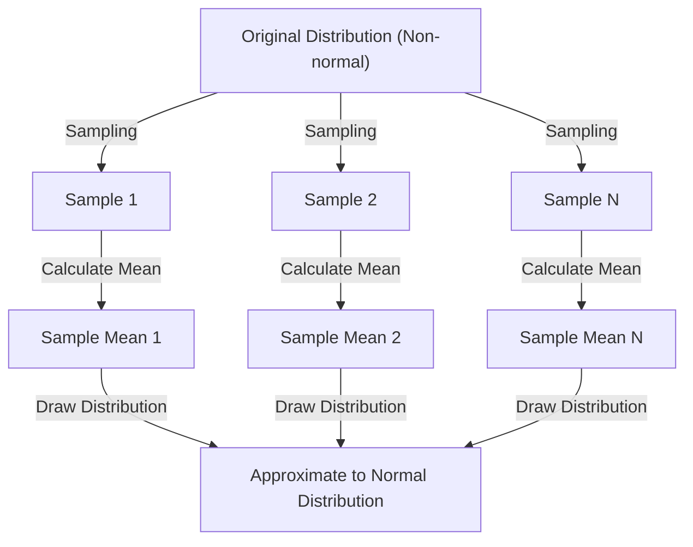

## 1. Introduction

When studying data science and statistics, the **[Central Limit Theorem](https://kenji.blog/en/p/central-limit-theorem/)** (CLT) is unavoidable. This theorem has an almost magical property: "No matter what distribution the data has, the distribution of its sample mean approaches a normal distribution as the sample size increases."

In this article, we will broadly explain the [Central Limit Theorem](https://kenji.blog/en/p/central-limit-theorem/), from an intuitive image to a strict mathematical definition and practical application examples.

## 2. What is the [Central Limit Theorem](https://kenji.blog/en/p/central-limit-theorem/)?

The [Central Limit Theorem](https://kenji.blog/en/p/central-limit-theorem/) (CLT) is one of the most powerful and surprising results in probability theory and statistics. Simply put, the sum (or average) of a large number of independent random variables sampled randomly is approximated by a normal distribution, regardless of the original variables' distribution.

### 2.1 Intuitive Understanding

Consider dice. When you roll one die, the distribution of the outcomes is a uniform distribution. However, when you roll two dice and take their sum, the distribution becomes a triangle peaking at 7 in the center. As you increase the number of dice further, the distribution of the sum approaches a smooth bell-shaped curve, that is, a **normal distribution**.

### 2.2 Mathematical Definition

Suppose $n$ samples $X_1, X_2, \dots, X_n$ randomly drawn from a population follow identically independent distributions (i.i.d.). Let the mean (expected value) of this population be $\mu$ and the variance be $\sigma^2$.

Let the sample mean be $\bar{X} = \frac{1}{n} \sum_{i=1}^{n} X_i$. According to the [Central Limit Theorem](https://kenji.blog/en/p/central-limit-theorem/), when $n$ is sufficiently large, the standardized variable $Z$ as shown below converges to the standard normal distribution $\mathcal{N}(0, 1)$.


$$
Z = \frac{\bar{X} - \mu}{\frac{\sigma}{\sqrt{n}}} \xrightarrow{d} \mathcal{N}(0, 1) \text{ as } n \to \infty
$$


Here, $\xrightarrow{d}$ means convergence in distribution. $\text{ as } n \to \infty$ indicates that the sample size approaches infinity.

## 3. Visualization of the [Central Limit Theorem](https://kenji.blog/en/p/central-limit-theorem/)

To visually understand how the [Central Limit Theorem](https://kenji.blog/en/p/central-limit-theorem/) works, here is a process diagram using Mermaid.



## 4. Simulation with Python

Instead of just theory, let's actually run a program to verify this. We will simulate sampling data from a uniform distribution and see how its mean is distributed.

```python
import numpy as np
import matplotlib.pyplot as plt

# Population parameters (Uniform distribution [0, 1])
mu = 0.5
sigma = np.sqrt(1/12)

# Simulation settings
sample_sizes = [1, 5, 30, 100]
num_simulations = 10000

# Graph rendering settings
fig, axes = plt.subplots(2, 2, figsize=(12, 8))
axes = axes.flatten()

for i, n in enumerate(sample_sizes):
    # Extract n samples from uniform distribution num_simulations times
    samples = np.random.uniform(0, 1, (num_simulations, n))
    
    # Calculate sample mean for each trial
    sample_means = np.mean(samples, axis=1)
    
    # Plot histogram
    ax = axes[i]
    ax.hist(sample_means, bins=50, density=True, alpha=0.7, color='skyblue')
    ax.set_title(f"Sample size n={n}")
    
    # Add theoretical normal distribution curve
    x = np.linspace(mu - 4*sigma/np.sqrt(n), mu + 4*sigma/np.sqrt(n), 100)
    y = (1 / (np.sqrt(2 * np.pi) * (sigma/np.sqrt(n)))) * np.exp(-0.5 * ((x - mu) / (sigma/np.sqrt(n)))**2)
    ax.plot(x, y, 'r-', lw=2)

plt.tight_layout()
plt.show()
```

When you run this code, you can see that it's a uniform distribution when $n=1$, but as $n$ gets larger, the histogram approaches the red line's normal distribution.

## 5. Importance and Applications of the [Central Limit Theorem](https://kenji.blog/en/p/central-limit-theorem/)

Why is the [Central Limit Theorem](https://kenji.blog/en/p/central-limit-theorem/) so important? Because even if we don't know exactly what distribution many real-world datasets have, we can assume a normal distribution when using statistics like the sample mean to conduct hypothesis testing and construct confidence intervals.

### 5.1 Foundation of Statistical Inference
When we infer something from data, such as in public opinion polls, quality control, or A/B testing, much of the rationale relies on the [Central Limit Theorem](https://kenji.blog/en/p/central-limit-theorem/).

### 5.2 Accumulation of Errors
Measurement errors and many noises in nature can also be modeled as the sum of many small, independent factors, so they often follow a normal distribution. This is why it is also called the Gaussian distribution.

## 6. Going Deeper: Approach to the Proof

Characteristic functions and Taylor expansion are used for a strict proof of the [Central Limit Theorem](https://kenji.blog/en/p/central-limit-theorem/). Here is a brief overview.

Using the characteristic function $\phi_X(t) = E[e^{itX}]$, the characteristic function of the sum of independent random variables is the product of their respective characteristic functions. When we calculate the characteristic function of the standardized variable $Z$ and take the limit as $n \to \infty$, it can be shown to converge to $e^{-t^2/2}$, which is the characteristic function of the standard normal distribution. This proves that the distribution itself converges to a normal distribution.

## 7. Conclusion

The [Central Limit Theorem](https://kenji.blog/en/p/central-limit-theorem/) is a very beautiful theorem that shows the order hidden behind chaotic data. By understanding this theorem, you will be able to gain deeper insights into data analysis and statistical modeling.


## Appendix: Detailed Mathematical Background and History

### Appendix 1: Development in Probability Theory
The history of the [Central Limit Theorem](https://kenji.blog/en/p/central-limit-theorem/) is deep, originating from Abraham de Moivre showing the normal approximation of the binomial distribution. It was later expanded by Pierre-Simon Laplace, and Aleksandr Lyapunov provided a proof under more general conditions. In modern probability theory, there are various extensions such as the Lindeberg condition and the Lyapunov condition. These conditions ensure that individual random variables do not have a dominant influence on the total sum. This provides an answer to the fundamental question of why diverse phenomena in nature and social sciences can be approximated by a normal distribution.

### Appendix 2: Application Conditions and the Meaning of the Theorem

In the basic form discussed in this text, it is required that $X_1,\ldots,X_n$ are independent and identically distributed, with a finite mean $\mu$ and a finite, positive variance $0<\sigma^2<\infty$. Please understand the explanation "any distribution" within the scope of these conditions. What approaches a normal distribution is the distribution of the standardized sum or sample mean, and the distribution of the individual observations does not change.

### Appendix 3: Standard Error and the [Law of Large Numbers](https://kenji.blog/en/p/law-of-large-numbers/)

Due to independence, the expected value and variance of the sample mean are as follows. The standard error is the dispersion of the sample mean and is different from the standard deviation of the individual data.

$$
E[\bar X_n]=\mu,\qquad \operatorname{Var}(\bar X_n)=\frac{\sigma^2}{n},\qquad \operatorname{SE}(\bar X_n)=\frac{\sigma}{\sqrt n}.
$$

Quadrupling the number of samples halves the standard error. The law of large numbers states that the sample mean approaches $\mu$, and the [Central Limit Theorem](https://kenji.blog/en/p/central-limit-theorem/) describes the shape of the distribution by multiplying the fluctuation around it by $\sqrt{n}$.

### Appendix 4: Supplementary Proof Using Characteristic Functions

Let $Y_i=(X_i-\mu)/\sigma$ and $Z_n=n^{-1/2}\sum_{i=1}^nY_i$. Since $E[Y_i]=0$ and $E[Y_i^2]=1$, the characteristic function can be expanded near the origin as follows.

$$
\phi_Y(t)=E[e^{itY}]=1-\frac{t^2}{2}+o(t^2)\quad(t\to0).
$$

From independence, the following equation is obtained. Since the limit is the characteristic function of the standard normal distribution, convergence in distribution follows from Lévy's continuity theorem. Characteristic functions and moment-generating functions are different, and the existence of a moment-generating function is not necessary for this proof.

$$
\phi_{Z_n}(t)=\left[\phi_Y\!\left(\frac{t}{\sqrt n}\right)\right]^n
=\left[1-\frac{t^2}{2n}+o\!\left(\frac1n\right)\right]^n
\longrightarrow e^{-t^2/2}.
$$

### Appendix 5: Inapplicable Examples and Approximation Accuracy

The [Cauchy](https://kenji.blog/en/p/cauchy/) distribution has neither a finite mean nor a finite variance, and the sample mean of independent standard Cauchy variables remains a standard [Cauchy](https://kenji.blog/en/p/cauchy/) distribution. Also, if all $X_i$ are equal to the same variable, there is no independence, and taking the mean does not reduce the dispersion. There is no guarantee that "$n\ge30$ is always sufficient". The required sample size varies depending on skewness and heavy tails. For extensions to cases that are independent but not identically distributed, it is necessary to check additional conditions such as the Lindeberg or Lyapunov conditions.
