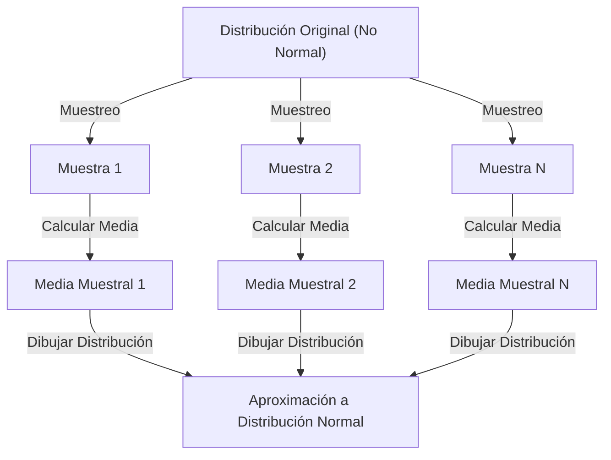

## 1. Introducción

Al estudiar ciencia de datos y estadística, es inevitable encontrarse con el **[Teorema del Límite Central](https://kenji.blog/es/p/central-limit-theorem/)** (TLC). Este teorema tiene una propiedad casi mágica: "Sin importar qué distribución tengan los datos, la distribución de su media muestral se aproxima a una distribución normal a medida que aumenta el tamaño de la muestra."

En este artículo, explicaremos ampliamente el [Teorema del Límite Central](https://kenji.blog/es/p/central-limit-theorem/), desde una imagen intuitiva hasta una definición matemática estricta y ejemplos de aplicación práctica.

## 2. ¿Qué es el [Teorema del Límite Central](https://kenji.blog/es/p/central-limit-theorem/)?

El [Teorema del Límite Central](https://kenji.blog/es/p/central-limit-theorem/) (TLC) es uno de los resultados más poderosos y sorprendentes en la teoría de la probabilidad y la estadística. En pocas palabras, la suma (o promedio) de una gran cantidad de variables aleatorias independientes extraídas al azar se aproxima a una distribución normal, independientemente de la distribución que tuvieran las variables originales.

### 2.1 Comprensión Intuitiva

Pensemos en los dados. Cuando tiras un dado, la distribución de los resultados es una distribución uniforme. Sin embargo, cuando tiras dos dados y tomas su suma, la distribución se convierte en un triángulo con un pico de 7 en el centro. A medida que aumentas aún más la cantidad de dados, la distribución de su suma se acerca a una curva suave en forma de campana, es decir, una **distribución normal**.

### 2.2 Definición Matemática

Supongamos que $n$ muestras $X_1, X_2, \dots, X_n$ extraídas al azar de una población siguen distribuciones idénticas e independientes (i.i.d.). Sea la media (valor esperado) de esta población $\mu$ y la varianza $\sigma^2$.

Sea la media muestral $\bar{X} = \frac{1}{n} \sum_{i=1}^{n} X_i$. Según el [Teorema del Límite Central](https://kenji.blog/es/p/central-limit-theorem/), cuando $n$ es suficientemente grande, la variable estandarizada $Z$ mostrada a continuación converge a la distribución normal estándar $\mathcal{N}(0, 1)$.


$$
Z = \frac{\bar{X} - \mu}{\frac{\sigma}{\sqrt{n}}} \xrightarrow{d} \mathcal{N}(0, 1) \text{ a medida que } n \to \infty
$$


Aquí, $\xrightarrow{d}$ significa convergencia en distribución. $\text{ a medida que } n \to \infty$ indica que el tamaño de la muestra se acerca al infinito.

## 3. Visualización del [Teorema del Límite Central](https://kenji.blog/es/p/central-limit-theorem/)

Para comprender visualmente cómo funciona el [Teorema del Límite Central](https://kenji.blog/es/p/central-limit-theorem/), aquí hay un diagrama de proceso usando Mermaid.



## 4. Simulación con Python

En lugar de solo teoría, ejecutemos un programa para verificarlo. Simularemos extraer datos de una distribución uniforme y veremos cómo se distribuye su media.

```python
import numpy as np
import matplotlib.pyplot as plt

# Parámetros de la población (Distribución uniforme [0, 1])
mu = 0.5
sigma = np.sqrt(1/12)

# Configuración de simulación
sample_sizes = [1, 5, 30, 100]
num_simulations = 10000

# Configuración de dibujo de gráficos
fig, axes = plt.subplots(2, 2, figsize=(12, 8))
axes = axes.flatten()

for i, n in enumerate(sample_sizes):
    # Extraer n muestras de la distribución uniforme num_simulations veces
    samples = np.random.uniform(0, 1, (num_simulations, n))
    
    # Calcular la media muestral para cada intento
    sample_means = np.mean(samples, axis=1)
    
    # Trazar el histograma
    ax = axes[i]
    ax.hist(sample_means, bins=50, density=True, alpha=0.7, color='skyblue')
    ax.set_title(f"Tamaño de muestra n={n}")
    
    # Añadir la curva teórica de la distribución normal
    x = np.linspace(mu - 4*sigma/np.sqrt(n), mu + 4*sigma/np.sqrt(n), 100)
    y = (1 / (np.sqrt(2 * np.pi) * (sigma/np.sqrt(n)))) * np.exp(-0.5 * ((x - mu) / (sigma/np.sqrt(n)))**2)
    ax.plot(x, y, 'r-', lw=2)

plt.tight_layout()
plt.show()
```

Al ejecutar este código, puedes confirmar que cuando $n=1$ es una distribución uniforme, pero a medida que $n$ aumenta, el histograma se acerca a la distribución normal de la línea roja.

## 5. Importancia y Aplicaciones del [Teorema del Límite Central](https://kenji.blog/es/p/central-limit-theorem/)

¿Por qué es tan importante el [Teorema del Límite Central](https://kenji.blog/es/p/central-limit-theorem/)? Es porque incluso si no sabemos exactamente qué distribución tienen muchos datos del mundo real, podemos asumir una distribución normal al usar estadísticas como la media muestral para realizar pruebas de hipótesis y construir intervalos de confianza.

### 5.1 Fundamento de la Inferencia Estadística
Cuando inferimos algo de los datos, como en encuestas de opinión, control de calidad o pruebas A/B, gran parte del razonamiento se basa en el [Teorema del Límite Central](https://kenji.blog/es/p/central-limit-theorem/).

### 5.2 Acumulación de Errores
Los errores de medición y muchos ruidos en la naturaleza también se pueden modelar como la suma de muchos factores pequeños e independientes, por lo que a menudo siguen una distribución normal. Por eso también se le llama distribución gaussiana.

## 6. Profundizando: Enfoque para la Demostración

Para una demostración estricta del [Teorema del Límite Central](https://kenji.blog/es/p/central-limit-theorem/) se utilizan funciones características y la expansión de Taylor. Aquí presentamos un breve resumen.

Usando la función característica $\phi_X(t) = E[e^{itX}]$, la función característica de la suma de variables aleatorias independientes es el producto de sus respectivas funciones características. Al calcular la función característica de la variable estandarizada $Z$ y tomar el límite a medida que $n \to \infty$, se puede demostrar que converge a la función característica de la distribución normal estándar $e^{-t^2/2}$. Esto demuestra que la distribución misma converge a una distribución normal.

## 7. Conclusión

El [Teorema del Límite Central](https://kenji.blog/es/p/central-limit-theorem/) es un teorema extremadamente hermoso que muestra el orden escondido detrás de los datos caóticos. Al comprender este teorema, podrás obtener conocimientos más profundos en el análisis de datos y la construcción de modelos estadísticos.


## Apéndice: Contexto Matemático Detallado e Historia

### Apéndice 1: Desarrollo en la Teoría de Probabilidades
La historia del [Teorema del Límite Central](https://kenji.blog/es/p/central-limit-theorem/) es profunda, y se origina en Abraham de Moivre, quien mostró la aproximación normal de la distribución binomial. Más tarde fue ampliada por Pierre-Simon Laplace, y Aleksandr Lyapunov proporcionó una demostración en condiciones más generales. En la teoría de la probabilidad moderna, existen varias extensiones, como la condición de Lindeberg y la condición de Lyapunov. Estas condiciones aseguran que las variables aleatorias individuales no tengan una influencia dominante en la suma total. Esto proporciona una respuesta a la pregunta fundamental de por qué diversos fenómenos en la naturaleza y las ciencias sociales pueden ser aproximados por una distribución normal.

### Apéndice 2: Condiciones de Aplicación y el Significado del Teorema

En la forma básica discutida en este texto, se requiere que $X_1,\ldots,X_n$ sean independientes e idénticamente distribuidas, con una media finita $\mu$ y una varianza positiva finita $0<\sigma^2<\infty$. Por favor, comprende la explicación "cualquier distribución" dentro del alcance de estas condiciones. Lo que se aproxima a una distribución normal es la distribución de la suma estandarizada o de la media muestral, y la distribución de las observaciones individuales no cambia.

### Apéndice 3: Error Estándar y la [Ley de los Grandes Números](https://kenji.blog/es/p/law-of-large-numbers/)

Debido a la independencia, el valor esperado y la varianza de la media muestral son los siguientes. El error estándar es la dispersión de la media muestral y es diferente de la desviación estándar de los datos individuales.

$$
E[\bar X_n]=\mu,\qquad \operatorname{Var}(\bar X_n)=\frac{\sigma^2}{n},\qquad \operatorname{SE}(\bar X_n)=\frac{\sigma}{\sqrt n}.
$$

Cuadruplicar el número de muestras reduce a la mitad el error estándar. La ley de los grandes números establece que la media muestral se acerca a $\mu$, y el [Teorema del Límite Central](https://kenji.blog/es/p/central-limit-theorem/) describe la forma de la distribución multiplicando la fluctuación a su alrededor por $\sqrt{n}$.

### Apéndice 4: Demostración Complementaria usando Funciones Características

Sea $Y_i=(X_i-\mu)/\sigma$ y $Z_n=n^{-1/2}\sum_{i=1}^nY_i$. Como $E[Y_i]=0$ y $E[Y_i^2]=1$, la función característica se puede expandir cerca del origen de la siguiente manera.

$$
\phi_Y(t)=E[e^{itY}]=1-\frac{t^2}{2}+o(t^2)\quad(t\to0).
$$

De la independencia, se obtiene la siguiente ecuación. Dado que el límite es la función característica de la distribución normal estándar, la convergencia en distribución se deduce del teorema de continuidad de Lévy. Las funciones características y las funciones generadoras de momentos son diferentes, y la existencia de una función generadora de momentos no es necesaria para esta demostración.

$$
\phi_{Z_n}(t)=\left[\phi_Y\!\left(\frac{t}{\sqrt n}\right)\right]^n
=\left[1-\frac{t^2}{2n}+o\!\left(\frac1n\right)\right]^n
\longrightarrow e^{-t^2/2}.
$$

### Apéndice 5: Ejemplos Inaplicables y Precisión de la Aproximación

La distribución de [Cauchy](https://kenji.blog/es/p/cauchy/) no tiene media finita ni varianza finita, y la media muestral de variables de Cauchy estándar independientes sigue siendo una distribución de [Cauchy](https://kenji.blog/es/p/cauchy/) estándar. Además, si todas las $X_i$ son iguales a la misma variable, no hay independencia, y tomar la media no reduce la dispersión. No hay garantía de que "$n\ge30$ siempre sea suficiente". El tamaño de muestra requerido varía según la asimetría y las colas pesadas. Para las extensiones a casos independientes pero con distribuciones diferentes, es necesario verificar condiciones adicionales como las condiciones de Lindeberg o Lyapunov.
