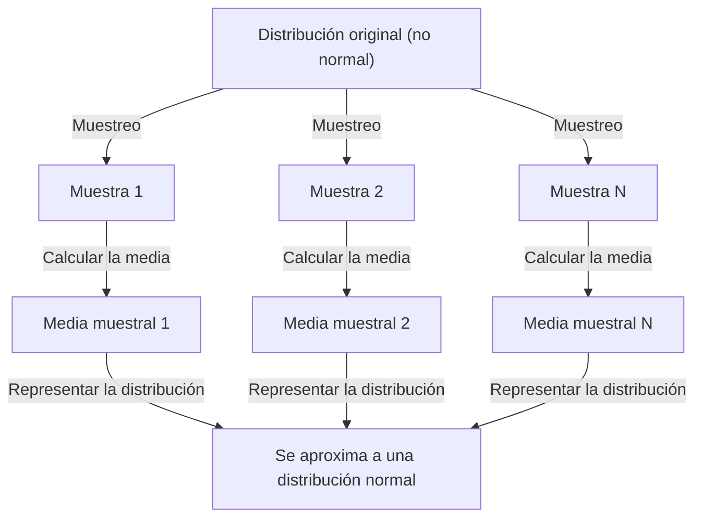

## 1. Introducción

Al estudiar ciencia de datos y estadística, un concepto que no se puede evitar es el **Teorema del límite central** (CLT). Este teorema posee la propiedad casi mágica de que "independientemente de la distribución de los datos, la distribución de las medias muestrales se acerca a una distribución normal a medida que aumenta el tamaño de la muestra".

En este artículo, proporcionamos una explicación completa del teorema del límite central, desde imágenes intuitivas hasta definiciones matemáticas rigurosas y aplicaciones prácticas.

## 2. ¿Qué es el teorema del límite central?

El Teorema del Límite Central (CLT) es uno de los resultados más poderosos y sorprendentes en teoría de probabilidad y estadística. En pocas palabras, la suma (o media) de un gran número de variables aleatorias independientes muestreadas aleatoriamente se aproxima mediante una distribución normal, independientemente de la distribución original de esas variables.

### 2.1 Comprensión intuitiva

Considere los dados. Cuando lanzas un solo dado, la distribución de los resultados es uniforme. Sin embargo, cuando tiras dos dados y tomas su suma, la distribución se vuelve triangular, alcanzando un máximo de 7. A medida que aumentas el número de dados, la distribución de su suma se acerca a una curva suave en forma de campana, es decir, una **distribución normal**.

### 2.2 Definición matemática

Supongamos que las muestras $n$ $X_1, X_2, \dots, X_n$ se extraen aleatoriamente de una población y se distribuyen de forma independiente e idéntica (i.i.d.). Sea la media poblacional (valor esperado) $\mu$ y la varianza $\sigma^2$.

Si definimos la media muestral como $\bar{X} = \frac{1}{n} \sum_{i=1}^{n} X_i$, entonces, de acuerdo con el teorema del límite central, cuando $n$ es suficientemente grande, la siguiente variable estandarizada $Z$ converge a la distribución normal estándar $\mathcal{N}(0, 1)$:


$$
Z = \frac{\bar{X} - \mu}{\frac{\sigma}{\sqrt{n}}} \xrightarrow{d} \mathcal{N}(0, 1) \text{ as } n \to \infty
$$


Aquí, $\xrightarrow{d}$ denota convergencia en la distribución. $\text{ as } n \to \infty$ indica que el tamaño de la muestra se acerca al infinito.

## 3. Visualizando el teorema del límite central

Para comprender visualmente cómo funciona el teorema del límite central, aquí hay un diagrama de proceso que utiliza Mermaid.



## 4. Simulación con Python

Verifiquemos esto no sólo con la teoría sino ejecutando un programa. Tomaremos muestras de datos de una distribución uniforme y simularemos cómo se distribuyen las medias.

```python
import numpy as np
import matplotlib.pyplot as plt

# Population parameters (Uniform distribution [0, 1])
mu = 0.5
sigma = np.sqrt(1/12)

# Simulation settings
sample_sizes = [1, 5, 30, 100]
num_simulations = 10000

# Graph drawing settings
fig, axes = plt.subplots(2, 2, figsize=(12, 8))
axes = axes.flatten()

for i, n in enumerate(sample_sizes):
    # Draw n samples from a uniform distribution, num_simulations times
    samples = np.random.uniform(0, 1, (num_simulations, n))
    
    # Calculate the sample mean for each trial
    sample_means = np.mean(samples, axis=1)
    
    # Plot the histogram
    ax = axes[i]
    ax.hist(sample_means, bins=50, density=True, alpha=0.7, color='skyblue')
    ax.set_title(f"Sample size n={n}")
    
    # Add the theoretical normal distribution curve
    x = np.linspace(mu - 4*sigma/np.sqrt(n), mu + 4*sigma/np.sqrt(n), 100)
    y = (1 / (np.sqrt(2 * np.pi) * (sigma/np.sqrt(n)))) * np.exp(-0.5 * ((x - mu) / (sigma/np.sqrt(n)))**2)
    ax.plot(x, y, 'r-', lw=2)

plt.tight_layout()
plt.show()
```

Cuando ejecuta este código, puede confirmar que para $n=1$ la distribución es uniforme, pero a medida que aumenta $n$, el histograma se acerca a la curva de distribución normal roja.

## 5. Importancia y aplicaciones del teorema del límite central

¿Por qué es tan importante el teorema del límite central? Esto se debe a que incluso sin conocer la distribución exacta de los datos del mundo real, podemos asumir una distribución normal para estadísticas como las medias muestrales, lo que permite probar hipótesis y construir intervalos de confianza.

### 5.1 Fundamentos de la inferencia estadística
Cuando hacemos inferencias a partir de datos (en encuestas de opinión, control de calidad, pruebas A/B y más), gran parte del razonamiento se basa en el teorema del límite central.

### 5.2 Acumulación de errores
Los errores de medición y muchos tipos de ruido en la naturaleza también se pueden modelar como la suma de numerosos pequeños factores independientes, razón por la cual a menudo siguen una distribución normal. Esta es también la razón por la que se le llama distribución gaussiana.

## 6. Profundizando: aproximaciones a la prueba

La demostración rigurosa del teorema del límite central utiliza funciones características y expansiones de Taylor. Aquí presentamos un esquema.

Usando la función característica $\phi_X(t) = E[e^{itX}]$, la función característica de la suma de variables aleatorias independientes se convierte en el producto de sus funciones características individuales. Al calcular la función característica de la variable estandarizada $Z$ y tomar el límite como $n \to \infty$, se puede demostrar que converge a la función característica de la distribución normal estándar $e^{-t^2/2}$. Esto demuestra que la distribución misma converge a la distribución normal.

## 7. Conclusión

El teorema del límite central es un teorema extraordinariamente hermoso que revela el orden oculto detrás de datos caóticos. Al comprender este teorema, podrá obtener conocimientos más profundos sobre el análisis de datos y la construcción de modelos estadísticos.


## Apéndice: Antecedentes e historia matemáticos detallados

### Apéndice 1: Desarrollos en la teoría de la probabilidad
La historia del teorema del límite central es profunda y se origina en la demostración de Abraham de Moivre de la aproximación normal de la distribución binomial. Posteriormente fue ampliado por Pierre-Simon Laplace, y Aleksandr Lyapunov dio una demostración en condiciones más generales. En la teoría de probabilidad moderna existen varias extensiones, como la condición de Lindeberg y la condición de Lyapunov. Estas condiciones garantizan que ninguna variable aleatoria individual tenga una influencia dominante sobre la suma global. Esto proporciona una respuesta a la pregunta fundamental de por qué diversos fenómenos en la naturaleza y las ciencias sociales pueden aproximarse mediante la distribución normal.

### Apéndice 2: Condiciones e interpretación

La versión básica exige que $X_1,\ldots,X_n$ sean independientes e idénticamente distribuidas, con media finita $\mu$ y varianza finita y positiva $0<\sigma^2<\infty$. «Cualquier distribución» debe entenderse bajo estas condiciones. Se aproxima a la normalidad la distribución de la suma o media estandarizada, no la de cada observación.

### Apéndice 3: Error estándar y ley de los grandes números

La independencia permite obtener la siguiente esperanza y varianza de la media muestral. El error estándar mide la variación de la media, no la desviación estándar de las observaciones individuales.

$$
E[\bar X_n]=\mu,\qquad \operatorname{Var}(\bar X_n)=\frac{\sigma^2}{n},\qquad \operatorname{SE}(\bar X_n)=\frac{\sigma}{\sqrt n}.
$$

Cuadruplicar el tamaño muestral reduce el error estándar a la mitad. La ley de los grandes números describe cómo la media se acerca a $\mu$; el TCL describe la forma de sus fluctuaciones escaladas por $\sqrt{n}$.

### Apéndice 4: Detalles de la prueba con funciones características

Definamos $Y_i=(X_i-\mu)/\sigma$ y $Z_n=n^{-1/2}\sum_{i=1}^nY_i$. Como $E[Y_i]=0$ y $E[Y_i^2]=1$, la función característica tiene la siguiente expansión cerca de cero.

$$
\phi_Y(t)=E[e^{itY}]=1-\frac{t^2}{2}+o(t^2)\quad(t\to0).
$$

Por independencia obtenemos la expresión siguiente. Su límite es la función característica de la normal estándar; el teorema de continuidad de Lévy implica la convergencia en distribución. La función característica es distinta de la función generadora de momentos: esta prueba no exige que exista la segunda.

$$
\phi_{Z_n}(t)=\left[\phi_Y\!\left(\frac{t}{\sqrt n}\right)\right]^n
=\left[1-\frac{t^2}{2n}+o\!\left(\frac1n\right)\right]^n
\longrightarrow e^{-t^2/2}.
$$

### Apéndice 5: Contraejemplos y precisión

La distribución de Cauchy no tiene media ni varianza finitas; la media de variables Cauchy estándar independientes sigue siendo Cauchy estándar. Si todos los $X_i$ son la misma variable aleatoria, falla la independencia y promediar no reduce la variabilidad. No hay garantía universal de que $n\ge30$ baste: influyen la asimetría y el peso de las colas. Para variables independientes con distribuciones distintas deben verificarse condiciones adicionales, como las de Lindeberg o Lyapunov.
