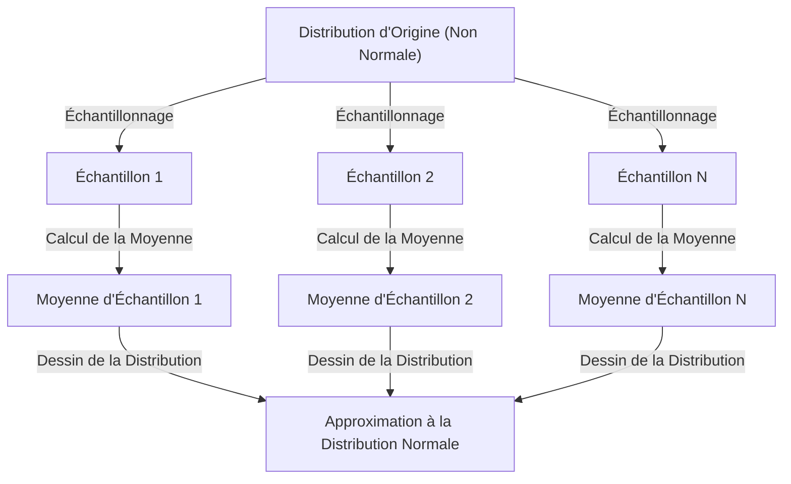

## 1. Introduction

Lorsque l'on étudie la science des données et les statistiques, il est impossible d'éviter le **[Théorème Central Limite](https://kenji.blog/fr/p/central-limit-theorem/)** (TCL). Ce théorème possède une propriété presque magique : "Peu importe la distribution des données, la distribution de sa moyenne d'échantillon s'approche d'une distribution normale à mesure que la taille de l'échantillon augmente."

Dans cet article, nous expliquerons largement le [Théorème Central Limite](https://kenji.blog/fr/p/central-limit-theorem/), depuis une image intuitive jusqu'à une définition mathématique stricte et des exemples d'applications pratiques.

## 2. Qu'est-ce que le [Théorème Central Limite](https://kenji.blog/fr/p/central-limit-theorem/) ?

Le [Théorème Central Limite](https://kenji.blog/fr/p/central-limit-theorem/) (TCL) est l'un des résultats les plus puissants et surprenants de la théorie des probabilités et des statistiques. En termes simples, la somme (ou la moyenne) d'un grand nombre de variables aléatoires indépendantes tirées au hasard s'approche d'une distribution normale, indépendamment de la distribution des variables d'origine.

### 2.1 Compréhension Intuitive

Prenons l'exemple des dés. Lorsque vous lancez un seul dé, la distribution des résultats est une distribution uniforme. Cependant, lorsque vous lancez deux dés et prenez leur somme, la distribution devient un triangle culminant à 7 au centre. Au fur et à mesure que vous augmentez encore le nombre de dés, la distribution de leur somme s'approche d'une courbe douce en forme de cloche, c'est-à-dire une **distribution normale**.

### 2.2 Définition Mathématique

Supposons que $n$ échantillons $X_1, X_2, \dots, X_n$ tirés au hasard d'une population suivent des distributions identiques et indépendantes (i.i.d.). Soit la moyenne (valeur espérée) de cette population $\mu$ et la variance $\sigma^2$.

Soit la moyenne d'échantillon $\bar{X} = \frac{1}{n} \sum_{i=1}^{n} X_i$. Selon le [Théorème Central Limite](https://kenji.blog/fr/p/central-limit-theorem/), lorsque $n$ est suffisamment grand, la variable standardisée $Z$ comme illustré ci-dessous converge vers la distribution normale standard $\mathcal{N}(0, 1)$.


$$
Z = \frac{\bar{X} - \mu}{\frac{\sigma}{\sqrt{n}}} \xrightarrow{d} \mathcal{N}(0, 1) \text{ pour } n \to \infty
$$


Ici, $\xrightarrow{d}$ signifie la convergence en distribution. $\text{ pour } n \to \infty$ indique que la taille de l'échantillon approche de l'infini.

## 3. Visualisation du [Théorème Central Limite](https://kenji.blog/fr/p/central-limit-theorem/)

Pour comprendre visuellement comment fonctionne le [Théorème Central Limite](https://kenji.blog/fr/p/central-limit-theorem/), voici un diagramme de processus utilisant Mermaid.



## 4. Simulation avec Python

Au lieu de se contenter de la théorie, exécutons un programme pour vérifier cela. Nous allons simuler l'extraction de données à partir d'une distribution uniforme et voir comment leur moyenne est distribuée.

```python
import numpy as np
import matplotlib.pyplot as plt

# Paramètres de la population (Distribution uniforme [0, 1])
mu = 0.5
sigma = np.sqrt(1/12)

# Paramètres de simulation
sample_sizes = [1, 5, 30, 100]
num_simulations = 10000

# Paramètres de dessin des graphiques
fig, axes = plt.subplots(2, 2, figsize=(12, 8))
axes = axes.flatten()

for i, n in enumerate(sample_sizes):
    # Extraire n échantillons de la distribution uniforme num_simulations fois
    samples = np.random.uniform(0, 1, (num_simulations, n))
    
    # Calculer la moyenne d'échantillon pour chaque essai
    sample_means = np.mean(samples, axis=1)
    
    # Tracer l'histogramme
    ax = axes[i]
    ax.hist(sample_means, bins=50, density=True, alpha=0.7, color='skyblue')
    ax.set_title(f"Taille de l'échantillon n={n}")
    
    # Ajouter la courbe de distribution normale théorique
    x = np.linspace(mu - 4*sigma/np.sqrt(n), mu + 4*sigma/np.sqrt(n), 100)
    y = (1 / (np.sqrt(2 * np.pi) * (sigma/np.sqrt(n)))) * np.exp(-0.5 * ((x - mu) / (sigma/np.sqrt(n)))**2)
    ax.plot(x, y, 'r-', lw=2)

plt.tight_layout()
plt.show()
```

Lorsque vous exécutez ce code, vous pouvez confirmer que pour $n=1$, c'est une distribution uniforme, mais à mesure que $n$ augmente, l'histogramme s'approche de la ligne rouge de la distribution normale.

## 5. Importance et Applications du [Théorème Central Limite](https://kenji.blog/fr/p/central-limit-theorem/)

Pourquoi le [Théorème Central Limite](https://kenji.blog/fr/p/central-limit-theorem/) est-il si important ? C'est parce que même si nous ne savons pas exactement quelle distribution ont de nombreuses données du monde réel, nous pouvons supposer une distribution normale lors de l'utilisation de statistiques comme la moyenne d'échantillon pour effectuer des tests d'hypothèses et construire des intervalles de confiance.

### 5.1 Fondement de l'Inférence Statistique
Lorsque nous déduisons quelque chose à partir des données, comme dans les sondages d'opinion, le contrôle qualité ou les tests A/B, une grande partie du raisonnement repose sur le [Théorème Central Limite](https://kenji.blog/fr/p/central-limit-theorem/).

### 5.2 Accumulation des Erreurs
Les erreurs de mesure et de nombreux bruits dans la nature peuvent également être modélisés comme la somme de nombreux petits facteurs indépendants, de sorte qu'ils suivent souvent une distribution normale. C'est pourquoi on l'appelle aussi la distribution gaussienne.

## 6. Pour Aller Plus Loin : Approche de la Preuve

Les fonctions caractéristiques et le développement de Taylor sont utilisés pour une preuve stricte du [Théorème Central Limite](https://kenji.blog/fr/p/central-limit-theorem/). En voici un bref aperçu.

En utilisant la fonction caractéristique $\phi_X(t) = E[e^{itX}]$, la fonction caractéristique de la somme de variables aléatoires indépendantes est le produit de leurs fonctions caractéristiques respectives. Lorsque nous calculons la fonction caractéristique de la variable standardisée $Z$ et prenons la limite pour $n \to \infty$, on peut montrer qu'elle converge vers $e^{-t^2/2}$, qui est la fonction caractéristique de la distribution normale standard. Cela prouve que la distribution elle-même converge vers une distribution normale.

## 7. Conclusion

Le [Théorème Central Limite](https://kenji.blog/fr/p/central-limit-theorem/) est un théorème extrêmement beau qui montre l'ordre caché derrière des données chaotiques. En comprenant ce théorème, vous pourrez acquérir des connaissances plus approfondies dans l'analyse de données et la construction de modèles statistiques.


## Annexe : Contexte Mathématique Détaillé et Histoire

### Annexe 1 : Développement dans la Théorie des Probabilités
L'histoire du [Théorème Central Limite](https://kenji.blog/fr/p/central-limit-theorem/) est profonde, trouvant son origine avec Abraham de Moivre qui a montré l'approximation normale de la distribution binomiale. Elle a ensuite été étendue par Pierre-Simon Laplace, et Aleksandr Lyapunov a fourni une preuve sous des conditions plus générales. Dans la théorie des probabilités moderne, il existe diverses extensions telles que la condition de Lindeberg et la condition de Lyapunov. Ces conditions garantissent que les variables aléatoires individuelles n'ont pas d'influence dominante sur la somme totale. Cela donne une réponse à la question fondamentale de savoir pourquoi divers phénomènes dans la nature et les sciences sociales peuvent être approximés par une distribution normale.

### Annexe 2 : Conditions d'Application et Signification du Théorème

Dans la forme de base discutée dans ce texte, il est requis que $X_1,\ldots,X_n$ soient indépendantes et identiquement distribuées, avec une moyenne finie $\mu$ et une variance positive finie $0<\sigma^2<\infty$. Veuillez comprendre l'explication "n'importe quelle distribution" dans le cadre de ces conditions. Ce qui s'approche d'une distribution normale, c'est la distribution de la somme standardisée ou de la moyenne d'échantillon, et la distribution des observations individuelles ne change pas.

### Annexe 3 : Erreur Standard et Loi des Grands Nombres

En raison de l'indépendance, l'espérance et la variance de la moyenne d'échantillon sont les suivantes. L'erreur standard est la dispersion de la moyenne d'échantillon et est différente de l'écart type des données individuelles.

$$
E[\bar X_n]=\mu,\qquad \operatorname{Var}(\bar X_n)=\frac{\sigma^2}{n},\qquad \operatorname{SE}(\bar X_n)=\frac{\sigma}{\sqrt n}.
$$

Quadrupler le nombre d'échantillons réduit de moitié l'erreur standard. [La loi des grands nombres](https://kenji.blog/fr/p/law-of-large-numbers/) stipule que la moyenne d'échantillon s'approche de $\mu$, et le [Théorème Central Limite](https://kenji.blog/fr/p/central-limit-theorem/) décrit la forme de la distribution en multipliant la fluctuation autour d'elle par $\sqrt{n}$.

### Annexe 4 : Preuve Supplémentaire Utilisant des Fonctions Caractéristiques

Soit $Y_i=(X_i-\mu)/\sigma$ et $Z_n=n^{-1/2}\sum_{i=1}^nY_i$. Puisque $E[Y_i]=0$ et $E[Y_i^2]=1$, la fonction caractéristique peut être développée près de l'origine comme suit.

$$
\phi_Y(t)=E[e^{itY}]=1-\frac{t^2}{2}+o(t^2)\quad(t\to0).
$$

D'après l'indépendance, on obtient l'équation suivante. Puisque la limite est la fonction caractéristique de la distribution normale standard, la convergence en distribution découle du théorème de continuité de Lévy. Les fonctions caractéristiques et les fonctions génératrices de moments sont différentes, et l'existence d'une fonction génératrice de moments n'est pas nécessaire pour cette preuve.

$$
\phi_{Z_n}(t)=\left[\phi_Y\!\left(\frac{t}{\sqrt n}\right)\right]^n
=\left[1-\frac{t^2}{2n}+o\!\left(\frac1n\right)\right]^n
\longrightarrow e^{-t^2/2}.
$$

### Annexe 5 : Exemples Inapplicables et Précision de l'Approximation

La distribution de [Cauchy](https://kenji.blog/fr/p/cauchy/) n'a ni moyenne finie ni variance finie, et la moyenne d'échantillon de variables de Cauchy standard indépendantes reste une distribution de [Cauchy](https://kenji.blog/fr/p/cauchy/) standard. De plus, si toutes les $X_i$ sont égales à la même variable, il n'y a pas d'indépendance, et prendre la moyenne ne réduit pas la dispersion. Il n'y a aucune garantie que "$n\ge30$ est toujours suffisant". La taille de l'échantillon requise varie en fonction de l'asymétrie et de l'épaisseur des queues. Pour les extensions aux cas qui sont indépendants mais non identiquement distribués, il est nécessaire de vérifier des conditions supplémentaires telles que les conditions de Lindeberg ou de Lyapunov.
