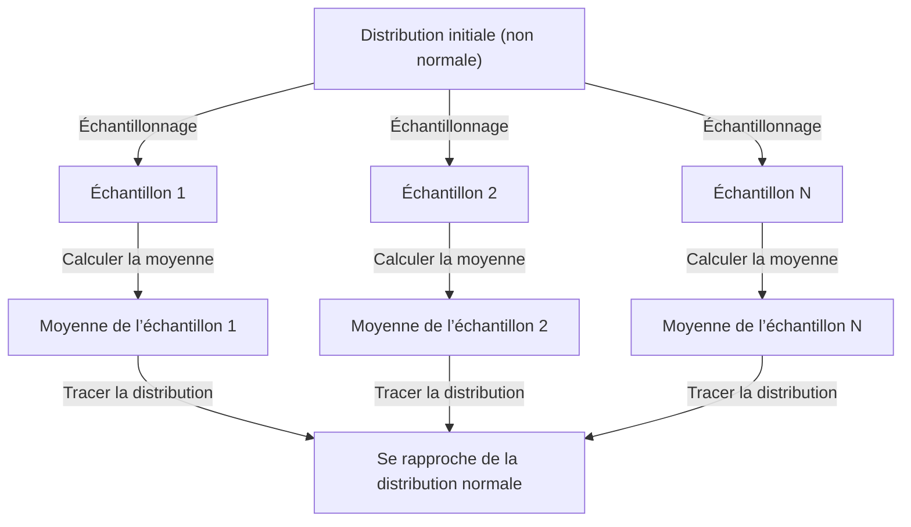

## 1. Introduction

Lorsque vous étudiez la science des données et les statistiques, un concept que vous ne pouvez pas éviter est le **théorème central limite** (CLT). Ce théorème possède la propriété presque magique selon laquelle « quelle que soit la distribution des données, la distribution des moyennes de l'échantillon se rapproche d'une distribution normale à mesure que la taille de l'échantillon augmente ».

Dans cet article, nous fournissons une explication complète du théorème central limite, des images intuitives aux définitions mathématiques rigoureuses et aux applications pratiques.

## 2. Qu'est-ce que le théorème central limite ?

Le théorème central limite (CLT) est l’un des résultats les plus puissants et les plus surprenants de la théorie des probabilités et des statistiques. En termes simples, la somme (ou la moyenne) d'un grand nombre de variables aléatoires indépendantes échantillonnées au hasard est approximée par une distribution normale, quelle que soit la distribution originale de ces variables.

### 2.1 Compréhension intuitive

Pensez aux dés. Lorsque vous lancez un seul dé, la répartition des résultats est uniforme. Cependant, lorsque vous lancez deux dés et calculez leur somme, la distribution devient triangulaire, culminant à 7. À mesure que vous augmentez le nombre de dés, la distribution de leur somme se rapproche d'une courbe lisse en forme de cloche, c'est-à-dire une **distribution normale**.

### 2.2 Définition mathématique

Supposons que les échantillons $n$ $X_1, X_2, \dots, X_n$ soient tirés au hasard dans une population et soient distribués de manière indépendante et identique (i.i.d.). Soit la moyenne de la population (valeur attendue) soit $\mu$ et la variance soit $\sigma^2$.

Si nous définissons la moyenne de l'échantillon comme $\bar{X} = \frac{1}{n} \sum_{i=1}^{n} X_i$, alors selon le théorème central limite, lorsque $n$ est suffisamment grand, la variable standardisée suivante $Z$ converge vers la distribution normale standard $\mathcal{N}(0, 1)$ :


$$
Z = \frac{\bar{X} - \mu}{\frac{\sigma}{\sqrt{n}}} \xrightarrow{d} \mathcal{N}(0, 1) \text{ as } n \to \infty
$$


Ici, $\xrightarrow{d}$ désigne la convergence de la distribution. $\text{ as } n \to \infty$ indique que la taille de l'échantillon s'approche de l'infini.

## 3. Visualisation du théorème central limite

Pour comprendre visuellement le fonctionnement du théorème central limite, voici un diagramme de processus utilisant Mermaid.



## 4. Simulation avec Python

Vérifions cela non seulement avec la théorie, mais en exécutant réellement un programme. Nous échantillonnerons les données d'une distribution uniforme et simulerons la façon dont les moyennes sont distribuées.

```python
import numpy as np
import matplotlib.pyplot as plt

# Population parameters (Uniform distribution [0, 1])
mu = 0.5
sigma = np.sqrt(1/12)

# Simulation settings
sample_sizes = [1, 5, 30, 100]
num_simulations = 10000

# Graph drawing settings
fig, axes = plt.subplots(2, 2, figsize=(12, 8))
axes = axes.flatten()

for i, n in enumerate(sample_sizes):
    # Draw n samples from a uniform distribution, num_simulations times
    samples = np.random.uniform(0, 1, (num_simulations, n))
    
    # Calculate the sample mean for each trial
    sample_means = np.mean(samples, axis=1)
    
    # Plot the histogram
    ax = axes[i]
    ax.hist(sample_means, bins=50, density=True, alpha=0.7, color='skyblue')
    ax.set_title(f"Sample size n={n}")
    
    # Add the theoretical normal distribution curve
    x = np.linspace(mu - 4*sigma/np.sqrt(n), mu + 4*sigma/np.sqrt(n), 100)
    y = (1 / (np.sqrt(2 * np.pi) * (sigma/np.sqrt(n)))) * np.exp(-0.5 * ((x - mu) / (sigma/np.sqrt(n)))**2)
    ax.plot(x, y, 'r-', lw=2)

plt.tight_layout()
plt.show()
```

Lorsque vous exécutez ce code, vous pouvez confirmer que pour $n=1$, la distribution est uniforme, mais à mesure que $n$ augmente, l'histogramme se rapproche de la courbe de distribution normale rouge.

## 5. Importance et applications du théorème central limite

Pourquoi le théorème central limite est-il si important ? En effet, même sans connaître la distribution exacte des données du monde réel, nous pouvons supposer une distribution normale pour les statistiques telles que les moyennes d'échantillon, ce qui permet de tester des hypothèses et de construire des intervalles de confiance.

### 5.1 Fondement de l'inférence statistique
Lorsque nous faisons des déductions à partir de données – dans le cadre de sondages d’opinion, de contrôle qualité, de tests A/B, etc. – une grande partie de la justification repose sur le théorème central limite.

### 5.2 Accumulation d'erreurs
Les erreurs de mesure et de nombreux types de bruit dans la nature peuvent également être modélisés comme la somme de nombreux petits facteurs indépendants, c'est pourquoi ils suivent souvent une distribution normale. C'est aussi la raison pour laquelle on l'appelle distribution gaussienne.

## 6. Aller plus loin : approches de la preuve

La preuve rigoureuse du théorème central limite utilise des fonctions caractéristiques et des développements de Taylor. Nous en présentons ici un aperçu.

En utilisant la fonction caractéristique $\phi_X(t) = E[e^{itX}]$, la fonction caractéristique de la somme des variables aléatoires indépendantes devient le produit de leurs fonctions caractéristiques individuelles. En calculant la fonction caractéristique de la variable standardisée $Z$ et en prenant la limite comme $n \to \infty$, on peut montrer qu'elle converge vers la fonction caractéristique de la distribution normale standard $e^{-t^2/2}$. Cela prouve que la distribution elle-même converge vers la distribution normale.

## 7. Conclusion

Le théorème central limite est un théorème extraordinairement beau qui révèle l’ordre caché derrière les données chaotiques. En comprenant ce théorème, vous serez en mesure d'acquérir des connaissances plus approfondies sur l'analyse des données et la construction de modèles statistiques.


## Annexe : Contexte mathématique détaillé et historique

### Annexe 1 : Développements en théorie des probabilités
L'histoire du théorème central limite est profonde et trouve son origine dans la démonstration par Abraham de Moivre de l'approximation normale de la distribution binomiale. Elle a ensuite été étendue par Pierre-Simon Laplace, et une preuve dans des conditions plus générales a été donnée par Aleksandr Lyapunov. Dans la théorie moderne des probabilités, diverses extensions existent, telles que la condition de Lindeberg et la condition de Lyapunov. Ces conditions garantissent qu’aucune variable aléatoire individuelle n’a une influence dominante sur la somme globale. Cela apporte une réponse à la question fondamentale de savoir pourquoi divers phénomènes dans les sciences naturelles et sociales peuvent être approximés par la distribution normale.

### Annexe 2 : Hypothèses et interprétation

La version de base suppose des variables $X_1,\ldots,X_n$ indépendantes et de même loi, avec une moyenne finie $\mu$ et une variance finie strictement positive $0<\sigma^2<\infty$. « Toute distribution » doit se comprendre sous ces hypothèses. C’est la loi de la somme ou de la moyenne standardisée qui tend vers la normale ; celle des observations individuelles ne change pas.

### Annexe 3 : Erreur standard et loi des grands nombres

L’indépendance donne l’espérance et la variance de la moyenne empirique ci-dessous. L’erreur standard mesure les fluctuations de la moyenne, et non l’écart-type des observations individuelles.

$$
E[\bar X_n]=\mu,\qquad \operatorname{Var}(\bar X_n)=\frac{\sigma^2}{n},\qquad \operatorname{SE}(\bar X_n)=\frac{\sigma}{\sqrt n}.
$$

Quadrupler la taille de l’échantillon divise l’erreur standard par deux. La loi des grands nombres décrit le rapprochement de la moyenne vers $\mu$ ; le TCL décrit la forme de ses fluctuations multipliées par $\sqrt{n}$.

### Annexe 4 : Complément de preuve par fonctions caractéristiques

Posons $Y_i=(X_i-\mu)/\sigma$ et $Z_n=n^{-1/2}\sum_{i=1}^nY_i$. Puisque $E[Y_i]=0$ et $E[Y_i^2]=1$, la fonction caractéristique admet le développement suivant près de zéro.

$$
\phi_Y(t)=E[e^{itY}]=1-\frac{t^2}{2}+o(t^2)\quad(t\to0).
$$

L’indépendance donne l’expression suivante. La limite est la fonction caractéristique de la loi normale centrée réduite ; le théorème de continuité de Lévy entraîne la convergence en loi. Une fonction caractéristique est distincte d’une fonction génératrice des moments : cette preuve n’exige pas l’existence de cette dernière.

$$
\phi_{Z_n}(t)=\left[\phi_Y\!\left(\frac{t}{\sqrt n}\right)\right]^n
=\left[1-\frac{t^2}{2n}+o\!\left(\frac1n\right)\right]^n
\longrightarrow e^{-t^2/2}.
$$

### Annexe 5 : Contre-exemples et précision

La loi de Cauchy n’a ni moyenne ni variance finies ; la moyenne de variables de Cauchy standard indépendantes suit encore cette même loi. Si tous les $X_i$ sont la même variable aléatoire, l’indépendance manque et la moyenne ne réduit pas la variabilité. Rien ne garantit universellement que $n\ge30$ suffise : l’asymétrie et le poids des queues comptent. Pour des variables indépendantes de lois différentes, il faut vérifier des conditions supplémentaires, comme celles de Lindeberg ou de Lyapunov.
