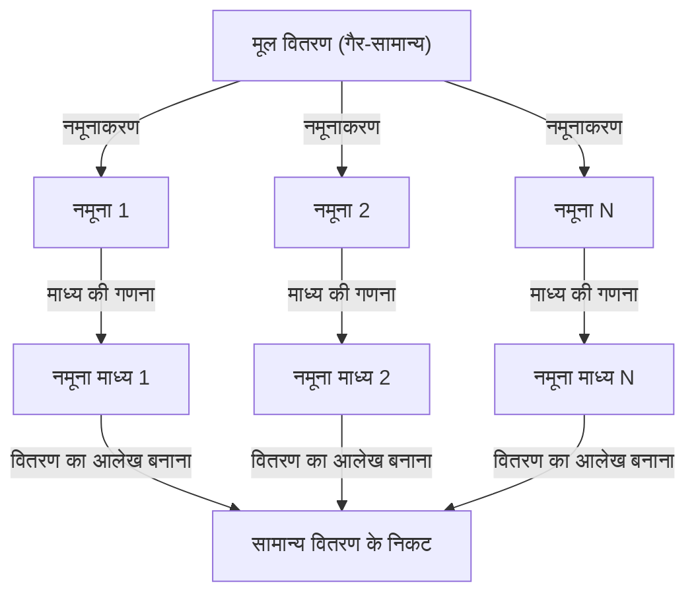

## 1 परिचय

डेटा विज्ञान और सांख्यिकी का अध्ययन करते समय, एक अवधारणा जिसे आप टाल नहीं सकते वह है **केंद्रीय सीमा प्रमेय** (सीएलटी)। इस प्रमेय में लगभग जादुई संपत्ति है कि "डेटा के वितरण के बावजूद, नमूना माध्यों का वितरण सामान्य वितरण के करीब पहुँचता है क्योंकि नमूना आकार बढ़ता है।"

इस लेख में, हम सहज छवियों से लेकर कठोर गणितीय परिभाषाओं और व्यावहारिक अनुप्रयोगों तक, केंद्रीय सीमा प्रमेय की व्यापक व्याख्या प्रदान करते हैं।

## 2. केंद्रीय सीमा प्रमेय क्या है?

केंद्रीय सीमा प्रमेय (सीएलटी) संभाव्यता सिद्धांत और सांख्यिकी में सबसे शक्तिशाली और आश्चर्यजनक परिणामों में से एक है। सीधे शब्दों में कहें तो, बड़ी संख्या में यादृच्छिक रूप से नमूना किए गए स्वतंत्र यादृच्छिक चर का योग (या माध्य) एक सामान्य वितरण द्वारा अनुमानित किया जाता है, उन चर के मूल वितरण की परवाह किए बिना।

### 2.1 सहज समझ

पासे पर विचार करें. जब आप एक पासा घुमाते हैं, तो परिणामों का वितरण एक समान होता है। हालाँकि, जब आप दो पासों को घुमाते हैं और उनका योग लेते हैं, तो वितरण त्रिकोणीय हो जाता है, जो 7 पर चरम पर होता है। जैसे-जैसे आप पासों की संख्या बढ़ाते हैं, उनके योग का वितरण एक चिकने घंटी के आकार के वक्र के करीब पहुंचता है - यानी, एक **सामान्य वितरण**।

### 2.2 गणितीय परिभाषा

मान लीजिए कि $n$ नमूने $X_1, X_2, \dots, X_n$ एक आबादी से यादृच्छिक रूप से निकाले गए हैं और स्वतंत्र रूप से और समान रूप से वितरित किए गए हैं (i.i.d.)। मान लीजिए कि समष्टि का माध्य (अपेक्षित मान) $\mu$ है और प्रसरण $\sigma^2$ है।

यदि हम नमूना माध्य को $\bar{X} = \frac{1}{n} \sum_{i=1}^{n} X_i$ के रूप में परिभाषित करते हैं, तो केंद्रीय सीमा प्रमेय के अनुसार, जब $n$ पर्याप्त रूप से बड़ा होता है, तो निम्नलिखित मानकीकृत चर $Z$ मानक सामान्य वितरण $\mathcal{N}(0, 1)$ में परिवर्तित हो जाता है:


$$
Z = \frac{\bar{X} - \mu}{\frac{\sigma}{\sqrt{n}}} \xrightarrow{d} \mathcal{N}(0, 1) \text{ as } n \to \infty
$$


यहां, $\xrightarrow{d}$ वितरण में अभिसरण को दर्शाता है। $\text{ as } n \to \infty$ इंगित करता है कि नमूना आकार अनंत तक पहुंच रहा है।

## 3. केंद्रीय सीमा प्रमेय की कल्पना करना

केंद्रीय सीमा प्रमेय कैसे काम करता है, इसे स्पष्ट रूप से समझने के लिए, यहां मरमेड का उपयोग करते हुए एक प्रक्रिया आरेख दिया गया है।



## 4. पायथन के साथ सिमुलेशन

आइए इसे केवल सिद्धांत से नहीं बल्कि वास्तव में एक प्रोग्राम चलाकर सत्यापित करें। हम एक समान वितरण से डेटा का नमूना लेंगे और अनुकरण करेंगे कि नमूना माध्य कैसे वितरित होते हैं।

```python
import numpy as np
import matplotlib.pyplot as plt

# Population parameters (Uniform distribution [0, 1])
mu = 0.5
sigma = np.sqrt(1/12)

# Simulation settings
sample_sizes = [1, 5, 30, 100]
num_simulations = 10000

# Graph drawing settings
fig, axes = plt.subplots(2, 2, figsize=(12, 8))
axes = axes.flatten()

for i, n in enumerate(sample_sizes):
    # Draw n samples from a uniform distribution, num_simulations times
    samples = np.random.uniform(0, 1, (num_simulations, n))
    
    # Calculate the sample mean for each trial
    sample_means = np.mean(samples, axis=1)
    
    # Plot the histogram
    ax = axes[i]
    ax.hist(sample_means, bins=50, density=True, alpha=0.7, color='skyblue')
    ax.set_title(f"Sample size n={n}")
    
    # Add the theoretical normal distribution curve
    x = np.linspace(mu - 4*sigma/np.sqrt(n), mu + 4*sigma/np.sqrt(n), 100)
    y = (1 / (np.sqrt(2 * np.pi) * (sigma/np.sqrt(n)))) * np.exp(-0.5 * ((x - mu) / (sigma/np.sqrt(n)))**2)
    ax.plot(x, y, 'r-', lw=2)

plt.tight_layout()
plt.show()
```

जब आप इस कोड को चलाते हैं, तो आप पुष्टि कर सकते हैं कि $n=1$ के लिए वितरण एक समान है, लेकिन जैसे-जैसे $n$ बढ़ता है, हिस्टोग्राम लाल सामान्य वितरण वक्र के करीब पहुंचता है।

## 5. केंद्रीय सीमा प्रमेय का महत्व और अनुप्रयोग

केंद्रीय सीमा प्रमेय इतना महत्वपूर्ण क्यों है? ऐसा इसलिए है क्योंकि वास्तविक दुनिया के डेटा के सटीक वितरण को जाने बिना भी, हम नमूना साधनों, परिकल्पना परीक्षण और आत्मविश्वास अंतराल निर्माण को सक्षम करने जैसे आंकड़ों के लिए सामान्य वितरण मान सकते हैं।

### 5.1 सांख्यिकीय अनुमान का आधार
जब हम डेटा से निष्कर्ष निकालते हैं - जनमत सर्वेक्षणों, गुणवत्ता नियंत्रण, ए/बी परीक्षण और बहुत कुछ में - तो अधिकांश तर्क केंद्रीय सीमा प्रमेय पर निर्भर करता है।

### 5.2 त्रुटियों का संचय
माप त्रुटियों और प्रकृति में कई प्रकार के शोर को कई छोटे स्वतंत्र कारकों के योग के रूप में भी तैयार किया जा सकता है, यही कारण है कि वे अक्सर सामान्य वितरण का पालन करते हैं। यही कारण है कि इसे गाऊसी वितरण भी कहा जाता है।

## 6. गहराई तक जाना: प्रमाण की ओर दृष्टिकोण

केंद्रीय सीमा प्रमेय का कठोर प्रमाण अभिलाक्षणिक फलनों और टेलर विस्तार का उपयोग करता है। यहां हम एक रूपरेखा प्रस्तुत करते हैं.

विशेषता फ़ंक्शन $\phi_X(t) = E[e^{itX}]$ का उपयोग करते हुए, स्वतंत्र यादृच्छिक चर के योग का विशेषता फ़ंक्शन उनके व्यक्तिगत विशेषता कार्यों का उत्पाद बन जाता है। मानकीकृत चर $Z$ के विशेषता फ़ंक्शन की गणना करके और सीमा को $n \to \infty$ के रूप में लेते हुए, यह दिखाया जा सकता है कि यह मानक सामान्य वितरण $e^{-t^2/2}$ के विशेषता फ़ंक्शन में परिवर्तित होता है। इससे सिद्ध होता है कि वितरण स्वयं सामान्य वितरण में परिवर्तित हो जाता है।

## 7. निष्कर्ष

केंद्रीय सीमा प्रमेय एक असाधारण रूप से सुंदर प्रमेय है जो अराजक डेटा के पीछे छिपे क्रम को प्रकट करता है। इस प्रमेय को समझकर, आप डेटा विश्लेषण और सांख्यिकीय मॉडल निर्माण में गहरी अंतर्दृष्टि प्राप्त करने में सक्षम होंगे।


## परिशिष्ट: विस्तृत गणितीय पृष्ठभूमि और इतिहास

### परिशिष्ट 1: संभाव्यता सिद्धांत में विकास
केंद्रीय सीमा प्रमेय का इतिहास बहुत गहरा है, जो अब्राहम डी मोइवर के द्विपद वितरण के सामान्य सन्निकटन के प्रदर्शन से उत्पन्न हुआ है। इसे बाद में पियरे-साइमन लाप्लास द्वारा विस्तारित किया गया था, और अधिक सामान्य परिस्थितियों में एक प्रमाण अलेक्जेंडर लायपुनोव द्वारा दिया गया था। आधुनिक संभाव्यता सिद्धांत में, विभिन्न विस्तार मौजूद हैं, जैसे लिंडेबर्ग स्थिति और ल्यपुनोव स्थिति। ये स्थितियाँ गारंटी देती हैं कि किसी भी व्यक्तिगत यादृच्छिक चर का समग्र योग पर प्रमुख प्रभाव नहीं पड़ता है। यह इस मूलभूत प्रश्न का उत्तर प्रदान करता है कि प्रकृति और सामाजिक विज्ञान में विविध घटनाओं को सामान्य वितरण द्वारा अनुमानित क्यों किया जा सकता है।

### परिशिष्ट 2: शर्तें और अर्थ

यहाँ प्रयुक्त मूल रूप में $X_1,\ldots,X_n$ स्वतंत्र और समान वितरण वाले होने चाहिए, जिनका माध्य $\mu$ परिमित हो और प्रसरण परिमित तथा धनात्मक हो: $0<\sigma^2<\infty$। ‘कोई भी वितरण’ इन्हीं शर्तों के अंतर्गत समझें। मानकीकृत योग या नमूना माध्य का वितरण सामान्य वितरण के निकट जाता है; अलग-अलग प्रेक्षणों का वितरण नहीं बदलता।

### परिशिष्ट 3: मानक त्रुटि और बड़ी संख्याओं का नियम

स्वतंत्रता से नमूना माध्य की प्रत्याशा और प्रसरण नीचे दिए गए रूप में मिलते हैं। मानक त्रुटि नमूना माध्य की परिवर्तनशीलता मापती है, न कि अलग-अलग प्रेक्षणों का मानक विचलन।

$$
E[\bar X_n]=\mu,\qquad \operatorname{Var}(\bar X_n)=\frac{\sigma^2}{n},\qquad \operatorname{SE}(\bar X_n)=\frac{\sigma}{\sqrt n}.
$$

नमूना आकार चार गुना करने पर मानक त्रुटि आधी हो जाती है। बड़ी संख्याओं का नियम बताता है कि नमूना माध्य $\mu$ के निकट जाता है; केंद्रीय सीमा प्रमेय उसके उतार-चढ़ाव को $\sqrt{n}$ से गुणा करने के बाद वितरण का आकार बताता है।

### परिशिष्ट 4: अभिलाक्षणिक फलन से प्रमाण का विस्तार

$Y_i=(X_i-\mu)/\sigma$ और $Z_n=n^{-1/2}\sum_{i=1}^nY_i$ रखें। चूँकि $E[Y_i]=0$ और $E[Y_i^2]=1$, अभिलाक्षणिक फलन का शून्य के पास निम्न विस्तार मिलता है।

$$
\phi_Y(t)=E[e^{itY}]=1-\frac{t^2}{2}+o(t^2)\quad(t\to0).
$$

स्वतंत्रता से अगला व्यंजक मिलता है। इसकी सीमा मानक सामान्य वितरण का अभिलाक्षणिक फलन है, इसलिए लेवी के निरंतरता प्रमेय से वितरण में अभिसरण मिलता है। अभिलाक्षणिक फलन और आघूर्ण जनक फलन अलग हैं; इस प्रमाण में दूसरे का अस्तित्व आवश्यक नहीं है।

$$
\phi_{Z_n}(t)=\left[\phi_Y\!\left(\frac{t}{\sqrt n}\right)\right]^n
=\left[1-\frac{t^2}{2n}+o\!\left(\frac1n\right)\right]^n
\longrightarrow e^{-t^2/2}.
$$

### परिशिष्ट 5: प्रतिउदाहरण और सन्निकटन की सटीकता

कॉशी वितरण का माध्य और प्रसरण परिमित नहीं होते। स्वतंत्र मानक कॉशी चरों का नमूना माध्य भी मानक कॉशी वितरण का रहता है। यदि सभी $X_i$ एक ही यादृच्छिक चर हों, तो स्वतंत्रता नहीं होती और औसत लेने से परिवर्तनशीलता नहीं घटती। $n\ge30$ हमेशा पर्याप्त होने की कोई सार्वभौमिक गारंटी नहीं है; विषमता और वितरण की पूँछों का भारीपन आवश्यक नमूना आकार को प्रभावित करते हैं। स्वतंत्र लेकिन अलग-अलग वितरण वाले चरों के लिए लिंडेबर्ग या ल्यापुनोव जैसी अतिरिक्त शर्तें जाँचनी पड़ती हैं।
